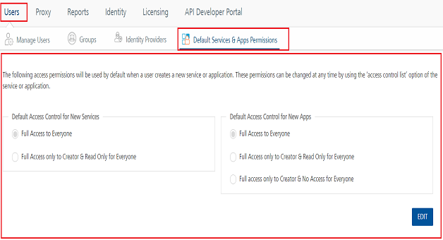

                               

User Guide: Default Access Control Lists (ACLs) on New Apps and Services

Account Settings for Default User Access Control Lists (ACLs) on New Apps and Services
--------------------------------------------------------------------------------------

As an Admin/Owner account role, you can configure the default access control for the new apps and services. So, when a new user is invited or automatically added to an account using the master account setting, these default access control settings are applied to the user.

By default, the following access permissions are used when a user creates a new service or application.

  
| Default Access Control for New Services | Default Access Control for New Apps |
| --- | --- |
| Full Access to Everyone Full Access only to Creator & Read Only for Everyone | Full Access to Everyone Full Access only to Creator & Read Only for Everyone Full access only to Creator & No Access for Everyone |
| You can edit the **Default Access Control for New Services** and **Default Access Control for New Apps** by clicking the **EDIT** button. ||

> **_Important:_** When you edit the default access control permissions, the changes will apply to the apps and services created post change only and not the ones created before the edit.

You can access the **Default Services & Apps Permissions** under **Settings** \> **Users** tab.

> **_Note:_** Use the [Apps Console Access Control](../../../Foundry/voltmx_foundry_roles_access_control_guide/Content/ConsoleAccessControl.md#how-to-use-access-control-for-applications) page to control the access to an application.

> **_Note:_** Use the [Services Console Access Control](../../../Foundry/voltmx_foundry_roles_access_control_guide/Content/ConsoleAccessControl.md#how-to-use-access-control-for-services) page to control the access to a service.
