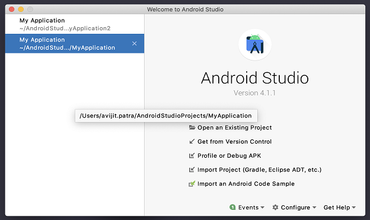
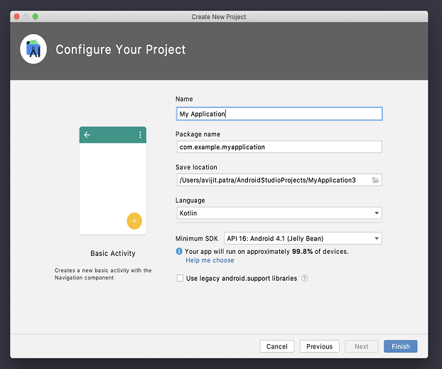
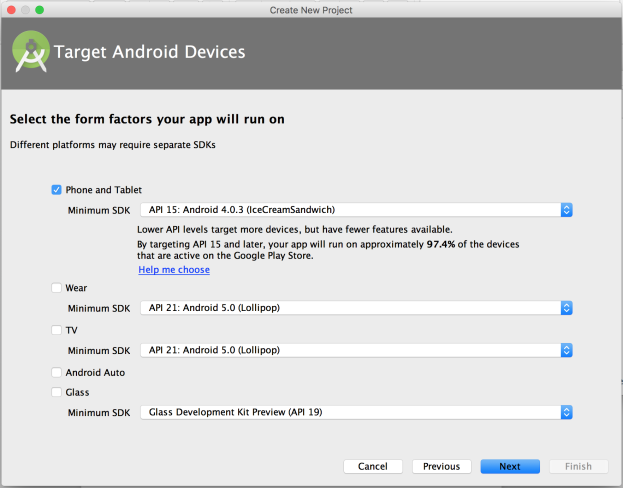
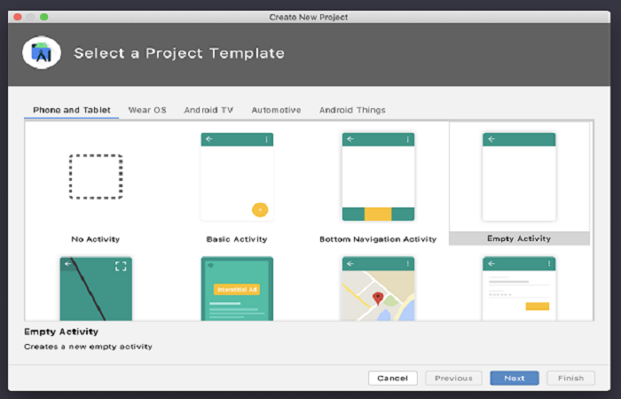
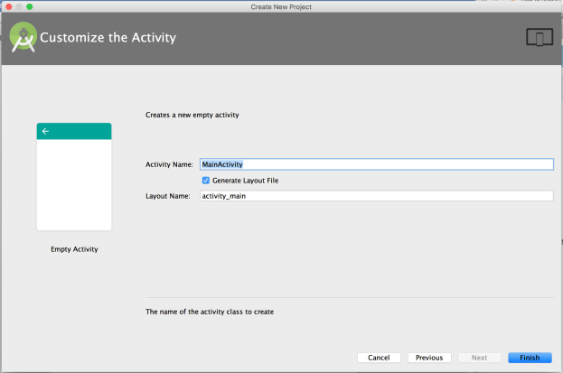
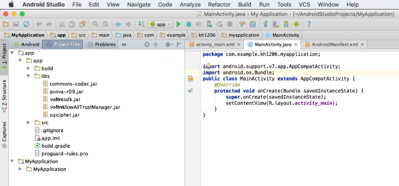
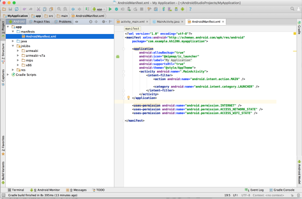

                              

User Guide: [SDKs](../Foundry_SDKs.md) > [Android SDK](Installing_Android_SDK.md) > [Configuring the Volt MX Android SDK](Configuring_VoltMX_SDK_Android.md) > Configuring voltmx-sdk.jar to Project - Android Studio

### Configuring voltmx-sdk.jar to Project - **Android Studio**

To configure voltmx-sdk.jar file, follow these steps:

1.  Launch **Android Studio**.
    
    
    
2.  In Android Studio, click **Start a new Android Studio Project**.  
    
    The **New Project** screen appears.
    
    
    
3.  In the **New Android Application** dialog, enter the following and click **Next**. (You can leave the rest of the fields unchanged.)  
    *   **Application Name**: Enter the name of the application.
    *   **Company Domain**: Enter company domain. (Android Studio generates the package name in reverse order).
        
    *   **Package Name**: The field is auto-filled based on the company domain. You can edit the package name, if required.
    *   **Project Location**: Select a path for your package.
4.  Click **Next**.
    
    
    
5.  Select the form factors and platforms, and click **Next**.
6.  Add activity as follows:
    *   If you select an **Activity**, the **Next** button is activated. Provide the name for the activity and click **Finish**.
    *   If you select **Add No Activity**, the **Finish** button is activated. The project is created without user interface.
        
        
        
        
         
        Your project is created. Now You need add the required Volt MX SDK libraries to the project.
        
7.  To import SDK libraries to your project, follow these steps:
    1.  Unzip the `VoltMX Android SDK.zip`.
    2.  Copy the `voltmx-sdk.jar` and paste it to `/app/libs/` folder in your project.
    3.  Unzip `libs.zip` (downloaded from voltmx sdk.) You will get all the required SDK libraries for your project.
    4.  Copy all the jar files from the SDK libraries and paste them to `/app/libs/` folder in your project.
        
8.  Create a folder named **jniLibs** (if not present) at `/app/src/main/` location. Copy the all the folders containing \*.so files (armeabi, armeabi-v7a, mips, x86) into the **jniLibs**. Your project folder structure should look like.
    
    
    
9.  Add the following permissions in your `AndroidManifest.xml`:
    
    1.  <code class="language-plaintext highlighter-rouge" style="background-color:white; border:none">&lt;uses-permission android:name="android.permission.INTERNET" /&gt;</code>
    2.  <code class="language-plaintext highlighter-rouge" style="background-color:white; border:none">&lt;uses-permission android:name="android.permission.ACCESS\_NETWORK\_STATE" /&gt;</code>
    3.  <code class="language-plaintext highlighter-rouge" style="background-color:white; border:none">&lt;uses-permission android:name="android.permission.ACCESS\_WIFI\_STATE" /&gt;</code>
    4.  <code class="language-plaintext highlighter-rouge" style="background-color:white; border:none">&lt;uses-permission android:name="android.permission.READ\_PHONE\_STATE"/&gt;</code>
        
    
    The `VoltMX-Android-SDK` is now successfully configured in your project. Now you can use Volt MX APIs for Android platform.
    
    
