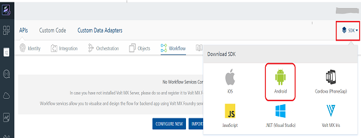
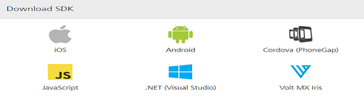

User Guide: [SDKs](../Foundry_SDKs.md) > [Android SDK](Installing_Android_SDK.md) > Downloading Volt MX Android SDK

# Downloading Volt MX Android SDK Files

To download Volt MX Android SDK, follow these steps:

1.  In the Volt MX Foundry console, navigate to <b>Apps</b> > <b>SDKs</b>, and click <b>Android</b>. The system prompts you to save the zip file in your local system.

    

    

2.  Save the `voltmx-android-sdk.zip` file in your local system.
3.  Extract the `voltmx-android-sdk.zip` file that you just downloaded.

    The `` `voltmx-android-sdk` `` folder contains the following files:

    - voltmx-sdk.jar
    - voltmx-sdk.doc
    - LICENSE.txt
    - version.txt
    - libs.zip
