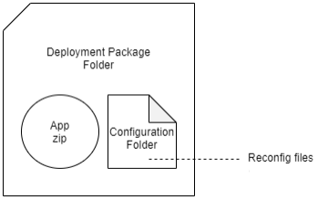
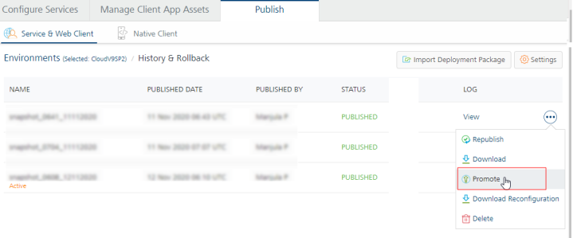
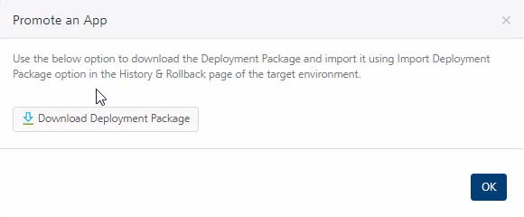
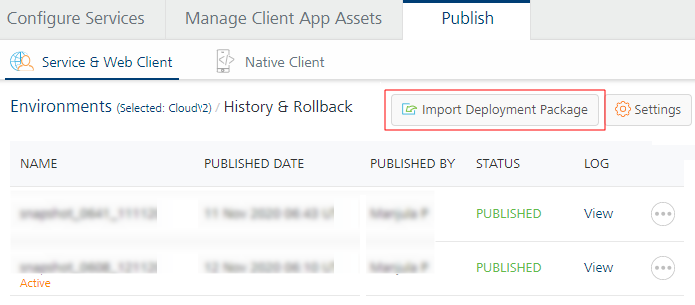
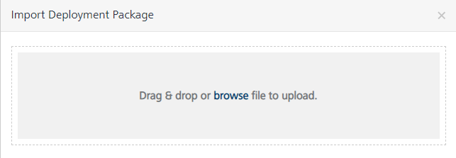
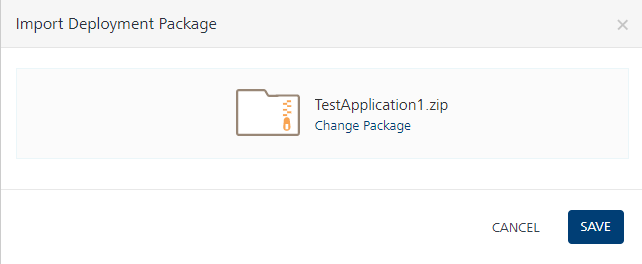

                               

User Guide: Deployment Package Structure

Promoting a Deployment Package
==============================

From V9SP2 GA, Foundry supports the Deployment Package Promotion feature which separates the active changes going on in the shared workspace with the deployment of the application from environment to environment. This feature uses a Deployment Package zip (DP) as a source to publish it to another environment. A Deployment Package contains an App.zip and the Reconfiguration folder. This will not interfere with the existing app development process and the publishing process time is reduced.

*   Deployment Package promotion support is available for both Foundry Console and MFCLI.

Deployment Package Structure
----------------------------

As deployment package is generated from an existing snapshot, the app package zip that is stored during a snapshot creation will be used to create it. Additionally, the reconfiguration profile that is used during the snapshot creation (publish of app) is also part of the Deployment Package.

The following is a sample folder structure of the Deployment Package ZIP.

Use Case
--------

Consider a scenario in which you have developed a Foundry app in the Foundry console and published it to the DEV Environment. You want to deploy the certified Foundry app to the QA Environment and in parallel keep on working on the app development changes (for v2.0) in the Foundry Console.

To deploy the app to QA Environment, you visit the 'History & Rollback' page for DEV Environment and hit the 'Download Deployment Package' to export the App.zip and Service Configuration as a single package.

Next, you update the Service Configuration file according to the target QA Environment. Then visit the 'History & Rollback' page for the target QA Environment and hit the 'Import Deployment Package' to import and promote the zip to QA Environment. You can also use the MFCLI to deploy the Deployment Package to QA Environment. Foundry imports the compiled app into its history and pushes the app to the QA Runtime.

After the testing is complete, you can deploy the Deployment Package to the Production Environment in the same way.

Prerequisites
-------------

You must have selected the **Save App Package in Snapshot** check box if you want save an export of the Foundry app as part of the snapshot to serve as a backup of the app at the time of publish.  
Path to access the Save App Package in Snapshot check box in Foundry Console: **Publish** page **> Service & Web Client > Snapshots > History & Rollback > Settings** section. Refer to [Snapshots documentation](Publish_LifeCycle.md#snapshots).

How to Promote a Deployment Package
-----------------------------------

How to promote a Deployment Package using Foundry Console

The Deployment Package promotion involves the following steps by using Foundry Console:

1.  **Generating a deployment package:**
    1.  Navigate to the Publish page of the app, in Foundry Console.
    2.  Click **Snapshots**. The **History & Rollback** page appears with the list of all snapshots.
    3.  Click **More Options** button and select **Promote** option of an existing snapshot, for which you want to download the **Deployment Package**.
        
        
        
    4.  Then click **Download Deployment Package**.
        
        The Deployment Package is downloaded to your local drive on your system.
        
        
        
2.  **Deploying and Publishing the Deployment Package to an environment:**
    1.  Navigate to the **Publish** page of the app.
    2.  Navigate to **History & Rollback** page of the other environment.
    3.  Click **Import Deployment Package**.
        
        
        
    4.  In the **Import** dialog, select the Deployment Package.zip. You can click browse to navigate to the downloaded Deployment Package.zip or drag and drop the zip file into the dialog box.  
        
        
        
        The Deployment Package is selected.
        
        
        
    5.  Click **SAVE**.
        
        The selected Deployment Package.zip is processed for publishing the app to the environment. After the app is published, the app is set to the active snapshot listed under the **History & Rollback** page.
        

How to promote a Deployment Package using MFCLI

The Deployment Package promotion involves the following steps by using MFCLI commands:

  
| Step | MFCLI Commands to Promote a Deployment Package ||
| --- | --- | --- |
| 1 | `explore-snapshots`: To view the details of the available snapshots from the current environment, run the following command: for Volt MX Cloud environment:java -jar mfcli.jar explore-snapshots -u <user> -p <password> -t <account id> -clurl <cloud url> \[ -a <app name> \] \[ -v <app version> \] \[ -e <environment name> \]For example,java -jar mfcli.jar explore-snapshots -u abc@voltmx.com -p password -t 100054321 -clurl https://manage.hcl-cloud.com -a MyApp -v 2.0 -e MyEnv for on-premise installation:java -jar mfcli.jar explore-snapshots -u <user> -p <password> -au <Identity URL> -cu <Console URL> \[ -a <app name> \] \[ -v <app version> \] \[ -e <environment name> \]For example,java -jar mfcli.jar explore-snapshots -u abc@voltmx.com -p password -au http://10.10.24.79:8080 -cu http://10.10.24.78:8081 -a MyApp -v 2.0 -e MyEnv ||
| 2 | `export-deploymentpackage`: To export/download the deployment package of a snapshot from the current environment, run the following build command: for Volt MX Cloud environment:java -jar mfcli.jar export-deploymentpackage -u <user> -p <password> -t <account id> -clurl <cloud url> \[ -d <deployment package> \] \[ -s <snapshot name>\] \[ -a <app name> \] \[ -v <app version> \] \[ -e <environment name> \]For example,java -jar mfcli.jar export-deploymentpackage -u abc@voltmx.com -p password -t 100054321 -clurl https://manage.hcl-cloud.com -d "C:\\\\tmp\\\\MyDeploymentPackage.zip" -s MySnapshot -a MyApp -v 2.0 -e MyEnv for on-premise installation:java -jar mfcli.jar export-deploymentpackage -u <user> -p <password> -au <Identity URL> -cu <Console URL> \[ -d <deployment package> \] \[ -s <snapshot name>\] \[ -a <app name> \] \[ -v <app version> \] \[ -e <environment name> \]For example,java -jar mfcli.jar export-deploymentpackage -u abc@voltmx.com -p password -au http://10.10.24.79:8080 -cu http://10.10.24.78:8081 -d "C:\\\\tmp\\\\MyDeploymentPackage.zip" -s MySnapshot -a MyApp -v 2.0 -e MyEnv ||
| 3 | `promote-deploymentpackage`: To import and promote the deployment package to the target environment, run the following command: for Volt MX Cloud environment:java -jar mfcli.jar promote-deploymentpackage -u <user> -p <password> -t <account id> -clurl <cloud url> \[ -d <deployment package> \] \[ -a <app name> \] \[ -v <app version> \] \[ -e <environment name> \]For example,java -jar mfcli.jar promote-deploymentpackage -u abc@voltmx.com -p password -t 100054321 -clurl https://manage.hcl-cloud.com -d "C:\\\\tmp\\\\MyDeploymentPackage.zip" -a MyApp -v 2.0 -e MyEnv for on-premise installation:java -jar mfcli.jar promote-deploymentpackage -u <user> -p <password> -au <Identity URL> -cu <Console URL> \[ -d <deployment package> \] \[ -a <app name> \] \[ -v <app version> \] \[ -e <environment name> \]For example,java -jar mfcli.jar promote-deploymentpackage -u abc@voltmx.com -p password -au http://10.10.24.79:8080 -cu http://10.10.24.78:8081 -d "C:\\\\tmp\\\\MyDeploymentPackage.zip" -a MyApp -v 2.0 -e MyEnv ||

> **_Important:_** For Object Services of type 'Storage', if you want to promote a new version of sample data, you must include the `sampleData` value as `true` for the specified SAAS service, in the Service Reconfiguration JSON present under the Configuration folder of Deployment Package zip.  
  
This state of the `sampleData (true/false)` is not saved in the Service Reconfiguration JSON.
