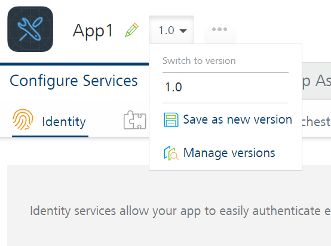
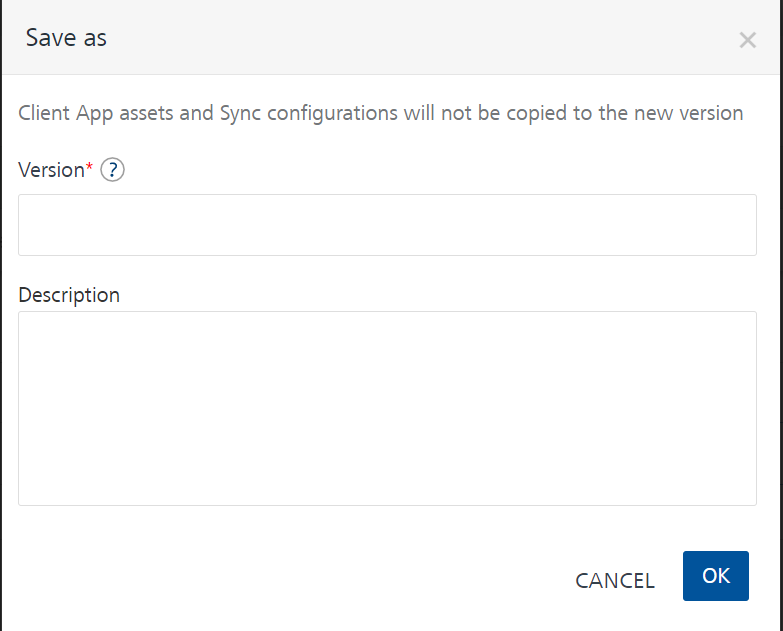
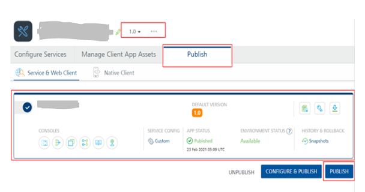

                               

User Guide: Application Versioning

Volt MX  Foundry Application Versioning
=====================================

**Problem statement**:

Consider a scenario where an Enterprise has a mobile application (MA) and a Volt MX Foundry counterpart (QF/MF) that is live and in use. The next updated version of the Volt MX Foundry app needs to be deployed and tested in Production and then released publicly. However, the Enterprise must meet the following requirements during this process:

*   The publicly available mobile application should have no downtime and should continue to work without any interference or updates related to the new version.
*   Once the testing is completed on the new Volt MX Foundry version, you should be able to switch to the new app version without requiring additional publish and/or modifications to the mobile application.

**Solution**:

**App Versioning** is a feature of Volt MX Foundry that allows you to create multiple versions of a Volt MX Foundry application, which can be developed and deployed at the same time. And provides a mechanism to configure the default version that you can bind with the Mobile app.

> **_Important:_** From V9SP1 onwards, App versioning is supported for Engagement artifacts. For more information refer to [Engagement User Guide > Foundry App Versioning with Engagement Artifacts](../../../Foundry/vms_console_user_guide/Content/API_Versioning.md).

> **_Important:_** App Versioning is not supported for Volt MX Foundry apps using Sync services.

The app service option is available across all the stages of the app creation in Volt MX Foundry Console such as **Configure Services**, **Manage Client App Assets**, and **Publish** tabs. For the first time created apps, version number 1.0 is added to the app by default. For the existing apps, you can change the version by saving the app with another version.

### How to change the existing app version

You can change the current app version to a new version by saving the app with another version number.

1.  Click an app. Your current app version is selected in the version list.
2.  In the app edit mode (Configure Services, Manage Client App Assets, and Publish), next to the app name, click the version list and select **Save as new version**.
    
    
    
    The **Save as** dialog box appears.
    
    
    
3.  In the **Save as** dialog box, do the following:
    
    1.  Under **Version**, choose the version number.
    2.  Provide the appropriate description for the app.
    3.  Click **OK**.
    
    The new app version is added to the versions list and the latest version is selected (active) in your app edit mode.
    

### How to Manage App Versions

You can edit the description of apps and delete one or more versions of an application.

1.  In the app edit mode (Configure Services, Manage Client App Assets, and Publish), next to the app name, click **Manage Versions**. The **Manage versions** dialog lists versions of the app.
2.  Hover your cursor over the required version, and click the **Edit** button. You can edit the description of the app.
3.  Hover your cursor over the required version, and click the **Delete** button. When you click the **Delete** button, the **Delete App** dialog appears.
4.  To confirm the deletion of the version, click **DELETE**. If the current version of the app is not published, the versions is deleted. Otherwise, the Error warns you that you are trying to delete the current version of the app that cannot be deleted as it is published.

### How to Change the Default App Version Published at Runtime Server

By default, the latest version of an app is set for publishing. You can change the default version to another existing app version before publishing.

1.  From the Applications page, select the desired app.
2.  Click the **Publish** tab. By default, the **Service & Web Client** tab is selected and lists clouds or environments configured for the Volt MX Foundry account. The list also displays the app status for that cloud or environment. The default version of the app published to different environments is displayed.
3.  Click an environment.
4.  Select the desired version of the app from the version list.
5.  Click **PUBLISH** to start the publishing. The process of publishing the app begins. Now, the version the you selected becomes the default app version for publishing. The selected app version is published to run-time server.
    
    
    

When a default version of the app is unpublished, the following cases may arise
-------------------------------------------------------------------------------

*   If there is only one instance of the application in the runtime environment, the app is unpublished successfully.
*   If there are two versions of the application in runtime, and the default instance is unpublished, the remaining one version should be made default.
*   If there are multiple versions of the application in runtime, you can set one of the app versions as default by only viewing the list of published versions. Based on the list, you can choose the new default version at the time of un-publishing an app.
