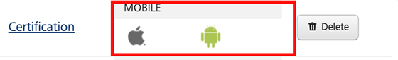
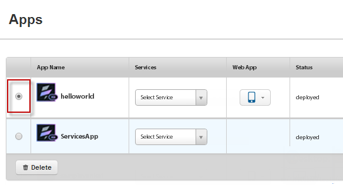
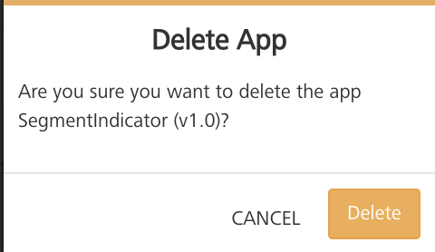
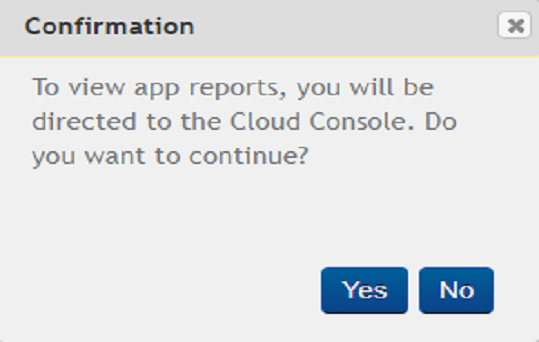

                              

User Guide: Appendix App Servies

Appendix - App Services
=======================

App Services console provides you with the following details:

*   List of Volt MX Studio applications in your Volt MX cloud environment.
*   List of Integration services and Orchestration services defined across your Volt MX Foundry environment.

App Services console consist of the following tabs:

*   [VoltMX Studio Apps](#studio-apps): Displays a list of all the Volt MX Studio Apps.
*   [Integration Services](#integration-services): Displays a list of Integration services that are added across your Volt MX Foundry apps.
*   [Orchestration Services](#orchestration-services): Displays a list of Orchestration services that are added across your Volt MX Foundry apps.
*   [Logs](#logs): These are the system generated reports containing a list of activities that are performed based on the [Logger Levels](#logger-levels).
*   [Logger Levels](#logger-levels): Allows you to specify the type of [logs](#logs) recoded for Integration Services and Orchestration Services.
*   [Health Check](#health-check): The Health check view denotes the connection properties for App Server in a cloud environment
*   [Reports](#reports): Enables you to create Standard Reports, and Custom Reports.
*   [Downloads](#downloads): Allows you to download the `middleware-system.jar` for writing preprocessor and postprocessor code.
    

Volt MX  Studio Apps
-------------------

Click **VoltMX Studio Apps** from the left pane of the console to view a list of Volt MX Studio applications available in your cloud environment.

For each of these Apps, following details are available:

1.  **App Name**: Name of the VoltMX Studio application.
2.  **Services**: List of all the services that are added to the app.
3.  **Web App**: List the channels (Desktop, Mobile, and Tablet) on which the app is available.
4.  **Status**: Specifies if the deployment of the app is successfully.

For each of the apps, you can perform following actions:

*   [Invoke an operation](#invoking-an-operation)
*   [Launch an app](#launching-an-app)
*   [Delete an app](#deleting-an-app)

### Invoking an operation

To invoke an operation, follow these steps:

1.  In the Volt MX Studio Apps page, select an operation from the **Services** list of an application.
    
    
    
    The **Service Details** page is displayed.
    
2.  Enter the input parameters,if required.
    
    
    
3.  Click **Get Response**. The **Response Body** tab appears.
    
    
    
4.  Click **Headers** to view the headers response.
    
    
    

### Launching an App

To launch an application, follow these steps:

1.  In the Volt MX Studio Apps page, click the down-arrow next to the channel (Desktop, Mobile, and Tablet).
    
    
    
    Following information is available:
    
    *   Platforms for which the app is built. For example, iOS and Android.
    *   URL of the application.
2.  Click the URL to launch the application.

### Deleting an app

To delete an app from the cloud, follow these steps:

1.  In the **VoltMX Studio Apps** page, select an application.
    
    
    
2.  Click **Delete**.
    
    
    
    A **Confirm Delete** window is displayed.
    
3.  Click **OK** to delete the application.

Integration Services
--------------------

Click **Integration Services** from the left pane of the console to view a list of Integration services that are available across the applications within your Volt MX Foundry environment.

For each of the services, following details are available:

1.  **Service name**: Name of the Integration service.
2.  **URL**: Select an operation from the URL list to display the URL link of the operation. This link is used for invoking the corresponding operation.

### Invoking an operation

To invoke an operation, follow these steps:

1.  In the Integration page, select an operation from the URL list of an application.
    
    
    
    The URL of the operation is displayed.
    
2.  Click the URL to open the **Service Details** page.
    
    
    
3.  Enter the input parameters,if required.
4.  Click **Get Response**. The **Response Body** tab is displayed.
    
    
    
5.  Click **Headers** to view the headers response.
    
    
    

Orchestration Services
----------------------

Click **Orchestration Services** from the left pane of the console to view a list of Orchestration services across the applications within your Volt MX Foundry environment.

For each of the services, following details are available:

1.  Service name: Name of the Integration service.
2.  URL: Link to invoke the corresponding operation.

### Invoking an operation

To invoke an operation, follow these steps:

1.  In the Orchestration page, click the corresponding URL of the operation to open the **Service Details** page.
    
    
    
2.  Enter the input parameters, if required.
    
    
    
3.  Click **Get Response**.The **Response Body** tab is displayed.
    
    
    
4.  Click **Headers** to view the headers response.
    
    
    

Logs
----

Logs are automatically generated reports containing a list of activities that are performed based on the [Logger Levels](#logger-levels).

Logs show a list of instances with **Instance ID**, **IP Address** along with the links to view the **Archived** and **Snapshot** Logs. If the number of logs is more than ten, you can use the Next or Previous options to view other logs.

There are two types of cloud logs:

*   [Archived Logs](#archived-logs)
*   [Snapshot Logs](#snapshot-logs)

### Archived Logs

The log files for the server instance that are archived every hour and stored for seven days. You can view and download these archived log files. If the number of archived log files is more than 10, you can use Next or Previous to move to view other archived logs.

On Cloud Logs tab, you can view the list of archived logs and manage them. You can perform the following tasks:

*   [Viewing Archived Logs](#viewing-archived-logs)
*   [Downloading Selected Logs](#downloading-selected-logs)
*   [Downloading all the Logs](#downloading-all-the-logs)
*   [Refreshing Archived Logs](#refreshing-archived-logs)

#### Viewing Archived Logs

To view the archived logs, click **View Archived Logs** under Archived Logs. The Archived Logs pop-up appears with a list of the archived log files.

#### Downloading Selected Logs

To download the selected logs, follow these steps:

1.  On the **Archived Logs** page, select the checkbox of desired archived file that you want to download and click **Download Selected**.
    
    A **Confirmation** pop-up appears.
    
    
    
2.  Click **OK** to download the selected archived log files.
    
    A pop-up appears to choose the location to save the downloaded archived log files.
    
3.  Select the location to save the downloaded archived log files, and click **OK**.
    

#### Downloading all the Logs

To download all the archived log files, follow these steps:

1.  On the **Archived Logs** page, click **Download All**.
    
    A **Confirmation** pop-up appears.
    
    
    
2.  Click **OK** to download the selected archived log files.
    
    A pop-up appears to choose the location to save all downloaded archived log files.
    
3.  Select a location, and click **OK**.
    

#### Refreshing Archived Logs

To refresh the archived logs, on the Archived Logs page, click **Refresh**.The Archived Logs are refreshed.

### Snapshot Logs

You can access real-time logs through the snapshot logs page. Snapshot logs comprise the last manual log snapshot fetched from the server.The logs listed in the table are periodic snapshots of the log files and may not contain the very latest log data. You can view and download these snapshot log files. If the number of snapshot log files is more than ten, you can use Next or Previous options to move to more number of snapshot log files.

On Cloud Logs tab, you can view the list of snapshot logs and manage them.

You can perform the following tasks:

*   [Viewing Snapshot Logs](#viewing-snapshot-logs)
*   [Requesting Latest Snapshot Logs](#requesting-latest-snapshot-logs)
*   [Downloading Selected Logs](#downloading-selected-logs)
*   [Downloading all the Logs](#downloading-all-the-logs)
*   [Refreshing Snapshot Logs](#refreshing-snapshot-logs)

#### Viewing Snapshot Logs

To view the snapshot logs, click **View Snapshot Logs** under **Snapshot Logs**. The **Snapshot Logs** pop-up appears with all the snapshot log files.

#### Requesting Latest Snapshot Logs

To request latest snapshot logs, follow these steps:

1.  On the **Snapshot Logs** page, to initiate a manual snapshot of all logs on all servers, follow these steps:
2.  Click **Request Latest Logs**.
    
    A Confirmation pop-up appears.
    
    
    
3.  Click **OK** to download the latest log files.
    
    The manual snapshots of the logs are typically available within five minute
    

#### Downloading Selected Logs

To download the selected log files, follow these steps:

1.  On the **Snapshot Logs** page, select the checkbox of desired snapshot file that you want to download and click **Download Selected**.
    
    A **Confirmation** pop-up appears.
    
    
    
2.  Click **OK** to download the selected snapshot log files.
    
    A pop-up appears to choose the location to save all downloaded archived log files.
    
3.  Select a location, and click **OK**.
    

#### Downloading all the Logs

To download all the snapshot log files, follow these steps:

1.  On the **Snapshot Logs** page, click **Download All**.
    
    A **Confirmation** pop-up appears.
    
    
    
2.  Click **OK** to download the selected snapshot log files.
    
    A pop-up appears to choose the location to save all downloaded snapshot log files.
    
3.  Select the location, and click **OK**.

#### Refreshing Snapshot Logs

To refresh the snapshot logs and to reload the table with new snapshots available for download, on the **Snapshot Logs** page, click **Refresh**.

The Snapshot Logs are refreshed.

Logger Levels
-------------

Logger levels enable you to specify the type of [logs](#logs) recoded for Integration Services and Orchestration Services.

Following type of loggers are supported:

*   **Trace**: It designates finer-grained informational events than the _DEBUG_.
*   **DEBUG**: It designates fine-grained informational events that are most useful to debug an application.
*   **INFO**: It designates informational messages that highlight the progress of the application at coarse-grained level.
*   **WARN**: It designates potentially harmful situations.
*   **ERROR**: It designates error events that might still allow the application to continue running.
*   **FATAL**: It designates very severe error events that will presumably lead the application to abort.
*   **OFF**: It designates that the logging is turned off.

### Assigning a logger level

To assign logger levels for the services, follow these steps:

1.  On the **Logger Levels** page, select the type of service from the **Select Application** list.
2.  Update the levels for all the required loggers.
3.  Click **Save**.

Health Check
------------

The Health check view denotes the connection properties for App Server in a cloud environment.

The following are the various connection properties that denote the health of a App Server:

*   **Cloud Environment Identification**: Indicates if the App server is running properly in the cloud environment.
*   **Access to Reporting Queue**: Indicates if the environment has proper reporting Queue URL, and is able to connect.
*   **Security Credentials**: Indicates if the App server has the cloud security credentials.
*   **Static Resources Location**: Indicates if you are able to connect to the Amazon S3 bucket resources.
*   **Access to Deployment Storage**: Indicates if you are able to connect to the Amazon S3 bucket storage repository.
*   **Access to Device DB**: Indicates if you are able to connect to the Device DB.
*   **Access to Cache**: Indicates if you are able to connect to the “Amazon Elastic Cache”.

Reports
-------

Enables you to create Standard Reports, and Custom Reports.

To view or generate reports, follow these steps.

1.  From the left pane of the console click **Reports**. A **Confirmation** pop-up appears.
    
    
    
2.  Click **Yes**. You are directed to the **Reports** page.
    
    
    

For more information on generation reports refer to:

*   Refer to [VoltMX Reporting and Analytics - Standard Metrics and Reports](../../../Foundry/standard_metrics_reports_guide/Content/standard_metrics_reports_guide.md "VoltMX Reporting and Analytics - Standard Reports").
*   Refer to [VoltMX Reporting and Analytics - Custom Metrics and Reports](../../../Foundry/custom_metrics_and_reports/Content/VoltMX_Cloud_Custom_Metrics_Guide.md)

Downloads
---------

Enables you to download the `middleware-system.jar` file.

Click on the image to download the `middleware-system.jar` file.

The downloaded file is used to write the custom code for preprocessor, postprocessor and custom Java services.

*   Refer to [Preprocessor and Postprocessor](Java_Preprocessor_Postprocessor_.md)
