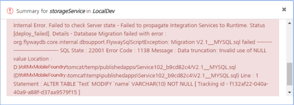
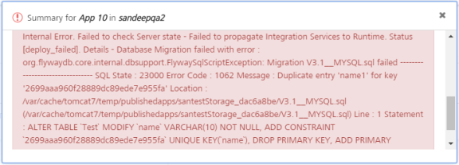
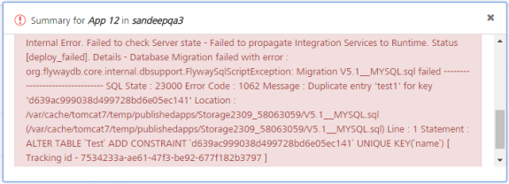
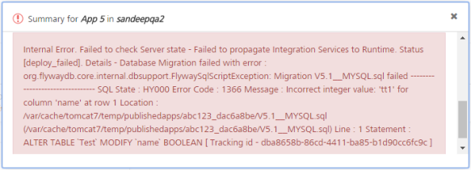
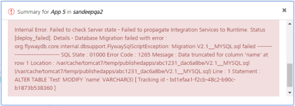
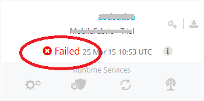
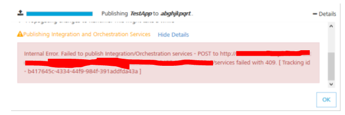
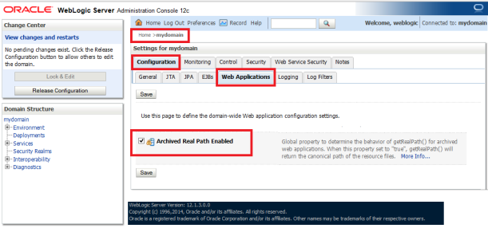

                              

User Guide: Appendix - Frequently Asked Questions (FAQs)

Appendix - Frequently Asked Questions (FAQs)
============================================

*   **Issue**
    
    Republish of app with modifications in storage services fails.  
    The following are a few of the scenarios that cause republish fail of an app:
    
    *   If you change a field nullable to **FALSE** after there is some data with null values in that field, republish fails.
        
        
        
    *   If you change the **primary key** of a field, which has duplicate values to **TRUE** and republish, republish fails.
        
        
        
    *   If you change **unique** to **true** when already there is data in that field with duplicate values, republish fails.
        
        
        
    *   If you change **datatypes** (for example: String to Boolean, Number to Date) and there is some data in that field, republish fails.
        
        
        
    *   If you reduce the **size of a string column** if the table already has data that exceeds the changed value and republishing, republish fails.
        
        
        
    *   If you have more than one field that has auto-generated property set to **TRUE** in an object (MySQL InnoDB engine limitation).
    
    **Workaround:**
    
    1.  Export the app.  
        For more details, refer to [Exporting and Importing an Application](../../../Foundry/voltmx_foundry_user_guide/Content/Export-Import_Apps.md).
    2.  Check the version for script.
    3.  Import the modified app into the app.
        
        > **_Important:_** While importing an app to an existing app, if the app names are same, the system overrides the existing data with new data in the imported .zip file. The app name will not be changed.
        
    4.  Publish the app.

*   **Issue**
    
    While launching Volt MX Foundry apps from Internet Explorer 8 and Internet Explorer 9, the `init` fails to load the apps.
    
    **Workaround:**
    
    Enable domain settings to access the identity service in your Volt MX Foundry account.  
    For more details to enable CORS, refer to [API Management > Identity > SERVICE CONFIGURATION > Identity Service Cross Domain Security (CORS)](App_User_Session.md#identity-service-security-settings).
    

<!-- *   **Issue**
    
    Volt MX Foundry Console is unable to explore MySQL stored procedures from integration service for WebLogic with MSSQL,Oracle as consoleDB. Because WebLogic loads 5.1.22 mysql jar by default. (This jar is older version).
    
    **Workaround:**
    
    You can resolve this issue by any of the following two ways:
    
    *   Update the mysql jar in WebLogic itself. For more details, refer to [https://docs.oracle.com/middleware/1212/wls/JDBCA/third\_party\_drivers.html#JDBCA233](https://docs.oracle.com/middleware/1212/wls/JDBCA/third_party_drivers.htm#JDBCA233)
    
                       Or
    
    *   Configure the new mysql jar path in the required war files. This workaround it recommended by Volt MX.
    
    To configure mysql (com.mysql.jdbc) jar path in WebLogic.xml, follow these steps:
    
    1.  Open the WebLogic.xml file. For example, WEB-INF->INF->Weblogic.xml.
    2.  Add the following property in the four war files (mfconsole.war, middleware.war, admin.war, and services.war) located in Weblogic.xml.
        
        `<package-name>com.mysql.jdbc.*</package-name>` -->
        

*   **Issue**
    
    When auth and Iris are in different nodes and they are not in time sync, auth gives 401 response for `request_token` call but does not give any valid reason for the failure.
    
    **Workaround:**
    
    Check if the Iris host time is set correctly.
    

*   **Issue**
    
    Connection Issues While Creating a Salesforce Service Using Volt MX Foundry When you create a Salesforce service by providing a wrong **client ID**, the system throws the following exception:
    
```
 Error retrieving the Salesforce metadata:   
    {"error_description":"invalid client credentials","error":"invalid_client"};  
    
```
    
    **Workaround:** Refer to [Creating Connected Application](../../../tutorials/MobileFoundry/Content/Overview.md#ConnectedApps).
    

*   **Issue**
    
    When you create a Salesforce service by providing a wrong **secret key**, the system throws the following exception:
    
```
 Error retrieving the Salesforce metadata:  
    {"error_description":"client identifier invalid","error":"invalid_client_id"};
      
    
```
    
    **Workaround:** Refer to [Creating Connected Application](../../../tutorials/MobileFoundry/Content/Overview.md#ConnectedApps).
    
*   **Issue**
    
    When you create a Salesforce service by providing a wrong **password with suffix**, the system throws the following exception:
    
```
 Error retrieving the Salesforce metadata:   
    {"error_description":"authentication failure - Invalid Password","error":"invalid_grant"};
      
    
```
    
    **Workaround:** Refer to [Configuring Salesforce Account](../../../tutorials/MobileFoundry/Content/Overview.md#Configur).
    
*   **Issue**
    
    When you create a Salesforce service by providing a wrong **password without suffix**, the system throws the following exception:
    
```
 Error retrieving the Salesforce metadata:   
    {"error_description":"authentication failure - Failed: API security token required","error":"invalid_grant"};
    
```
    
    **Workaround:** Refer to [Configuring Salesforce Account](../../../tutorials/MobileFoundry/Content/Overview.md#Configur).
    
*   **Issue**
    
    When you log into Salesforce by providing a wrong **UserName**, the system throws the following exception:
    
```
 Error retrieving the Salesforce metadata:   
    {"error_description":"expired access/refresh token","error":"invalid_grant"};
    
```
    
    **Workaround:** Refer to [Configuring Salesforce Account](../../../tutorials/MobileFoundry/Content/Overview.md#Configur).
    

Issues Publishing an Application Using Volt MX Foundry Console
-------------------------------------------------------------

*   **Issue**
    
    When you try to publish more than one apps at a time, the system throws the following error:  
    
```
 406 - indicates parallel application deployment is in-progress
```
    
    **Workaround:** You must wait until an app in the row is published successfully, and then re-publish the next app.
    

*   **Issue**
    
    While publishing, an app goes to the `InProgress` state, and the status for the app changes into   `Failed` only after 20 minutes. The user is not allowed to perform the publish operation on this app during those 20 minutes.
    
      
    
    An app publish status can go to the `InProgress` state based on factors such as, a browser refresh, a request timeout, and network issues.
    
    The InProgress/Failed issue is specific to publishing behavior.
    

*   **Issue**
    
    When another deployment is in progress for the server, the system throws the following error:
    
```
 409 -Failed to `Publish Integration and Orchestration Services`.
```
    
    
    
    **Workaround**: You must wait until an app in the queue is published successfully, and then re-publish the app.
    

*   **Issue  
    **
    
    \- If the size of your application is more than the variable size of the server database, an error occurs while publishing. Ensure the variable  `max_allowed_packet_size`  is set to a higher value than the application size.  
      
    \- While saving a jar file, the system throws the error message: `Size of jar file is too large`.
    
    \- While saving a client binary file, the system throws the error message: `Size of Client Binary is too large`.  
    
    **Workaround**:  
      
    Increase the network packet size value for DB server. For example, to set max\_allowed\_packet for MYSQL, refer to [http://docs.oracle.com/cd/E19509-01/820-6323/gicxk/index.html](http://docs.oracle.com/cd/E19509-01/820-6323/gicxk/index.html)  
      
    For example, if your application size is 1024 kilobytes (1MB), and you try to publish a 2048 kilobyte (2 MB) application from Volt MX Iris, an error appears while publishing. Increase the size of the server database to a value more than 2048 kilobytes (2 MB) for publishing the application.
    

*   **Issue**
    
    An app is created with the same name as an integration service or orchestration service. When these services are published from Volt MX Foundry Console and the app is published from Volt MX Iris, the app will override these services or these services will override the app.
    
    **Workaround**
    
    While creating an integration service or orchestration service in Volt MX Foundry Console and an app in Volt MX Iris, use different names for integration and orchestration services, and app names.
    
    For example, you can name an integration service as `SampleIntegrationService`, an orchestration service as `SampleOrchestrationService`, and Volt MX Iris app name as `MySampleAppName`.
    

*   **Issue**
    
    Uploading huge `Jars/binary files/wsdl` files fails with "Size of the <..> file is too large"
    
    *   BLOB content is sent over the wire from Volt MX Foundry to MySQL Serve in hexadecimal encoding. Hence the size of the MySQL query doubles. There is a limit to the packet size of the MySQL query. Hence adjusting the packet size to accommodate the whole binary would solve the problem.
    *   Redo log writes for large, externally stored BLOB fields could overwrite the most recent checkpoint. The 5.6.20 patch limits the size of redo log BLOB writes to 10% of the redo log file size. The 5.7.5 patch addresses the bug without imposing a limitation. For MySQL 5.5, the bug remains a known limitation. As a result of the redo log BLOB write limit introduced for MySQL 5.6, innodb\_log\_file\_size should be set to a value greater than 10 times the largest BLOB data size found in the rows of your tables plus the length of other variable length fields (VARCHAR, VARBINARY, and TEXT type fields). Failing to do so could result in “Row size too large” errors. No action is required if your `innodb_log_file_size` setting is already sufficiently large or your tables contain no BLOB data.
        
        Related Links: [https://dev.mysql.com/doc/refman/5.5/en/packet-too-large.html http://stackoverflow.com/questions/25246074/row-size-too-large-8126-exception-on-adding-appcenter-application](https://dev.mysql.com/doc/refman/5.5/en/packet-too-large.md http://stackoverflow.com/questions/25246074/row-size-too-large-8126-exception-on-adding-appcenter-application)
        
    
    **Workaround**
    
    Change the following MySQL Server variables:
    
    *   Change the  `max_allowed_packet` to double the size of the binary with maximum size you want to support.
    *   Change the  `innodb_log_file_size` to a value greater than 10 times the largest BLOB data size found in the rows of your tables plus the length of other variable length fields.

*   **Issue**
    
    When you try to test an operation with preprocessor or postprocessor that has a logic to call another service, the Test operation fails during design time. This is a known issue.
    
    **Workaround**
    
    Publish the app and call the service from the device. After republishing the app, the app successfully works with preprocessor or postprocessor that has a logic to call another service.
    

*   **Issue**
    
    When you create an integration for  `WSDL`, the service fails with `NoClassDefFoundError`.
    
    **Workaround**
    
    While creating a SOAP service by uploading  `WSDL`, ensure that all the referenced  `WSDLs`  and   `XSDs`  have path to URLs and not to any local file system.
    

*   **Issue**
    
    Unable to read metadata from an integration service (for example, SOAP) that is protected by an SSL certificate.
    
    **Workaround**
    
    When you configure an integration service that is protected by an SSL, enable the integration service by importing the SSL into your cacerts in your Volt MX Foundry install location.
    
    To import an SSL certificate of an integration service, follow these steps:
    
    1.  Download the required SSL certificate.
    2.  Import the SSL certificate into your `cacerts` of your Volt MX Foundry install location.
        
        For example:  
        `keytool -import -alias somealias -file <cert-file> -keystore C:\VoltMXFoundry\jre\lib\security\cacerts`
        

<!-- *   **Issue**
    
    If your Volt MX Foundry is installed on the WebLogic Server, when a user builds an app in IDE and tries to publish the app, the system fails to deploy the app.
    
    **Workaround**
    
    Enable the **Archived real path Enabled** property in the WebLogic Console.
    
    To enable **Archived real path Enabled**, follow these steps:
    
    1.  Log in to **WebLogic Console**.
    2.  In the **Home** page, click the **mydomain** link.
        
        
        
        The **Settings for mydomain** details appear.
        
        
        
    3.  In the **Settings for mydomain** section click the **Configuration** tab, and then click the **Web Applications** tab.
    4.  In the **Web Applications** section, select the **Archived Real Path Enabled** check box.
    5.  Click **Save** to save the configuration.
    6.  Restart the WebLogic Server.
    7.  Republish the app. -->
