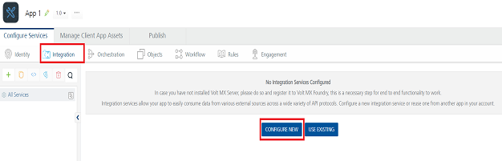
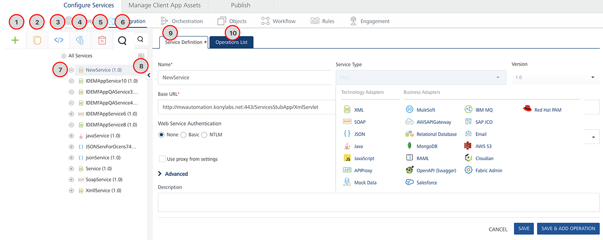

                               

User Guide: [Integration](Services.md#integration) \> Configure Integration Service

Configure Integration Service
=============================

Menu path for integration service designer:

1.  After you [create an application](Adding_Applications.md), in the **Configure Services** tab, click the **Integration** service tab. The **Integration** page appears and lists the existing integration services (if any).
    
    
    
2.  Click **CONFIGURE NEW** to create an integration service. The following details are displayed in the integration service designer.
    
    
    
    The Integration page displays the following sections for an endpoint adapter:
    
    | Number | Section | Description |
    | --- | --- | --- |
    | 1 | Add | Allows you to add the following:Add New ServiceUse ExistingAdd New Operation |
    | 2 | Clone | Allows you to duplicate an existing service. Changes made to a cloned service will not impact the original service. |
    | 3 | Sample Code | A dynamic code is generated based on the configuration of a service. You can use this code in your SDK. |
    | 4 | Unlink | Allows you remove the service from the Integration services section of an app. When a service is unlinked, it is disassociated from a particular app. |
    | 5 | Delete button | Allows you to delete a service. |
    | 6 | Search button | Allows you to search services and operations in the **Services** section. |
    | 7 | **Services section** | Configured services for an app.You can click the expand or collapse button of a service to show or hide operations in the services. |
    | 8 | **Show / Hide button** | Allows you the show or hide the tree. When you hide the tree section, the right pane is used for service definition or operations details. |
    | 9 | **Service Definition tab** | Allows you to configure service defection for an integration service. |
    | 10 | Operations List tab | Allows you to configure operations for an integration service. The **Operations List** tab appears only after you save the details in the service definition tab. |
    

1.  Select the Integration service from the **Service Type** list, and configure the service.
    
    For more information, refer [supported Integration Endpoint Adapters](Services.md#supported-endpoint-adapters).
    

> **_Note:_** For more information on existing integration services, refer [Manage Existing Integration Services](Manage_Existing_Integration_Services.md).
