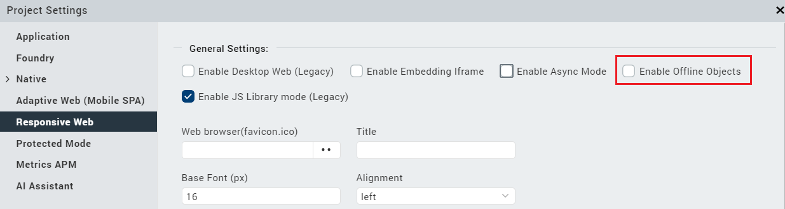
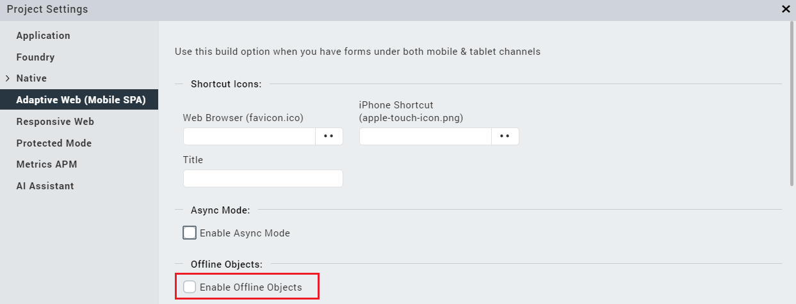

                              

User Guide: [SDKs](Foundry_SDKs.md) > [VoltMX Iris SDK](VoltMXStudio/Installing_VoltMXJS_SDK.md) > File Service Adapter APIs

File Service Adapter APIs
=========================

File Service Adapters, such as S3 File Storage and Cloudian File Storage, enable you to store binaries along with the metadata. The adapters create and use a generic FILE object, which makes searching of binaries easier.

The APIs provide a unified interface to perform various operations for binaries. Even if the back-end service changes, the application code remains the same and you do not need to change the interface.

File Storage Adapter supports the following operations:

*   **POST (create)** creates the metadata of a file. It takes a file\_name, metadata (optional), security\_key (optional), relative path (optional), and file\_namespace (optional) as inputs. It returns a unique file\_id.
*   **createBinary** uploads the file content to the metadata that is created using POST operation. It takes the file’s binary content, file\_id to identify the file, chunk sequence as inputs. It takes **security\_key** and **file\_namespace** as inputs if they are provided during the creation of the metadata.
*   **PATCH (partial update)** completes the file upload transaction. It takes file\_id to identify a file. You must provide security\_key and file\_namespace if they are provided during the creation of the metadata. You can also provide commit\_properties (stringified JSON or collection of properties) as an input based on the business requirements.
*   **GET** lists down the metadata of the created file. It takes an OData filter containing a combination of security\_key, file\_namespace, relative\_path, tags, description, and file\_id as inputs.
*   **getBinary** downloads the file content in the **base64** format by default. It takes file\_id as an input to identify a file. You must provide security\_key and file\_namespace if they are provided during the creation of the metadata. You can also provide **type** as an input with value **bytes** or **file**. If you specify **bytes**, the response will be in a stream format. If you specify the **file**, the response will be in a downloadable format.
*   **DELETE** deletes the metadata and file content. It takes file\_id, security\_key (optional) and file\_namespace (optional) as inputs.
*   **PUT (update)** updates the metadata of the file.  
    
    > **_Note:_** If the file content needs to be updated, you must delete the file using the **DELETE** operation and re-upload the file.
    

**file\_namespace** is a folder in the base folder in which, the hash of security\_key is created. While the base folder is configured during service creation (service\_namespace), file\_namespace is provided as a run-time input to the operation. The namespace can be sent from the input parameters, and a folder is created under service namespace from the service definition. If the namespace is not provided in the input parameters, a default namespace is used.

**security\_key** is used to create a folder under the file\_namespace folder. The binary content is saved with the file\_name provided in the newly created folder. The security\_key can be null. If it is null, a default security\_key is used.

If you want to upload data for a specific user, it is recommended to use the user ID from the identity session that is in the preprocessor of the service. If you want to have common content, you can also send a common security\_key.

**Relative path** is used to create a folder hierarchy in the folder specified by the hashed security\_key. The binary content is saved with the filename, in the newly created folder. If the relative path is not provided, the content will be stored directly under the given security\_key.

Workflow
--------

The workflow of File Storage Adapter is as follows:

1.  Create a service using the file storage as backend in the object service tab
2.  Choose the Binary Backend Type from the drop-down pointing to the file system or cloudian.
3.  In the case of Cloudian hyperstore, provide the required information to access the Cloudian Hyperstore such as access credentials, base folder, region, and endpoint as a json in advanced settings.
    
    { "accessKey": <your access key>, "accessSecret": <your access secret>, "endPointURL": <your endpoint URL>, "region": <your region name>, "bucketPath": <your bucket path>  
    }
    

1.  Provide the required service namespace in the service configuration.
2.  Test and save the service.
3.  Click on generate and choose File Object in the list.
4.  Configure the security\_key in the mapper of the appropriate verb as required. You can either choose to use the user ID from the identity session as the security\_key or let the user provide the security\_key.  
    
    > **_Note:_** Even though the user provides the security\_key, identity session user ID takes precedence over the security key by default.
    
5.  Use an SDK API to connect to the file storage adapter service and upload a binary.
6.  The binary is uploaded to either Filesystem or Cloudian inside a specified folder path in the server.

> **_Note:_** If you select identity session user ID as security\_key, you must log on to the identity session before invoking any APIs. Otherwise, the server throws an error saying, ‘Please log on and try again’.

File Storage Adapter supports the following operations:

> **_Note:_** Client SDK APIs are supported for Android, iOS and Web platforms.

Preprequisites
--------------

To use File Service Adapter APIs for web applications, you must enable Offline Objects in Volt MX Iris.

To enable Offline Objects for Responsive Web apps, follow these steps:

1.  From the left navigation panel of Iris, select **Project Settings**.
2.  From the Project Settings window, navigate to the **Responsive Web** section.
3.  Under **General Settings**, select the **Enable Offline Objects** check box.



To enable Offline Objects for Adaptive Web (Mobile SPA) apps, follow these steps:

1.  From the left navigation panel of Iris, select **Project Settings**.
2.  From the Project Settings window, navigate to the **Adaptive Web (Mobile SPA)** section.
3.  Under **Offline Objects**, select the **Enable Offline Objects** check box.



Getting the File Storage Handler from an Object Service
-------------------------------------------------------

Use the following sample code to get the file storage handler from an Object service.

```
var objSvc;
var fileStorage;
var serviceName = "TestService";
// Init
function initApp() {
    voltmx.logger.currentLogLevel = voltmx.logger.logLevel.TRACE;
    voltmx.logger.activatePersistors(voltmx.logger.consolePersistor);

    if (!client) {
        client = new voltmx.sdk();
        client.init(appkey, appsecret, serviceURL, function(response) {
            currObj = voltmx.sdk.getCurrentInstance();
            objSvc = currObj.getObjectService(serviceName, {
                "access": "online"
            });
            fileStorage = objSvc.getFileStorage();
            if (fileStorage === null) {
                alert("null fileStorage !");
            } else {
                alert("Init success !");
            }
        }, function(error) {
            alert("Init Failure " + error);
        });
    }
}
```

list
----

The **list** operation returns a JSON string that contains the metadata of all matching files.

> **_Note:_** If no matching files are found, the JSON string response will contain an empty array.

### Syntax

objSvc.getFileStorage().listFiles(searchFilter, headers, successCallback, failureCallback, options)

### Parameters

  
| Parameter | Data Type | Description | Mandatory |
| --- | --- | --- | --- |
| searchFilter | String | An OData filter that has conditions for search. The allowed keys are **security\_key**, **file\_namespace**, **relative\_path**, **tags**, and **description**. It can be null or empty, implying that all files' metadata will be returned. | No |
| headers | dictionary<string, string> | It is a dictionary <string, string> that contains the required headers. | Yes |
| successCallback | function(obj) | It is the callback to be invoked on successful completion of the **listFiles** operation. | Yes (may be null) |
| failureCallback | function(obj) | It is the callback to be invoked on failure of the **listFiles** operation. | Yes (may be null) |

### Sample Code

```
function listFiles() {
    headers = {};
    headers["Content-Type"] = "application/json";
    filter = "file_namespace eq userDefinedNamespace and security_key eq userDefinedSecurityKey";

    fileStorage.listFiles(filter,
        headers,
        function(res) {
            alert("Results of query = " + JSON.stringify(res));
        },
        function(err) {
            alert("
    Query Error " + JSON.stringify(err));
        },
        null);
}
```

### Sample Output

```
{
    "records": [{
        "security_key": "XXXXXX",
        "file_name": "XXXX.jpg",
        "size": "null",
        "file_namespace": "XXXX",
        "file_id": "XX",
        "relative_path": ""
    }, {
        "security_key": "XXXXXXXX",
        "file_name": "XXXX.jpg",
        "size": "null",
        "file_namespace": "XXXX",
        "file_id": "XX",
        "relative_path": ""
    }, {
        "security_key": "XXXXXXXX",
        "file_name": "XXXX.jpg",
        "tags": "XXX",
        "size": "null",
        "file_namespace": "XXXX",
        "file_id": "XX",
        "relative_path": ""
    }],
    "requestContext": "file_namespace eq XXXX and security_key eq XXXXXXX",
    "opstatus": 0,
    "httpStatusCode": 0
}
```

upload
------

The **upload** operation uploads either a single file or raw bytes. It is mandatory to specify either filePath or rawBytes, but not both.

### Syntax

objSvc.getFileStorage().upload(uploadEntityType, uploadParams, successCallback, failureCallback, options)

### Parameters

  
| Parameter | Data Type | Description | Mandatory |
| --- | --- | --- | --- |
| uploadEntityType | String | It decides whether to upload a local file (using its filePath) or raw bytes array. Permitted values are **UploadInputTypeLocalFilePath** and **UploadInputTypeRawBytes**. The corresponding filePath or byteArray will be specified in uploadParams. | Yes |
| uploadParams | dictionary<string, dictionary<string, string>> | It is a dictionary that contains the three key value pairs (metadata, headers and file). Each of these keys correspond to another dictionary of key value pairs. **metadata** dictionary must contain **attachment\_name**, **security\_key** (optional) and **file\_namespace** (optional). Also, file must specify either a valid **filePath** or non-null **rawBytes**, in accordance with the value specified for uploadEntityType. > **_Important:_** For SPA, uploadParams must contains a JavaScript file object.For more information on file object, click [here](https://developer.mozilla.org/en-US/docs/Web/API/File). | Yes |
| successCallback | function(obj) | It is the callback to be invoked on successful upload. | Yes (may be null) |
| failureCallback | function(obj) | It is the callback to be invoked in case of failure of upload. | Yes (may be null) |

### Sample Code

```
function uploadNewFile() {
    headers = {};
    headers["Content-Type"] = "application/json";

    fileMap = {};
    fileMap["rawBytes"] = voltmx.convertToBase64(cameraWidget.rawBytes);

    metadata = {};
    metadata["file_name"] = "Photo.jpg";
    metadata["security_key"] = "userDefinedSecurityKey";
    metadata["file_namespace"] = "userDefinedNamespace";

    uploadParams = {};
    uploadParams["headers"] = headers;
    uploadParams["metadata"] = metadata;
    uploadParams["file"] = fileMap;

    fileStorage.upload("UploadInputTypeRawBytes",
        uploadParams,
        function(res) {
            alert("Upload successful for " + metadata["file_name"] + " : " + JSON.stringify(res));
        },
        function(err) {
            alert("Upload Error " + JSON.stringify(err));
        },
        null);
}
```

### Sample Output

```
Upload Success {
    "totalRecords": 1,
    "commit_properties": "{}",
    "security_key": "XXXX",
    "file_namespace": "XXXX",
    "requestContext": {
        "security_key": "XXXX",
        "file_namespace": "XXXX",
        "file_name": "XXXX.jpg"
    },
    "file_id": "XX",
    "opstatus": 0,
    "updtaedRecords": 1,
    "httpStatusCode": 0
}
```

download
--------

The **download** operation downloads one file at a time.

### Syntax

objSvc.getFileStorage().download(downloadParams, successCallback, failureCallback, options)

### Parameters

  
| Parameter | Type | Description | Mandatory |
| --- | --- | --- | --- |
| downloadParams | dictionary<string, dictionary<string, string>> | It is a dictionary that contains the two key value pairs (metadata and headers). Each of these keys correspond to another dictionary of key value pairs. **metadata** dictionary must contain **file\_id**, **security\_key** (optional) and **file\_namespace** (optional). | Yes |
| successCallback | function(obj) | It is the callback to be invoked on successful download. | Yes (may be null) |
| failureCallback | function(obj) | It is the callback to be invoked in case of failure of download. | Yes (may be null) |
| options | dictionary<string, string> | It accepts only one parameter namely **forceDownload**. > **_Note:_** If **forceDownload** is **true**, for every download call, the file is explicitly downloaded and overwrites the pre-existing local file (if any). | No |

> **_Note:_** The downloadParams parameter must contain valid values. Otherwise, an error is encountered that says, 'no such file exists'.

### Sample Code

```
function downloadFile() {
    selectedFileId = "100";
    selectedFileName = "MyFile.jpg";
    headers = {};
    headers["Content-Type"] = "application/json";
    metadata = {};
    metadata["file_id"] = selectedFileId;
    metadata["security_key"] = "userDefinedSecurityKey";
    metadata["file_namespace"] = "userDefinedNamespace";

    downloadParams = {};
    downloadParams["headers"] = headers;
    downloadParams["metadata"] = metadata;

    fileStorage.download(downloadParams,
        function(res) {
            "Download success : " + JSON.stringify(res);
        },
        function(err) {
            alert("Download Error " + JSON.stringify(err));
        }, {
            forceDownload: true
        });
}
```

### Sample Output

```
{
    "file_name": "XXXX.jpg",
    "filePath": "/data/dta/com.orgname.BinaryDemo/downlaods/KH54321_2017.jpg",
    "requestContext": {
        "file_id": "XX",
        "security_key": "XXXX",
        "file_namespace": "XXXX"
    },
    "opstatus": 0,
    "httpStausCode": 0
}
```

> **_Note:_** In SPA, the output contains a **fileObject** instead of the **filePath**.  
For more information on file object, click [here](https://developer.mozilla.org/en-US/docs/Web/API/File).

update
------

The **update** operation updates the metadata of the existing file.

### Syntax

objSvc.getFileStorage().update(updateParams, successCallback, failureCallback, options)

### Parameters

  
| Parameter | Type | Description | Mandatory |
| --- | --- | --- | --- |
| updateParams | dictionary<string, dictionary<string, string>> | It is a dictionary that contains the two key value pairs (metadata and headers). Each of these keys correspond to another dictionary of key value pairs. **metadata** dictionary must contain **file\_id**, **security\_key** (optional) and **file\_namespace** (optional). For more information about which columns of the metadata can be modified, refer to the [Modifiable Columns](#modifiable-columns) table. | Yes |
| successCallback | function(obj) | It is the callback to be invoked on successful update. | Yes (may be null) |
| failureCallback | function(obj) | It is the callback to be invoked in case of failure of update. | Yes (may be null) |

> **_Note:_** The updateParams parameter must contain valid values. Otherwise, an error is encountered that says, 'no such file exists'.

### Modifiable Columns

The following table specifies which columns of the metadata can be modified by using the update API.

<table style="mc-table-style: url('Resources/TableStyles/Basic.css');" class="TableStyle-Basic" cellspacing="0"><colgroup><col style="width: 25%;" class="TableStyle-Basic-Column-Column1"> <col style="width: 25%;" class="TableStyle-Basic-Column-Column1"></colgroup><tbody><tr class="TableStyle-Basic-Body-Body1"><th class="TableStyle-Basic-BodyE-Column1-Body1">Column name</th><th class="TableStyle-Basic-BodyD-Column1-Body1">Support for modification</th></tr><tr class="TableStyle-Basic-Body-Body1"><td class="TableStyle-Basic-BodyE-Column1-Body1">file_namespace</td><td class="TableStyle-Basic-BodyD-Column1-Body1">No</td></tr><tr class="TableStyle-Basic-Body-Body1"><td class="TableStyle-Basic-BodyE-Column1-Body1">Description</td><td class="TableStyle-Basic-BodyD-Column1-Body1">Yes</td></tr><tr class="TableStyle-Basic-Body-Body1"><td class="TableStyle-Basic-BodyE-Column1-Body1">Tags</td><td class="TableStyle-Basic-BodyD-Column1-Body1">Yes</td></tr><tr class="TableStyle-Basic-Body-Body1"><td class="TableStyle-Basic-BodyE-Column1-Body1">Createdby</td><td class="TableStyle-Basic-BodyD-Column1-Body1">No <span class="autonumber"><span><b><i><span style="color: #0a9c4a;" class="mcFormatColor">Note: </span></i></b></span></span>Createdby can be configured in the <a href="#upload" class="selected">upload</a> API</td></tr><tr class="TableStyle-Basic-Body-Body1"><td class="TableStyle-Basic-BodyE-Column1-Body1">Modifiedby</td><td class="TableStyle-Basic-BodyD-Column1-Body1">Yes</td></tr><tr class="TableStyle-Basic-Body-Body1"><td class="TableStyle-Basic-BodyE-Column1-Body1">custom_field</td><td class="TableStyle-Basic-BodyD-Column1-Body1">Yes <span class="autonumber"><span><b><i><span style="color: #0a9c4a;" class="mcFormatColor">Note: </span></i></b></span></span>A custom_field parameter can also be configured in the <a href="#upload" class="selected">upload</a> API</td></tr><tr class="TableStyle-Basic-Body-Body1"><td class="TableStyle-Basic-BodyE-Column1-Body1">File_id</td><td class="TableStyle-Basic-BodyD-Column1-Body1">No</td></tr><tr class="TableStyle-Basic-Body-Body1"><td class="TableStyle-Basic-BodyE-Column1-Body1">File_name</td><td class="TableStyle-Basic-BodyD-Column1-Body1">No</td></tr><tr class="TableStyle-Basic-Body-Body1"><td class="TableStyle-Basic-BodyE-Column1-Body1">Checksum</td><td class="TableStyle-Basic-BodyD-Column1-Body1">Yes</td></tr><tr class="TableStyle-Basic-Body-Body1"><td class="TableStyle-Basic-BodyE-Column1-Body1">File_size</td><td class="TableStyle-Basic-BodyD-Column1-Body1">Yes</td></tr><tr class="TableStyle-Basic-Body-Body1"><td class="TableStyle-Basic-BodyE-Column1-Body1">Security_key</td><td class="TableStyle-Basic-BodyD-Column1-Body1">No</td></tr><tr class="TableStyle-Basic-Body-Body1"><td class="TableStyle-Basic-BodyE-Column1-Body1">Commit_properties</td><td class="TableStyle-Basic-BodyD-Column1-Body1">No <span class="autonumber"><span><b><i><span style="color: #0a9c4a;" class="mcFormatColor">Note: </span></i></b></span></span>Commit_properties can be configured in the <a href="#upload" class="selected">upload</a> API</td></tr><tr class="TableStyle-Basic-Body-Body1"><td class="TableStyle-Basic-BodyE-Column1-Body1">Mime_type</td><td class="TableStyle-Basic-BodyD-Column1-Body1">Yes</td></tr><tr class="TableStyle-Basic-Body-Body1"><td class="TableStyle-Basic-BodyE-Column1-Body1">Relative_path</td><td class="TableStyle-Basic-BodyD-Column1-Body1">No</td></tr><tr class="TableStyle-Basic-Body-Body1"><td class="TableStyle-Basic-BodyE-Column1-Body1">CreatedTimeStamp</td><td class="TableStyle-Basic-BodyD-Column1-Body1">No</td></tr><tr class="TableStyle-Basic-Body-Body1"><td class="TableStyle-Basic-BodyB-Column1-Body1">ModifiedTimeStamp</td><td class="TableStyle-Basic-BodyA-Column1-Body1">No</td></tr></tbody></table>

### Sample Code

```
function update() {
    tags = “my new tag”;
    metadata = {};
    metadata["file_id"] = "100";
    metadata["file_name"] = "test.jpg";
    metadata["security_key"] = "userDefinedSecurityKey";
    metadata["file_namespace"] = "userDefinedNamespace";
    metadata["tags"] = tags;

    headers = {};
    headers["Content-Type"] = "application/json";

    updateParams = {};
    updateParams["headers"] = headers;
    updateParams["metadata"] = metadata;

    fileStorage.update(updateParams,
        function(res) {
            alert("Successfully added tag =  \"" + tags + "\" : " + JSON.stringify(res));
        },
        function(err) {
            alert("Update Error : " + JSON.stringify(err));
        },
        null);
}
```

### Sample Output

```
Update Success {
    "totalRecords": 1,
    "requestContext": {
        "security_key": "XXXX",
        "file_namespace": "XXXX",
        "file_name": "XXXX.jpg",
        "file_id": "XX",
        "tags": "newTag"
    },
    "file_id": "XX",
    "opstatus": 0,
    "updatedRecords": 1,
    "httpStatusCode": 0
}
```

deleteById
----------

The **deleteById** operation deletes the existing files. It deletes one file at a time.

### Syntax

objSvc.getFileStorage().deleteById(file\_id, deleteParams, successCallback, failureCallback, options)

### Parameters

  
| Parameter | Type | Description | Mandatory |
| --- | --- | --- | --- |
| file\_id | String | It is the ID of the file to be deleted. | Yes |
| deleteParams | dictionary<string, dictionary<string, string>> | It is a dictionary that contains the two key value pairs (metadata and headers). Each of these keys correspond to another dictionary of key value pairs. **metadata** dictionary is optional and must contain at one key value pair. | Yes |
| successCallback | function(obj) | It is the callback to be invoked on successful deletion. | Yes (may be null) |
| failureCallback | function(obj) | It is the callback to be invoked in case of failure of deletion. | Yes (may be null) |

> **_Note:_** The combination of file\_id and downloadParams metadata must contain valid values. Otherwise, an error is encountered that says, 'no such file exists'.

### Sample Code

```
function deleteFileById() {
    headers = {};
    headers["Content-Type"] = "application/json";

    deleteParams = {};
    deleteParams["security_key"] = "userDefinedSecurityKey";
    deleteParams["file_namespace"] = "userDefinedNamespace";

    fileStorage.deleteById("100",
        deleteParams,
        headers,
        function(res) {
            alert("Deletion Successful  : " + JSON.stringify(res));
        },
        function(err) {
            alert("Deletion Error : " + JSON.stringify(err));
        },
        null);
}
```

### Sample Output

```
Delete Success {
    "totalRecords": 1,
    "deletedRecords": 1,
    "requestContext": {
        "security_key": "XXXX",
        "file_namespace": "XXXX",
        "file_id": "XX"
    },
    "file_id": "XX",
    "opstatus": 0,
    "httpStatusCode": 0
}
```

deleteByCriteria
----------------

The **deleteByCriteria** is used for bulk-delete of files matching the specified **deleteParams**.

### Syntax

objSvc.getFileStorage().deleteByCriteria(deleteParams,successCallback, failureCallback, options)

### Parameters

  
| Parameter | Type | Description | Mandatory |
| --- | --- | --- | --- |
| deleteParams | dictionary<string, dictionary<string, string>> | It is a dictionary that contains the two key value pairs (metadata and headers). Each of these keys correspond to another dictionary of key value pairs. **metadata** dictionary is optional and must contain at one key value pair. All the files whose metadata matches with the value(s) specified are deleted. | Yes |
| successCallback | function(obj) | It is the callback to be invoked on successful deletion. | Yes (may be null) |
| failureCallback | function(obj) | It is the callback to be invoked in case of failure of deletion. | Yes (may be null) |

> **_Note:_** The downloadParams metadata must contain valid values. Otherwise, an error is encountered that says, 'no such file exists'.

### Sample Code

```
function bulkDelete() {
    headers = {};
    headers["Content-Type"] = "application/json";

    deleteParams = {};
    deleteParams["security_key"] = "userDefinedSecurityKey";
    deleteParams["file_namespace"] = "userDefinedNamespace";

    fileStorage.deleteByCriteria(deleteParams,
        headers,
        function(res) {
            alert("Bulk Delete success : " + JSON.stringify(res));
        },
        function(err) {
            alert("Bulk Delete Error " + JSON.stringify(err));
        }, {});
}
```

### Sample Output

```
Bulk Delete Success {
    "totalRecords": 1,
    "deletedRecords": 1,
    "requestContext": {
        "security_key": "XXXX",
        "file_namespace": "XXXX"
    },
    "opstatus": 0,
    "httpStatusCode": 0
}
```

abort
-----

The **abort** is same as deleteById. It deletes one file at a time.

### Syntax

objSvc.getFileStorage().abort(file\_id, abortParams, successCallback, failureCallback, options)

### Parameters

  
| Parameter | Type | Description | Mandatory |
| --- | --- | --- | --- |
| file\_id | String | It is the ID of the file to be deleted. | Yes |
| abortParams | dictionary<string, dictionary<string, string>> | It is a dictionary that contains the two key value pairs (metadata and headers). Each of these keys correspond to another dictionary of key value pairs. **metadata** dictionary is optional and must contain at one key value pair. | Yes |
| successCallback | function(obj) | It is the callback to be invoked on successful deletion. | Yes (may be null) |
| failureCallback | function(obj) | It is the callback to be invoked in case of failure of deletion. | Yes (may be null) |

> **_Note:_** The combination of file\_id and downloadParams metadata must contain valid values. Otherwise, an error is encountered that says, 'no such file exists'.

### Sample Code

```
function abortFile() {
    headers = {};
    headers["Content-Type"] = "application/json";

    abortParams = {}
    abortParams["security_key"] = "userDefinedSecurityKey";
    abortParams["file_namespace"] = "userDefinedNamespace";

    fileStorage.abort("100",
        abortParams,
        headers,
        function(res) {
            alert("Abort Successful  : " + JSON.stringify(res));
        },
        function(err) {
            alert("Abort Error : " + JSON.stringify(err));
        },
        null);
}
```

### Sample Output

```
Delete Success {
    "totalRecords": 1,
    "deletedRecords": 1,
    "requestContext": {
        "security_key": "XXXX",
        "file_namespace": "XXXX",
        "file_id": "XX"
    },
    "file_id": "XX",
    "opstatus": 0,
    "httpStatusCode": 0
}
```

Error Codes and Messages
------------------------

  
| Error Code | Error Message | Scenario |
| --- | --- | --- |
| 5001 | Binary record is in invalid state to perform the operation | Unexpected exception while performing an operation. For example, network issues, out of memory, low disk space, and data corruption. |
| 5004 | Binary record doesn't exist for the given primary keys | Invalid file\_id provided for downloading a file. |
| 6002 | Download operation of binary failed | Failed to download a file. |
| 6003 | Network operation failed | Unexpected response received from the Volt MX Foundry server. |
| 6006 | Upload error | Failed to upload a file. |
| 6020 | Update operation failed | Failure of the update operation. |
| 6024 | Unable to perform Delete | Failure of **deleteById**, **deleteByCriteria**, and **abort** operations. |
| 8001 | Binary operation failed due to IO Operation | Error from the Volt MX Foundry Server when creating an entry for uploading a new file. |
| 11001 | Chunk could not be saved | Failed to save a chunk of file while downloading a large file. |
