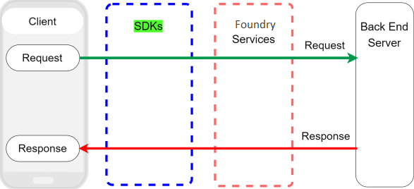
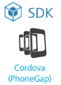
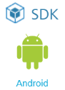
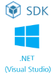

                               

User Guide: Workflow of Volt MX SDKs

               

Volt MX  SDKs
============

SDKs integrate Volt MX Foundry services with your client applications. You can use your preferred development language or platform to build your apps.

Before using Volt MX SDKs, Volt MX Foundry app must be published to an environment.

> **_Note:_** HCL provides different client SDKs to connect applications to Volt MX Foundry services. The SDKs are available for Native iOS, Native Android, .NET, Cordova (PhoneGap), JavaScript, and the SDK built into the Volt MX Iris IDE.  
  
Due to differences in the various platforms, the functionality varies for each client SDK. Please refer to the documentation of specific SDKs to view the features supported by each of them and how to use them.

Workflow of Volt MX SDKs
------------------------

The following workflow describes the integration of Volt MX SDKs layer along with various stages of client app development.

Supported Volt MX SDKs
----------------------

Volt MX  Foundry client SDKs are supported for the following languages.

  
| Volt MX SDKs ||||
| --- | --- | --- | --- |
| SDKs | Description | Prerequisites | **Documentation** |
| --- | --- | --- | --- |
| Volt MX Iris | Volt MX Iris SDK (`voltmx-ide-sdk`) is bundled with Iris. Volt MX Iris SDK help you to integrate Volt MX Foundry services into client apps for multiple platforms | Volt MX Iris 7.0 and above. |  |
| JavaScript | Plain JS SDK (`voltmx-plainJS-sdk`) helps you to integrate Volt MX Foundry services into client apps developed with Vanilla JS | Supported Web browsers for Plain JS: Firefox 31.0 Google Chrome 36.0 Internet Explorer 10.1 Opera 23.0 |  |
| PhoneGap (Cordova) | Volt MX PhoneGap SDK (`voltmx-phonegap-sdk`) helps you to integrate Volt MX Foundry services into client apps developed with PhoneGap (Cordova) | Cordova 3.4.0-rc.2 |  |
| iOS | Volt MX iOS SDK (`voltmx-ios-sdk`) helps you to integrate Volt MX Foundry services into client apps developed with Xcode | Minimum iOS version: iOS7 Mavericks OS X or Mountain Lion OS X Xcode 5.1 |  |
| Android | Volt MX Android SDK (`voltmx-android-sdk`) helps you to integrate Volt MX Foundry services into client apps developed with Android Studio | Minimum Android version: Android 4.0 (API Level 14) Java Development Kit (JDK) 1.6 - [Oracle Technology NetworkJavaJava SE SupportDownloads > Java SE 6 Downloads](http://www.oracle.com/technetwork/java/javasebusiness/downloads/java-archive-downloads-javase6-419409.html#jdk-6u32-oth-JPR) An IDE, such as Eclipse, with ADT installed or Android Studio 1.5 or 2.1. |  |
| .NET (Visual Studio) | Volt MX .NET (Visual Studio) SDK (`voltmx-windows-sdk`) helps you to integrate Volt MX Foundry services into client apps developed with .Net (Windows) | .NET Framework 4.6.1 or higher NuGet Packages:[Acr.DeviceInfo 6.5.0](https://www.nuget.org/packages/Acr.DeviceInfo/) or higher[Newtonsoft.Json 12.0.1](https://www.nuget.org/packages/Newtonsoft.Json/) or higher> **_Note:_** HCL does not explicitly test or certify the .NET SDK with Xamarin, but it is designed to be compatible with Xamarin. |  |
