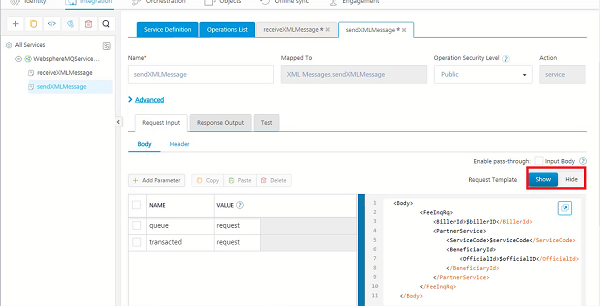
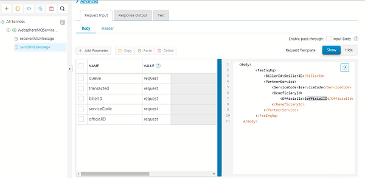
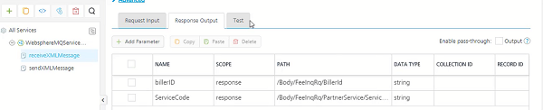

                                

User Guide: [Integration](Services.md#integration) \> [Configure the Integration Service](ConfigureIntegrationService.md) > IBM MQ Adapter

IBM MQ Adapter
--------------

IBM MQ server 9.0.0 version is a messaging middleware that simplifies and accelerates the integration of diverse applications and business data across multiple platforms. It uses message queues to facilitate the exchanges of information and offers a single messaging solution for cloud, mobile, Internet of Things (IoT) and on-premises environments. Volt MX uses the IBM MQ service to secure the message delivery and reduce the risk of data loss.

### Configure IBM MQ End-point Adapter

**To configure your IBM MQ Service in the [Integration Service Definition](ConfigureIntegrationService.md#IntegrationSDpage) tab, follow these steps:**

1.  In the **Service Name** text box, enter a unique name for your service.
2.  From the **Service Type** list, select **IBM MQ**.  
    By default, XML is selected. If you select **IBM MQ**, the **Connection Parameters** section is displayed.
3.  Provide the following details to create an IBM MQ Service:
    
      | Fields | Description |
| --- | --- |
| Connection Parameters |**Fill in the details for the following fields.**  **Host**: Enter the IP/host of the IBM queue manager. **Port**: Enter the MQ port number of the queue manager. **Channel**: Enter the IBM channel configured for the queue manager. The default channel is SYSTEM.DEF.SVRCONN. **Queue Manager**: Select or type the name of the queue manager that hosts the destination queue. Queue manager is list of queues. **Destination**: Default destination of the queue inside queue manager or hosted in a queue manager. **Consumer Timeout (milliseconds)**: Default timeout is 10000 milliseconds. **Advanced Connection Properties**: Enter the **Connection Mode** in **Advanced Connection Properties** field. You can also enter the user name and secret, if required. {"connectionMode":"CLIENT", "username":"", "secret" : ""} **Test Connection**: Click **Test Connection** to validate the user data. If your database is configured with a proxy server, you must select an **environment** and then click **Test Connection** to test the database connectivity. The environment should be `=> V8.3`.  For example, you have the Volt MX Foundry Console installed on one machine, and the Runtime and Database servers installed on another machine. When you create an integration service of type IBM MQ, the Console must be established with a VPN connection to the IBM MQ server. So that, when you test the Database connection, the test case will be successful. You can do this by selecting the correct environment for your Runtime Server which will ensure a VPN connection between the Console and the Runtime Server and test the database. If the entered details are correct, the system displays the message: Valid Database connection details. |
| Use Existing Identity Provider | Select **IBM MQ** identity from the list. |

4. 

For additional configuration of your service definition, provide the following details in the Advanced section.

      | Fields | Description |
| --- | --- |
| Specify JAR | To specify a JAR associated to the service, select one from the **Select Existing IBM JAR** from the list or click **Upload New** to add a new JAR file. **To specify dependent JAR, follow these steps:**   Select the **IBM** JAR files from the drop-down list, or click **Upload New** to browse the JAR file from your local system.   You can upload any one of the following JARs to connect the IBM MQ using JMS.  IBM All client JAR(8 MB) - com.ibm.mq.allclient.jar   **_Important:_** Make sure that the MySQL packet size should be more than 8 MB. By  default, the MySQL packet size is 4 MB. If the MySQL packet size is less than 8 MB, an error will appear when the service is used from a device.You can check the error logs and reset the MySQL packet size to more than 8 MB.  Four mandatory JARs -  com.ibm.mqcore.jar or com.ibm.mq.jar  com.ibm.mq.headers.jar  com.ibm.mq.jmqi.jar  com.ibm.mqjms.jar |
| API Throttling | If you want to use **API throttling** in Volt MX Foundry Console, to limit the number of request calls within a minute. do the following:   In the **Total Rate Limit** text box, enter a required value. This will limit the total number of requests processed by this API.  In the **Rate Limit Per IP** field, enter a required value. With this value, you can limit the number of IP address requests configured in your Volt MX Foundry console in terms of Per IP Rate Limit.   To override throttling from Volt MX Foundry App Services Console, refer to [Override API Throttling Configuration](API_Throttling_Override.md#override-api-throttling-configuration).  **_Note:_** In case of On-premises, the number of nodes in a clustered environment is set by configuring the VOLTMX\_SERVER\_NUMBER\_OF\_NODES property in the Admin Console. This property indicates the number of nodes configured in the cluster. The default value is 1. Refer to [The Runtime Configuration tab on the Settings screen of App Services](../../../Foundry/vmf_integrationservice_admin_console_userguide/Content/Runtime_Configuration.md). The total limit set in the Volt MX Foundry Console will be divided by the number of configured nodes. For example, a throttling limit of 600 requests/minute with three nodes will be calculated to be 200 requests/minute per node. This is applicable for Cloud and On-premises. | 

5.  In the **Description** field, enter the description.
6.  Click **SAVE** to save your service definition.

### Create Operations for IBM MQ Service

1.  Click **SAVE & ADD OPERATION** in your service definition page to save your service definition and display the **NewOperation** tab for adding operations.  
                        OR  
    Click **Add Operation** to add a new operation or from the tree in the left pane, click **Add > Add New Operation**.
    
2.  Select an operation from the drop-down list and click **ADD OPERATION**.
3.  Click the configured operation and provide the following details to create an operation.  
    
    | Field | Description |
    | --- | --- |
    | Name | The operation name appears in the Name field. You can modify the name, if required. |
    | Mapped To | The operation name to which the configured operation is mapped. |
    | Operation Security Level | It specifies how a client must authenticate to invoke this operation.  **Select one of the following security operations in the Operation Security Level field.**   **Authenticated App User** – It restricts the access to clients who have successfully authenticated using an Identity Service associated with the app.  **Anonymous App User** – It allows the access from trusted clients that have the required App Key and App Secret. Authentication through an Identity Service is not required.  **Public** – It allows any client to invoke this operation without any authentication. This setting does not provide any security to invoke this operation and you should avoid this authentication type if possible.  **Private** - It blocks the access to this operation from any external client. It allows invocation either from an Orchestration/Object Service, or from the custom code in the same run-time environment. |

> **_Note:_** The field is set to Authenticated App User, by default. 
    
4.  Click the Advanced tab to configure the preprocessor and postprocessor forJava and JavaScript. For more details, refer to [Preprocessor and Postprocessor](Java_Preprocessor_Postprocessor_.md). You can also configure **Server Events** from here. For more details, refer [Server Events](ServerEvents.md).
    
> **_Note:_** All options in the Advanced section are optional.

### Configure Request Operation for IBM MQ

Integration services accept only form-url-encoded inputs for all input parameters provided in service input parameters (request input).

You can perform the following actions in the Request Input tab,

1.  Click **Add Parameter**  to add an entry (if the entries for input and the output tabs does not exist).
2.  To make duplicate entries, select the check box for the entry, click **Copy** and **Paste**.
3.  To delete an entry, select the check box for an entry and click **Delete** .
4.  Click **Show** button and enter the message template in the right pane. The message template is used to send a message to IBM MQ server.
    
    
    
    
    
5.  Add the template parameters as request parameters in the **Request Input** tab.
    
    > **_Note:_** Enter **Queue** and **Transacted** in the request parameters.  
      
    \- Queue parameter is used to change queue in the queue manager at run time.  
    \- Transacted parameter accepts **True**or **False** to set JMS message to be in the transacted session scope or not.  
    
6.  Provide the following details in the request input parameters tab:
    
    | Field | Description |
    | --- | --- |
    | Name | Enter a unique identifier for the request input parameter. Change the identifier, if required. |
    | Value | Three different options are available in Volt MX Foundry under **VALUE** during configuration of any operation. When you start editing this field, dependent identity services are auto populated. These options primarily determine the source of the value of the header.  **Select request or session or Identity.**   **Request**: If this option is selected, the Integration Server picks the value pairs from the client's request during run time and forwards the same to the back-end.User has the option to configure the default value. This default value is taken if the request does not have the header.  **Session**: If this option is selected, the value of header is picked from session context based on the user configuration.  **Identity**: If this option is selected, you can filter the request parameters based on the response from the identity provider. For more details to configure identity filters, refer to [Enhanced Identity Filters - Integration Services](Identity_Filters_Integration.md).   **_Note:_** The field is set to **Request**, by default. |
    | TEST VALUE | Enter a value. A test value is used for testing the service. |
    | DEFAULT VALUE | Enter the value, if required. The default value will be used if the test value is empty. |
    | DATA TYPE | **Select a data type in the Data Type field.**  **String** - A combination of alphanumeric and special characters. String supports all formats including UTF-8 and UTF-16 with no maximum size limit.  **Date** - A value that is defined as date values.  **Boolean** - A value that is true or false.  **Number** - An integer or a floating number.**Collection** - A group of data or data set. |
    | Record ID | Enter the record ID. |
    | Collection ID | Enter the collection ID. |

7.  Enter the description for the Request Input.
8.  You can test a MQ service operation from Volt MX Foundry. You can refer to [Test a Service Operation](Test_a_Service_Operation.md) for the steps to test a service.

### Configure Response Operation for IBM MQ

Click the **Response Output** tab, and the values in the required fields such as name, scope, path, data type, collection ID, record ID, and description are automatically populated.

The following JMS service output parameters are auto-populated, by default.

*   JMSCorrelationID
*   JMSDeliveryMode
*   JMSDestination
*   JMSExpiration
*   JMSMessageID
*   JMSPriority
*   JMSRedelivered
*   JMSTimestamp
*   JMSReplyTo
*   JMSType
*   JMSXDeliveryCount
*   MessageBody
*   JMSREPLYTO
*   JMSTYPE
*   JMSXDELIVERYCOUNT

You can delete the default parameters and add the custom parameters and **XML** path or **JSON** path to receive the response from IBM MQ server.

Click **SAVE OPERATION** to save the operation. The system updates the operation definition.

If you click **Cancel**, the **Edit Operation** tab closes without saving any information.

> **_Note:_** You can view the service in the Data Panel feature of Volt MX Iris. By using the Data Panel, you can link back-end data services to your application UI elements seamlessly with low-code to no code. For more information on Data Panel, click [here](../../../Iris/iris_user_guide/Content/DataPanel.md#top).
