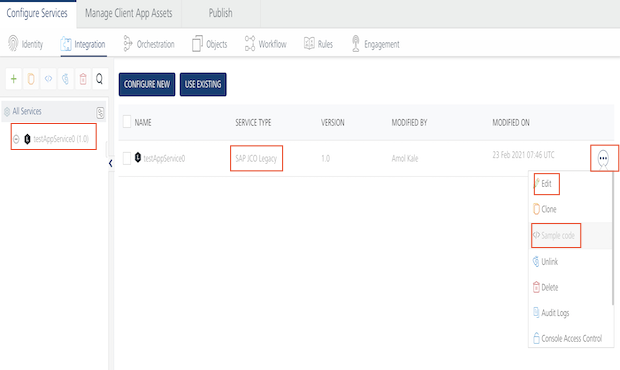
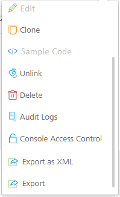
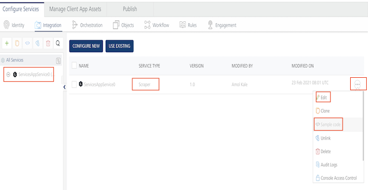
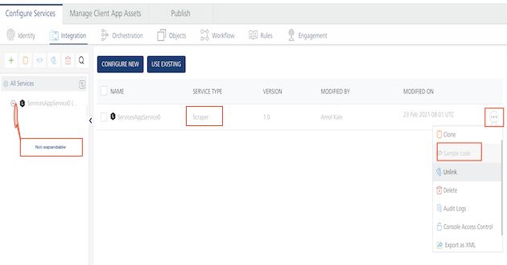

User Guide: Limitations - SAP JCo Connector

# Legacy Services - SAP JCo Connector and Scraper Connector

Volt MX Foundry supports legacy services like SAP JCo and Scraper connectors. Legacy services include services that are originally created by using Volt MX Studio V 6.5 or lower, or services that are manually created using external tools. Apps whose services are created manually or outside Volt MX Studio are called Consolidated Services Definition (CSD) apps.

You cannot create new services using legacy connectors such as Scraper or SAP JCo directly in Volt MX Foundry. If you migrate apps with the legacy services into Volt MX Foundry, you can enable Volt MX Foundry apps with the services.

> **_Note:_**  If your application is built in Volt MX Studio versions before th 6.0, upgrade your project to current version format by using Volt MX Studio 6.5, and then migrate the app. For more details, refer to [Migrate a Project from an Earlier Version of Volt MX Studio or Iris](../../../Iris/iris_user_guide/Content/MigrateProjectFromVoltMXStudioOrPrevVerIris.md).

## Limitations

Read the following limitations for legacy services before migrating your apps to Volt MX Foundry.

### Limitations - SAP JCo Connector

<details close markdown="block"><summary>Click here for more details</summary>

- Due to limitations of the SAP JCo connector, Volt MX Foundry does not support middleware and services together to connect to same or different SAP systems on WebLogic, JBoss, and WebSphere. SAP JCo connector can be enabled either on middleware or services.
- When an app that contains an SAP JCo service is migrated, the **Service Type** field is filled in **SAP JCO Legacy** in the [integration](Services.md#integration) tab of the Volt MX Foundry Console, shown below: <br/>

  

- In the Volt MX Foundry Console, you can publish SAP JCo services like the other services supported in the Volt MX ecosystem.
- You cannot edit SAP JCo services in the Volt MX Foundry Console. If you click the **Settings cogwheel** button for the service, the following app menu appears.  
  <br/>

  

  <br/>

  <p>Note the following supported actions:</p>

  - **Edit** and **Sample code** are not supported.
  - **Clone**, **Unlink**, **Delete**, **Console Access Control**, **Export** are supported. For details, refer to [How to Use Actions on an Existing Integration Service](Manage_Existing_Integration_Services_1.md#context-based-options)

- You cannot view operations of an SAP JCo service in the Volt MX Foundry Console.
- An SAP JCo service is not clickable in Volt MX Foundry Console. You can only access operations for an SAP JCo service via the service definition XML directly. The **Configure Operation** button support is not available in the console.
- You cannot create SAP JCo services in Volt MX Foundry Console.
- For SAP JCo services, when you expand the tree view on the left pane in the integration service designer, no operations will be shown even if operations exist within the service definition XML of an SAP JCo service. The operations can only be accessed from within the XML file.
- While creating an orchestration, object or synchronization service in Foundry 7.x and later, legacy services are not available for linking.
- When an app that contains a Synchronization service referenced by legacy services as data source is migrated, sync scopes can only be viewed in Volt MX Foundry. You cannot edit the sync scopes.
- When an app that contains an Orchestration service referenced by legacy services is migrated, you can only view operations of the Orchestration service in Volt MX Foundry. You cannot edit the Orchestration service.

</details>

### Limitations - Scraper Connector

<details close markdown="block"><summary>Click here for more details</summary>

- For each scraper service, there should be a corresponding dsl file.
- When an app that contains a scraper service is migrated, then the **Service Type** field is filled in **Scraper** in the [integration](Services.md#integration) tab of Volt MX Foundry Console, shown below:  
  <br/>

  

<br/>

- In Volt MX Foundry Console, you can publish Scraper services like the other services supported in the Volt MX ecosystem.
- You cannot edit scraper services in Volt MX Foundry Console. If you click the **Settings cogwheel** button for the service, the following app menu appears. <br/>

  

  <br/>

  <p>Note the following supported actions:</p>

  - **Edit** and **Sample code** are not supported.
  - **Clone**, **Unlink**, **Delete**, **Audit Logs**, **Console Access Control**, **Export as XML**, and **Export** are supported. For details, refer to [How to Use Actions on an Existing Integration Service](Services.md#ActioninIntegration).

- You cannot view operations of a scraper service in Volt MX Foundry Console.
- Scraper service is not clickable in Volt MX Foundry Console. You can only access operations for a scraper service via the service definition XML directly. The **Configure Operation** button support is not available in the console.
- You cannot create scraper services in Volt MX Foundry Console. To create scraper services, use a version of Volt MX Studio 6.5 or older.
- For scraper services, in the integration service designer, the tree view on the left pane when expanded, it will not show any operations. The operations can only be accessed from within the XML file. <br/>

  

- Ensure that DSL files and the corresponding Java services have the same name. Otherwise, the migration fails.
- While creating an orchestration, object, or synchronization service in Foundry 7.x and later, legacy services are not available for linking.
- When an app that contains a synchronization service referenced by legacy services as a data source is migrated, sync scopes can only be viewed in Volt MX Foundry. You cannot edit the sync scopes.
- When an app that contains an Orchestration service referenced by legacy services is migrated, you can only view operations of the Orchestration service in Volt MX Foundry. You cannot edit the Orchestration service.

  > **_Note:_** Only one property file is allowed. The property file name must match the appID in the scraper servicedef file.

  #### Scraper services with a custom classname

  As custom classnames are no longer supported for scraper services, you must modify the custom classname to `com.voltmx.scrapper.gc.ScrapperJavaService`.

</details>

## How to Enable SAP JCo Configurations on Standalone JBoss Server

Middleware.war and Services.war are not deployed on JBoss if SAP is enabled. To enable SAP JCo on standalone for JBoss, follow these steps:

1.  Place the SAP JCo DLL file in the **System32** folder for Windows. For Linux, place the SAP JCo SO file in the user’s **lib** folder.
2.  Create a global module for SAP JCo jar inside  `<jboss_home>\modules\system\layers\base\com` , and map it in the `standalone.xml`.

    1.  Create the global module folder - for example, `sap\main`.
    2.  Add the `module.xml` and SAP JCo jar files in the folder that you created.

        The following is sample content of the module.xml file:

```

        <?xml version="1.0" encoding="UTF-8"?>
        <module xmlns="urn:jboss:module:1.1" name="com.sap">
                <properties>
                                <property name="jboss.api" value="unsupported"/>
                </properties>
                <resources>
                                <resource-root path="sapjco3.jar"/>
                </resources>
        </module>
          
        \-	Add below mapping in standalone.xml global-modules tag.
        <module name="com.sap" slot="main"/>

```

3.  Restart JBoss server.

## Migrating Apps to Volt MX Foundry

The following sections help you migrate apps with legacy services into Volt MX Foundry.

- [Migrate an app from an earlier version of Volt MX Studio (6.5 or lower versions) to Volt MX Foundry](../../../Iris/iris_user_guide/Content/MigrateProjectFromVoltMXStudioOrPrevVerIris.md)
- [Migrate a Consolidated Service Definition (CSD) to Volt MX Foundry](CSD-LegacySerivce.md)

<table style="margin-left: 0;margin-right: auto;" data-mc-conditions="Default.HTML5 Only"><colgroup><col> <col> <col></colgroup><tbody><tr><td>Rev</td><td>Author</td><td>Edits</td></tr><tr><td>7.1</td><td>SD</td><td>SD</td></tr></tbody></table>
