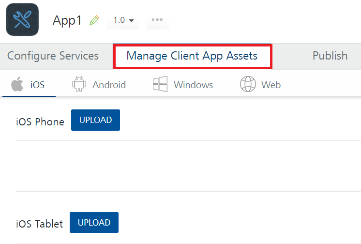

                              

User Guide: Path for Manage Client App Assets

Manage Client App Assets
========================

With Manage Client App Assets ( for example, Volt MX Management as a Service) functionality in Volt MX Foundry, Volt MX Foundry Users can now manage their client binaries through Volt MX Foundry Console such as creating mobile applications or publishing the apps to an EAS Environment. After the native client binaries are published to Volt MX Management environment, Volt MX Management admin can make the applications available to the users of an Enterprise. Currently, Volt MX Foundry supports more than one version of client binaries for different versions of platforms such as iOS Phone, for iOS Phone, iOS Tablet, Android Phone, Android Tablet, Windows Phone, and Web Client. The allowed version formats for binaries are `<One Digit>.<Upto 2 Digits>.<Upto 3 Digits>`. The dots and the digits after it in the version number are optional.  
For example: The supported version formats for binaries are allowed for uploading such as `1`, `1.0`, `1.00.00`, `1.0.00`, and `1.23.456`.

*   In Volt MX Foundry Console, to publish native client binaries to a Volt MX Management Environment, first upload the required native client binaries for platforms under the **Manage Client App Assets** tab and publish these binaries to Management environment through **Publish > Native Client** tab.
*   If you upload web client binaries (`.war`) for **Web** under the **Manage Client App Assets** tab, these web binaries will only be published to the server.

> **_Note:_** The database global variable  `MAX_ALLOWED_PACKETS` size should be set to approximately twice the size of the binaries that you want to upload to Volt MX Foundry Console.  
Refer to [FAQs > How I can increase the size limit of the Client binaries that I upload to MobileFaric Console](Appendix_-_FAQs.md#MAX_ALLOWED_PACKETS).

> **_Note:_** You can upload maximum up to 10 Web Client binaries for an app.

Menu path for Managing Client App Assets service designer:

After you [create an application](Adding_Applications.md), in the app configuration page, click the **Manage Client App Assets** tab to display the tabs for iOS, Android, Windows, and Web.

Managing Client App Assets involves three steps:

1.  [Uploading Client Binaries to Volt MX Foundry](Upload_Client_Binaries.md#Uploadin)
2.  [Publishing Client Binaries from Volt MX Foundry](Publishing_Client_Binaries.md#publishing-client-binaries-from-foundry)
3.  [Upgrading Native Client Binaries](Upgrade_Client_Binaries.md)
