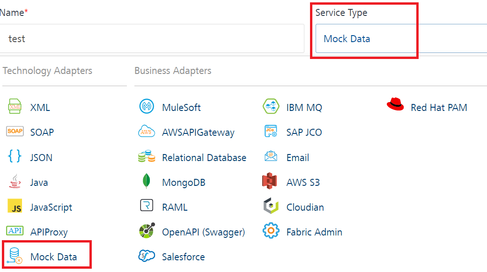
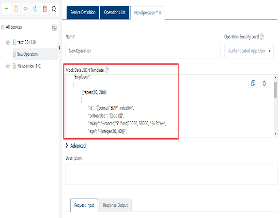
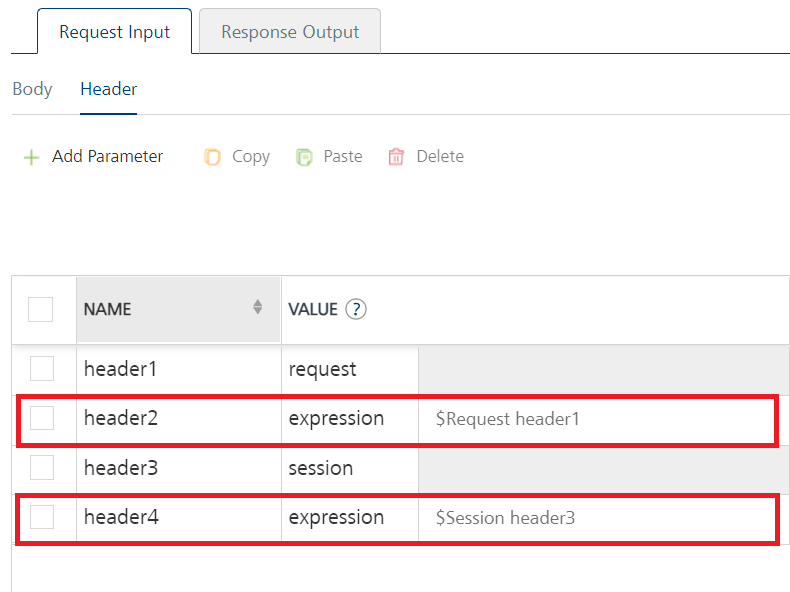

                                

User Guide: [Integration](Services.md#top) \> [Configure the Integration Service](ConfigureIntegrationService.md) > How to Test a Mock Data Response from Admin Console

Mock Data Adapter
-----------------

The **VoltMX Mock Data adapter** capability helps you to continue to develop apps when the back-end services that an app connects to are not ready to be leveraged.

There are several instances in an app development life-cycle when back-end systems and app development happen in parallel and only the contract or interface for the app to communicate to a backend is finalized. In this scenario, you can create a response template to stub the response that is expected from the actual backend. The response template can have hard-coded values or use pre-built functions such as concat, firstName, lastName, gender, random, email, and phone, and options to randomize the output within the required criteria.

For example, in the scenario mentioned earlier, a Volt MX app developer can create the service based on a stub template. The stub response template can be set for each operation of a service. The app developers can continue to develop apps based on a sample back-end response from the stub template.

> **_Important:_** Services built with Mock Data adapter will always give you mock data and cannot be switch between live backend and mock data like [Stub backend response](Stub.md) feature.

### Configure Mock Data Adapter

To configure your Mock Data Adapter, provide the following details:

1.  In the **Name** field, provide a unique name for your service.
2.  From the **Service Type** list, select **Mock Data**.
    
      
    
3.  For additional configuration of your service definition, provide the following details in the **Advanced** section:
    
      
| Field | Description |
| --- | --- |
| Custom Code | Custom Code enables you to specify dependent JAR.<br> To specify dependent JAR, select the JAR containing preprocessor or postprocessor libraries from the drop-down list, or click **Upload New** to browse the JAR file from your local system. This step allows you to further filter the data sent to the back end.<br><br>**_Important:_** Make sure that you upload a custom JAR file that is built on the same JDK version used for installing Volt MX Foundry Integration.<br><br>For example, if the JDK version on the machine where Volt MX Foundry Integration is installed is 1.6, you must use the same JDK version to build your custom jar files. If the JDK version is different, an unsupported class version error will appear when a service is used from a device.<br><br> You can download the uploaded jars to your local system. |
| Throttling | API throttling enables you to limit the number of request calls within a minute. If an API exceeds the throttling limit, it will not return the service response.<br><br> 1. **To specify throttling in Volt MX Foundry Console, follow these steps:<br><br> i.** In the **Total Rate Limit** text box, enter a required value. With this value, you can limit the number of requests configured in your Volt MX Foundry console in terms of Total Rate Limit.<br><br> ii. In the **Rate Limit Per IP** text box, enter a required value. With this value, you can limit the number of IP address requests configured in your Volt MX Foundry console in terms of Per IP Rate Limit.<br><br>2. **To override throttling in App Services Console, refer to** [Override API Throttling   Configuration](API_Throttling_Override.md#OverrideAPIThrottling). |
    
> **_Note:_** All options in the Advanced section are optional.
    
4.  In the **Description** field, provide a suitable description for the service.
    
5.  Click **Save** to save your service definition.

### Create Operations for Mock Data

The **Operations List** tab appears only after the service definition is saved.

> **_Note:_** Click **Operations List** tab > **Configure Operation**. The **Configured Operations** list appears.

**To create an operation, follow these steps:**

1.  Click **SAVE & ADD OPERATION** in your service definition page to save your service definition and display the **NewOperation** tab for adding operations.  
                        OR  
    Click **Add Operation** to add a new operation or from the tree in the left pane, click **Add > Add New Operation**.  
    
    
    
    > **_Note:_** To use an existing integration service, refer to [How to Use an Existing Integration Service](Manage_Existing_Integration_Services_1.md#Use_existing_Inte).
    
2.  In the **Operation Modal** tab, follow these steps:
    
    This tab contains the request input, response output, and advanced sections. The input values are data types, scope, and format types. By default, the system will display the **Request Input** tab.
    
    > **_Note:_** You can add an entry by clicking the **Add** button if entries for the input and the output tabs do not exist.  
      
    You can also delete an entry. Select the check box for an entry, and then click the **Delete** button.
    
3.  To configure an operation, provide the following details:  
    

  
| Field | Description |
| --- | --- |
| Name | It is prepopulated with the operation name. You can change the name if required. |
| Operation Security Level | It specifies how a client must authenticate to invoke this operation.<br><br>**Select one of the following security operations in the Operation Security Level field.<br><br>i. Authenticated App User** – It restricts the access to clients who have successfully authenticated using an Identity Service associated with the app. <br><br>**ii. Anonymous App User** – It allows the access from trusted clients that have the required App Key and App Secret. Authentication through an Identity Service is not required. <br><br>**iii. Public** – It allows any client to invoke this operation without any authentication. This setting does not provide any security to invoke this operation and you should avoid this authentication type if possible.<br><br>**iv. Private** - It blocks the access to this operation from any external client. It allows invocation either from an Orchestration/Object Service, or from the custom code in the same run-time environment.|

5.  Configure your Mock data template in the **Mock Data JSON Template** text field. By default this field is enabled with a sample mock response template.
    
    
    
    > **_Note:_** For more information on Pre-built functions supported in Mock Data template, refer [Mock Data Template and Supported Pre-built functions in Mock Data](#mock-data-template-and-pre-built-functions-supported-in-mock-data-template)
    
5. <details close markdown="block"><summary> response operations, provide the following details in the Advanced section:</summary>
    
      
    | Field | Description |
    | Custom Code Invocation - Preprocessor and Postprocessor (for Java and JavaScript) | You can add pre and post processing logic to services to modify the request inputs. When you test, the services details of various stages in the service execution are presented to you for better debugging. All options in the Advanced section are optional. For more details, refer to [Preprocessor and Postprocessor](Java_Preprocessor_Postprocessor_.md). |
    | Properties | [Additional configuration properties (timeout, cachable, unescape embedded xml in response, response encoding, number of connectioretries](Java_Preprocessor_Postprocessor_.md#timeout_cachable) allows you to configure service call time out cache response |
    | Front End API | It allows you map your endpoint/back-end URL of an operation to a [front-end URL](FrontEndAPI.md). |
    | Server Events | Using Server Events you can configure this service to trigger or process server side events. For detailed information, refer [Server Events](ServerEvents.md). |
    
    </details>
    
    > **_Note:_** All options in the Advanced section are optional.
    

### Configure Request Operation for Mock Data

Integration services accept only `form-url-encoded` inputs for all the input parameters provided in the service input parameters (request input).

1.  In the **Request Input > Body** tab, do the following:
    1.  To forward the body of the client's request to backend as it is, select the **Enable pass-through input body** check box. For more details on API Proxy service, refer to [](#APIProxyCheckBox)[How to Enable Pass-through Proxy for Operations](API_Proxy_Adapter.md#APIProxyCheckBox).
    2.  Click **Add Parameter** button to create new entries for the input.
        
        > **_Note:_** \- To make duplicate entries, select the check box for the entry, click Copy, and then click Paste.  
          
        \- To delete an entry, select the check box for an entry, and then click the Delete button.
        
    3.  Configure parameters in the client's body, do the following:
        
        | Field | Description |
        |  ---  |  ---  |
        | Name   | It Contains a Unique Identifier. Change the name if required. |
        | Value  | Select Request or Session. It is set to **Request** by default.<br><br>i. **Request** indicates that the value must be retrieved from the HTTP request received from the mobile device.<br><br>**ii. Session** indicates that the value must be retrieved from the HTTP session stored on Volt MX Foundry.<br><br>**iii. Identity** If this is selected, you can filter the request parameters based on the response from the identity provider. For more details to configure identity filters, refer to [Enhanced Identity Filters - Integration Services](Identity_Filters_Integration.md).| 
        | TEST VALUE  | Enter a value. A test value is used for testing the service. |
        | DEFAULT VALUE  | Enter the value, if required. The default value will be used if the test value is empty. |
        | Datatype  |Select one of the following data types.<br><br>i. **String** - A combination of alpha-numeric and special characters. Supports all formats including UTF-8 and UTF-16 with no maximum size limit.<br><br>ii. **Boolean** - A value that can be true or false.**Number** - An integer or a floating number.<br><br>iii. **Collection** - A group of data, also referred as data set.|
        | Encode  | Select the check box to enable encoding of an input parameter. For example, the name New York Times would be encoded as _New_York_Times_ when the encoding is set to True. The encoding must also adhere to the HTML URL encoding standards. |
        | Description  | Provide a suitable description. |
        

1.  In the **Request Input > Header** tab, do the following:
    1.  To forward the body of the client's request to backend as it is, select the **Enable pass-through input body** check box. For more details on API Proxy service, refer to [](#APIProxyCheckBox)[How to Enable Pass-through Proxy for Operations](API_Proxy_Adapter.md#APIProxyCheckBox).
    2.  Click **Add Parameter** button to create new entries for the input.
        
        > **_Note:_** \- To make duplicate entries, select the check box for the entry, click Copy, and then click Paste.  
          
        \- To delete an entry, select the check box for an entry, and then click the Delete button.
        
    3.  Configure parameters in the client's header, do the following:
        
        | Field | Description |
        | --- | --- |
        | Name | It Contains a Unique Identifier. Change the name if required. |
        | Value | Select Request or Session. It is set to **Request** by default. By default, this field is set to **Request.** Five different options are available in Volt MX Foundry under **Request Input > Headers** > **VALUE** during configuration of any operation. When you start editing this field, dependent identity services are auto populated. These options primarily determine the source of the value of the header**.****Request**: If this option is selected, the Integration Server picks the value pairs from the client's request during run time and forwards the same to the back-end.User has the option to configure the default value. This default value is taken if the request does not have the header.**Session**: If this option is selected, the value of header is picked from session context based on the user configuration.**Constant**: Constant is used to configure the value that is picked and sent to back-end by the Integration Server during the run-time.**Expression**: Select this option to configure the velocity template expressions for the header values.You cannot edit the default value for expression.**Identity**: If this is selected, you can filter the request parameters based on the response from the identity provider. For more details to configure identity filters, refer to [Enhanced Identity Filters - Integration Services](Identity_Filters_Integration.md).> **_Note:_** If the header value is scoped as a **Request** (or) **Session** and the same header is accessed under the **Expression** header value, then the expression must be represented as $request.header (or) $session.header.**Example**: If a header 1 value is a request and header 2 value is an expression, then the value of the expression must be $Request.header1. |
        | TEST VALUE | Enter a value. A test value is used for testing the service. |
        | DEFAULT VALUE | Enter the value, if required. The default value will be used if the test value is empty. |
        | Datatype | Select one of the following data types.**String** - A combination of alpha-numeric and special characters. Supports all formats including UTF-8 and UTF-16 with no maximum size limit.**Boolean** - A value that can be true or false.**Number** - An integer or a floating number.**Collection** - A group of data, also referred as data set. |
        | Description | Provide a suitable description. |
        
2.  Click **SAVE OPERATION** to save the operation. The system updates the operation definition.

### Create Response Operation for Mock Data

To forward the response to the client as it is, select the **Enable pass-through input body** check box. For more details on API Proxy service, refer to [](#APIProxyCheckBox)[How to Enable Pass-through Proxy for Operations](API_Proxy_Adapter.md#APIProxyCheckBox).

1.  Click the **Response Output** tab, and enter the values for required fields such as name, scope, data type, collection ID, record ID, format and format value.
    
    > **_Note:_** If you define parameters inside a record as the session, the session scope will not get reflected for the parameters.
    
2.  Click **SAVE OPERATION** to save the operation. The system updates the operation definition.
    
    If you click **Cancel**, the **Edit Service Parameters** window will close without saving any information.
    
    > **_Note:_** Only JSON Path is supported for Mock Data response parsing.
    
    > **_Note:_** You can view the service in the Data Panel feature of Volt MX Iris. By using the Data Panel, you can link back-end data services to your application UI elements seamlessly with low-code to no code. For more information on Data Panel, click [here](../../../Iris/iris_user_guide/Content/DataPanel.md#top).
    

### How to Test a Mock Data Response from Admin Console

1.  Publish your app to a runtime server.
2.  Go to the runtime server in **Admin Console**.
3.  Go to the **Integration Services** tab.
4.  For the Mock Data service that you created, select the stubbed operation from the **Operations** list.
5.  Click **Get Response**.
    
    > **_Note:_** The `X-VoltMX-Stub-Response header` as `true` in the back-end response indicates that the response is generated from the Mock Data template.
    

### **Advanced Parameters in Mock Data**

#### How to Configure a Request Input and Request Header Parameters in Mock Data

You can access input parameters in a Stub template by using the `{ {requestBody("<request_param_name>")} }` function. Additionally, you can access headers by using the `{ {requestHeader("<header_name>")} }` function.

For example, you want to send the `testUser` request input parameter to the Stub template and the value of the parameter is defined in the Input Parameters section of Console. You can access the input parameter in the stub template as `"inputtest": "{ {requestBody("testUser")} }"`.

The following sample Stub template has been configured with the testUser request input parameter.

```
 [
  '{ {repeat(30,40)} }',
  {
    "locationID": "{ {index()} }",
    "company": "{ {toUpperCase(company())} }",
    "phone": "+1 { {phone()} }",
    "address": "{ {integer(100, 999)} } { {street()} }, { {city()} }, { {state()} }, { {integer(100, 10000)} }",  
   ``"`inputtest": "{ {requestBody("testUser")} }"`,``
    "latitude": "{ {float(-90.000001, 90)} }",  
    "longitude": "{ {float(-180.000001, 180)} }",
    "office":"{ {random("HR Head Office","Sales Head Office","Marketing Head Office","Development Center")} }"
  }
]
```

> **_Note:_** Volt MX functions for request input and header are as follows:  
  
\-  To access any header with name, `requestHeader`: Syntax: `{ {requestHeader("<header_name>")} }`  
\-  To access a request parameter, `requestBody`: Syntax: `{ {requestBody("<request_param_name>")} }  
`

### Mock Data Template and Pre-built Functions Supported in Mock Data Template

	Click here

#### Mock Data Template

The back-end stubbed response specifies a Mock Data template for stubbing and returning dynamically-generated mock data.

The following table details a sample Mock Data response template and a back-end response that is generated based on the Mock Data template.

  
| Sample Mock Data Template (JSON) | Sample Mock Data Response |
| --- | --- |
|  \[ '{ {repeat(1,2)} }', { "locationID": "{ {index()} }", "company": "{ {toUpperCase(company())} }", "phone": "+1 { {phone()} }", "address": "{ {integer(100, 999)} } { {street()} }, { {city()} }, { {state()} }, { {integer(100, 10000)} }", "latitude": "{ {float(-90.000001, 90)} }", "longitude": "{ {float(-180.000001, 180)} }", "office":"{ {random("HR Head Office","Sales Head Office","Marketing Head Office","Development Center")} }" } \] |  \[{ "locationID": "0", "company": "RODEOMAD", "phone": "+1 371-222-9269", "address": "671 Division Place, Grill, South Dakota, 9220", "latitude": "-0.29528046", "longitude": "159.72824", "office": "Marketing Head Office" }, { "locationID": "1", "company": "ACME", "phone": "+1 311-324-8984", "address": "257 Adam Place, McCoy, South Carolina, 21245", "latitude": "-0.23528046", "longitude": "124.72824", "office": "Sales Head Office" }\] |

### Pre-built Functions Supported in Mock Data Template

The following list of the **sample pre-built functions** are supported in the Mock Data response template:

<details close markdown="block"><summary>repeat(< lower_value >, < upper_value >)</summary>

<table class="TableStyle-Basic" cellspacing="0" style="mc-table-style: url('Resources/TableStyles/Basic.css');width: 820px;"><colgroup><col class="TableStyle-Basic-Column-Column1" style="width: 181px;"> <col class="TableStyle-Basic-Column-Column1"></colgroup><tbody><tr class="TableStyle-Basic-Body-Body1"><td class="TableStyle-Basic-BodyE-Column1-Body1" style="font-weight: bold;">Description</td><td class="TableStyle-Basic-BodyD-Column1-Body1"><b>repeat</b> function repeats JSON&nbsp;or XML objects randomly based on the <b>value range</b> provided in the syntax. This is typically set at the beginning of a collection to repeat number of times as required. For example, it can be set to get a random number of transactions for an account for a set format by setting repeat function at the head of the collection as shown in the default template above.</td></tr><tr class="TableStyle-Basic-Body-Body1"><td class="TableStyle-Basic-BodyE-Column1-Body1" style="font-weight: bold;">Syntax</td><td class="TableStyle-Basic-BodyD-Column1-Body1"><code class="codefirst">'{ {repeat (&lt;lower_value&gt;, &lt;upper_value&gt;)} }'</code></td></tr><tr class="TableStyle-Basic-Body-Body1"><td class="TableStyle-Basic-BodyB-Column1-Body1" style="font-weight: bold;">Sample Mock Data template</td><td class="TableStyle-Basic-BodyA-Column1-Body1"><code class="codefirst">'{ {repeat(30,40)} }'</code></td></tr></tbody></table>

</details>

<details close markdown="block"><summary>repeat(< number >)</summary>

<table class="TableStyle-Basic" cellspacing="0" style="mc-table-style: url('Resources/TableStyles/Basic.css');width: 820px;"><colgroup><col class="TableStyle-Basic-Column-Column1" style="width: 177px;"> <col class="TableStyle-Basic-Column-Column1"></colgroup><tbody><tr class="TableStyle-Basic-Body-Body1"><td class="TableStyle-Basic-BodyE-Column1-Body1" style="font-weight: bold;">Description</td><td class="TableStyle-Basic-BodyD-Column1-Body1"><b><b>repeat</b> function repeats JSON&nbsp;or XML objects randomly based on the <b>fixed number</b></b> provided in the syntax. This is typically set at the beginning of a collection to repeat number of times as required. For example, it can be set to get a random number of transactions for an account for a set format by setting repeat function at the head of the collection as shown in the default template above.</td></tr><tr class="TableStyle-Basic-Body-Body1"><td class="TableStyle-Basic-BodyE-Column1-Body1" style="font-weight: bold;">Syntax</td><td class="TableStyle-Basic-BodyD-Column1-Body1"><code class="codefirst">'{ {repeat (&lt;number&gt;)} }'</code></td></tr><tr class="TableStyle-Basic-Body-Body1"><td class="TableStyle-Basic-BodyB-Column1-Body1" style="font-weight: bold;">Sample Mock Data template</td><td class="TableStyle-Basic-BodyA-Column1-Body1"><code class="codefirst">'{ {repeat(2)} }'</code></td></tr></tbody></table>

</details>

<details close markdown="block"><summary>integer(min,max)</summary>

<table class="TableStyle-Basic" cellspacing="0" style="mc-table-style: url('Resources/TableStyles/Basic.css');width: 820px;"><colgroup><col class="TableStyle-Basic-Column-Column1" style="width: 176px;"> <col class="TableStyle-Basic-Column-Column1"></colgroup><tbody><tr class="TableStyle-Basic-Body-Body1"><td class="TableStyle-Basic-BodyE-Column1-Body1" style="font-weight: bold;">Description</td><td class="TableStyle-Basic-BodyD-Column1-Body1">Generates a random integer in the specified range.<b>&nbsp;</b></td></tr><tr class="TableStyle-Basic-Body-Body1"><td class="TableStyle-Basic-BodyE-Column1-Body1" style="font-weight: bold;">Syntax</td><td class="TableStyle-Basic-BodyD-Column1-Body1"><code class="codefirst"><code class="codefirst">"{ {integer(min,max)} }"</code></code></td></tr><tr class="TableStyle-Basic-Body-Body1"><td class="TableStyle-Basic-BodyE-Column1-Body1" style="font-weight: bold;">Sample Mock Data template</td><td class="TableStyle-Basic-BodyD-Column1-Body1"><code class="codefirst">"productRating":"{ {integer(0,5)} }"</code></td></tr><tr class="TableStyle-Basic-Body-Body1"><td class="TableStyle-Basic-BodyB-Column1-Body1" style="font-weight: bold;">Sample Mock Data response</td><td class="TableStyle-Basic-BodyA-Column1-Body1"><code class="codefirst"><code class="codefirst">"productRating": "4"</code></code></td></tr></tbody></table>

</details>

<details close markdown="block"><summary>float(min,max)</summary>

<table class="TableStyle-Basic" cellspacing="0" style="mc-table-style: url('Resources/TableStyles/Basic.css');width: 820px;"><colgroup><col class="TableStyle-Basic-Column-Column1" style="width: 177px;"> <col class="TableStyle-Basic-Column-Column1"></colgroup><tbody><tr class="TableStyle-Basic-Body-Body1"><td class="TableStyle-Basic-BodyE-Column1-Body1" style="font-weight: bold;">Description</td><td class="TableStyle-Basic-BodyD-Column1-Body1">Generates a random 32-bit floating point number in the specified range.</td></tr><tr class="TableStyle-Basic-Body-Body1"><td class="TableStyle-Basic-BodyE-Column1-Body1" style="font-weight: bold;">Syntax</td><td class="TableStyle-Basic-BodyD-Column1-Body1"><code class="codefirst"><code class="codefirst">"{ {float(min,max)} }"</code></code></td></tr><tr class="TableStyle-Basic-Body-Body1"><td class="TableStyle-Basic-BodyE-Column1-Body1" style="font-weight: bold;">Sample Mock Data template</td><td class="TableStyle-Basic-BodyD-Column1-Body1"><code class="codefirst">"floatrange": "{ {float(3,9)} }"</code></td></tr><tr class="TableStyle-Basic-Body-Body1"><td class="TableStyle-Basic-BodyB-Column1-Body1" style="font-weight: bold;">Sample Mock Data response</td><td class="TableStyle-Basic-BodyA-Column1-Body1"><code class="codefirst"><code class="codefirst">"floatrange": "6.718242"</code></code></td></tr></tbody></table>

</details>

<details close markdown="block"><summary>float(min,max,"%.2f")</summary>

<table class="TableStyle-Basic" cellspacing="0" style="mc-table-style: url('Resources/TableStyles/Basic.css');width: 820px;"><colgroup><col class="TableStyle-Basic-Column-Column1" style="width: 178px;"> <col class="TableStyle-Basic-Column-Column1"></colgroup><tbody><tr class="TableStyle-Basic-Body-Body1"><td class="TableStyle-Basic-BodyE-Column1-Body1" style="font-weight: bold;">Description</td><td class="TableStyle-Basic-BodyD-Column1-Body1">Generates a random 32-bit floating point number in the specified range of floating point numbers, with an option to round of the number of decimal places.</td></tr><tr class="TableStyle-Basic-Body-Body1"><td class="TableStyle-Basic-BodyE-Column1-Body1" style="font-weight: bold;">Syntax</td><td class="TableStyle-Basic-BodyD-Column1-Body1"><code class="codefirst"><code class="codefirst">"{ {float(min,max,"%.2f")} }"</code></code></td></tr><tr class="TableStyle-Basic-Body-Body1"><td class="TableStyle-Basic-BodyE-Column1-Body1" style="font-weight: bold;">Sample Mock Data template</td><td class="TableStyle-Basic-BodyD-Column1-Body1"><code class="codefirst">"floatrange": "{ {float(3,9,"%.2f")} }"</code></td></tr><tr class="TableStyle-Basic-Body-Body1"><td class="TableStyle-Basic-BodyB-Column1-Body1" style="font-weight: bold;">Sample Mock Data response</td><td class="TableStyle-Basic-BodyA-Column1-Body1"><code class="codefirst"><code class="codefirst">"floatrange": "8.87"</code></code></td></tr></tbody></table>

</details>

<details close markdown="block"><summary>double(min,max)</summary>

<table class="TableStyle-Basic" cellspacing="0" style="mc-table-style: url('Resources/TableStyles/Basic.css');width: 820px;"><colgroup><col class="TableStyle-Basic-Column-Column1" style="width: 179px;"> <col class="TableStyle-Basic-Column-Column1"></colgroup><tbody><tr class="TableStyle-Basic-Body-Body1"><td class="TableStyle-Basic-BodyE-Column1-Body1" style="font-weight: bold;">Description</td><td class="TableStyle-Basic-BodyD-Column1-Body1">Generates a random 64-bit double number in the specified range.</td></tr><tr class="TableStyle-Basic-Body-Body1"><td class="TableStyle-Basic-BodyE-Column1-Body1" style="font-weight: bold;">Syntax</td><td class="TableStyle-Basic-BodyD-Column1-Body1"><code class="codefirst"><code class="codefirst">"{ {double(min,max)} }"</code></code></td></tr><tr class="TableStyle-Basic-Body-Body1"><td class="TableStyle-Basic-BodyE-Column1-Body1" style="font-weight: bold;">Sample Mock Data template</td><td class="TableStyle-Basic-BodyD-Column1-Body1"><code class="codefirst">"double": "{ {double(2,8)} }"</code></td></tr><tr class="TableStyle-Basic-Body-Body1"><td class="TableStyle-Basic-BodyB-Column1-Body1" style="font-weight: bold;">Sample Mock Data response</td><td class="TableStyle-Basic-BodyA-Column1-Body1"><code class="codefirst"><code class="codefirst">"double": "7.654668228367652"</code></code></td></tr></tbody></table>

</details>

<details close markdown="block"><summary>long(min,max)</summary>

<table class="TableStyle-Basic" cellspacing="0" style="mc-table-style: url('Resources/TableStyles/Basic.css');width: 820px;"><colgroup><col class="TableStyle-Basic-Column-Column1" style="width: 180px;"> <col class="TableStyle-Basic-Column-Column1"></colgroup><tbody><tr class="TableStyle-Basic-Body-Body1"><td class="TableStyle-Basic-BodyE-Column1-Body1" style="font-weight: bold;">Description</td><td class="TableStyle-Basic-BodyD-Column1-Body1">Generates a random long number in the specified range.</td></tr><tr class="TableStyle-Basic-Body-Body1"><td class="TableStyle-Basic-BodyE-Column1-Body1" style="font-weight: bold;">Syntax</td><td class="TableStyle-Basic-BodyD-Column1-Body1"><code class="codefirst"><code class="codefirst">"{ {long(min,max)} }"</code></code></td></tr><tr class="TableStyle-Basic-Body-Body1"><td class="TableStyle-Basic-BodyE-Column1-Body1" style="font-weight: bold;">Sample Mock Data template</td><td class="TableStyle-Basic-BodyD-Column1-Body1"><code class="codefirst">"network":"{ {long(200,500)} }"</code></td></tr><tr class="TableStyle-Basic-Body-Body1"><td class="TableStyle-Basic-BodyB-Column1-Body1" style="font-weight: bold;">Sample Mock Data response</td><td class="TableStyle-Basic-BodyA-Column1-Body1"><code class="codefirst"><code class="codefirst">"network":"378"</code></code></td></tr></tbody></table>

</details>

<details close markdown="block"><summary>uuid()</summary>

<table class="TableStyle-Basic" cellspacing="0" style="mc-table-style: url('Resources/TableStyles/Basic.css');width: 820px;"><colgroup><col class="TableStyle-Basic-Column-Column1" style="width: 181px;"> <col class="TableStyle-Basic-Column-Column1"></colgroup><tbody><tr class="TableStyle-Basic-Body-Body1"><td class="TableStyle-Basic-BodyE-Column1-Body1" style="font-weight: bold;">Description</td><td class="TableStyle-Basic-BodyD-Column1-Body1">Generates a random GUID.</td></tr><tr class="TableStyle-Basic-Body-Body1"><td class="TableStyle-Basic-BodyE-Column1-Body1" style="font-weight: bold;">Syntax</td><td class="TableStyle-Basic-BodyD-Column1-Body1"><code class="codefirst"><code class="codefirst">"{ {uuid()} }"</code></code></td></tr><tr class="TableStyle-Basic-Body-Body1"><td class="TableStyle-Basic-BodyE-Column1-Body1" style="font-weight: bold;">Sample Mock Data template</td><td class="TableStyle-Basic-BodyD-Column1-Body1"><code class="codefirst">"objects": "{ {uuid()} }"</code></td></tr><tr class="TableStyle-Basic-Body-Body1"><td class="TableStyle-Basic-BodyB-Column1-Body1" style="font-weight: bold;">Sample Mock Data response</td><td class="TableStyle-Basic-BodyA-Column1-Body1"><code class="codefirst"><code class="codefirst">"objects": "fb81ad08-42e3-4b61-9a2c-636f95952766"</code></code></td></tr></tbody></table>

</details>

<details close markdown="block"><summary>hex()</summary> 

<table class="TableStyle-Basic" cellspacing="0" style="mc-table-style: url('Resources/TableStyles/Basic.css');width: 820px;"><colgroup><col class="TableStyle-Basic-Column-Column1" style="width: 182px;"> <col class="TableStyle-Basic-Column-Column1"></colgroup><tbody><tr class="TableStyle-Basic-Body-Body1"><td class="TableStyle-Basic-BodyE-Column1-Body1" style="font-weight: bold;">Description</td><td class="TableStyle-Basic-BodyD-Column1-Body1">Generates a random 16 bytes hexadecimal string.</td></tr><tr class="TableStyle-Basic-Body-Body1"><td class="TableStyle-Basic-BodyE-Column1-Body1" style="font-weight: bold;">Syntax</td><td class="TableStyle-Basic-BodyD-Column1-Body1"><code class="codefirst"><code class="codefirst">"{ {hex()} }"</code></code></td></tr><tr class="TableStyle-Basic-Body-Body1"><td class="TableStyle-Basic-BodyE-Column1-Body1" style="font-weight: bold;">Sample Mock Data template</td><td class="TableStyle-Basic-BodyD-Column1-Body1"><code class="codefirst"><code class="codefirst">"color": "{ {hex()} }"</code></code></td></tr><tr class="TableStyle-Basic-Body-Body1"><td class="TableStyle-Basic-BodyB-Column1-Body1" style="font-weight: bold;">Sample Mock Data response</td><td class="TableStyle-Basic-BodyA-Column1-Body1"><code class="codefirst"><code class="codefirst"><code class="codefirst">"color": "b53ff7fa4b63b18cdf7729e85c39e660"</code></code></code></td></tr></tbody></table>

</details>

<details close markdown="block"><summary>hex(size)</summary> 

<table class="TableStyle-Basic" cellspacing="0" style="mc-table-style: url('Resources/TableStyles/Basic.css');width: 820px;"><colgroup><col class="TableStyle-Basic-Column-Column1" style="width: 183px;"> <col class="TableStyle-Basic-Column-Column1"></colgroup><tbody><tr class="TableStyle-Basic-Body-Body1"><td class="TableStyle-Basic-BodyE-Column1-Body1" style="font-weight: bold;">Description</td><td class="TableStyle-Basic-BodyD-Column1-Body1">Generates a random hexadecimal string according to the specified size in bytes.</td></tr><tr class="TableStyle-Basic-Body-Body1"><td class="TableStyle-Basic-BodyE-Column1-Body1" style="font-weight: bold;">Syntax</td><td class="TableStyle-Basic-BodyD-Column1-Body1"><code class="codefirst"><code class="codefirst">"{ {hex(size)} }"</code></code></td></tr><tr class="TableStyle-Basic-Body-Body1"><td class="TableStyle-Basic-BodyE-Column1-Body1" style="font-weight: bold;">Sample Mock Data template</td><td class="TableStyle-Basic-BodyD-Column1-Body1"><code class="codefirst"><code class="codefirst">"color": "{ {hex(2)} }"</code></code></td></tr><tr class="TableStyle-Basic-Body-Body1"><td class="TableStyle-Basic-BodyB-Column1-Body1" style="font-weight: bold;">Sample Mock Data response</td><td class="TableStyle-Basic-BodyA-Column1-Body1"><code class="codefirst"><code class="codefirst"><code class="codefirst">"color": "1b41"</code></code></code></td></tr></tbody></table>

</details>

<details close markdown="block"><summary>objectId()</summary>

<table class="TableStyle-Basic" cellspacing="0" style="mc-table-style: url('Resources/TableStyles/Basic.css');width: 820px;"><colgroup><col class="TableStyle-Basic-Column-Column1" style="width: 184px;"> <col class="TableStyle-Basic-Column-Column1"></colgroup><tbody><tr class="TableStyle-Basic-Body-Body1"><td class="TableStyle-Basic-BodyE-Column1-Body1" style="font-weight: bold;">Description</td><td class="TableStyle-Basic-BodyD-Column1-Body1">Generates a hexadecimal string of size 12 bytes.</td></tr><tr class="TableStyle-Basic-Body-Body1"><td class="TableStyle-Basic-BodyE-Column1-Body1" style="font-weight: bold;">Syntax</td><td class="TableStyle-Basic-BodyD-Column1-Body1"><code class="codefirst"><code class="codefirst">"{ {objectId()} }"</code></code></td></tr><tr class="TableStyle-Basic-Body-Body1"><td class="TableStyle-Basic-BodyE-Column1-Body1" style="font-weight: bold;">Sample Mock Data template</td><td class="TableStyle-Basic-BodyD-Column1-Body1"><code class="codefirst"><code class="codefirst">"id": "{ {objectId()} }"</code></code></td></tr><tr class="TableStyle-Basic-Body-Body1"><td class="TableStyle-Basic-BodyB-Column1-Body1" style="font-weight: bold;">Sample Mock Data response</td><td class="TableStyle-Basic-BodyA-Column1-Body1"><code class="codefirst"><code class="codefirst"><code class="codefirst">"<code class="codefirst">id": "1c91293a4c777000585e04e6"</code></code></code></code></td></tr></tbody></table>

</details>

<details close markdown="block"><summary>bool()</summary>

<table class="TableStyle-Basic" cellspacing="0" style="mc-table-style: url('Resources/TableStyles/Basic.css');width: 820px;"><colgroup><col class="TableStyle-Basic-Column-Column1" style="width: 186px;"> <col class="TableStyle-Basic-Column-Column1"></colgroup><tbody><tr class="TableStyle-Basic-Body-Body1"><td class="TableStyle-Basic-BodyE-Column1-Body1" style="font-weight: bold;">Description</td><td class="TableStyle-Basic-BodyD-Column1-Body1">Generates a random Boolean value, either True or False.</td></tr><tr class="TableStyle-Basic-Body-Body1"><td class="TableStyle-Basic-BodyE-Column1-Body1" style="font-weight: bold;">Syntax</td><td class="TableStyle-Basic-BodyD-Column1-Body1"><code class="codefirst"><code class="codefirst">"{ {bool()} }"</code></code></td></tr><tr class="TableStyle-Basic-Body-Body1"><td class="TableStyle-Basic-BodyE-Column1-Body1" style="font-weight: bold;">Sample Mock Data template</td><td class="TableStyle-Basic-BodyD-Column1-Body1"><code class="codefirst"><code class="codefirst">"stockAvailable": "{ {bool()} }"</code></code></td></tr><tr class="TableStyle-Basic-Body-Body1"><td class="TableStyle-Basic-BodyB-Column1-Body1" style="font-weight: bold;">Sample Mock Data response</td><td class="TableStyle-Basic-BodyA-Column1-Body1"><code class="codefirst"><code class="codefirst"><code class="codefirst">"stockAvailable": "true"</code></code></code></td></tr></tbody></table>

</details>

<details close markdown="block"><summary>bool(< probability >)</summary>

<table class="TableStyle-Basic" cellspacing="0" style="mc-table-style: url('Resources/TableStyles/Basic.css');width: 820px;"><colgroup><col class="TableStyle-Basic-Column-Column1" style="width: 185px;"> <col class="TableStyle-Basic-Column-Column1"></colgroup><tbody><tr class="TableStyle-Basic-Body-Body1"><td class="TableStyle-Basic-BodyE-Column1-Body1" style="font-weight: bold;">Description</td><td class="TableStyle-Basic-BodyD-Column1-Body1">Generates a random Boolean value, either True or False as per the given probability.</td></tr><tr class="TableStyle-Basic-Body-Body1"><td class="TableStyle-Basic-BodyE-Column1-Body1" style="font-weight: bold;">Syntax</td><td class="TableStyle-Basic-BodyD-Column1-Body1"><code class="codefirst"><code class="codefirst">"{ {bool(probability)} }"</code></code></td></tr><tr class="TableStyle-Basic-Body-Body1"><td class="TableStyle-Basic-BodyE-Column1-Body1" style="font-weight: bold;">Sample Mock Data template</td><td class="TableStyle-Basic-BodyD-Column1-Body1"><code class="codefirst">"stockAvailable": "{ {bool(0.9)} }"</code></td></tr><tr class="TableStyle-Basic-Body-Body1"><td class="TableStyle-Basic-BodyB-Column1-Body1" style="font-weight: bold;">Sample Mock Data response</td><td class="TableStyle-Basic-BodyA-Column1-Body1"><code class="codefirst">"stockAvailable": "true"</code></td></tr></tbody></table>

</details>

<details close markdown="block"><summary>index()</summary>

<table class="TableStyle-Basic" cellspacing="0" style="mc-table-style: url('Resources/TableStyles/Basic.css');width: 820px;"><colgroup><col class="TableStyle-Basic-Column-Column1" style="width: 184px;"> <col class="TableStyle-Basic-Column-Column1"></colgroup><tbody><tr class="TableStyle-Basic-Body-Body1"><td class="TableStyle-Basic-BodyE-Column1-Body1" style="font-weight: bold;">Description</td><td class="TableStyle-Basic-BodyD-Column1-Body1">Generates an incrementing index integer for each record with a specific starting point.</td></tr><tr class="TableStyle-Basic-Body-Body1"><td class="TableStyle-Basic-BodyE-Column1-Body1" style="font-weight: bold;">Syntax</td><td class="TableStyle-Basic-BodyD-Column1-Body1"><code class="codefirst">"{ {index()} }"</code></td></tr><tr class="TableStyle-Basic-Body-Body1"><td class="TableStyle-Basic-BodyE-Column1-Body1" style="font-weight: bold;">Sample Mock Data template</td><td class="TableStyle-Basic-BodyD-Column1-Body1"><code class="codefirst">"locationID": "{ {index()} }"</code></td></tr><tr class="TableStyle-Basic-Body-Body1"><td class="TableStyle-Basic-BodyB-Column1-Body1" style="font-weight: bold;">Sample Mock Data response</td><td class="TableStyle-Basic-BodyA-Column1-Body1"><code class="codefirst">"locationID": "0"</code></td></tr></tbody></table>

</details>

<details close markdown="block"><summary>index("index-name")</summary>

<table class="TableStyle-Basic" cellspacing="0" style="mc-table-style: url('Resources/TableStyles/Basic.css');width: 820px;"><colgroup><col class="TableStyle-Basic-Column-Column1" style="width: 183px;"> <col class="TableStyle-Basic-Column-Column1"></colgroup><tbody><tr class="TableStyle-Basic-Body-Body1"><td class="TableStyle-Basic-BodyE-Column1-Body1" style="font-weight: bold;">Description</td><td class="TableStyle-Basic-BodyD-Column1-Body1">Generates an incrementing index integer for each record based on the name of the index.</td></tr><tr class="TableStyle-Basic-Body-Body1"><td class="TableStyle-Basic-BodyE-Column1-Body1" style="font-weight: bold;">Syntax</td><td class="TableStyle-Basic-BodyD-Column1-Body1"><code class="codefirst">"{ {index("index-name")} }"</code></td></tr><tr class="TableStyle-Basic-Body-Body1"><td class="TableStyle-Basic-BodyE-Column1-Body1" style="font-weight: bold;">Sample Mock Data template</td><td class="TableStyle-Basic-BodyD-Column1-Body1"><code class="codefirst">"index-number": "{ {index("abc")} }"</code></td></tr><tr class="TableStyle-Basic-Body-Body1"><td class="TableStyle-Basic-BodyB-Column1-Body1" style="font-weight: bold;">Sample Mock Data response</td><td class="TableStyle-Basic-BodyA-Column1-Body1"><code class="codefirst">"index-number": "42"</code></td></tr></tbody></table>

</details>

<details close markdown="block"><summary>index(< number >)</summary>

<table class="TableStyle-Basic" cellspacing="0" style="mc-table-style: url('Resources/TableStyles/Basic.css');width: 820px;"><colgroup><col class="TableStyle-Basic-Column-Column1" style="width: 184px;"> <col class="TableStyle-Basic-Column-Column1"></colgroup><tbody><tr class="TableStyle-Basic-Body-Body1"><td class="TableStyle-Basic-BodyE-Column1-Body1" style="font-weight: bold;">Description</td><td class="TableStyle-Basic-BodyD-Column1-Body1">Generates an incrementing index integer for each record with a specific starting point.</td></tr><tr class="TableStyle-Basic-Body-Body1"><td class="TableStyle-Basic-BodyE-Column1-Body1" style="font-weight: bold;">Syntax</td><td class="TableStyle-Basic-BodyD-Column1-Body1"><code class="codefirst">"{ {index(78)}"</code></td></tr><tr class="TableStyle-Basic-Body-Body1"><td class="TableStyle-Basic-BodyE-Column1-Body1" style="font-weight: bold;">Sample Mock Data template</td><td class="TableStyle-Basic-BodyD-Column1-Body1"><code class="codefirst">"index-number": "{ {index(78)} }"</code></td></tr><tr class="TableStyle-Basic-Body-Body1"><td class="TableStyle-Basic-BodyB-Column1-Body1" style="font-weight: bold;">Sample Mock Data response</td><td class="TableStyle-Basic-BodyA-Column1-Body1"><code class="codefirst">"index-number": "4248"</code></td></tr></tbody></table>

</details>

<details close markdown="block"><summary>index("index-name",< number >)</summary>

<table class="TableStyle-Basic" cellspacing="0" style="mc-table-style: url('Resources/TableStyles/Basic.css');width: 820px;"><colgroup><col class="TableStyle-Basic-Column-Column1" style="width: 186px;"> <col class="TableStyle-Basic-Column-Column1"></colgroup><tbody><tr class="TableStyle-Basic-Body-Body1"><td class="TableStyle-Basic-BodyE-Column1-Body1" style="font-weight: bold;">Description</td><td class="TableStyle-Basic-BodyD-Column1-Body1">Generates an incrementing index integer for each record based on both a specific starting point and name of the index.</td></tr><tr class="TableStyle-Basic-Body-Body1"><td class="TableStyle-Basic-BodyE-Column1-Body1" style="font-weight: bold;">Syntax</td><td class="TableStyle-Basic-BodyD-Column1-Body1"><code class="codefirst">"<code class="codefirst">{ {index("index-name",78)}"</code></code></td></tr><tr class="TableStyle-Basic-Body-Body1"><td class="TableStyle-Basic-BodyE-Column1-Body1" style="font-weight: bold;">Sample Mock Data template</td><td class="TableStyle-Basic-BodyD-Column1-Body1"><code class="codefirst">"index-name-number": "{ {index("abc",78)} }"</code></td></tr><tr class="TableStyle-Basic-Body-Body1"><td class="TableStyle-Basic-BodyB-Column1-Body1" style="font-weight: bold;">Sample Mock Data response</td><td class="TableStyle-Basic-BodyA-Column1-Body1"><code class="codefirst">"index-name-number": "626"</code></td></tr></tbody></table>

</details>

<details close markdown="block"><summary>lorem(count,"words")</summary>

<table class="TableStyle-Basic" cellspacing="0" style="mc-table-style: url('Resources/TableStyles/Basic.css');width: 820px;"><colgroup><col class="TableStyle-Basic-Column-Column1" style="width: 182px;"> <col class="TableStyle-Basic-Column-Column1"></colgroup><tbody><tr class="TableStyle-Basic-Body-Body1"><td class="TableStyle-Basic-BodyE-Column1-Body1" style="font-weight: bold;">Description</td><td class="TableStyle-Basic-BodyD-Column1-Body1">Generates a random dummy text. User must specify the count of words required.</td></tr><tr class="TableStyle-Basic-Body-Body1"><td class="TableStyle-Basic-BodyE-Column1-Body1" style="font-weight: bold;">Syntax</td><td class="TableStyle-Basic-BodyD-Column1-Body1"><code class="codefirst">"<code class="codefirst"><code class="codefirst">{ {lorem(count,"words")} }"</code></code></code></td></tr><tr class="TableStyle-Basic-Body-Body1"><td class="TableStyle-Basic-BodyE-Column1-Body1" style="font-weight: bold;">Sample Mock Data template</td><td class="TableStyle-Basic-BodyD-Column1-Body1"><code class="codefirst">"productDescription": "{ {lorem(5, "words")} }"</code></td></tr><tr class="TableStyle-Basic-Body-Body1"><td class="TableStyle-Basic-BodyB-Column1-Body1" style="font-weight: bold;">Sample Mock Data response</td><td class="TableStyle-Basic-BodyA-Column1-Body1"><code class="codefirst">"productDescription": "lorem ipsum porta sit curabitur"</code></td></tr></tbody></table>

</details>

<details close markdown="block"><summary>lorem(count,"paragraphs")</summary>

<table class="TableStyle-Basic" cellspacing="0" style="mc-table-style: url('Resources/TableStyles/Basic.css');width: 820px;"><colgroup><col class="TableStyle-Basic-Column-Column1" style="width: 172px;"> <col class="TableStyle-Basic-Column-Column1"></colgroup><tbody><tr class="TableStyle-Basic-Body-Body1"><td class="TableStyle-Basic-BodyE-Column1-Body1" style="font-weight: bold;">Description</td><td class="TableStyle-Basic-BodyD-Column1-Body1">Generates a random dummy paragraph. User must specify the count of paragraphs required.</td></tr><tr class="TableStyle-Basic-Body-Body1"><td class="TableStyle-Basic-BodyE-Column1-Body1" style="font-weight: bold;">Syntax</td><td class="TableStyle-Basic-BodyD-Column1-Body1"><code class="codefirst">"{ {lorem(count,"paragraphs")} }"</code></td></tr><tr class="TableStyle-Basic-Body-Body1"><td class="TableStyle-Basic-BodyE-Column1-Body1" style="font-weight: bold;">Sample Mock Data template</td><td class="TableStyle-Basic-BodyD-Column1-Body1"><code class="codefirst">"about": "{ {lorem(2, "paragraphs")} }"</code></td></tr><tr class="TableStyle-Basic-Body-Body1"><td class="TableStyle-Basic-BodyB-Column1-Body1" style="font-weight: bold;">Sample Mock Data response</td><td class="TableStyle-Basic-BodyA-Column1-Body1"><code class="codefirst">"about": " Lorem ipsum eros amet accumsan non quisque ut molestie nullam sagittis tincidunt.Lorem ipsum quis aliquam nostra.Lorem ipsum litora tristique arcu habitant.Lorem ipsum nulla mauris inceptos fusce adipiscing tortor torquent."</code></td></tr></tbody></table>

</details>

<details close markdown="block"><summary>lorem(count,"paragraphs")phone()</summary>

<table class="TableStyle-Basic" cellspacing="0" style="mc-table-style: url('Resources/TableStyles/Basic.css');width: 820px;"><colgroup><col class="TableStyle-Basic-Column-Column1" style="width: 181px;"> <col class="TableStyle-Basic-Column-Column1"></colgroup><tbody><tr class="TableStyle-Basic-Body-Body1"><td class="TableStyle-Basic-BodyE-Column1-Body1" style="font-weight: bold;">Description</td><td class="TableStyle-Basic-BodyD-Column1-Body1">Generates a random phone number. The phone number is preceded by <code class="codefirst">+</code> to indicate a country code. This allows to set phone numbers for different countries. For example, for USA/Canada, the phone number format is <code class="codefirst">+1 xxx xxx xxxx</code></td></tr><tr class="TableStyle-Basic-Body-Body1"><td class="TableStyle-Basic-BodyE-Column1-Body1" style="font-weight: bold;">Syntax</td><td class="TableStyle-Basic-BodyD-Column1-Body1"><code class="codefirst">"{ {phone()} }"</code></td></tr><tr class="TableStyle-Basic-Body-Body1"><td class="TableStyle-Basic-BodyE-Column1-Body1" style="font-weight: bold;">Sample Mock Data template</td><td class="TableStyle-Basic-BodyD-Column1-Body1"><code class="codefirst">"phone": "+1 { {phone()} }"</code></td></tr><tr class="TableStyle-Basic-Body-Body1"><td class="TableStyle-Basic-BodyB-Column1-Body1" style="font-weight: bold;">Sample Mock Data response</td><td class="TableStyle-Basic-BodyA-Column1-Body1"><code class="codefirst">"phone": "+1 371-222-9269"</code></td></tr></tbody></table>

</details>

<details close markdown="block"><summary>gender()</summary>

<table class="TableStyle-Basic" cellspacing="0" style="mc-table-style: url('Resources/TableStyles/Basic.css');width: 820px;"><colgroup><col class="TableStyle-Basic-Column-Column1" style="width: 195px;"> <col class="TableStyle-Basic-Column-Column1"></colgroup><tbody><tr class="TableStyle-Basic-Body-Body1"><td class="TableStyle-Basic-BodyE-Column1-Body1" style="font-weight: bold;">Description</td><td class="TableStyle-Basic-BodyD-Column1-Body1">Generates a random gender value, either male or female.</td></tr><tr class="TableStyle-Basic-Body-Body1"><td class="TableStyle-Basic-BodyE-Column1-Body1" style="font-weight: bold;">Syntax</td><td class="TableStyle-Basic-BodyD-Column1-Body1"><code class="codefirst">"{ {gender()} }"</code></td></tr><tr class="TableStyle-Basic-Body-Body1"><td class="TableStyle-Basic-BodyE-Column1-Body1" style="font-weight: bold;">Sample Mock Data template</td><td class="TableStyle-Basic-BodyD-Column1-Body1"><code class="codefirst">"gender": "{ {gender()} }"</code></td></tr><tr class="TableStyle-Basic-Body-Body1"><td class="TableStyle-Basic-BodyB-Column1-Body1" style="font-weight: bold;">Sample Mock Data response</td><td class="TableStyle-Basic-BodyA-Column1-Body1"><code class="codefirst">"gender": "female"</code></td></tr></tbody></table>

</details>

<details close markdown="block"><summary>date()</summary>

<table class="TableStyle-Basic" cellspacing="0" style="mc-table-style: url('Resources/TableStyles/Basic.css');width: 820px;"><colgroup><col class="TableStyle-Basic-Column-Column1" style="width: 184px;"> <col class="TableStyle-Basic-Column-Column1"></colgroup><tbody><tr class="TableStyle-Basic-Body-Body1"><td class="TableStyle-Basic-BodyE-Column1-Body1" style="font-weight: bold;">Description</td><td class="TableStyle-Basic-BodyD-Column1-Body1">Generates the current date.</td></tr><tr class="TableStyle-Basic-Body-Body1"><td class="TableStyle-Basic-BodyE-Column1-Body1" style="font-weight: bold;">Syntax</td><td class="TableStyle-Basic-BodyD-Column1-Body1"><code class="codefirst">"{ {date()} }"</code></td></tr><tr class="TableStyle-Basic-Body-Body1"><td class="TableStyle-Basic-BodyE-Column1-Body1" style="font-weight: bold;">Sample Mock Data template</td><td class="TableStyle-Basic-BodyD-Column1-Body1"><code class="codefirst">"date": "{ {date()} }"</code></td></tr><tr class="TableStyle-Basic-Body-Body1"><td class="TableStyle-Basic-BodyB-Column1-Body1" style="font-weight: bold;">Sample Mock Data response</td><td class="TableStyle-Basic-BodyA-Column1-Body1"><code class="codefirst">"date": "Tue, 11 Sep 2018 10:55:44 GMT"</code></td></tr></tbody></table>

</details>

<details close markdown="block"><summary>date("java-simple-date-format")</summary>

<table class="TableStyle-Basic" cellspacing="0" style="mc-table-style: url('Resources/TableStyles/Basic.css');width: 820px;"><colgroup><col class="TableStyle-Basic-Column-Column1" style="width: 186px;"> <col class="TableStyle-Basic-Column-Column1"></colgroup><tbody><tr class="TableStyle-Basic-Body-Body1"><td class="TableStyle-Basic-BodyE-Column1-Body1" style="font-weight: bold;">Description</td><td class="TableStyle-Basic-BodyD-Column1-Body1">Generates the current date in the specified date format.</td></tr><tr class="TableStyle-Basic-Body-Body1"><td class="TableStyle-Basic-BodyE-Column1-Body1" style="font-weight: bold;">Syntax</td><td class="TableStyle-Basic-BodyD-Column1-Body1"><code class="codefirst">"{ {date("java-simple-date-format")} }"</code></td></tr><tr class="TableStyle-Basic-Body-Body1"><td class="TableStyle-Basic-BodyE-Column1-Body1" style="font-weight: bold;">Sample Mock Data template</td><td class="TableStyle-Basic-BodyD-Column1-Body1"><code class="codefirst">"date_format": "{ {date("dd-MM-yyyy HH:mm:ss")} }"</code></td></tr><tr class="TableStyle-Basic-Body-Body1"><td class="TableStyle-Basic-BodyB-Column1-Body1" style="font-weight: bold;">Sample Mock Data response</td><td class="TableStyle-Basic-BodyA-Column1-Body1"><code class="codefirst">"date_format": "11-09-2018 12:00:00"</code></td></tr></tbody></table>

</details>

<details close markdown="block"><summary>date("begin-date","end-date","java-simple-date-format")</summary>

<table class="TableStyle-Basic" cellspacing="0" style="mc-table-style: url('Resources/TableStyles/Basic.css');width: 820px;"><colgroup><col class="TableStyle-Basic-Column-Column1" style="width: 188px;"> <col class="TableStyle-Basic-Column-Column1"></colgroup><tbody><tr class="TableStyle-Basic-Body-Body1"><td class="TableStyle-Basic-BodyE-Column1-Body1" style="font-weight: bold;">Description</td><td class="TableStyle-Basic-BodyD-Column1-Body1">Generates a random date in the specified range and specified format. Your date range input must be in this format: <code class="codefirst">dd-MM-yyyy HH:mm:ss</code></td></tr><tr class="TableStyle-Basic-Body-Body1"><td class="TableStyle-Basic-BodyE-Column1-Body1" style="font-weight: bold;">Syntax</td><td class="TableStyle-Basic-BodyD-Column1-Body1"><code class="codefirst">"{ {date("begin-date","end-date","java-simple-date-format"} }"</code></td></tr><tr class="TableStyle-Basic-Body-Body1"><td class="TableStyle-Basic-BodyE-Column1-Body1" style="font-weight: bold;">Sample Mock Data template</td><td class="TableStyle-Basic-BodyD-Column1-Body1"><code class="codefirst"><code class="codefirst">"{ {date("01-01-2014 12:00:00", "01-01-2018 12:00:00", "yyyy-MM-dd'T'HH:mm:ss Z")} }"</code></code></td></tr><tr class="TableStyle-Basic-Body-Body1"><td class="TableStyle-Basic-BodyB-Column1-Body1" style="font-weight: bold;">Sample Mock Data response</td><td class="TableStyle-Basic-BodyA-Column1-Body1"><code class="codefirst">"date_of_joining": "2015-12-22T22:00:33 +0000"</code></td></tr></tbody></table>

</details>

<details close markdown="block"><summary>date("begin-date","end-date")</summary>

<table class="TableStyle-Basic" cellspacing="0" style="mc-table-style: url('Resources/TableStyles/Basic.css');width: 820px;"><colgroup><col class="TableStyle-Basic-Column-Column1" style="width: 188px;"> <col class="TableStyle-Basic-Column-Column1"></colgroup><tbody><tr class="TableStyle-Basic-Body-Body1"><td class="TableStyle-Basic-BodyE-Column1-Body1" style="font-weight: bold;">Description</td><td class="TableStyle-Basic-BodyD-Column1-Body1">Generates a random date in the specified range of dates with default format. Your input must be in this format <code class="codefirst">EEE, d MMM yyyy HH:mm:ss z</code></td></tr><tr class="TableStyle-Basic-Body-Body1"><td class="TableStyle-Basic-BodyE-Column1-Body1" style="font-weight: bold;">Syntax</td><td class="TableStyle-Basic-BodyD-Column1-Body1"><code class="codefirst">"{ {date("begin-date","end-date")}"</code></td></tr><tr class="TableStyle-Basic-Body-Body1"><td class="TableStyle-Basic-BodyE-Column1-Body1" style="font-weight: bold;">Sample Mock Data template</td><td class="TableStyle-Basic-BodyD-Column1-Body1"><code class="codefirst"><code class="codefirst">"date_default_format": "{ {date("01-01-2014 12:00:00", "01-01-2018 12:00:00", "EEE, d MMM yyyy-MM-dd'T'HH:mm:ss Z")} }"</code></code></td></tr><tr class="TableStyle-Basic-Body-Body1"><td class="TableStyle-Basic-BodyB-Column1-Body1" style="font-weight: bold;">Sample Mock Data response</td><td class="TableStyle-Basic-BodyA-Column1-Body1"><code class="codefirst">"date_default_format": "Tue, 21 Jun 2016-06-21T19:26:18 +0000"</code></td></tr></tbody></table>

</details>

<details close markdown="block"><summary>timestamp()</summary>

<table class="TableStyle-Basic" cellspacing="0" style="mc-table-style: url('Resources/TableStyles/Basic.css');width: 820px;"><colgroup><col class="TableStyle-Basic-Column-Column1" style="width: 189px;"> <col class="TableStyle-Basic-Column-Column1"></colgroup><tbody><tr class="TableStyle-Basic-Body-Body1"><td class="TableStyle-Basic-BodyE-Column1-Body1" style="font-weight: bold;">Description</td><td class="TableStyle-Basic-BodyD-Column1-Body1">Generates the current timestamp (milliseconds, between the current time and midnight, January 1, 1970 UTC):</td></tr><tr class="TableStyle-Basic-Body-Body1"><td class="TableStyle-Basic-BodyE-Column1-Body1" style="font-weight: bold;">Syntax</td><td class="TableStyle-Basic-BodyD-Column1-Body1"><code class="codefirst">"<code class="codefirst">{ {timestamp()} }"</code></code></td></tr><tr class="TableStyle-Basic-Body-Body1"><td class="TableStyle-Basic-BodyE-Column1-Body1" style="font-weight: bold;">Sample Mock Data template</td><td class="TableStyle-Basic-BodyD-Column1-Body1"><code class="codefirst"><code class="codefirst">"time": "{ {timestamp()} }"</code></code></td></tr><tr class="TableStyle-Basic-Body-Body1"><td class="TableStyle-Basic-BodyB-Column1-Body1" style="font-weight: bold;">Sample Mock Data response</td><td class="TableStyle-Basic-BodyA-Column1-Body1"><code class="codefirst">"time": "1536662962710"</code></td></tr></tbody></table>

</details>

<details close markdown="block"><summary>timestamp("begin-date","end-date")</summary>

<table class="TableStyle-Basic" cellspacing="0" style="mc-table-style: url('Resources/TableStyles/Basic.css');width: 820px;"><colgroup><col class="TableStyle-Basic-Column-Column1" style="width: 189px;"> <col class="TableStyle-Basic-Column-Column1"></colgroup><tbody><tr class="TableStyle-Basic-Body-Body1"><td class="TableStyle-Basic-BodyE-Column1-Body1" style="font-weight: bold;">Description</td><td class="TableStyle-Basic-BodyD-Column1-Body1">Generates the current timestamp (milliseconds, between the current time and midnight, January 1, 1970 UTC) between two dates with default format. Your input must be in this format <code class="codefirst">EEE, d MMM yyyy HH:mm:ss z</code></td></tr><tr class="TableStyle-Basic-Body-Body1"><td class="TableStyle-Basic-BodyB-Column1-Body1" style="font-weight: bold;">Syntax</td><td class="TableStyle-Basic-BodyA-Column1-Body1"><code class="codefirst">"{ {timestamp("begin-date","end-date"} }"</code></td></tr></tbody></table>

</details>

<details close markdown="block"><summary>country()</summary>

<table class="TableStyle-Basic" cellspacing="0" style="mc-table-style: url('Resources/TableStyles/Basic.css');width: 820px;"><colgroup><col class="TableStyle-Basic-Column-Column1" style="width: 190px;"> <col class="TableStyle-Basic-Column-Column1"></colgroup><tbody><tr class="TableStyle-Basic-Body-Body1"><td class="TableStyle-Basic-BodyE-Column1-Body1" style="font-weight: bold;">Description</td><td class="TableStyle-Basic-BodyD-Column1-Body1">Generates a random country name.</td></tr><tr class="TableStyle-Basic-Body-Body1"><td class="TableStyle-Basic-BodyE-Column1-Body1" style="font-weight: bold;">Syntax</td><td class="TableStyle-Basic-BodyD-Column1-Body1"><code class="codefirst">"<code class="codefirst">{ {country()} }"</code></code></td></tr><tr class="TableStyle-Basic-Body-Body1"><td class="TableStyle-Basic-BodyE-Column1-Body1" style="font-weight: bold;">Sample Mock Data template</td><td class="TableStyle-Basic-BodyD-Column1-Body1"><code class="codefirst"><code class="codefirst">"country": "{ {country()} }"</code></code></td></tr><tr class="TableStyle-Basic-Body-Body1"><td class="TableStyle-Basic-BodyB-Column1-Body1" style="font-weight: bold;">Sample Mock Data response</td><td class="TableStyle-Basic-BodyA-Column1-Body1"><code class="codefirst">"country": "Montenegro"</code></td></tr></tbody></table>

</details>

<details close markdown="block"><summary>countryList()</summary>

<table class="TableStyle-Basic" cellspacing="0" style="mc-table-style: url('Resources/TableStyles/Basic.css');width: 820px;"><colgroup><col class="TableStyle-Basic-Column-Column1" style="width: 192px;"> <col class="TableStyle-Basic-Column-Column1"></colgroup><tbody><tr class="TableStyle-Basic-Body-Body1"><td class="TableStyle-Basic-BodyE-Column1-Body1" style="font-weight: bold;">Description</td><td class="TableStyle-Basic-BodyD-Column1-Body1">Generates a JSON&nbsp;mapping with all country codes and country name.</td></tr><tr class="TableStyle-Basic-Body-Body1"><td class="TableStyle-Basic-BodyB-Column1-Body1" style="font-weight: bold;">Syntax</td><td class="TableStyle-Basic-BodyA-Column1-Body1"><code class="codefirst">"<code class="codefirst">{ {countryList()} }"</code></code></td></tr></tbody></table>

</details>

<details close markdown="block"><summary>countryList("country\_code\_1", "country\_code\_2")</summary>

<table class="TableStyle-Basic" cellspacing="0" style="mc-table-style: url('Resources/TableStyles/Basic.css');width: 820px;"><colgroup><col class="TableStyle-Basic-Column-Column1" style="width: 192px;"> <col class="TableStyle-Basic-Column-Column1"></colgroup><tbody><tr class="TableStyle-Basic-Body-Body1"><td class="TableStyle-Basic-BodyE-Column1-Body1" style="font-weight: bold;">Description</td><td class="TableStyle-Basic-BodyD-Column1-Body1">Generates a JSON&nbsp;mapping with given country codes and country name.</td></tr><tr class="TableStyle-Basic-Body-Body1"><td class="TableStyle-Basic-BodyB-Column1-Body1" style="font-weight: bold;">Syntax</td><td class="TableStyle-Basic-BodyA-Column1-Body1"><code class="codefirst">"<code class="codefirst">{ {countryList("IN", "US", "UK")} }"</code></code></td></tr></tbody></table>

</details>

<details close markdown="block"><summary>city()</summary>

<table class="TableStyle-Basic" cellspacing="0" style="mc-table-style: url('Resources/TableStyles/Basic.css');width: 820px;"><colgroup><col class="TableStyle-Basic-Column-Column1" style="width: 192px;"> <col class="TableStyle-Basic-Column-Column1"></colgroup><tbody><tr class="TableStyle-Basic-Body-Body1"><td class="TableStyle-Basic-BodyE-Column1-Body1" style="font-weight: bold;">Description</td><td class="TableStyle-Basic-BodyD-Column1-Body1">Generates a random city.</td></tr><tr class="TableStyle-Basic-Body-Body1"><td class="TableStyle-Basic-BodyE-Column1-Body1" style="font-weight: bold;">Syntax</td><td class="TableStyle-Basic-BodyD-Column1-Body1"><code class="codefirst">"<code class="codefirst">{<code class="codefirst">{city()} }"</code></code></code></td></tr><tr class="TableStyle-Basic-Body-Body1"><td class="TableStyle-Basic-BodyE-Column1-Body1" style="font-weight: bold;">Sample Mock Data template</td><td class="TableStyle-Basic-BodyD-Column1-Body1"><code class="codefirst"><code class="codefirst">"city": "{ {city()} }"</code></code></td></tr><tr class="TableStyle-Basic-Body-Body1"><td class="TableStyle-Basic-BodyB-Column1-Body1" style="font-weight: bold;">Sample Mock Data response</td><td class="TableStyle-Basic-BodyA-Column1-Body1"><code class="codefirst">"city": "Belva"</code></td></tr></tbody></table>

</details>

<details close markdown="block"><summary>state()</summary>

<table class="TableStyle-Basic" cellspacing="0" style="mc-table-style: url('Resources/TableStyles/Basic.css');width: 820px;"><colgroup><col class="TableStyle-Basic-Column-Column1" style="width: 195px;"> <col class="TableStyle-Basic-Column-Column1"></colgroup><tbody><tr class="TableStyle-Basic-Body-Body1"><td class="TableStyle-Basic-BodyE-Column1-Body1" style="font-weight: bold;">Description</td><td class="TableStyle-Basic-BodyD-Column1-Body1">Generates a random state name.</td></tr><tr class="TableStyle-Basic-Body-Body1"><td class="TableStyle-Basic-BodyE-Column1-Body1" style="font-weight: bold;">Syntax</td><td class="TableStyle-Basic-BodyD-Column1-Body1"><code class="codefirst">"<code class="codefirst">{<code class="codefirst">{state()} }"</code></code></code></td></tr><tr class="TableStyle-Basic-Body-Body1"><td class="TableStyle-Basic-BodyE-Column1-Body1" style="font-weight: bold;">Sample Mock Data template</td><td class="TableStyle-Basic-BodyD-Column1-Body1"><code class="codefirst"><code class="codefirst">"state": "{ {state()} }"</code></code></td></tr><tr class="TableStyle-Basic-Body-Body1"><td class="TableStyle-Basic-BodyB-Column1-Body1" style="font-weight: bold;">Sample Mock Data response</td><td class="TableStyle-Basic-BodyA-Column1-Body1"><code class="codefirst">"state": "Pennsylvania"</code></td></tr></tbody></table>

</details>

<details close markdown="block"><summary>company()</summary>

<table class="TableStyle-Basic" cellspacing="0" style="mc-table-style: url('Resources/TableStyles/Basic.css');width: 820px;"><colgroup><col class="TableStyle-Basic-Column-Column1" style="width: 197px;"> <col class="TableStyle-Basic-Column-Column1"></colgroup><tbody><tr class="TableStyle-Basic-Body-Body1"><td class="TableStyle-Basic-BodyE-Column1-Body1" style="font-weight: bold;">Description</td><td class="TableStyle-Basic-BodyD-Column1-Body1">Generates a random company name.</td></tr><tr class="TableStyle-Basic-Body-Body1"><td class="TableStyle-Basic-BodyE-Column1-Body1" style="font-weight: bold;">Syntax</td><td class="TableStyle-Basic-BodyD-Column1-Body1"><code class="codefirst">"<code class="codefirst">{<code class="codefirst">{company()} }"</code></code></code></td></tr><tr class="TableStyle-Basic-Body-Body1"><td class="TableStyle-Basic-BodyE-Column1-Body1" style="font-weight: bold;">Sample Mock Data template</td><td class="TableStyle-Basic-BodyD-Column1-Body1"><code class="codefirst"><code class="codefirst">"company": "{ {company()} }"</code></code></td></tr><tr class="TableStyle-Basic-Body-Body1"><td class="TableStyle-Basic-BodyB-Column1-Body1" style="font-weight: bold;">Sample Mock Data response</td><td class="TableStyle-Basic-BodyA-Column1-Body1"><code class="codefirst">"company": "Gorganic"</code></td></tr></tbody></table>

</details>

<details close markdown="block"><summary>lastName()</summary>

<table class="TableStyle-Basic" cellspacing="0" style="mc-table-style: url('Resources/TableStyles/Basic.css');width: 820px;"><colgroup><col class="TableStyle-Basic-Column-Column1" style="width: 199px;"> <col class="TableStyle-Basic-Column-Column1"></colgroup><tbody><tr class="TableStyle-Basic-Body-Body1"><td class="TableStyle-Basic-BodyE-Column1-Body1" style="font-weight: bold;">Description</td><td class="TableStyle-Basic-BodyD-Column1-Body1">Generates a random last name.</td></tr><tr class="TableStyle-Basic-Body-Body1"><td class="TableStyle-Basic-BodyE-Column1-Body1" style="font-weight: bold;">Syntax</td><td class="TableStyle-Basic-BodyD-Column1-Body1"><code class="codefirst">"<code class="codefirst">{<code class="codefirst">{lastName()} }"</code></code></code></td></tr><tr class="TableStyle-Basic-Body-Body1"><td class="TableStyle-Basic-BodyE-Column1-Body1" style="font-weight: bold;">Sample Mock Data template</td><td class="TableStyle-Basic-BodyD-Column1-Body1"><code class="codefirst"><code class="codefirst">"lastname": "{ {lastName()} }"</code></code></td></tr><tr class="TableStyle-Basic-Body-Body1"><td class="TableStyle-Basic-BodyB-Column1-Body1" style="font-weight: bold;">Sample Mock Data response</td><td class="TableStyle-Basic-BodyA-Column1-Body1"><code class="codefirst">"lastname": "Randolph"</code></td></tr></tbody></table>

</details>

<details close markdown="block"><summary>firstName()</summary>

<table class="TableStyle-Basic" cellspacing="0" style="mc-table-style: url('Resources/TableStyles/Basic.css');width: 820px;"><colgroup><col class="TableStyle-Basic-Column-Column1" style="width: 200px;"> <col class="TableStyle-Basic-Column-Column1"></colgroup><tbody><tr class="TableStyle-Basic-Body-Body1"><td class="TableStyle-Basic-BodyE-Column1-Body1" style="font-weight: bold;">Description</td><td class="TableStyle-Basic-BodyD-Column1-Body1">Generates a random first name.</td></tr><tr class="TableStyle-Basic-Body-Body1"><td class="TableStyle-Basic-BodyE-Column1-Body1" style="font-weight: bold;">Syntax</td><td class="TableStyle-Basic-BodyD-Column1-Body1"><code class="codefirst">"<code class="codefirst">{<code class="codefirst">{firstName()} }"</code></code></code></td></tr><tr class="TableStyle-Basic-Body-Body1"><td class="TableStyle-Basic-BodyE-Column1-Body1" style="font-weight: bold;">Sample Mock Data template</td><td class="TableStyle-Basic-BodyD-Column1-Body1"><code class="codefirst"><code class="codefirst">"firstname": "{ {firstName()} }"</code></code></td></tr><tr class="TableStyle-Basic-Body-Body1"><td class="TableStyle-Basic-BodyB-Column1-Body1" style="font-weight: bold;">Sample Mock Data response</td><td class="TableStyle-Basic-BodyA-Column1-Body1"><code class="codefirst">"firstname": "Mays"</code></td></tr></tbody></table>

</details>

<details close markdown="block"><summary>username()</summary>

<table class="TableStyle-Basic" cellspacing="0" style="mc-table-style: url('Resources/TableStyles/Basic.css');width: 820px;"><colgroup><col class="TableStyle-Basic-Column-Column1" style="width: 201px;"> <col class="TableStyle-Basic-Column-Column1"></colgroup><tbody><tr class="TableStyle-Basic-Body-Body1"><td class="TableStyle-Basic-BodyE-Column1-Body1" style="font-weight: bold;">Description</td><td class="TableStyle-Basic-BodyD-Column1-Body1">Generates a random username based on the first initial of your random first name and random last name in lowercase.</td></tr><tr class="TableStyle-Basic-Body-Body1"><td class="TableStyle-Basic-BodyE-Column1-Body1" style="font-weight: bold;">Syntax</td><td class="TableStyle-Basic-BodyD-Column1-Body1"><code class="codefirst">"<code class="codefirst">{<code class="codefirst">{username()} }"</code></code></code></td></tr><tr class="TableStyle-Basic-Body-Body1"><td class="TableStyle-Basic-BodyE-Column1-Body1" style="font-weight: bold;">Sample Mock Data template</td><td class="TableStyle-Basic-BodyD-Column1-Body1"><code class="codefirst"><code class="codefirst">"username": "{ {username()} }"</code></code></td></tr><tr class="TableStyle-Basic-Body-Body1"><td class="TableStyle-Basic-BodyB-Column1-Body1" style="font-weight: bold;">Sample Mock Data response</td><td class="TableStyle-Basic-BodyA-Column1-Body1"><code class="codefirst">"username": "nbarr"</code></td></tr></tbody></table>

</details>

<details close markdown="block"><summary>email()</summary>

<table class="TableStyle-Basic" cellspacing="0" style="mc-table-style: url('Resources/TableStyles/Basic.css');width: 820px;"><colgroup><col class="TableStyle-Basic-Column-Column1" style="width: 203px;"> <col class="TableStyle-Basic-Column-Column1"></colgroup><tbody><tr class="TableStyle-Basic-Body-Body1"><td class="TableStyle-Basic-BodyE-Column1-Body1" style="font-weight: bold;">Description</td><td class="TableStyle-Basic-BodyD-Column1-Body1">Generate a random email address in the standard format. For example: the email standard format is <code class="codefirst">&lt;firstName&gt;.&lt;lastName&gt;@&lt;domain&gt;.&lt;com&gt;</code></td></tr><tr class="TableStyle-Basic-Body-Body1"><td class="TableStyle-Basic-BodyE-Column1-Body1" style="font-weight: bold;">Syntax</td><td class="TableStyle-Basic-BodyD-Column1-Body1"><code class="codefirst">"<code class="codefirst">{ {email()} }"</code></code></td></tr><tr class="TableStyle-Basic-Body-Body1"><td class="TableStyle-Basic-BodyE-Column1-Body1" style="font-weight: bold;">Sample Mock Data template</td><td class="TableStyle-Basic-BodyD-Column1-Body1"><code class="codefirst"><code class="codefirst">"email": "{ {email()} }"</code></code></td></tr><tr class="TableStyle-Basic-Body-Body1"><td class="TableStyle-Basic-BodyB-Column1-Body1" style="font-weight: bold;">Sample Mock Data response</td><td class="TableStyle-Basic-BodyA-Column1-Body1"><code class="codefirst">"email": "irma.england@mazuda.com"</code></td></tr></tbody></table>

</details>

<details close markdown="block"><summary>email("mydomain.com")</summary>

<table class="TableStyle-Basic" cellspacing="0" style="mc-table-style: url('Resources/TableStyles/Basic.css');width: 820px;"><colgroup><col class="TableStyle-Basic-Column-Column1" style="width: 204px;"> <col class="TableStyle-Basic-Column-Column1"></colgroup><tbody><tr class="TableStyle-Basic-Body-Body1"><td class="TableStyle-Basic-BodyE-Column1-Body1" style="font-weight: bold;">Description</td><td class="TableStyle-Basic-BodyD-Column1-Body1">Generates a random email address with the specified domain name in the standard format.For example: the email standard format is <code class="codefirst">&lt;firstName&gt;.&lt;lastName&gt;@&lt;"mydomain.com"&gt;</code></td></tr><tr class="TableStyle-Basic-Body-Body1"><td class="TableStyle-Basic-BodyE-Column1-Body1" style="font-weight: bold;">Syntax</td><td class="TableStyle-Basic-BodyD-Column1-Body1"><code class="codefirst">"<code class="codefirst">{ {email("mydomain.com")} }"</code></code></td></tr><tr class="TableStyle-Basic-Body-Body1"><td class="TableStyle-Basic-BodyE-Column1-Body1" style="font-weight: bold;">Sample Mock Data template</td><td class="TableStyle-Basic-BodyD-Column1-Body1"><code class="codefirst"><code class="codefirst">"email": "{ {email("mydomain.com")} }"</code></code></td></tr><tr class="TableStyle-Basic-Body-Body1"><td class="TableStyle-Basic-BodyB-Column1-Body1" style="font-weight: bold;">Sample Mock Data response</td><td class="TableStyle-Basic-BodyA-Column1-Body1"><code class="codefirst">"email": "wilson.allison@mydomain.com"</code></td></tr></tbody></table>

</details>

<details close markdown="block"><summary>ssn()</summary>

<table class="TableStyle-Basic" cellspacing="0" style="mc-table-style: url('Resources/TableStyles/Basic.css');width: 820px;"><colgroup><col class="TableStyle-Basic-Column-Column1" style="width: 205px;"> <col class="TableStyle-Basic-Column-Column1"></colgroup><tbody><tr class="TableStyle-Basic-Body-Body1"><td class="TableStyle-Basic-BodyE-Column1-Body1" style="font-weight: bold;">Description</td><td class="TableStyle-Basic-BodyD-Column1-Body1">Generates a random social security number.</td></tr><tr class="TableStyle-Basic-Body-Body1"><td class="TableStyle-Basic-BodyE-Column1-Body1" style="font-weight: bold;">Syntax</td><td class="TableStyle-Basic-BodyD-Column1-Body1"><code class="codefirst">"<code class="codefirst">{ {ssn()} }"</code></code></td></tr><tr class="TableStyle-Basic-Body-Body1"><td class="TableStyle-Basic-BodyE-Column1-Body1" style="font-weight: bold;">Sample Mock Data template</td><td class="TableStyle-Basic-BodyD-Column1-Body1"><code class="codefirst"><code class="codefirst">"ssn": "{ {ssn()} }"</code></code></td></tr><tr class="TableStyle-Basic-Body-Body1"><td class="TableStyle-Basic-BodyB-Column1-Body1" style="font-weight: bold;">Sample Mock Data response</td><td class="TableStyle-Basic-BodyA-Column1-Body1"><code class="codefirst">"ssn": "285-59-5039"</code></td></tr></tbody></table>

</details>

<details close markdown="block"><summary>ipv4()</summary>

<table class="TableStyle-Basic" cellspacing="0" style="mc-table-style: url('Resources/TableStyles/Basic.css');width: 820px;"><colgroup><col class="TableStyle-Basic-Column-Column1" style="width: 206px;"> <col class="TableStyle-Basic-Column-Column1"></colgroup><tbody><tr class="TableStyle-Basic-Body-Body1"><td class="TableStyle-Basic-BodyE-Column1-Body1" style="font-weight: bold;">Description</td><td class="TableStyle-Basic-BodyD-Column1-Body1">Generates a random ipv4 address.</td></tr><tr class="TableStyle-Basic-Body-Body1"><td class="TableStyle-Basic-BodyE-Column1-Body1" style="font-weight: bold;">Syntax</td><td class="TableStyle-Basic-BodyD-Column1-Body1"><code class="codefirst">"<code class="codefirst">{ {ipv4()} }"</code></code></td></tr><tr class="TableStyle-Basic-Body-Body1"><td class="TableStyle-Basic-BodyE-Column1-Body1" style="font-weight: bold;">Sample Mock Data template</td><td class="TableStyle-Basic-BodyD-Column1-Body1"><code class="codefirst"><code class="codefirst">"ipv4": "{ {ipv4()} }"</code></code></td></tr><tr class="TableStyle-Basic-Body-Body1"><td class="TableStyle-Basic-BodyB-Column1-Body1" style="font-weight: bold;">Sample Mock Data response</td><td class="TableStyle-Basic-BodyA-Column1-Body1"><code class="codefirst">"ipv4": "218.110.1.153"</code></td></tr></tbody></table>

</details>

<details close markdown="block"><summary>ipv6()</summary>

<table class="TableStyle-Basic" cellspacing="0" style="mc-table-style: url('Resources/TableStyles/Basic.css');width: 820px;"><colgroup><col class="TableStyle-Basic-Column-Column1" style="width: 208px;"> <col class="TableStyle-Basic-Column-Column1"></colgroup><tbody><tr class="TableStyle-Basic-Body-Body1"><td class="TableStyle-Basic-BodyE-Column1-Body1" style="font-weight: bold;">Description</td><td class="TableStyle-Basic-BodyD-Column1-Body1">Generates a random ipv6 address.</td></tr><tr class="TableStyle-Basic-Body-Body1"><td class="TableStyle-Basic-BodyE-Column1-Body1" style="font-weight: bold;">Syntax</td><td class="TableStyle-Basic-BodyD-Column1-Body1"><code class="codefirst">"<code class="codefirst">{ {ipv6()} }"</code></code></td></tr><tr class="TableStyle-Basic-Body-Body1"><td class="TableStyle-Basic-BodyE-Column1-Body1" style="font-weight: bold;">Sample Mock Data template</td><td class="TableStyle-Basic-BodyD-Column1-Body1"><code class="codefirst"><code class="codefirst">"ipv6": "{ {ipv6()} }"</code></code></td></tr><tr class="TableStyle-Basic-Body-Body1"><td class="TableStyle-Basic-BodyB-Column1-Body1" style="font-weight: bold;">Sample Mock Data response</td><td class="TableStyle-Basic-BodyA-Column1-Body1"><code class="codefirst">"ipv6": "<code class="codefirst">ipv6": "e801:bde0:c898:3a0e:2401:1b23:2199:4d3f"</code></code></td></tr></tbody></table>

</details>

<details close markdown="block"><summary>ipv6("upper")</summary>

<table class="TableStyle-Basic" cellspacing="0" style="mc-table-style: url('Resources/TableStyles/Basic.css');width: 820px;"><colgroup><col class="TableStyle-Basic-Column-Column1" style="width: 211px;"> <col class="TableStyle-Basic-Column-Column1"></colgroup><tbody><tr class="TableStyle-Basic-Body-Body1"><td class="TableStyle-Basic-BodyE-Column1-Body1" style="font-weight: bold;">Description</td><td class="TableStyle-Basic-BodyD-Column1-Body1">Generates a random ipv6 address with all the alphabetical characters in uppercase.</td></tr><tr class="TableStyle-Basic-Body-Body1"><td class="TableStyle-Basic-BodyB-Column1-Body1" style="font-weight: bold;">Syntax</td><td class="TableStyle-Basic-BodyA-Column1-Body1"><code class="codefirst">"{ {ipv6("upper")} }"</code></td></tr></tbody></table>

</details>

<details close markdown="block"><summary>ipv6("lower")</summary>

<table class="TableStyle-Basic" cellspacing="0" style="mc-table-style: url('Resources/TableStyles/Basic.css');width: 820px;"><colgroup><col class="TableStyle-Basic-Column-Column1" style="width: 209px;"> <col class="TableStyle-Basic-Column-Column1"></colgroup><tbody><tr class="TableStyle-Basic-Body-Body1"><td class="TableStyle-Basic-BodyE-Column1-Body1" style="font-weight: bold;">Description</td><td class="TableStyle-Basic-BodyD-Column1-Body1">Generates a random ipv6 address with all the alphabetical characters in lowercase.</td></tr><tr class="TableStyle-Basic-Body-Body1"><td class="TableStyle-Basic-BodyB-Column1-Body1" style="font-weight: bold;">Syntax</td><td class="TableStyle-Basic-BodyA-Column1-Body1"><code class="codefirst">"{ {ipv6("lower")} }"</code></td></tr></tbody></table>

</details>

<details close markdown="block"><summary>concat(var arg)</summary>

<table class="TableStyle-Basic" cellspacing="0" style="mc-table-style: url('Resources/TableStyles/Basic.css');width: 820px;"><colgroup><col class="TableStyle-Basic-Column-Column1" style="width: 209px;"> <col class="TableStyle-Basic-Column-Column1"></colgroup><tbody><tr class="TableStyle-Basic-Body-Body1"><td class="TableStyle-Basic-BodyE-Column1-Body1" style="font-weight: bold;">Description</td><td class="TableStyle-Basic-BodyD-Column1-Body1">Generates a string by concatenating all the strings given as inputs.</td></tr><tr class="TableStyle-Basic-Body-Body1"><td class="TableStyle-Basic-BodyE-Column1-Body1" style="font-weight: bold;">Syntax</td><td class="TableStyle-Basic-BodyD-Column1-Body1"><code class="codefirst">"{concat("A","B","C","D")} }"</code></td></tr><tr class="TableStyle-Basic-Body-Body1"><td class="TableStyle-Basic-BodyE-Column1-Body1" style="font-weight: bold;">Sample Mock Data template</td><td class="TableStyle-Basic-BodyD-Column1-Body1"><code class="codefirst"><code class="codefirst">"id": "{ {concat("EMP",index())} }"</code></code></td></tr><tr class="TableStyle-Basic-Body-Body1"><td class="TableStyle-Basic-BodyB-Column1-Body1" style="font-weight: bold;">Sample Mock Data response</td><td class="TableStyle-Basic-BodyA-Column1-Body1"><code class="codefirst">"id": "EMP2942"</code></td></tr></tbody></table>

</details>

<details close markdown="block"><summary>substring("word",3)</summary>

<table class="TableStyle-Basic" cellspacing="0" style="mc-table-style: url('Resources/TableStyles/Basic.css');width: 820px;"><colgroup><col class="TableStyle-Basic-Column-Column1" style="width: 209px;"> <col class="TableStyle-Basic-Column-Column1"></colgroup><tbody><tr class="TableStyle-Basic-Body-Body1"><td class="TableStyle-Basic-BodyE-Column1-Body1" style="font-weight: bold;">Description</td><td class="TableStyle-Basic-BodyD-Column1-Body1">Generates a substring from the given string and the starting position.</td></tr><tr class="TableStyle-Basic-Body-Body1"><td class="TableStyle-Basic-BodyE-Column1-Body1" style="font-weight: bold;">Syntax</td><td class="TableStyle-Basic-BodyD-Column1-Body1"><code class="codefirst">"{ {substring("word",3)} }"</code></td></tr><tr class="TableStyle-Basic-Body-Body1"><td class="TableStyle-Basic-BodyE-Column1-Body1" style="font-weight: bold;">Sample Mock Data template</td><td class="TableStyle-Basic-BodyD-Column1-Body1"><code class="codefirst"><code class="codefirst">"substring":"{ {substring("SampleApps", 3)} }"</code></code></td></tr><tr class="TableStyle-Basic-Body-Body1"><td class="TableStyle-Basic-BodyB-Column1-Body1" style="font-weight: bold;">Sample Mock Data response</td><td class="TableStyle-Basic-BodyA-Column1-Body1"><code class="codefirst">"substring":"pleApps"</code></td></tr></tbody></table>

</details>

<details close markdown="block"><summary>substring("long word", 1, 6)</summary>

<table class="TableStyle-Basic" cellspacing="0" style="mc-table-style: url('Resources/TableStyles/Basic.css');width: 820px;"><colgroup><col class="TableStyle-Basic-Column-Column1" style="width: 210px;"> <col class="TableStyle-Basic-Column-Column1"></colgroup><tbody><tr class="TableStyle-Basic-Body-Body1"><td class="TableStyle-Basic-BodyE-Column1-Body1" style="font-weight: bold;">Description</td><td class="TableStyle-Basic-BodyD-Column1-Body1">Generates a substring from the given string, the starting position, and the end position.</td></tr><tr class="TableStyle-Basic-Body-Body1"><td class="TableStyle-Basic-BodyE-Column1-Body1" style="font-weight: bold;">Syntax</td><td class="TableStyle-Basic-BodyD-Column1-Body1"><code class="codefirst">"{ {substring("long word", 1, 6)} }"</code></td></tr><tr class="TableStyle-Basic-Body-Body1"><td class="TableStyle-Basic-BodyE-Column1-Body1" style="font-weight: bold;">Sample Mock Data template</td><td class="TableStyle-Basic-BodyD-Column1-Body1"><code class="codefirst"><code class="codefirst">"substring":"{ {substring("Sampleword" , 1,6)} }"</code></code></td></tr><tr class="TableStyle-Basic-Body-Body1"><td class="TableStyle-Basic-BodyB-Column1-Body1" style="font-weight: bold;">Sample Mock Data response</td><td class="TableStyle-Basic-BodyA-Column1-Body1"><code class="codefirst">"substring":"ample"</code></td></tr></tbody></table>

</details>

<details close markdown="block"><summary>random("SampleValue1","SampleValue2","SampleValue3","SampleValue4")</summary>

<table class="TableStyle-Basic" cellspacing="0" style="mc-table-style: url('Resources/TableStyles/Basic.css');width: 820px;"><colgroup><col class="TableStyle-Basic-Column-Column1" style="width: 208px;"> <col class="TableStyle-Basic-Column-Column1"></colgroup><tbody><tr class="TableStyle-Basic-Body-Body1"><td class="TableStyle-Basic-BodyE-Column1-Body1" style="font-weight: bold;">Description</td><td class="TableStyle-Basic-BodyD-Column1-Body1"><b>random</b> function provides string values to each record randomly based on the predefined sample string values provided while invoking the function.</td></tr><tr class="TableStyle-Basic-Body-Body1"><td class="TableStyle-Basic-BodyE-Column1-Body1" style="font-weight: bold;">Syntax</td><td class="TableStyle-Basic-BodyD-Column1-Body1"><code class="codefirst">"<code class="codefirst">{ {random("SampleValue1","SampleValue2","SampleValue3","SampleValue4")} }"</code></code></td></tr><tr class="TableStyle-Basic-Body-Body1"><td class="TableStyle-Basic-BodyE-Column1-Body1" style="font-weight: bold;">Sample Mock Data template</td><td class="TableStyle-Basic-BodyD-Column1-Body1"><code class="codefirst">"office":"{ {random("HR Head Office","Sales Head Office","Marketing Head Office","Development Center")} }"</code></td></tr><tr class="TableStyle-Basic-Body-Body1"><td class="TableStyle-Basic-BodyB-Column1-Body1" style="font-weight: bold;">Sample Mock Data response</td><td class="TableStyle-Basic-BodyA-Column1-Body1"><code class="codefirst">"office": "Marketing Head Office"</code></td></tr></tbody></table>

</details>

<details close markdown="block"><summary>alpha()</summary>

<table class="TableStyle-Basic" cellspacing="0" style="mc-table-style: url('Resources/TableStyles/Basic.css');width: 820px;"><colgroup><col class="TableStyle-Basic-Column-Column1" style="width: 206px;"> <col class="TableStyle-Basic-Column-Column1"></colgroup><tbody><tr class="TableStyle-Basic-Body-Body1"><td class="TableStyle-Basic-BodyE-Column1-Body1" style="font-weight: bold;">Description</td><td class="TableStyle-Basic-BodyD-Column1-Body1">Generates a random string with alphabetic characters of length between 10 to 20 characters.</td></tr><tr class="TableStyle-Basic-Body-Body1"><td class="TableStyle-Basic-BodyE-Column1-Body1" style="font-weight: bold;">Syntax</td><td class="TableStyle-Basic-BodyD-Column1-Body1"><code class="codefirst">"<code class="codefirst">{ {alpha()} }"</code></code></td></tr><tr class="TableStyle-Basic-Body-Body1"><td class="TableStyle-Basic-BodyE-Column1-Body1" style="font-weight: bold;">Sample Mock Data template</td><td class="TableStyle-Basic-BodyD-Column1-Body1"><code class="codefirst">"alpha": "{ {alpha()} }"</code></td></tr><tr class="TableStyle-Basic-Body-Body1"><td class="TableStyle-Basic-BodyB-Column1-Body1" style="font-weight: bold;">Sample Mock Data response</td><td class="TableStyle-Basic-BodyA-Column1-Body1"><code class="codefirst">"alpha": "jFulYDTuFQBk"</code></td></tr></tbody></table>

</details>

<details close markdown="block"><summary>alpha(min,max)</summary>

<table class="TableStyle-Basic" cellspacing="0" style="mc-table-style: url('Resources/TableStyles/Basic.css');width: 820px;"><colgroup><col class="TableStyle-Basic-Column-Column1" style="width: 205px;"> <col class="TableStyle-Basic-Column-Column1"></colgroup><tbody><tr class="TableStyle-Basic-Body-Body1"><td class="TableStyle-Basic-BodyE-Column1-Body1" style="font-weight: bold;">Description</td><td class="TableStyle-Basic-BodyD-Column1-Body1">Generates a random string with alphabetic characters and length in the given range.</td></tr><tr class="TableStyle-Basic-Body-Body1"><td class="TableStyle-Basic-BodyE-Column1-Body1" style="font-weight: bold;">Syntax</td><td class="TableStyle-Basic-BodyD-Column1-Body1"><code class="codefirst">"{ {alpha(min,max)} }"</code></td></tr><tr class="TableStyle-Basic-Body-Body1"><td class="TableStyle-Basic-BodyE-Column1-Body1" style="font-weight: bold;">Sample Mock Data template</td><td class="TableStyle-Basic-BodyD-Column1-Body1"><code class="codefirst">"alphaRange": "{ {alpha(15,20)} }"</code></td></tr><tr class="TableStyle-Basic-Body-Body1"><td class="TableStyle-Basic-BodyB-Column1-Body1" style="font-weight: bold;">Sample Mock Data response</td><td class="TableStyle-Basic-BodyA-Column1-Body1"><code class="codefirst">"alphaRange": "hTyLpLYMHGJkYrEB"</code></td></tr></tbody></table>

</details>

<details close markdown="block"><summary>alpha(length)</summary>

<table class="TableStyle-Basic" cellspacing="0" style="mc-table-style: url('Resources/TableStyles/Basic.css');width: 820px;"><colgroup><col class="TableStyle-Basic-Column-Column1" style="width: 203px;"> <col class="TableStyle-Basic-Column-Column1"></colgroup><tbody><tr class="TableStyle-Basic-Body-Body1"><td class="TableStyle-Basic-BodyE-Column1-Body1" style="font-weight: bold;">Description</td><td class="TableStyle-Basic-BodyD-Column1-Body1">Generates a random string with alphabetic characters of given length.</td></tr><tr class="TableStyle-Basic-Body-Body1"><td class="TableStyle-Basic-BodyE-Column1-Body1" style="font-weight: bold;">Syntax</td><td class="TableStyle-Basic-BodyD-Column1-Body1"><code class="codefirst">"{ {alpha(length)} }"</code></td></tr><tr class="TableStyle-Basic-Body-Body1"><td class="TableStyle-Basic-BodyE-Column1-Body1" style="font-weight: bold;">Sample Mock Data template</td><td class="TableStyle-Basic-BodyD-Column1-Body1"><code class="codefirst">"alphaLength": "{ {alpha(7)} }"</code></td></tr><tr class="TableStyle-Basic-Body-Body1"><td class="TableStyle-Basic-BodyB-Column1-Body1" style="font-weight: bold;">Sample Mock Data response</td><td class="TableStyle-Basic-BodyA-Column1-Body1"><code class="codefirst">"alphaLength": "ZKziDST"</code></td></tr></tbody></table>

</details>

<details close markdown="block"><summary>alphaNumeric()</summary>

<table class="TableStyle-Basic" cellspacing="0" style="mc-table-style: url('Resources/TableStyles/Basic.css');width: 820px;"><colgroup><col class="TableStyle-Basic-Column-Column1" style="width: 201px;"> <col class="TableStyle-Basic-Column-Column1"></colgroup><tbody><tr class="TableStyle-Basic-Body-Body1"><td class="TableStyle-Basic-BodyE-Column1-Body1" style="font-weight: bold;">Description</td><td class="TableStyle-Basic-BodyD-Column1-Body1">Generates a random string with alpha-numeric characters of length between 10 to 20 characters.</td></tr><tr class="TableStyle-Basic-Body-Body1"><td class="TableStyle-Basic-BodyE-Column1-Body1" style="font-weight: bold;">Syntax</td><td class="TableStyle-Basic-BodyD-Column1-Body1"><code class="codefirst">"{ {alphaNumeric()} }"</code></td></tr><tr class="TableStyle-Basic-Body-Body1"><td class="TableStyle-Basic-BodyE-Column1-Body1" style="font-weight: bold;">Sample Mock Data template</td><td class="TableStyle-Basic-BodyD-Column1-Body1"><code class="codefirst">"alphaNumeric": "{ {alphaNumeric()} }"</code></td></tr><tr class="TableStyle-Basic-Body-Body1"><td class="TableStyle-Basic-BodyB-Column1-Body1" style="font-weight: bold;">Sample Mock Data response</td><td class="TableStyle-Basic-BodyA-Column1-Body1"><code class="codefirst">"alphaNumeric": "hIrUkxDzdH4VIR86g6G"</code></td></tr></tbody></table>

</details>

<details close markdown="block"><summary>alphaNumeric(min,max)</summary>

<table class="TableStyle-Basic" cellspacing="0" style="mc-table-style: url('Resources/TableStyles/Basic.css');width: 820px;"><colgroup><col class="TableStyle-Basic-Column-Column1" style="width: 193px;"> <col class="TableStyle-Basic-Column-Column1"></colgroup><tbody><tr class="TableStyle-Basic-Body-Body1"><td class="TableStyle-Basic-BodyE-Column1-Body1" style="font-weight: bold;">Description</td><td class="TableStyle-Basic-BodyD-Column1-Body1">Generates a random string with alpha-numeric characters of length in the specified range.</td></tr><tr class="TableStyle-Basic-Body-Body1"><td class="TableStyle-Basic-BodyE-Column1-Body1" style="font-weight: bold;">Syntax</td><td class="TableStyle-Basic-BodyD-Column1-Body1"><code class="codefirst">"{ {alphaNumeric(min,max)} }"</code></td></tr><tr class="TableStyle-Basic-Body-Body1"><td class="TableStyle-Basic-BodyE-Column1-Body1" style="font-weight: bold;">Sample Mock Data template</td><td class="TableStyle-Basic-BodyD-Column1-Body1"><code class="codefirst">"alphaNumericRange": "{ {alphaNumeric(15,20)} }"</code></td></tr><tr class="TableStyle-Basic-Body-Body1"><td class="TableStyle-Basic-BodyB-Column1-Body1" style="font-weight: bold;">Sample Mock Data response</td><td class="TableStyle-Basic-BodyA-Column1-Body1"><code class="codefirst">"alphaNumericRange": "k5BBh4U45o19vhaO4LQ"</code></td></tr></tbody></table>

</details>

<details close markdown="block"><summary>alphaNumeric(length)</summary>

<table class="TableStyle-Basic" cellspacing="0" style="mc-table-style: url('Resources/TableStyles/Basic.css');width: 820px;"><colgroup><col class="TableStyle-Basic-Column-Column1" style="width: 192px;"> <col class="TableStyle-Basic-Column-Column1"></colgroup><tbody><tr class="TableStyle-Basic-Body-Body1"><td class="TableStyle-Basic-BodyE-Column1-Body1" style="font-weight: bold;">Description</td><td class="TableStyle-Basic-BodyD-Column1-Body1">Generates a random string with alpha-numeric characters of the given length.</td></tr><tr class="TableStyle-Basic-Body-Body1"><td class="TableStyle-Basic-BodyE-Column1-Body1" style="font-weight: bold;">Syntax</td><td class="TableStyle-Basic-BodyD-Column1-Body1"><code class="codefirst">"{ {alphaNumeric(length)} }"</code></td></tr><tr class="TableStyle-Basic-Body-Body1"><td class="TableStyle-Basic-BodyE-Column1-Body1" style="font-weight: bold;">Sample Mock Data template</td><td class="TableStyle-Basic-BodyD-Column1-Body1"><code class="codefirst">"alphaNumericLength": "{ {alphaNumeric(7)} }"</code></td></tr><tr class="TableStyle-Basic-Body-Body1"><td class="TableStyle-Basic-BodyB-Column1-Body1" style="font-weight: bold;">Sample Mock Data response</td><td class="TableStyle-Basic-BodyA-Column1-Body1"><code class="codefirst">"alphaNumericLength": "Zphdrag"</code></td></tr></tbody></table>

</details>

<details close markdown="block"><summary>toLowerCase("text")</summary>

<table class="TableStyle-Basic" cellspacing="0" style="mc-table-style: url('Resources/TableStyles/Basic.css');width: 820px;"><colgroup><col class="TableStyle-Basic-Column-Column1" style="width: 191px;"> <col class="TableStyle-Basic-Column-Column1"></colgroup><tbody><tr class="TableStyle-Basic-Body-Body1"><td class="TableStyle-Basic-BodyE-Column1-Body1" style="font-weight: bold;">Description</td><td class="TableStyle-Basic-BodyD-Column1-Body1">Converts the string value to lowercase letters.</td></tr><tr class="TableStyle-Basic-Body-Body1"><td class="TableStyle-Basic-BodyE-Column1-Body1" style="font-weight: bold;">Syntax</td><td class="TableStyle-Basic-BodyD-Column1-Body1"><code class="codefirst">"{ {toLowerCase(company())} }"</code></td></tr><tr class="TableStyle-Basic-Body-Body1"><td class="TableStyle-Basic-BodyE-Column1-Body1" style="font-weight: bold;">Sample Mock Data template</td><td class="TableStyle-Basic-BodyD-Column1-Body1"><code class="codefirst">"company": "{ {toLowerCase(company())} }"</code></td></tr><tr class="TableStyle-Basic-Body-Body1"><td class="TableStyle-Basic-BodyB-Column1-Body1" style="font-weight: bold;">Sample Mock Data response</td><td class="TableStyle-Basic-BodyA-Column1-Body1"><code class="codefirst">"company": "rodeomad"</code></td></tr></tbody></table>

</details>

<details close markdown="block"><summary>toUpperCase("text")</summary>

<table class="TableStyle-Basic" cellspacing="0" style="mc-table-style: url('Resources/TableStyles/Basic.css');width: 820px;"><colgroup><col class="TableStyle-Basic-Column-Column1" style="width: 196px;"> <col class="TableStyle-Basic-Column-Column1"></colgroup><tbody><tr class="TableStyle-Basic-Body-Body1"><td class="TableStyle-Basic-BodyE-Column1-Body1" style="font-weight: bold;">Description</td><td class="TableStyle-Basic-BodyD-Column1-Body1">Converts the string value to uppercase letters.</td></tr><tr class="TableStyle-Basic-Body-Body1"><td class="TableStyle-Basic-BodyE-Column1-Body1" style="font-weight: bold;">Syntax</td><td class="TableStyle-Basic-BodyD-Column1-Body1"><code class="codefirst">"{ {toUpperCase(company())} }"</code></td></tr><tr class="TableStyle-Basic-Body-Body1"><td class="TableStyle-Basic-BodyE-Column1-Body1" style="font-weight: bold;">Sample Mock Data template</td><td class="TableStyle-Basic-BodyD-Column1-Body1"><code class="codefirst">"company": "{ {toUpperCase(company())} }"</code></td></tr><tr class="TableStyle-Basic-Body-Body1"><td class="TableStyle-Basic-BodyB-Column1-Body1" style="font-weight: bold;">Sample Mock Data response</td><td class="TableStyle-Basic-BodyA-Column1-Body1"><code class="codefirst">"company": "RODEOMAD"</code></td></tr></tbody></table>

</details>

<details close markdown="block"><summary>##Escape braces</summary>  

<table class="TableStyle-Basic" cellspacing="0" style="mc-table-style: url('Resources/TableStyles/Basic.css');width: 820px;"><colgroup><col class="TableStyle-Basic-Column-Column1" style="width: 194px;"> <col class="TableStyle-Basic-Column-Column1"></colgroup><tbody><tr class="TableStyle-Basic-Body-Body1"><td class="TableStyle-Basic-BodyE-Column1-Body1" style="font-weight: bold;">Description</td><td class="TableStyle-Basic-BodyD-Column1-Body1">If you want to escape braces from within a function use a single escape character as seen in the example below:</td></tr><tr class="TableStyle-Basic-Body-Body1"><td class="TableStyle-Basic-BodyB-Column1-Body1" style="font-weight: bold;">Syntax</td><td class="TableStyle-Basic-BodyA-Column1-Body1"><code class="codefirst">"{ {concat("\{", "test", "\}")} }</code></td></tr></tbody></table>

</details>

<details close markdown="block"><summary>##Nesting functions</summary>  

<table class="TableStyle-Basic" cellspacing="0" style="mc-table-style: url('Resources/TableStyles/Basic.css');width: 820px;"><colgroup><col class="TableStyle-Basic-Column-Column1" style="width: 192px;"> <col class="TableStyle-Basic-Column-Column1"></colgroup><tbody><tr class="TableStyle-Basic-Body-Body1"><td class="TableStyle-Basic-BodyE-Column1-Body1" style="font-weight: bold;">Description</td><td class="TableStyle-Basic-BodyD-Column1-Body1">Mock Data service supports nesting functions as well. For example, if you wanted to create results that looked like dollar amounts, you can do the following:</td></tr><tr class="TableStyle-Basic-Body-Body1"><td class="TableStyle-Basic-BodyB-Column1-Body1" style="font-weight: bold;">Syntax</td><td class="TableStyle-Basic-BodyA-Column1-Body1"><code class="codefirst">"{ {concat("$",float(0.90310, 5.3421, "%.2f"))} }</code> or something like this if you wanted a capitalized F or M: <code class="codefirst">{ {toUpperCase(substring(gender(),0,1))} }</code></td></tr></tbody></table>


</details>
