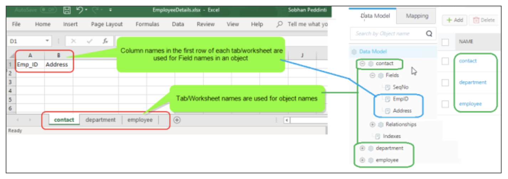

                               
User Guide: [Object Services](../Objectservices.md) > Data Model Template in XLSX file for Storage Objects

Data Model Template in XLSX file for Storage Objects
--------------------------------------------------------------

### Requirements to create a Data Model using XLSX workbook

You can create your data model in an XLS/XLSX file as per the following requirements:

1.   Maximum number of sheets that can be imported: 15  [These sheets are used for objects in the Data Model]
2.   Maximum number of columns in sheet that can be imported: 50  [These columns are used for fields of an object]
3.   Maximum size of Excel workbook that can be imported: 3MB.

### Structure of Sample Data Model template in XLSX file

The followed screenshot helps you understand the sample data model template created using the XLSX file.

1.   Tab/worksheet names of the XLSX file are used for object names in the data model
2.   Column names in the first row of each tab/worksheet are used for fields names in an object

