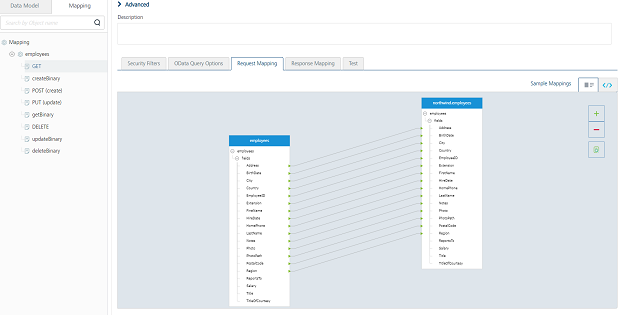
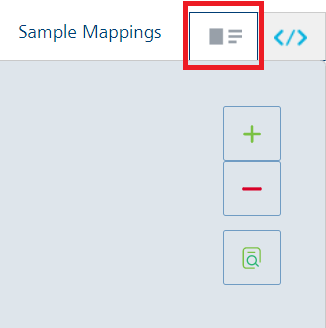
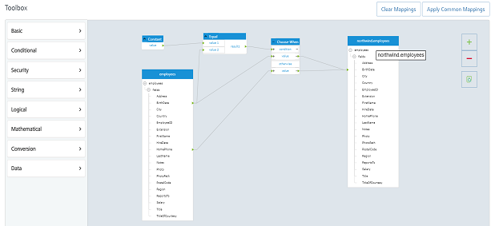

                              

User Guide: [Object Services](../Objectservices.md) > [Stage 3: Mapping Operations to Back-end Methods](Objectservices_Stage3.md) > Creating a Mapping by using Visual Mapper

Creating a Mapping by using Visual Mapper
-----------------------------------------

Object Services includes a visual designer that lets you add, modify, and delete request and response mappings of any of your Object Services by using a drag-and-drop interface.

The back-end object, data model, and the other objects and functions associated with the service are each displayed in their own container. Each container has one or more items listed within it. You can click on an item and drag your cursor to another item in another container to create new mappings.

Each mapping has a corresponding color associated with it.

*   Gray corresponds to a valid mapping.
*   Blue corresponds to a common mapping.

The design view is available along with a XML code view of your mappings. You can quickly switch between code view and the visual design view by clicking on the appropriate tab in the viewing pane.

> **_Note:_** This video will walk you through understanding the Visual Mapper in your application: [https://youtu.be/5JH9s3Qzx5g](https://youtu.be/5JH9s3Qzx5g)

The procedures in this section describe how to use the visual designer to manage your Object Service mappings.

### How to View and Edit Mappings

You can examine any Object Service in visual design view that has request and response mappings. This section describes how to access visual design view for your services.

> **_Note:_** The default visual design view pane is view-only and cannot be edited.

You can also edit your mappings by clicking the Edit button at the bottom of the viewing pane.

**To access visual design view for a specific object service, do the following:**

1.  In the **Object Services** list, click the ... button on the right side of the service listing you want to view, and then click **Edit Configuration**.
2.  In the navigation pane, click the **Mapping** tab.
3.  In the **Mapping** tab, click the item you want to view.
4.  Click either the **Request Mapping** or the **Response Mapping** tab.
5.  Under **Request Mapping** or **Response Mapping**, click the design view tab, which is located next to the Sample Mapping button.  
    
    
    After you are in visual design view, you can increase and decrease the zoom level of the viewing pane by clicking the **+** and **\-** buttons in the upper-right corner of the pane. In addition, you can hide mappings by clicking the button below the zoom buttons and selecting which type of mappings you want to hide.
    
6.  If you want to edit your mappings for this service, click the **Edit** button in the lower-right corner of the page.

### How to Add Mappings

You can map objects to each other by using your mouse to click on one item and then dragging to another item.

Depending on the type of item, the item can have multiple mappings from several different sources.

To map one item to another, do the following:

1.  Click and hold on the item you want to connect.
2.  While continuing to hold the mouse button, move your mouse cursor to the item you want to connect to and release the mouse button.

> **_Note:_** If you attempt invalid mapping, an error message will appear.

### How to Remove Mappings

You can remove all the existing mappings by clicking the **Clear Mappings** button.

If you want to remove individual mappings, select the mapping you want to remove, and press delete on your keyboard. You can select multiple mappings by holding down either `Shift` or `Ctrl` keys and then selecting more mappings.

### How-to Use Functions in the Visual Designer

When the visual designer is in **Edit** mode, the **Toolbox** pane lists built-in functions on the left side of the view.

The list includes all built-in mapper functions, as well as any custom functions you have created.

You can add new functions to your service by dragging and dropping the function from the list. You can also add, edit, import, export, and delete any custom functions you have.

To add a built-in function, do the following:

1.  Select the function you want to use from the function list.
2.  Click and hold the mouse button on the function.
3.  While continuing to hold the mouse button, move your mouse cursor to the location you want to place the function and release the mouse button.

You can now [Enhance the Mapping by using XML Mapper for advanced scenarios](ObjectservicesMapper.md)
