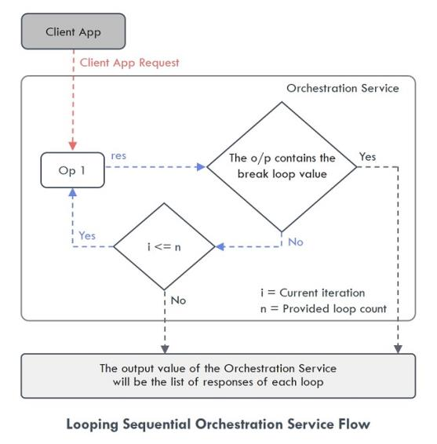

                              

User Guide: Orchestration Service

  

Orchestration
=============

Overview
--------

Orchestration Services leverage the concept of combining multiple integration services, object services or orchestration services into a single service to simplify business logic in client apps and reduce the number of service invocations.

Use Case
--------

An HR executive wants to fill a vacancy in the company available for a developer with 3-6 years of experience. The HR uses an HR tool to search for the suitable candidates. The tool sends the initial request to an Orchestration service which then invokes other services that connect to various data sources, for example, Naukri, LinkedIn, Monster, Indeed and get the list of suitable candidates.

Finally, the orchestration service gets the list of eligible candidates suitable for the vacancy and the data is displayed in the HR tool.

Orchestration Service Operations
--------------------------------

Operations are the functional entities that are invoked from the client-side core functions that define the capabilities of any service. Operations in an orchestration service can be defined to invoke operations from multiple services. You can create Orchestration service operations from the existing Integration service operations, Object service operations, and other Orchestration service operations; and assign an execution strategy to these operations so that they are executed in the defined order.

There are two major execution types for Orchestration service Operations:

*   **Composite** – The Composite execution type allows you to combine multiple operations and execute the operations added to the Orchestration service. There are two execution modes for this execution type:
    
    *   **Composite Concurrent** - This executes the operations added in a service simultaneously, and there is no order in the way the operations are executed. For example, in the provided use case, the service calls made to different data sources are executed simultaneously.  
        
    *   **Composite Sequential** - This mode executes the operations added in a service in a specified order, and you can also use the output response of one service as input request for the next service.  
        For example, a weather app with Orchestration service gets the Geolocation of the device first, then gets the Pin code based on the input from the Geolocation, and then calls a weather service to get the temperature based on Pin code.  
        
*   **Looping** – You can add only one operation in the orchestration service if you want to select looping execution type. It allows you to execute the operation repeatedly in a loop using a delimited set of inputs or until a specified condition is met. You have to define the following parameters if you want to execute the operation in a loop:
    
    *   **Looping Concurrent** - When you select this mode, the operation is executed simultaneously “n” number of times based on the loop count value. The output value of the Orchestration Service will be the list of responses of each loop.  
        
    *   **Looping Sequential** - When you select this mode, the operation is executed sequentially in a loop till the break loop parameter or loop count is met. The output value of the Orchestration Service will be the list of responses of each loop.  
        

> **_Important:_** You cannot add any service to an Orchestration Service in which the **Enable Pass-through** feature is enabled.

Orchestration Service Tab
-------------------------

To go to the Orchestration tab from the Volt MX Foundry Console dashboard, click **Add New** or select any existing app > **Configure Services** > **Orchestration**.

If you have not configured any Orchestration service before, the Volt MX Foundry displays a message that there are no Orchestration services configured on the Orchestration tab landing page.

You can do the following from the Orchestration service landing page:

*   [Create a new Orchestration service](#create-a-new-orchestration-service)
    
*   [Use existing Orchestration services](#use-existing-service-to-create-a-new-orchestration-service) in the account to create a new Orchestration service
    
*   [Manage](#manage-services) the available Orchestration services
    

Create a New Orchestration Service
----------------------------------

> **_Note:_** If you want to create an Orchestration service without associating it with any Volt MX Foundry app, from the side menu, click API Management > APIs > Orchestration > Configure New. For more information on API Management, refer [API Management](API_Management.md).

To configure a new Orchestration service, you must first create a service definition and add operations to that service definition.

### Create a Service Definition

To create a new Service Definition, in the Orchestration page click **Configure New** or in the left pane click the “+” icon and select **Add New Service**. The Volt MX Foundry displays the **Service Definition** screen. You can do the following on the **Service Definition** screen:

*   In the **Name** box, type a unique name for the new Orchestration service. The name of the service must not match with any of the existing service names.  
    
    > **_Note:_** The service name should not contain special characters, must begin with a letter, and should be between 4 and 30 characters. The service name can include underscore ( \_ ) and dash (-) characters.  
    

*   The version of the Orchestration service is mentioned by default in the **Version** list. To know more about service versions, click [here.](#service-versions)
    
*   In the **Description** box, type the required definition for the new service. This field is optional.
    

In Volt MX Foundry, you can upload a custom code library in the form of a .jar file. These uploaded files can be used across all the services.

If you want to associate this new service with a custom code library or apply a throttling limit, expand the **Advanced** section. This section contains two tabs, which are **Custom Code** and **Throttling**. By default, the **Custom Code** tab is selected.

**Custom Code**

From the **Custom Code** tab, you can select the .jar file you want to associate with your new service. You can do the following to select the .jar file:

> **_Important:_** If you have access to multiple accounts in Volt MX Foundry Console, the uploaded .jar files are available only in that account where they were uploaded. The .jar files uploaded in one account will not be available in another account. These files will be accessible to anyone who has access to that accounts.

*   If you do not have the required .jar file available in the account, click **Upload New** and select the required .jar file from your local machine.
    
*   If you have the required .jar file available in the accounts, click **Select existing JAR** list and select the required file.
    

**Throttling**

From the **Throttling** tab, you can provide the number of times you want to invoke an API per minute. If the API exceeds its throttling limit, it will not return the service responses. You can do the following to provide the throttling limit:

*   In the **Total Rate Limit** box, type a required value. This value limits the total number of requests processed by the API.
    
*   In the **Rate Limit per IP** box, type a required value. The value limits the number of requests made from an IP address. If the device exceeds the limit set, the API returns an appropriate error message.
    

> **_Note:_** If both the values are given, the throttling limit which is met first will take precedence.

Once all the required parameters are configured in the **Service Definition** page, click **Save** if you want to save the new service and add operations to it later. Click **Save and Add Operation** if you want to add operations to that service immediately.

The new service is added to the All Services list and to the Orchestration tab landing page.

### Create an Operation

If you have clicked **Save** on the **Service Definition** page, Volt MX Foundry displays an **Operations List** tab when you open the service next time. Select the **Operations List** tab and click **Add Operation** or in the left pane, click the “+” icon and select **Add New Operation**. Volt MX Foundry displays the **NewOperation** tab.

If you have clicked **Save and Add Operation** in the **Service Definition** page, it directly opens the **NewOperation** tab.

You can do the following to add an operation to the service:

*   In the **Name** box, type a unique name for the new operation. The name of the operation must not match with any of the existing operation names.
    
*   From the **Operation Execution Type** list, select the required execution type. The available execution types are as follows:
    
    *   Composite Concurrent
        
    *   Composite Sequential
        
    *   Looping Concurrent
        
    *   Looping Concurrent
        
*   If you select a looping operation, the following fields appear:
    
    *   **Loop Count**: It denotes the number of times the service included in the looping service must get executed.
        
    *   **Loop Separator**: Specifies the character that separates the input parameters of a service.  
        For example: When the input parameter for the operations you add in the Orchestration Service are different, then the character provided here will act as a separator for the input parameters like “,”.
        
    *   **Break Loop Parameter Name**: Specifies if there are any breakout parameters for the execution of the looping service. The breakout parameter is a part of the result returned from the service call within a loop.  
        For example: If you want a particular Key Value pair in the response as the break loop parameter, then mention the name of the Key here.
        
    *   **Break Loop Parameter Value**: Specifies the value for the breakout parameter of the looping service. If the value of the breakout parameter returned from the service matches with the given value, the operation exits the loop.  
        For example: If you want a particular Key Value pair in the response as the break loop parameter, then mention the Value here.
        
*   From the **Operation Security Level** list, select the required authentication type. It defines the way a client must authenticate to access this operation. The available execution types are as follows:
    
    *   **Authenticated App User** – It restricts the access to clients who have successfully authenticated using an Identity Service associated with the app.
    *   **Anonymous App User** – It allows the access from trusted clients that have the required App Key and App Secret. Authentication through an Identity Service is not required.
    *   **Public** – It allows any client to invoke this operation without any authentication. This setting does not provide any security to invoke this operation and you should avoid this authentication type if possible.
    *   **Private** - It blocks the access to this operation from any external client. It allows invocation either from an Orchestration/Object Service, or from the custom code in the same run-time environment.
*   From the **Front End HTTP Method** list, select the required request method you want to use to invoke the service operation from a HTTP Client. The available request methods are as follows:
    
    *   GET
    *   POST
    *   PUT
    *   DELETE
    
    For example, Iris and Other SDKs use POST method for communicating with Volt MX Foundry.
    
*   In the **Description** box, type the required definition for the new service which you are creating now. This field is optional.
    
*   The **Operation Mapping > Available Services** section lists all the services from Integration and Object services. These services contain all the operations associated with them, and you can map the operations you want to use for the new Orchestration service. Do the following to map the operations:
    
    *   Expand the required services and select the required operations of that service.
        
    *   Drag and drop them into the right pane in the **Operation Mapping** section.
        
*   In the **Enable pass-through** section, select the required parameter type. This field is optional. If you select any parameter type, the related parameter variables are shown as is from the client server. The types of parameter available are: Input, Header, and Output.
    
    For example, if you have used multiple Integration service operations to create an Orchestration service, and selected the **Input** check box in **Enable pass-through** section. The **Request Input** parameter variables configured for those operations will be ignored, and they will be shown as is from the client server.
    
    > **_Note:_** This filter will be applicable to all the operations which you have dropped in the right pane of Operation Mapping.
    
*   If you want to check the service functionality, from the **Environments** list, select the environment to which you want to publish the app, and then click **Save and Fetch Response**. The responses from the client server are displayed. For more information, refer to [Test an Orchestration Service Operation.](Test_an_Orechestration_Service_Operation.md)
    
*   Click **Save Operations**. The new operation is added in the **Operations** tab of that Orchestration service.
    

Use Existing Service to Create a New Orchestration Service
----------------------------------------------------------

This feature helps you to use an existing Orchestration service in a Volt MX Foundry account and use it to configure a new Orchestration service. You can either clone or add existing services and make changes to them accordingly.

To create a new Orchestration service from the available services, perform the following steps:

*   In the **Orchestration** service tab, click **Use Existing** or in the left pane click the “+” icon and select **Use Existing**. The **Existing services** screen is displayed.
    
*   Select the required services from the **Existing services** screen and click **Clone** or **Add**. The Clone Service or Add Service status screen appears.
    
    *   **Clone**: It creates a duplicate of the selected service. The changes made to the duplicate service will not affect the original service.
        
    *   **Add**: It adds the selected service to the new Volt MX Foundry app. The changes made to the service will affect all the apps using the service.  
        If the service is part of any published app, you must unpublish the service to rename it.
        
    
    > **_Note:_** If the list is long, you can search for the required service with **Search** option.
    
*   After the **Clone** or **Add** process is complete, the service is added to the Orchestration services list.
    
*   Click the newly added service or open the Contextual menu and click **Edit** to configure the details of the service. For more information on configuring the details, refer to [Create a Service Definition](#create-a-service-definition) and [Create an Operation.](#create-an-operation)
    

Manage Services
---------------

All the services related to a service type are listed on the landing page of the respective service type. You can manage the details of a service from the Contextual menu available adjacent to each service. The following options are available in the Contextual Menu:

*   **Edit** – Click to edit the details of a selected service. After you edit a service, republish all the apps that use this service to apply the changes.
    
*   **Clone** - Duplicates an existing service. Clone a service to create a different version of the same service. Changes made to a cloned service will not affect the original service. The name of a cloned service indicates that it is a copy of an existing service.
*   **Sample Code** - Generates dynamic code for each SDK type based on the configuration of a service. You can use the code in your mobile app. For example, generate the sample code for an orchestration service from Volt MX Foundry. Then use that code in the mobile app to invoke the orchestration service instance.
*   **Unlink** - Removes a service from the Orchestration tab of an app. Unlink a service when you don’t want to associate the service with the Volt MX Foundry app.
*   **Delete** - Deletes a selected service from Volt MX Foundry Console. You cannot delete a service if the service is in use. A service in use is a service that is referenced by a Volt MX Foundry app or another service or a Sync scope.  
    
    > **_Note:_** When you delete a service that has multiple versions, only the active version is deleted.
    
*   **Console Access Control** – You can manage the users who can access this service from here. To know more, refer to [Console Access Control](ConsoleAccessControl.md).
*   **Export as XML** - Exports the current version of a service in the form of an XML file.
*   **Export** – Exports the service details in the form of a zip file. You can import this zip file to another Volt MX Foundry app and use it. For more information, refer to [Export and Import an Application](Export-Import_Apps.md).

Service Versions
----------------

You can use Service Versioning if you want to save the changes made to a service as another version of the same service. When you create a new version for a service, the Volt MX Foundry app associated with the service will use the latest version of the service automatically.

> **_Note:_** A Volt MX Foundry app can be associated with only one version of an orchestration service.

You can do the following in the Service Definition (link) tab to create a new version for a service:

1.  In the **Version** list, select **Save as New Version**. The **Save** as screen is displayed.
    
2.  In the **Version** box, type the required version number. This field is mandatory.
    
    > **_Note:_** The format for version number is major.minor. The value of major can be between 1 to 999, and the value of minor can be between 0 to 99. For example, 1.0 or 999.99.
    
3.  In the **Description** box, type the required notes for the new version. This field is optional.
    
4.  Click **OK**. The version of the service is updated to the latest version number.
    

If you want to select any previous versions, in the **Version** list, select the required version and then click **OK** on the **Alert** dialog box. The version of the service is updated.
