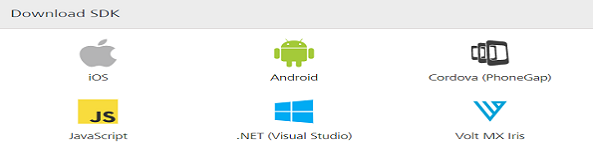
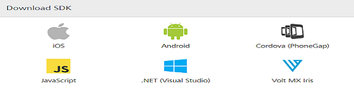

                             

User Guide: [SDKs](../Foundry_SDKs.md) > [Cordova (PhoneGap) SDK](Installing_PhoneGap_SDK.md) > Downloading Volt MX PhoneGap SDK

Downloading Volt MX Cordova SDK Files
=====================================

To download Volt MX Cordova SDK, follow these steps:

1.  In the Volt MX Foundry console, navigate to **Apps** > **SDKs**, and click Cordova (PhoneGap). The system prompts you to save the zip file in your local system.
    
    
    
    
    
2.  Save the `voltmx-phonegap-sdk.zip` file in your local system.
3.  Extract the `voltmx-phonegap-sdk.zip` file that you just downloaded.
    
    The `voltmx-phonegap-sdk` folder contains the following files:
    
    *   com.voltmx.sdk
    *   com.voltmx-sdk.doc
    *   LICENSE.txt
    *   version.txt
