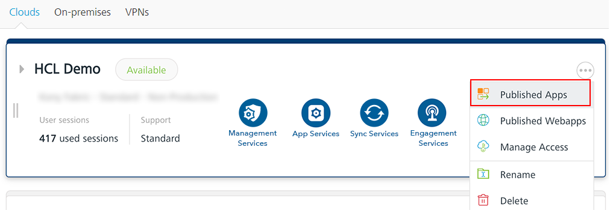
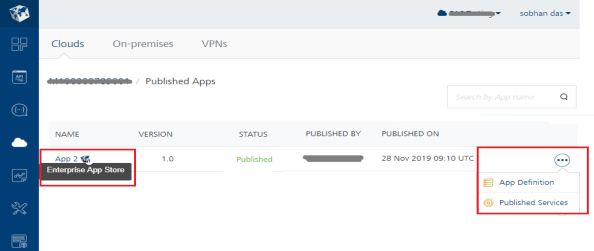
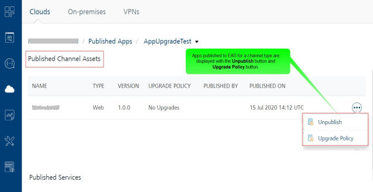

                               

User Guide: Viewing Applications Published to a Runtime Environment

Viewing Applications Published to a Runtime Environment and EAS
---------------------------------------------------------------

You can view the list of apps published to an environment and EAS and the runtime status of the apps through the **Environments** \> **More Options > Published Apps** page.

From Volt MX Foundry V9 onwards, the list of apps published to your EAS is displayed in the **Published Apps** page, in addition to the apps published to your environment.

> **_Note:_**  The **More Options** button in the **Environments** page is available only if you have the Admin access.

From the **Published Apps** page, you can perform the following actions:

*   Navigate to the application's definition of the published app.
*   Navigate to **Published Services**:
    *   **Published Channel Assets** section displays the list of channels for which an app has been published. This is applicable only to the apps that are published to EAS.
    *   **Unpublish** button is associated with the channel type of the app published to EAS. You can unpublish an app from EAS for a specific channel by clicking the **Unpublish** button associated to that channel.
    *   The **Published Services** section displays the list of all the services associated to the current version of the published app.

To view the list of all the apps published to an environment, follow these steps:

1.  From the left pane in your Volt MX Foundry Console, click **Environments**. This displays the list of clouds or environments configured for your Volt MX Foundry account.
2.  Click the **More Options** button of an environment.
    
    > **_Note:_**  The **More Options** button in the **Environments** page is available only if you have the Admin access.
    
3.  From the context menu, select **Published Apps**.
    
    
    
    The following details for all the apps published to the environment are displayed in the **Published Apps** page.
    
    *   **NAME**: Displays the name of the published app.
        *   The apps published to EAS are indicated with the EAS app icon and a tooltip.
    *   **VERSION**: Displays the version of the published app.
    *   **STATUS**: This section displays the status of the app published in the environment. Following are the different statuses available for an environment.
        *   **Published**: App is published to this cloud or environment.
            
        *   **In Progress**: App is in the process of being published to this cloud or environment.
            
        *   **Error**: The app publishing process is canceled while publishing, or there was an error while publishing.
            
    *   **PUBLISHED BY**: Displays name of the user that published the app to this environment or cloud.
    *   **PUBLISHED ON**: Displays the date and time when the app was last published.
    
    From the **Published Apps** page, you can navigate to the definition and published services of an app. For example, `<Environment-name> Published Apps > <app-name>` page.
    
    
    
4.  To view the application's definition, click **More Options** > **App Definition**. The [Identity Service Designer](Identity.md) page for the app is displayed. You can edit the service definition and services, if required. If you edit any details, these changes will not be available at runtime environment until you publish the updated app/services again.
5.  To view the associated services and the channel types with the published app, click the ****More Options**** > **Published Services**.
    
    The following app details are displayed for the published apps: _app publish status_, _app version_, _app publish time stamp_, and the _user name_ of the user who published the app.
    
    
    
    *   The **Published Channel Assets** section is applicable only for the published apps to EAS. This section displays the following details:
        
        | Column | Description |
        | --- | --- |
        | NAME | Displays the name of the app binary published to EAS. |
        | TYPE | Displays the type of the channel to which the app has been published. |
        | VERSION | Displays the version of the app. |
        | PUBLISHED BY | Displays the name of the user who published the app. |
        | PUBLISHED ON | Displays the time-stamp when the app was published. |
        | **Unpublish** button | You can click this button to unpublish the app. |
        
    *   The **Published Services** section displays the following details for the associated services:
        
        | Column | Description |
        | --- | --- |
        | NAME | Displays the name of the service. |
        | TYPE | Displays the type of the service. |
        | VERSION | Displays the version of the service. |
        | ASSOCIATED JARS | Displays the **View** hyperlink. When you click the **View** link, the list of jars associated with that service is displayed. This column is shown only for Application Servers with Volt MX Foundry V7.2 or later. |
