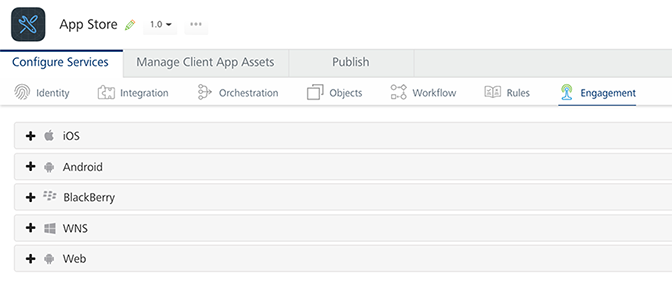
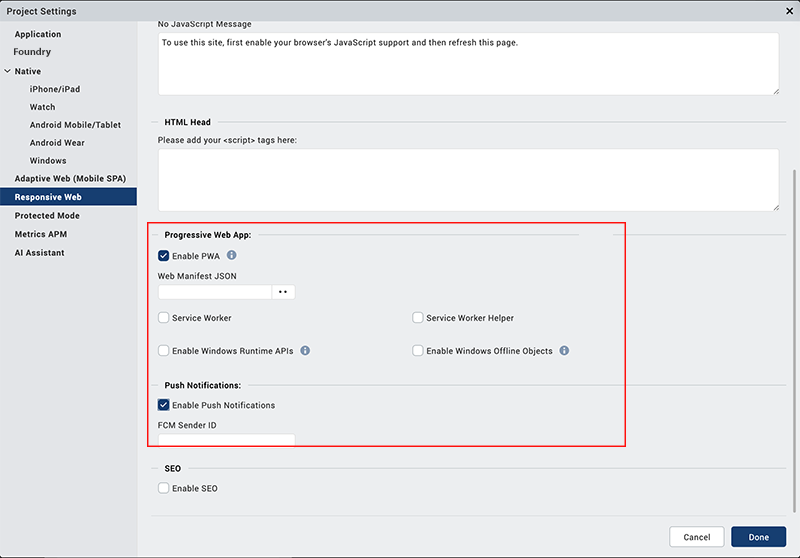
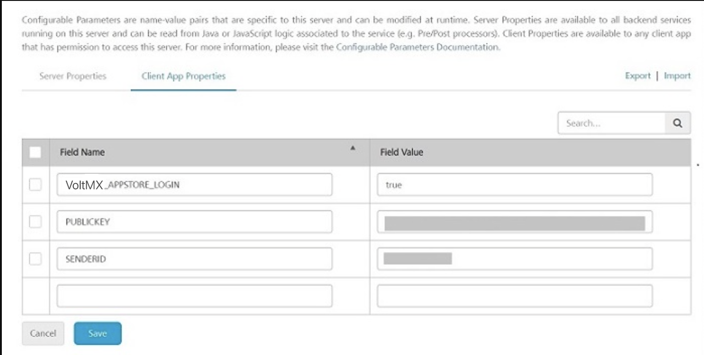
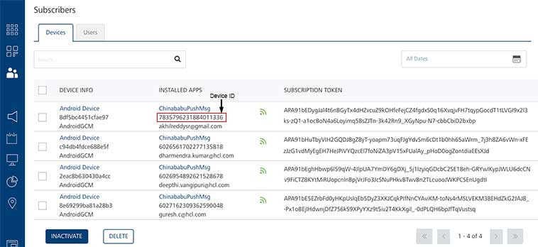
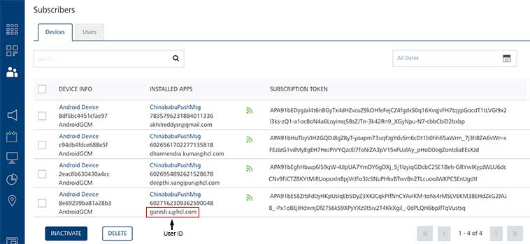
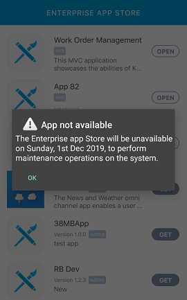
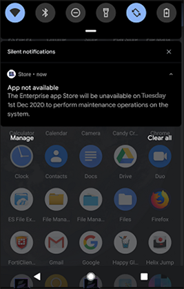

                              

User Guide: Sending Push Notification to EAS

Sending Push Notifications to Enterprise App Store
==================================================

Overview
--------

Enterprise App Store (EAS), the app distribution service that enables an enterprise to manage and distribute customized apps to their users supports sending Push Notifications. EAS has been enhanced to leverage the Volt MX Engagement Services for the client app. Using which, you can send manual push messages to all registered devices, or to a subset of devices, based on the device ID. This functionality is available for all devices as well as the web channel. The Engagement Services provide a subscription-based notification mechanism that enables users to subscribe their devices to receive notifications.

When an EAS app is launched on a device, the device is registered to the Engagement Server that is linked to your environment. In case the EAS login is disabled, the device is registered only by the device ID. If the EAS login is enabled, the username of the person is also registered. After the device registration is completed, you can send push notifications to your entire user base or to select users.

Supported Channels and Platforms
--------------------------------

Sending Push Notification to EAS is supported for the following channels and platforms:

*   **iOS**\- iPhone and iPad
*   **Android**\- Phones and Tablets
*   **Web** - Android Web

> **_Note:_** Support for push notifications is available in Volt MX Enterprise App Store version 2.0.0, or later. For more information on this refer to [VoltMX App Store on Marketplace](https://marketplace.hclvoltmx.com/items/voltmx-app-store).

Configuring a Push Notification
-------------------------------

1.  Go to the Volt MX Foundry Console. The **Apps** page appears.
2.  Click on the Volt MX App Store. The **Configure Services** page appears.
3.  Click on **Engagement**.
    
    Based on your requirement, choose Apple, Android, or Web platforms and enter platform specific details; for example, the FCM Authorization Key for Android. You can skip other platforms by clicking Next. You need to configure at least one platform to save and publish the application successfully.
    

> **_Note:_** For more information on generating a Server Key and Sender ID for Web devices, refer to [Generating FCM Server Key and Sender ID for Web Devices](../../../Foundry/vms_console_user_guide/Content/Apps/Generating_Web_FCM_keys.md).

> **_Note:_** To create an app for the Web channel in the Engagement Server, refer to [Add New App for Web](../../../Foundry/vms_console_user_guide/Content/Apps/Web.md).

### Configuration on Client Side

*    For enabling push notifications on the Web channel, do the following:
    
    1.  Go to **Iris** > **Project Settings** > **Responsive Web**.
    2.  Select the **Enable PWA** and **Enable Push Notifications** check boxes.
    3.  Enter the **FCM Sender ID**.
    4.  Click Done.
    
    
    
    > **_Important:_** If you have enabled Push Notifications for EAS Web apps, then registration callbacks will be triggered for the first launch of the EAS Web app. If you change any settings at the Engagement Server side, then for the same changes to reflect in the EAS Web app, the Settings of the Web app must be cleared.
    

*   For enabling push notifications on the Android channel, do the following:
    
    Go to your **Iris Project Workspace** > **projectProperties.json** add following key value pair:
    
    *   `"enablefcmpushnotifications": "true"`

### Configuration on Admin Console

Using Admin Console you can specify the name-value pairs of your public key and sender ID and they can be modified at runtime. Client App Properties are available to any client app that has permission to access your Admin Console Server.

*   Go to **Admin Console** > **Settings** and do the following:
    
    In **Client App Properties** of **App Services** add the following key-value pairs:
    
    *   `PUBLICKEY : xxxxxxxxxxxxxxxxxxxxxxxxxx`
    *   `SENDERID : xxxxxxxxxxx`
    
    > **_Note:_** This is a provision made for you to change the public key and sender ID details everytime you change your FCM project.
    
    
    

Device Registration on the Engagement Server
--------------------------------------------

When a user opens an EAS app, the following scenarios can occur:

*   **EAS without authentication**: The app opens and the device ID of the device on which the app is opened is registered on the Engagement Server.
    *   In the Volt MX Engagement Console, under Overview, click Subscribers. The Devices tab appears, with a list of all the devices registered to the server.
    *   You can send a **generic message** to these users, for example, "The Enterprise App Store will be unavailable on Sunday, 1st Dec 2019, to perform maintenance operations on the system.".
    
    
    
*   **EAS with authentication**: The sign in screen appears, you must sign in to the app with the required credentials. The device ID of the device on which the app is opened is registered on the Engagement Server along with your User ID.
    *   In the Volt MX Engagement Console, under Overview, click Subscribers. The Devices tab appears, with a list of all the users and their User IDs registered to the server.
    *   You can send **specific messages** to these users, for example, "Your account on the HR App will be made inactive in a week due to inactivity. To continue to use the HR App, please login to your account.".
    
    
    

Sending Push Messages
---------------------

To configure a push message, follow these steps on the Volt MX Engagement Console:

1.  From the Engagement section, click **Adhoc** from the left panel. The Adhoc screen appears, displaying the following three tabs: **Adhoc information**, **Select Users**, **Define Message**.
2.  In the **Adhoc Information** tab, provide the type of message and application name to which the message should be sent. You can also schedule the date and time at which the message should be sent. For more information on selecting date and time, refer to [Send Message](../../../Foundry/vms_console_user_guide/Content/Adhoc/Set_Start_and_Expiry_Time.md).
3.  In the **Select Users** tab, you can choose the entire subscriber list of the selected application or a Segment of users. For more information on how to create a Segment in Volt MX Engagement Server, refer to [Adding a Segment](../../../Foundry/vms_console_user_guide/Content/Segments/Adding_a_Segment.md).
4.  In the **Define Message** tab, you can define the message that should be sent to your subscribers.

After this process is done, the message gets queued with the respective platform specific server.

For more information on how to trigger a notification through Engagement Server, refer to [Adhoc Messages](../../../Foundry/vms_console_user_guide/Content/General__Distribution.md).

*   When a push is triggered, if the EAS app is open on a device, a notification appears on the device.  
    
*   When a push is triggered, if the EAS app is closed on a device, a status notification appears on the device.  
    

Known Issues
------------

*   In iOS 13 devices, the network error alert gets dismissed without user action.
