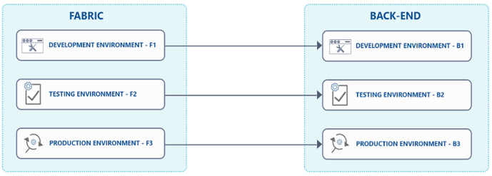
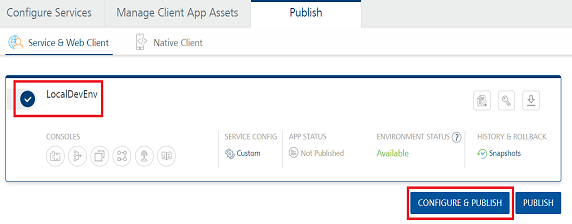
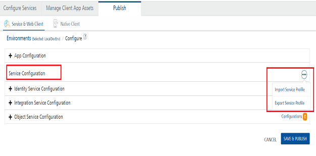

                               

User Guide: [Publish](Publish.md) > Use Case

Managing Service Profiles
=========================

The Service Configuration Profile Import and Export capability enables you to exchange service configuration parameters of an app between two environments.

Every service profile includes configuration parameters of all the services that are linked to an app. The details of the service profile are available in the form of a JSON file. You can export a service profile from one environment, edit the required service parameters in the JSON file, and then import the updated service profile to another environment.

Service profiles can be versioned in a Git repository and these versions can be used for app upgrades. This provides full portability of a service profile to deploy the profile to new clouds.

Service profiles support is available for Volt MX Foundry Console and MFCLI. The Export and Import features are in the **[Publish > Service & Web Client > CONFIGURE and PUBLISH](Publish.md)** page.

Use Case
--------

With service configurations, you can redefine the endpoints to which your Foundry application connects per environment.

Consider a scenario in which your app uses different back-end environments for different Foundry environments. For example: If your app runs on Foundry environment F1, it must connect to the back-end environment B1; and if the app runs on Foundry environment F2, it must connect to back-end environment B2.

This is useful because you typically want a development Foundry environment to connect to a development back-end environment, and so on for higher environments such as testing, UAT, or Production.

To avoid manually reconfiguring the endpoints every time you publish the app, you can create a service profile file, which contains the set of different back-end endpoints for a specific Foundry environment. You can then import the service profile when you publish the app. For example: You can import the service configuration for Foundry environment F3 to configure the endpoints for back-end environment B3.



Supported JSON Versions for Exported Services Configuration Parameters
----------------------------------------------------------------------

When you export service profiles, the service configuration parameters are downloaded in a JSON file structure, as follows:

*   **Generic JSON File format**: For V9SP1 or lower versions, generic JSON V1.0 File Structure is supported for the exported details.
*   **Simplified JSON File format**: From V9SP2 or higher versions, Simplified JSON File Structure V2.0 is supported, which is a human-readable format. When you export service profiles, the service configuration parameters are downloaded in a **simplified** JSON file structure including the specified level value, complete or delta.
    
    *   **Complete:** Downloads the configuration parameters in a simplified JSON file structure containing the Environment Current Configuration, which is the configuration currently in a specific environment for a specific app.
    *   **Delta**: Downloads the configuration parameters in a simplified JSON file structure **containing only the Changed Values, which are the edited values and modified artifacts.**
    
<details close markdown="block"><summary>sample JSON file format for Exported Service Configurations</summary>
    
    From V9SP2, the simplified JSON file structure (2.0) with level values **complete** and **delta** is supported as follows:
    
    | **V2.0, Complete** | **V2.0, Delta** |
    | --- | --- |
    | //Sample code for exported service profile for Complete { "identity": { "SampleIdentityService": { "profile\_endpoint": "https://.......", "client\_secret": "qwerty", "type": "oauth2", "version": "1.0", "client\_id": "changed value", "authorization\_endpoint": "https://.........", "token\_endpoint": "https://.............." }, "SampleIdentityService2": { } }, "objectsvc": {}, "integration": { }, "formatVersion": "2.0" } |  //Sample code for exported service profile for Delta { "identity": { "SampleIdentityService": { "type": "oauth2", "version": "1.0", "client\_id": "changed value" } }, "objectsvc": {}, "integration": {}, "formatVersion": "2.0" } |
</details>
    

Export/Import Service Profiles using Volt MX Foundry
---------------------------------------------------

To export or import a service configuration profile from the **Publish** tab, do the following:

1.  In the **[Publish > Service & Web Client](Publish.md)** page, select the required environment.
2.  Click **CONFIGURE & PUBLISH**.
    
    
    

1.  In **Service Configuration**, click the **More Options** button. The Import Service Profile and Export Service Profile options are shown in the list.
    
    
    
    *   To export the service profile, click the **Export Service Profile** option. The service profile details are downloaded in a JSON file.
        
        > **_Note:_** The **Export Service Profile** option downloads the format version 2.0 with level as **Delta**. This reconfig file is in simplified JSON file structure.
        

*   To import the service profile, click the **Import Service Profile** option and navigate to the required JSON file of a service profile.
    
    > **_Important:_** After you import a service profile, the existing configuration parameters get modified. This modification is based on the data imported before the **SAVE & PUBLISH** button was clicked.
    

1.  Click **SAVE & PUBLISH** to start publishing the updated details in the service profile to the selected environment. The process of publishing the app begins.

Export/Import Service Profiles using MFCLI
------------------------------------------

You can export or import service profiles by using MFCLI commands for continuous integration.

### export-config command

The `export-config` helps you to export the Service Profile for the existing services (Integration, Identity and Object), for a given app and an environment. The profile is downloaded as per the specified .json file.

*   To export a service profile from a Cloud (manage.hclvoltmx.com) environment
```
java -jar mfcli.jar export-config -u <user> -p <password> -t <account id> [-f <file name>  [-a <app name>] [-v <app version>] [-e <environment name>] [-x <format version>] [-y <level>]
```
    
> **_Important:_** The <level> values supported are **complete** and **delta**.  
```

For example:    
{-x 2.0} {-y complete}
Downloads simplified JSON file structure containing the environment current configuration (the configuration currently in a specific environment for a specific app)     
{-x 2.0} {-y delta}  or  {-x 2.0}
Downloads simplified JSON file structure contains only the changed values (the edited values and modified artifacts)
```

For example:

```
java -jar mfcli.jar export-config -u abc@voltmx.com -p password -t 100054321 -f "C:\\tmp\\Sample.json" -a MyApp_23 -v 1.0 -e MyCloudEnvironment \-x 2.0 -y delta
```

*   To export a service profile from an on-premise installation
```
 java -jar mfcli.jar export-config -u <user> -p <password> -au <Identity URL> -cu <Console URL> [-f <file name>  [-a <app name>] [-v <app version>] [-e <environment name>] [-x <format version>] [-y <level>]
```
    
    For example:
    
```
java -jar mfcli.jar export-config -u abc@voltmx.com -p password -au http://10.10.24.79:8080 -cu http://10.10.24.78:8081 -f "C:\\tmp\\Sample.json" -a MyApp_23 -v 1.0 -e MyCloudEnvironment \-x 2.0 -y delta
```
    
    The following arguments are supported for the export-config command:
    
```
For example, to get the summary help on all the commands,  
    java -jar mfcli.jar export-config help 
    Usage: Run the self-executable JAR with relevant arguments:
```
    
      
    | Arguments | Description |
    | --- | --- |
    | \-t, --account | Nine-digit ID of the Volt MX Cloud account (visible on top right corner in Console), for example, 100054321. Not relevant for an on-premise installation. |
    | \* -a, --app | Name of the app for which Service Configuration profile is to be exported. |
    | \-cu, --console | URL of Volt MX Foundry Console (without context path), relevant for on-premise installation only. For example, http://10.10.24.78:8081 |
    | \* -e, --environment | Name of the environment for which a Service Configuration profile is to be exported. |
    | \* -f, --file | Name of the file to import or export. For example, C:\\\\tmp\\\\Sample.json. |
    | \-au, --identity | URL of Volt MX Foundry Identity Services (without context path), relevant for on-premise installation only. For example, http://10.10.24.79:8080 |
    | \--mfa | If specified, Multi-Factor Authentication is enabled. The secret key for MFA required for generating one-time password (OTP) needs to be specified in the properties file. The default value is set to `false` |
    | \-p, --password | Password for the Volt MX user account. This could be plain text or, encrypted using 'encrypt' command. This is mandatory. |
    | \-u, --user | Volt MX user required for authentication. For example, abc@voltmx.com. This is mandatory. |
    | \-v, --version | Version of the app for which a Service Configuration profile to be exported. The default version is set to `1.0` |
    | \-x <format version> | Format version 2.0 is for the simplified reconfig JSON file structure. Format version 1.0 is for the generic reconfig JSON file structure. The present available generic reconfig version will be available to be downloaded using the MFCLI |
    | \-y <level> | <level> values supported are complete and delta. |
    

### import-config command

The `import-config` command helps you to import the specified Service Profile in a .json file into the given app and in an environment.

*   To import a service profile to a Cloud (manage.hclvoltmx.com) environment
```
java -jar mfcli.jar import-config -u <user> -p <password> -t <account id> [-f <file name> [-a <app name>] [-v <app version>] [-e <environment name>]]
```
    
    For example:
    
```
java -jar mfcli.jar import-config -u abc@voltmx.com -p password -t 100054321 -f "C:\\tmp\\Sample.zip" -a MyApp_23 -v 1.0 -e MyCloudEnvironment
```
*   To import a service profile to an on-premise installation
```
 java -jar mfcli.jar import-config -u <user> -p <password> -au <Identity URL> -cu <Console URL> [-f <file name>  [-a <app name>] [-v <app version>] [-e <environment name>]
```
    
    For example:
    
```
java -jar mfcli.jar import-config -u abc@voltmx.com -p password -au http://10.10.24.79:8080 -cu http://10.10.24.78:8081 -f "C:\\tmp\\Sample.zip" -a MyApp_23 -v 1.0 -e MyCloudEnvironment
```
    *   The following arguments are supported for the import-config command:
```
 For example, to get summary help on all the commands,  
        java -jar mfcli.jar import-config help  
          
        Usage: Run the self-executable JAR with relevant arguments:
```
        
        | Arguments | Description |
        | --- | --- |
        | \-t, --account | Nine-digit ID of the Volt MX Cloud account (visible on top right corner in Console), for example, 100054321. Not relevant for an on-premise installation. |
        | \* -a, --app | Name of the app for which a Service Configuration profile is to be exported. |
        | \-cu, --console | URL of Volt MX Foundry Console (without context path), relevant for on-premise installation only. For example, http://10.10.24.78:8081 |
        | \* -e, --environment | Name of the environment for which a Service Configuration profile is to be exported. |
        | \* -f, --file | Name of the file to import or export. For example, C:\\\\tmp\\\\Sample.json. |
        | \-au, --identity | URL of Volt MX Foundry Identity Services (without context path), relevant for on-premise installation only. For example, http://10.10.24.79:8080 |
        | \--mfa | If specified, Multi-Factor Authentication is enabled. The secret key for MFA required for generating one-time password (OTP) needs to be specified in the properties file. The default value is set to: `false` |
        | \-p, --password | Password for the Volt MX user account. This could be plain text or, encrypted using 'encrypt' command. This is mandatory. |
        | \-u, --user | Volt MX user required for authentication, For example, abc@voltmx.com. This is mandatory. |
        | \-v, --version | Version of the app for which a Service Configuration profile to be exported. The default version is set to `1.0`. |
