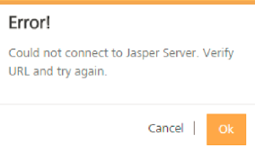

                               

User Guide: How to Add a User in Volt MX Foundry Console

Settings - On-Premises
======================

Using **Settings**, a superuser can manage tasks by configuring identity providers, adding users, importing new users and groups, assigning roles to users, deleting users and groups, configuring a proxy server, and configuring reports server.

The following are included under Settings:

*   [Users](#users)
*   [Proxy](#proxy)
*   [Reports](#reports)

Users
-----

Companies maintain a store of users and their details. Volt MX Foundry provides a mechanism to create a store of users in Volt MX Foundry Console (locally) or import from Active Directory.

Users listed in **Users** tab can access Volt MX Foundry Console to create apps. With the user information, an admin provides users access to Volt MX Foundry Console. Users are stored in accounts and are unique for each source or domain.

The Users tab contains the following sections:

*   [Manage Users](#manage-users)
*   [Groups](#groups)
*   [Identity Providers](#identity-providers)
*   [Default Services & Apps Permissions](#default-services-amp-apps-permissions)

### Manage Users

A user is an individual person. Each user needs an account to access Volt MX Foundry Console. A superuser creates user accounts for owners, admins, and members who use Volt MX Foundry Console.

The user module deals with creating users within Volt MX Foundry Console, importing users from external sources, editing user profiles, and assigning or unassigning environment access to users. Only a user with administrative privileges can access the user module. The user module also allows you to activate or deactivate user roles based on the requirements.

From the **Users** tab, click **Manage Users**. The **Manage Users** screen appears with the list of users. The list view displays a list of all the users along with other details. You can search the users based on each column and sort on each column.

The Users List view displays the following columns:

  
| Column | Description |
| --- | --- |
| NAME | First and last name of the user. |
| SOURCE | Source that belongs to a user. If the user is a local user, the system displays as userstore. |
| DOMAIN | If the user is imported from Active Directory or created locally. |
| EMAIL ID | Email ID as received from Active Directory or as specified by an admin. |
| PHONE | Phone number as received from Active Directory or as specified by an admin. |
| ACCOUNT ROLE | Role as received from Active Directory or as specified by an admin. |
| REPORTS ACCESS | Access to reports is provided as follows: **Standard Access** option provides access to Standard Reports and Dashboard. **Custom Access** option provides access to Standard Reports, Dashboard, Custom Reports, Funnel Reports, and Custom Dashboard. **Full Access** option provides access to Standard Reports, Dashboard, Custom Reports, Funnel Reports, and Custom Dashboard, and Custom Metrics. |
| Setting button | Allows you to edit and delete users, and change environment access to users. |

You can navigate the list view through the **Previous** and **Next** buttons.

The **Manage Users** module in **Users** tab helps you search for a specific identity across Volt MX Foundry Console, and helps you assign and evaluate access controls against the identity. This module helps for editing role and profile information of users.

> **_Note:_**  Special characters are supported in the import process. Names like O’Leary or Fernandez-Gutierrez are allowed.

> **_Important:_**  As a user, you must be an admin or owner to access the **Manage Users** page and perform different tasks based on the role.

You can do the following tasks from the Users page:

*   [Create a User in Volt MX Foundry Console](#how-to-create-a-user-in-foundry-console)
*   [Import Users from Active Directory](#how-to-import-users-from-active-directory)
*   [Edit a User](#how-to-edit-a-user)
*   [Change Environment Access to a User](#how-to-change-environment-access-to-a-user)
*   [Delete a User](#how-to-delete-a-user)

#### How to Create a User in Volt MX Foundry Console

To create a user, follow these steps:

1.  On Volt MX Foundry, click **Settings**. By default, the **Manage Users** page appears. The **Manage Users** tab is only visible to users who are owners or admins. The page lists all owners, admins, and members of the account.
2.  In the **Manage Users** page, click **Create User** button. The **Add New User** page appears.
    
    
    
3.  Enter the following details.
    
    > **_Note:_** The following fields, except Phone, are mandatory:
    
    1.  **First Name**: First name of the user.
    2.  **Last Name**: Last name of the user.
    3.  **Email ID**: Email address of the user. The address should include alphanumeric and special characters a,nd should follow the standard email address form.
    4.  **Phone**: Phone number of the user. It should be numeric. This information is optional.
    5.  **Role**: Select the role from the list.
        *   **Owner**: An owner has the most privileges and can do the following:
            *   Add, modify, and delete an environment.
                
            *   Add, modify, and delete other owners, admins, and members.
        *   **Admin:** An admin has fewer privileges than an owner and can do the following:
            *   Add other admins and members.
            *   Modify and delete other admins and members.
            *   Grant and deny environment access to other admins and members.
                
        *   **Member:** A member has the fewest privileges, including read-only access to the cloud given by other owners or admins.
        *   **Developer Portal Only**: By default, a **Developer Portal Only** role has **No Access** permission for reports access. For example, **No Access** (Standard Reports, Dashboard).
            
            > **_Note:_** A user with account role **Developer Portal Only** will have the Reports Access as No Access. You cannot modify the reports access to the **Developer Portal Only** user.
            
    6.  If you have selected the **Member** as Account Role, select one of the following Report access permissions:
        
        *   **No Access** (Standard Reports, Dashboard)
        *   **Custom Reports Access** (Standard Reports, Dashboard, Custom Reports, Custom Dashboards)
        *   **Full Access** (Standard Reports, Dashboard, Custom Reports, Custom Metrics, Custom Dashboards)
            
            > **_Important:_** A user with Reports Access permissions as **Full Access** and **Custom Reports Access** can access these reports even if the user does not have access to any of the environments.
            
    7.  **Password**: Enter the password for the user.
    8.  **Confirm Password**: Retype the password to ensure it is accurate.

1.  Click **Save** to save the user details. The system will add the new user in the grid.

#### How to Import Users From Active Directory

You can add users to Volt MX Foundry Console database by importing them from Active Directories by using **Import Users** window. For more to configure Active Directory, refer to [How to Configure Active Directory](#how-to-configure-active-directory).

To import a user from Microsoft Active Directory, follow these steps:

1.  To import a new user from Active Directory, click the **IMPORT USER** next to the Users List label at the top of the page.
    
    The **Browse Users from Import** window appears with the **Source** drop-down list. The Source drop-down list has all Active Directories configured in the Identity Providers.
    
    
    
2.  Click in the **Source** list, and choose appropriate Active Directory. The system displays the **Domain** list includes a list of domains associated with Active Directory that you selected.
    
    
    
3.  From the **Domain** list, choose the domain name. The following details of users for the selected domain appears:
    
    *   **NAME**
    *   **EMAIL ID**
    *   **PHONE**
    
    You can search for users through the available search filters. Apply a single filter or combination of filters to define the search criteria and get the results.
    
    Based on search criteria, the list view is updated with respective user details.You can navigate the list view using the **Previous** and **Next** buttons.
    
4.  Select the required user or users through the check box next to the **NAME** listing. You can select the complete user list by selecting the check box next to the **NAME** column name.
    
    
    
5.  Click the **IMPORT** button to import the users from Active Directory. The system displays the **Success** Window with a list of the updated users in the Users List view. The imported users from a source are identified under the **SOURCE** column.

#### How to Edit a User

Based on role of the logged-in user, the user can make changes to admins, users, or owners.

> **_Important:_**  An admin or owner can access the **Manage Users** page and perform different tasks.

To edit a user, follow these steps:

1.  In **Settings > Users > Manage Users** page, hover your cursor over the required user from the list. Click the **Settings** button, and then click **Edit**.
    
    
    
    > **_Important:_**  Based on user roles, the system allows users access to different settings.  
    For example:  
    \-  If you log in as an admin or owner, you can change access to environments in the Change Environment Access page.  
     In this case, an admin or owner makes changes for the logged-in admin or owner (self-user).  
          
    \-  If you log in as an admin, you can edit, change environment access, and delete other admins and members.  
        In this case, an admin makes changes for other admins and members.  
            
          
      
    \-  If you log in as an admin, you cannot edit owners. The **Settings** button is not available in this case.  
        In this case, an admin makes changes for owners.  
         
    
    The **Edit User** dialog appears.
    
    
    
2.  Make the necessary changes, if required. For example, you can change first name and last name, change email ID, change password, change phone number, change role of the user, and change reports access to the user.
3.  Click **SAVE** to save the changes and close the dialog.

#### How to Change Environment Access to a User

Users can be given full access or can be denied access to configured environments. An environment can contain all four servers such as server, messaging, sync, and management together or in different combinations. You can change the access for each user separately.

To change an environment access, follow these steps:

1.  In **Settings > Users > Manage Users** page, hover your cursor over the required user from the list. Click the **Settings** button, and then click **Change Environment Access**.
    
    
    
    The **Environment Access** page appears with all configured environments.
    
    
    
2.  For an environment from the **Access** drop-down list, select the option.
    *   **No Access**: indicates that users cannot access an environment.
    *   **Full Access**: indicates that users can access an environment.
3.  Click **Done** to close the page. The changes are applied to the user.

#### How to Delete a User

If you are a user (owner, admin, or member), you cannot delete yourself. A user with an admin or owner role can delete other admins and members. An admin cannot delete an owner.

> **_Important:_** As a user, you must be an admin or owner to get access to the Users page and perform different tasks based on the role.

To delete a user, follow these steps:

1.  In **Settings > Users > Manage Users** page, hover your cursor over the required user from the list, click the **Settings** button, and then click **Delete**.
    
    The **Delete** confirmation page appears, shown below:
    
    
    
2.  Click **Delete**. The system deletes the user from the Users grid.

#### How to Change your Volt MX Foundry User Password

If you are a user with member privileges (not an admin or owner,) you cannot change your password in the User List. However, you can change your password through your user profile.

To change your Volt MX Foundry user account password, follow these steps:

1.  In your Volt MX Foundry account, click on your name in the upper-right corner of the screen.
2.  From the drop-down menu, select **Profile**.
3.  Click the **Set Password** tab.
4.  In **Old Password**, type your old password.
5.  In **New Password**, type your new password.
6.  In **Confirm Password**, re-type your new password.
7.  Click **Save**.

### Groups

Groups are a set of similar users that provide a flexible way to define compound access rights. For example, a group combines entities such as roles and users. An administrator manages different types of user groups within an organization. Groups are useful when you have two entities to work on a common issue. For example, app developers and their subordinates can collaborate on an app issue by forming a group.

When a group is imported, all users of that group will also be imported. Users of subgroups within the groups will also be imported. For example, group Hyderabad consists of subgroups Hyd-Product and Hyd-Finance. If user James King is a part of Hyd-Finance only, he will get imported.

> **_Important:_**    Active Directory groups cannot be edited. No local user can be added as part of Active Directory group.

From the **Users** tab, click **Groups**. The Groups screen appears with the list of groups. The Group list view displays a list of all the groups along with other details. You can search the groups based on each column and sort on each column.

You can navigate the list view through the **Previous** and **Next** buttons.

The Groups list view displays the following columns:

  
| Columns    | Description    |
| --- | --- |
| GROUP NAME | Displays the name of the group. |
| SOURCE | Displays if the Group is imported from Active Directory or created Locally. |
| DOMAIN | Displays domain that belongs to Group. |
| DESCRIPTION | Description of the Group detailing features and functionality. |

You can perform the following activities from the **Groups** page:

*   [How to Import a Group from a Source](#how-to-import-a-group-from-a-source)

#### How to Import a Group from a Source

You can also add groups to the Volt MX Foundry database by importing them from Active Directory, using the **Browse Groups for Import** window.

**To import a group from Active Directory, follow these steps:**

1.  In the Groups tab, click the **IMPORT GROUP** next to the Group List label at the top of the page.
    
    The **Browse Groups for Import** screen appears with the **Source** drop-down list. The Source drop-down list has all Active Directories configured in the Identity Providers.
    
2.  From the **Source** list, choose the appropriate Active Directory. The system displays the **Domain** list, a list of domains associated with the selected Active Directory.
3.  From the **Domain** list, choose the domain name. The Group details from the selected domain appear in the grid.
    
    
    
    You can search for the groups through the available search filters. Apply a single filter or combination of search filters to define the search criteria and get the result. For example, enter the partial or complete name of the group in the **Search Groups** field.
    
    Based on the search criteria, the list view is updated with the respective group details. You can navigate the list view using the **Previous** and **Next** buttons.
    
4.  Select the required group or groups through the check box next to the **Group Name** listing. You can select the complete user list by selecting the check box next to the **Group Name** column name.  
    When you select the group or groups, the **IMPORT** button becomes active.
    
    
    
5.  Click the **IMPORT** button to import the groups from Active Directory. The system displays the **Success** window with a list of updated users. The selected groups are copied to Volt MX Foundry database and displayed in the **Groups List** page.
    
    The following table provides details about the groups:
    
    | Properties | Description    |
    | --- | --- |
    | GROUP NAME | Along with the groups, all users that are part of a group and part of any subgroups are individually imported into Volt MX Foundry database. The subgroup itself is not imported and its details are not captured as a group. For example, Group X includes a subgroup named Y. Group X has users: A, B, C, D.Sub Group Y has users: A, F, G.When Group X is imported, all six Users {A, B, C, D, F, G} are imported to Volt MX Foundry. Subgroup Y is not imported. If Subgroup Y is imported, then only users A, F, and G are imported because Group Y is a subgroup. Once the groups are added, any apps can be targeted to them. |
    

### Identity Providers

You can configure multiple identity providers and import users from different domains into Volt MX Foundry Console.

Once you have logged into Volt MX Foundry Console, from the left pane, click the Settings. In the **Users** page, click the **Identity Providers** tab. The Identity Providers page appears with a list of Active Directories and SiteMinder configured within Volt MX Foundry Console. You can search and sort Active Directories based on each column.

The Identity Providers list view displays the following columns:

  
| Column | Description |
| --- | --- |
| Domain | List of Active Directory domains. |
| Provider Type | Directory type of Active Directory. |
| Host or IP Address | List of host names or IP addresses. |
| Port | Port numbers of Active Directory Servers. |
| Created By | Name of the administrator who configured Active Directory Servers. |
| Created On | Date and time details of when Active Directory Servers are configured. |
| Information Icon | Number of users and groups imported from Active Directory when you click on the information icon.If no users or groups are imported from a directory, the information icon turns into a check box. To delete Active Directory, select the desired check box and then click the **Delete** button. |
| Delete Button | Deletes selected Active Directory from the database.The **Delete** button dims because it is not available until a check boxes is selected. |

You can navigate the list view through the **Previous** and **Next** buttons.

The following external identity provider types are supported:

*   [Microsoft Active Directory](#Microsoft_Active_Directory)
*   [SiteMinder](#Siteminder)

Microsoft Active Directory

Volt MX  Foundry supports importing users from Active Directory. Active Directory is a centralized and standardized system that automates network management of user data.

> **_Important:_**  As an administrator, you must have the appropriate permissions to configure multiple Active Directory instances.

These upcoming sections will help you learn more about managing your network resources:

*   [How to Configure Active Directory](#how-to-configure-active-directory)
*   [How to Update Active Directory Configuration](#how-to-update-active-directory-configuration)
*   [How to View Users of Active Directory](#how-to-view-users-of-active-directory)
*   [How to View Groups of Active Directory](#how-to-view-groups-of-active-directory)
*   [How to Delete Active Directory Configuration](#how-to-delete-active-directory-configuration)

#### How to Configure Active Directory

The Configure Directory page helps configure communication between Volt MX Foundry Console database and Active Directory. Volt MX Foundry Console uses a database to fetch employee details, to provide user authentication, and to update and synchronize users.

**To configure Active Directory, follow these steps:**

1.  After you sign in to the Volt MX Foundry Console, from the left pane, click **Settings**, and click **Users > Identity Providers**. The **Identity Providers** page appears.
    
2.  Click the **CONFIGURE** drop-down list, and choose **Active Directory**.
    
    The **Configure Active Directory** page appears.
    
    
    
3.  In the **Directory **Name****text box, enter the appropriate name for Active Directory.
    
4.  In the **Domain Name** text box, enter the domain name of Active Directory.
5.  In the **Ldap URL** text box, enter the domain name of Active Directory.
6.  In the **Root Domain** text box, enter the root domain name of Active Directory.
7.  In the **Root Domain Scope** text box, enter the domain name of Active Directory. If root domain scope is not defined, the **Root Domain Scope** field will be defaulted to root domain.
8.  In the **Login Attribute** text box, select one of the attributes from the drop-down list to search Active Directory.
9.  In the **Admin Username** text box, enter the admin name that is used to access Active Directory Server.
10.  In the **Admin Password** text box, enter the admin password that is used to access Active Directory Server.
11.  In the **Federation ID** text box, enter the unique identifier of Active Directory.
12.  Click the **Test Connection** button. If the connection is established, a confirmation message appears.
    
13.  Click the **SAVE** button. The following save status message appears.
    
14.  Click **OK** to return to the main page.
    

#### How to Update Active Directory Configuration

You may need to update Active Directory settings for specific reasons. For example, you may need to update a port number.

To Update active directory configuration, follow these steps:

1.  From the **Identity Providers** page, hover your cursor over the required Active Directory service from the list, click the **Settings** button, and then click **Edit**.
    
    
    
2.  The **Edit Directory** page appears. The desired fields can be updated. There are no restrictions. Click **Save** to save changes to Active Directory.

#### How to View Users of Active Directory

To view users of Active Directory, follow these steps:

1.  From the **Identity Providers** page, hover your cursor over the required Active Directory service from the list, click the **Settings** button.
2.  Click **View Users** to display the **Users List** page.
    
    
    

#### How to View Groups of Active Directory

To view groups of Active Directory, follow these steps:

1.  From the **Identity Providers** page, hover your cursor over the required Active Directory service from the list, click the **Settings** button.
2.  Click **View Groups** to display the **Groups List** page.

#### How to Delete Active Directory Configuration

To delete a directory, users and groups of the directory should be deleted. An admin can select and delete one or more entries in the Directory List. Once the directories are deleted, the entries do not appear in the Directory List.

> **_Note:_**  When no users and groups are imported from selected Active Directory, the Information icon turns into a check box.  

To delete a directory, follow these steps:

1.  From the **Identity Providers** page, hover your cursor over required Active Directory service from the list, click the **Settings** button, and then click **Delete**.
    
    
    
    The system displays Delete Directory Confirmation Message: _"Are you sure you want to delete the service <AD name>?_"
    
    
    
2.  Click **DELETE** to confirm the deletion.The directory is removed from the **Identity Providers** list.

SiteMinder

A centralized Web access management system, SiteMinder enables user authentication and single sign-on, policy-based authorization, and identity federation. SiteMinder also audits access to Web applications and portals.  

After a developer configures a SiteMinder in Volt MX Foundry Console, the SiteMinder instance handles authentication and authorization of users. When a SiteMinder user logs in Volt MX Foundry Console, the system directs the user to the SiteMinder log-in page. After a SiteMinder user logs in to the SiteMinder instance, the user will be redirected to Volt MX Foundry Console. Volt MX Foundry auth service will verify whether SiteMinder headers and cookies exist before giving access to Volt MX Foundry design time components. Volt MX Foundry components such as Volt MX Foundry Console, Volt MX Foundry Engagement, Volt MX Foundry Sync, and Volt MX Foundry Integration Server.

**To configure SiteMinder in the console, follow these steps:**

1.  Sign in to the Volt MX Foundry Console. From the left pane, in **Settings > Users**, click **Identity Providers**. The **Identity Providers** page appears.
    
2.  Click the **CONFIGURE** drop-down list, and choose **SiteMinder**.
    
    The **SiteMinder configuration** page appears.
    
    
    

1.  In the **Provider Name** text box, enter the appropriate name for the SiteMinder.
2.  In the **Session Identifier** text box, enter the cookie name.  
    SiteMinder uses the cookie name to send the session ID that identifies the logged-in user session.  
    
3.  In the **Federation ID** text box, enter the federation ID.  
    SiteMinder uses the identifier to uniquely identify a user independent of a session.
4.  In the **First Name** text box, enter the appropriate first name of the SiteMinder user.
5.  In the **Last Name** text box, enter the appropriate last name of the SiteMinder user.
6.  In the **Email Address** text box, enter the email address of the SiteMinder user.
7.  In the **Default Role** text box, select the role from the drop-down list.  
    By default, any authenticated SiteMinder user is mapped to the default role.
8.  Click the **SAVE** button. The configured SiteMinder appears in the Identity Providers list view.

### **Default Services & Apps Permissions**

As an Admin/Owner, you can configure the default access control for the new apps and services. So, when a new user is invited to an account or automatically added to an account using the master account setting, these default access control settings are applied to users. Refer to [Default Services & Apps Permissions](Account_Settings_User_ACLs.md).

Proxy
-----

With proxy, you can enable more security to your apps. Typically, you use the proxy server to filter web content, and monitor uploads and downloads on the Internet. When connecting to the Internet through proxies, the IP address of the proxy server will be shown instead of your machine's.

> **_Important:_**  As a user, you must be an admin or owner to access the **Proxy** page and perform different tasks based on the role.

You can do the following tasks from the Proxy page:

*   [How to Configure a Proxy](#how-to-configure-a-proxy)
*   [How to Enable a Proxy to an Integration Service](#how-to-enable-a-proxy-to-an-integration-service)
*   [How to Delete a Proxy](#how-to-delete-a-proxy)

### How to Configure a Proxy

You can configure only one proxy server. A proxy server can require basic or NT LAN Manager (NTLM) authentication. If you have NTLM authentication configured as your proxy, you need to provide additional information such as proxy user, password, and NTLM domain.

To configure a basic or NTLM proxy, follow these steps:

1.  On Volt MX Foundry, click **Settings**. By default, the **Manage Users** page appears.
2.  Select **Proxy** to open the **Proxy Settings**.
3.  Select the **Enable Proxy** check box.
4.  In the **Proxy Host** text box, enter the IP of the server.
    
    
    
5.  From the **Port** text box, enter the port number, which can range from 1 to 65535.
6.  To enable authentication for your proxy, select the **Authenticate** check box, and follow these steps. Otherwise skip to [Step 6](#Step6Proxy).
    
    1.  Under **Select Authentication**, select **Basic** or **NTLM**.
    2.  For Basic authentication, do the following:
        *   In the **Proxy User** text box, enter the user for the proxy.
        *   In the **Password** text box, enter the password for the proxy.
    
    1.  For NTLM authentication, follow these steps to add the required configurations to Volt MX Studio:
        *   In the **Proxy User** text box, enter the user for the proxy.
        *   In the **Password** text box, enter the password for the proxy.
        *   In the **NTLM Domain** text box, enter the domain for the proxy.
7.  Click **Save** to the save the proxy. The confirmation message appears.
    
    
    

### How to Enable a Proxy to an Integration Service

Once a proxy is configured, you can enable the proxy for an integration service. For more details, refer to [Integration Services](Services.md).

### How to Delete a Proxy

To delete a proxy server, follow these steps:

1.  From the **Proxy Settings** list, clear the **Enable Proxy** check box.
    
    
    
    The system displays the confirmation message  `Remove proxy: Click on Save to remove proxy settings`, shown below:
    
    
    
2.  Click **Save**. The system deletes the proxy and displays the confirmation message, shown below:
    
    
    

Reports
-------

In the **Reports** tab, you can configure the JasperReports Server. After you complete JasperReports Server configuration, the following **Reports** page displays data (reports) from the JasperReports Server.

  

### How to Configure the JasperReports Server

To configure the JasperReports Server, follow these steps:

> **_Important:_**  Before configuring the JasperReports Server in the Reports tab, ensure that you have installed the JasperReports Server and configured Volt MX Foundry Console in the JasperReports Server.  
  
For more details about how to set up the JasperReports Server, refer to [VoltMX Analytics and Reporting Installation Guide](../../../Foundry/voltmx_analytics_reporting/Content/homepage.md).  

1.  From the **Settings** page, select **Reports**. The **Reports** tab appears.
2.  In the **Jasper URL** text box, enter the JasperReports Server URL.
3.  In the **Username** text box, type `jasperadmin`.
    
    > **_Note:_**   Enter credentials for jasperadmin. The default credentials for jasper admin are:  
     username = jasperadmin  
     password = jasperadmin
    
4.  In the **Password** box, type `jasperadmin`.
5.  Click **Save** to the save the JasperReports Server. The following confirmation message appears.
    
    
    
    > **_Important:_**  If Volt MX Foundry Console is not configured in the JasperReports Server, and you try to save the details in the **Reports** tab, the system throws the following error:  
      
      
      
    If you enter a wrong URL for JasperReports Server, and you try to save the details in the **Reports** tab, the system throws the following error:  
      
      
      
    When you save the details in the **Reports** tab by providing wrong admin username and password of the JasperReports Server, the system throws the following error:  
    
    
    After you configured JasperReports Server successfully, you can access the reports from **Reports** page.
