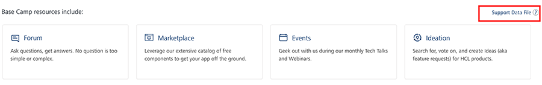

                              

User Guide: Telemetry

Telemetry
=========

Telemetry provides a mechanism to the administrators of the Volt MX Foundry portal to easily upload information about their setup while filing a support ticket. The feature aids a quick resolution of an issue.

Another objective of the feature is to gather information regarding the Volt MX Foundry portal usage. The information enables HCL to analyze the important areas of the Volt MX Foundry portal which helps in developing user-centric features.

When a Volt MX Foundry user encounters an issue with the deployment, they file a support ticket with Volt MX Support and continue to work with an assigned Support Engineer to provide information about the environment and the issues faced. The process involves a lot of back and forth around gathering information about the system to identify the root cause of the problem.

To ease the process of troubleshooting an issue, Volt MX integrates telemetry tool which gathers background information about the user’s deployment and also provides further information about the deployment state at the time the issue occurred. Now a user just needs to attach a diagnostics report, which contains all the necessary information, while filing a support ticket.

To generate a diagnostics report, follow these steps:

1.  From Volt MX Foundry Console, click **Support**.
    
    
    
2.  In the Support page, click **Support Data File**.
    
    A **diagnostics.json** file will be downloaded.
    

While filing a support ticket, attach the **diagnostics.json** file.
