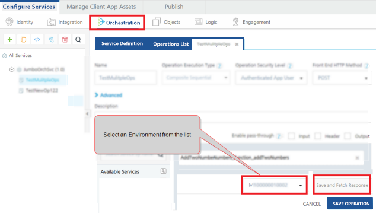
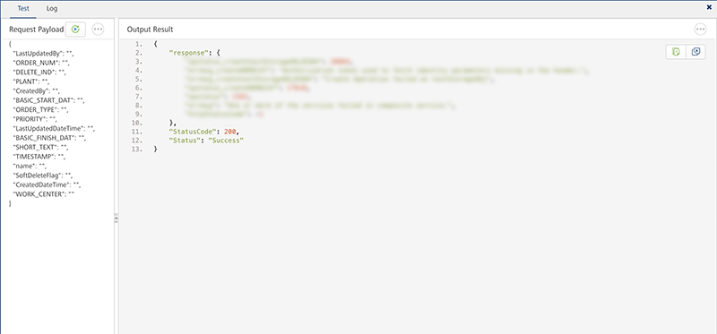
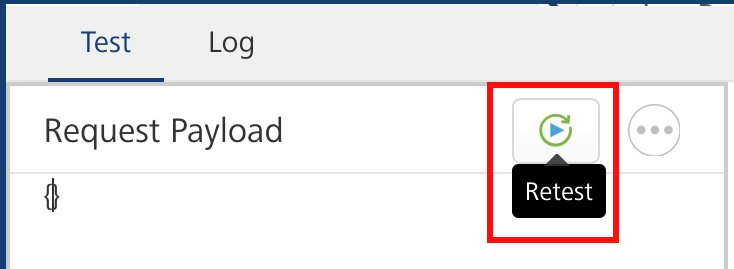
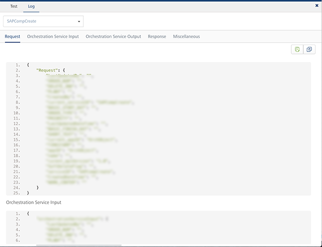
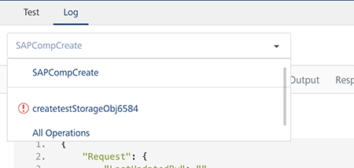

                              

User Guide: [Orchestration](Orchestration.md) > Test an Orchestration Service Operation

Test an Orchestration Service Operation
=======================================

You can test an Orchestration service operation to view the services details of various stages of the service execution for better debugging. The test results are displayed in the **Test results** window.

In the **Log** tab, you can navigate to an individual integration or object service and view the input payloads and response output for each. You can also pass input values in the Request payload under the **Test** tab to each of these services types.

To test an Orchestration service operation, do the following:

1.  From the **Select Environment** drop-down list, select an environment from the listed run-time environments configured for the Volt MX Foundry account.
    
    
    
2.  Click **SAVE AND FETCH RESPONSE**. The operation gets saved and then the **Output Result** window displays the operation test results.
    
    The **Test Results** window displays two tabs the **Test** and the **Log**.
    
    The **Test** tab displays two sections such as the **Request Payload** and the **Output Result**.
    
    
    
3.  To perform a retest by varying the request payload, click **Retest**.
    
    
    
4.  Click the **Log** tab to view details of an entire orchestration operation execution such as request, orchestration service input, orchestration service output, response, and miscellaneous of a service.
    
    
    
5.  In the **Log** tab, you can view the individual operation details of an orchestration operation. Select the required operation:
    
    *   The Orchestration operation shows the request and response parameters of the entire orchestration. This option is selected by default.
    *   **Orchestration Service Input** displays the input of Orchestration service.
    *   **Orchestration Service Output** displays the output of Orchestration service.
    *   Select an **individual operation** from the list to view the request and response parameters of that particular operation.
    *   Select all **operations** from the list to view the request and response parameters of all the operations called in the orchestration service.
    
    For example, if you have selected an integration service from the list, the following details are displayed:
    
    *   Integration Service Input
    *   Backend Request
    *   Backend Response
    *   Integration Service Output
    
    
    
    You can perform following actions in this window:
    
    *   Click **Copy** to copy the code.
    *   Click **Expand** to pop over the section as a separate pop-up.
    *   **Choose number of sections** and content to view in the pop-over.
    *   **Increase/decrease** the height of the Output Result window.
    *   **Dock** the sections to different edges by clicking on the section partitions.
