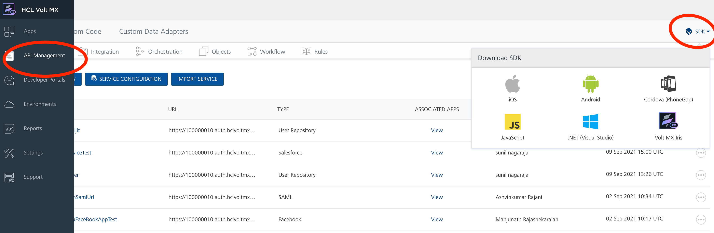

                             

User Guide: [SDKs](../Foundry_SDKs.md) > [VoltMX Iris SDK](Installing_VoltMXJS_SDK.md) > Downloading Volt MX IDE SDK

Downloading Volt MX IDE SDK Files
=================================

The Volt MX SDK is now included as part of the Volt MX development tools and the SDK version is managed using the update feature within the software.

If you need to install the Volt MX development tools, please login to <b>Foundry</b> - <a href="../Accessing_VoltMX_MBaaS_Portal.html">Cloud Portal</a> or <a href="../How_to_access_VoltMX_Foundry_Portal_on-Prem.html">On-premises Console</a>, navigate to <b>API Management</b> on the left panel, click on <b>SDK</b> on the right and choose to download the appropriate SDK files.

