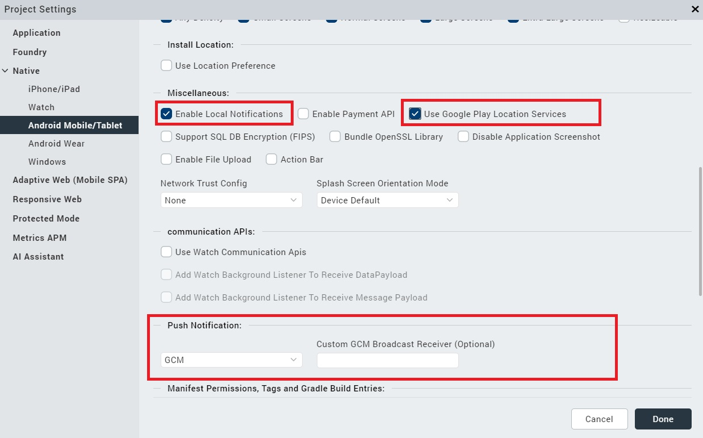
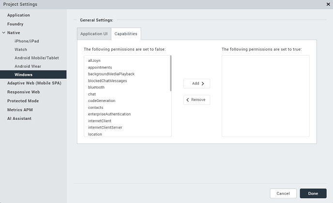

                                 

User Guide: [SDKs](../Foundry_SDKs.md) > [VoltMX Iris SDK](Installing_VoltMXJS_SDK.md) > Register

Invoking a Messaging Service
============================

A developer should register with Google Cloud Messaging (GCM) for Android services to get the deviceToken that is used to register with Volt MX Foundry Messaging. Also a developer should fetch the **deviceId** and   **userfriendlyId** to create an instance of messaging service.

The following are the methods you can use for a messaging service.

*   [Register](#register)
*   [Register With Auth Token](#register-with-auth-token)
*   [Unregister](#unregister)
*   [Unregister With Auth Token](#unregister-with-auth-token)
*   [Update GeoLocation](#update-geolocation)
*   [Update GeoLocation With Auth Token](#update-geolocation-with-auth-token)
*   [Register geoBoundaries](#register-geoboundaries)
*   [Fetch All Messages](#fetch-all-messages)
*   [Mark Message as Read](#mark-message-as-read)
*   [Fetch Message Content from Volt MX Foundry Messaging](#fetch-message-content-from-foundry-messaging)
*   [Subscribe Audience](#subscribe-audience)
*   [](#get-subscribed-audience-details)[Get Audience Details by Subscription ID](#GetAudienceDetails)
*   [Delete Subscribed Audience](#unsubscribe-audience)
*   [Update List of Beacons for a Device](#update-list-of-beacons-for-a-device)
*   [Get Rich Push Content](#get-rich-push-content)

Register
--------

**Register** API registers to the engagement server.

### Syntax

register = function(osType, deviceId, regID, UFID,successCallback, failureCallback, options)

### Parameters

  
| Name | Type | Description | Required |
| --- | --- | --- | --- |
| osType | String | Type of operating system | Yes |
| deviceID | String | Device ID of the device | Yes |
| regID | String | Registration ID of the user | Yes |
| UFID | String | User friendly ID configured in messaging service console | Yes |
| successCallback | Function | Method invoked on success | Yes |
| failureCallback | Function | Method invoked on failure | Yes |
| options | JSON | Map for optional parameters | Optional |

### **Optional Keys**

  
| Key | Type | Description | Required |
| --- | --- | --- | --- |
| authToken | String | Authorization token configured in messaging service console. | Optional |

### Example

```
// Get an instance of SDK
var client = voltmx.sdk.getCurrentInstance();
var messagingSvc = client.getMessagingService();
var deviceId = voltmx.os.deviceInfo().deviceid;
var UFID = "user_friendly_id";
var osType = "iphone"; /*"androidgcm" for android, "iphone" for iphone, "ipad" for ipad, "ipod" for ipod*/
var options = {
    "authToken": "authorization_token"
}; //To get regID, use voltmx.push.register() method 
var regID = voltmx.push.register();
messagingSvc.register(osType, deviceId, regID, UFID, function(response) {
    voltmx.print("register with auth token success: " + JSON.stringify(response));
}, function(error) {
    voltmx.print("register with auth token failed: " + JSON.stringify(error));
}, options);
```

Register with Auth Token
------------------------

The **registerWithAuthToken** API registers with an Auth Token for the messaging service.

### **Syntax**

```
registerWithAuthToken = function(osType, deviceId, regID, UFID, authToken, successCallback, failureCallback)
```

### **Parameters**

  
| Name | Type | Description   | Required |
| --- | --- | --- | --- |
| osType | String | Type of operating system | Yes |
| deviceId | String | Device ID of the device | Yes |
| regID | String | Registration ID of the user. | Yes |
| UFID | String | User friendly id or reconciliation key which is configured in engagement console. | Yes |
| authToken | String | Authorization token configured in engagement console | Yes |
| successCallback | Function | Method invoked on success | Yes |
| failureCallback | Function | Method invoked on failure | Yes |

### **Example**

```
// Sample code to register with an Auth Token
// Get an instance of SDK
var client = voltmx.sdk.getCurrentInstance();
var messagingSvc = client.getMessagingService();
messagingSvc.registerWithAuthToken("osType", "deviceId", "regID", "UFID", "authToken", function(response) {
    voltmx.print("Subscription Success: " + JSON.stringify(response));
}, function(error) {
    voltmx.print("Subscription Failure: " + JSON.stringify(error));
});
```

> **_Important:_** You must register to a messaging service at least once to use the following APIs.

Unregister
----------

**Unregister** API unregisters with the engagement server.

### Syntax

unregister = function(successCallback, failureCallback, options)

### Parameters

  
| Name | Type | Descroption | Required |
| --- | --- | --- | --- |
| successCallback | Function | Method invoked on success | Yes |
| failureCallback | Function | Method invoked on failure | Yes |
| options | JSON | Map for optional parameters | Optional |

### Optional Keys

  
| Key | Type | Description | Required |
| --- | --- | --- | --- |
| authToken | String | Authorization token configured in messaging service console. | Optional |

### Example

```
// Get an instance of SDK
var client = voltmx.sdk.getCurrentInstance();
var messagingSvc = client.getMessagingService();
var options = {
    "authToken": "xyz"
};
messagingSvc.unregister(function(response) {
    voltmx.print("Unregistration Success: " + JSON.stringify(response));
}, function(error) {
    voltmx.print("Unregistration Failure: " + JSON.stringify(error));
}, options);
```

Unregister with Auth Token
--------------------------

The **unregisterWithAuthToken** API unregisters from the messaging service with the Auth Token.

### **Syntax**

```
unregisterWithAuthToken = function(authToken, successCallback, failureCallback)
```

### **Parameters**

  
| Name | Type | Descroption | Required |
| --- | --- | --- | --- |
| successCallback | Function | Method invoked on success | Yes |
| failureCallback | Function | Method invoked on failure | Yes |
| options | JSON | Map for optional parameters | Optional |

### Optional Keys

  
| Key | Type | Description | Required |
| --- | --- | --- | --- |
| authToken | String | Authorization token configured in messaging service console. | Optional |

### **Example**

```
// Get an instance of SDK
var client = voltmx.sdk.getCurrentInstance();
var messagingSvc = client.getMessagingService();
var authToken = "Authorization token configured in messaging service console";
messagingSvc.unregisterWithAuthToken(authToken, function(response) {
    voltmx.print("Unregistration Success: " + JSON.stringify(response));
}, function(error) {
    voltmx.print("Unregistration Failure: " + JSON.stringify(error));
});
```

Register geoBoundaries
----------------------

The **registerGeoBoundaries** API registers geoboundaries to be monitored by the Engagement Service. The parameters of this API specify the radius and number of geoboundaries to monitor.

> **_Important:_** When User registers for Geofence alert, some times there may be a delay in alerts, as per Google.  
The Geofence service does not continuously query for location, so expect some latency when receiving alerts. Usually the latency is less than 2 minutes, even less when the device has been moving. If the Background Location Limits are in effect, the latency is about to 2-3 minutes on average. If the device has been stationary for a significant period of time, the latency may increase (up to 6 minutes).  
  
For more information on delay in Geo-fence alerts, refer to [https://developer.android.com/training/location/geofencing](https://developer.android.com/training/location/geofencing)

> **_Note:_** In the case of iOS, when the device location is inside a Geofence, invoking "registerGeoBoundaries" API does not execute any Client Action (Notify Engagement Server, Local Client Notification and Custom Business Logic). The API will be executed only when the user client/device enters the Geofence.  

### **Use Case**

Suppose you have a product that is being sold in several retail locations throughout the area. You have a special offer and you want to send an alert to customers when they are near one of the retail locations. The **registerGeoBoundaries** API is called during the app initialization. The API gets the geoboundaries based on the user's current location and stores them in the device OS. The OS will prompt the SDK when the user reaches a geoboundary and the application will check what action is to happen. The possible actions are:

*   A local push notification from the client application is displayed.
*   The engagement server sends a notification to display.
*   Some custom logic is executed by a callback function specified by the customLogicCallback option.

### **refreshBoundary**

Suppose that the radius parameter was specified as 5 miles when the user launched the app from his home. As the user moves away from his home, there is a point at which the set of geoboundaries that is being monitored should be refreshed. This is referred to as the refreshBoundary. In this example, when the user has moved 2.5 miles, the SDK will prompt the server for a new set of location data.

#### **Syntax**

```
registerGeoBoundaries(options, successCallback, failureCallback);  

```

#### **Parameters**

  
| Name | Type | Description |
| --- | --- | --- |
| options | jsonObject | The jsonObject has the following geoBoundary options
  
| Name | Type | Description |
| --- | --- | --- |
| radius | number | Radius of the refresh boundary, in miles. This value defines the radius that must be monitored. By default, this value is taken from the Volt MX Engagement Service. The user can override it. |
| pageSize | number | Number of geoBoundaries that can be monitored through the SDK. Default is 19. Platform limitations Android - Can monitor 99 geoBoundaries for a given instance. Windows and iOS - Can monitor 19 geoBoundaries for a given instance. |
| tags | array | Array of strings used for grouping geoBoundaries |
| customLogicCallback | function | callback function invoked when clientAction is "customLogic". |

 |
| successCallback | function | Callback method on success |
| failureCallback | function | Callback method on failure |

### Additional Settings

There are additional settings that must be enabled for this API to work correctly.

> **_Note:_** Exceptions are thrown if location is switched off on the device, or user does not allow permission to retrieve location, or the SDK is not able to retrieve the current location on the device.<br><br> For more information on SDKs for Messaging Service docs, refer to [VoltMX Iris API Developers' Guide > Notifications > Push Notifications](../../../../Iris/iris_api_dev_guide/content/push_notifications.md)

**Android**

To enable the **registerGeoBoundaries** API for the Android platform perform the following steps in Volt MX Iris.

1.  On the File menu, click **Settings** to open the Project Settings dialog box.
2.  Click the **Native** tab.
3.  Click the **Android** sub-tab.
4.  In **Push Notifications** section, select either **GCM** or **FCM** for the engagement APIs to work.
    
5.  Enable the following items:

**Enable Local Notifications**

**Use Google Play Location Services**

8.  In the **Manifest Properties** section, select Tags. Add the following to the Child tag entries < application > tag:
<service android:name="com.konylabs.api.location.KonyGeoTransitionsIntentService"/>

The page will look like the following example.



**iOS**

To enable the **registerGeoBoundaries** API for the iOS platform, add the following keys to the info.plist file.

*   "NSLocationAlwaysUsageDescription":"<ThisMessageWillBeDisplayedToUser>"
*   "UIBackgroundModes":\["location"\]

For information about how to access and edit the info.plist file, refer to [Build an App for iOS](../../../../Iris/iris_user_guide/Content/Introduction.md).

> **_Important:_**<br><br>i.    Include the `NSLocationWhenInUseUsageDescription` and `NSLocationAlwaysAndWhenInUseUsageDescription` keys in your app's `Info.plist` file.<br/>ii.    If the deployment target is iOS10 or below, the `NSLocationAlwaysUsageDescription` key is required. If those keys are not present, authorization requests fail immediately.

To obtain the geolocation callbacks, run the following code in the **preappinit** of your application.

```
var msgObj = voltmx.sdk.getCurrentInstance().getMessagingService();
var cback = msgObj.manageGeoBoundariesCallback;
voltmx.location.setGeofencesCallback(cback);
```

> **_Important:_** Before building the application, link your Foundry application to your Iris project.

**Windows**

To enable the **registerGeoBoundaries** API for the Windows platform perform the following steps in Volt MX Iris.

1.  On the **File** menu, click **Settings** to open the Project Settings dialog box.
2.  Click the **Native** tab.
3.  Click the **Windows Phone** tab.
4.  Click the **Windows 10 Mobile** tab.
5.  Click the **Capabilities** tab.
6.  Move the following permissions to "true":

> internetClient
> 
> internetClientService
> 
> location

The Capabilities page will look like the following example.



**Example**

The following example shows how to register geoboundaries.

```
// Get an instance of SDK
        var client = voltmx.sdk.getCurrentInstance();
        var messagingSvc = client.getMessagingService();
        messagingSvc.register("osType", "deviceId", "regID", "UFID", function(response) {
        voltmx.print("Register Successful");
        var options = {};
        options.radius = "radius"; //radius in miles            
        options.pageSize = "pageSize";
        options.authToken = "Authorization_Token";
        options.tags = "Array of tags"; //TODO          
        options.customLogicCallback = function(data) {
            // data is geoBoundary Data received from Volt MX Messaging Service                 
            //custom logic implementation           
        };

        function successCallback(response) {
            //Registered Successfully.           
        }

        function failureCallback(error) {
            //Registration failure.         
        }
        messagingSvc.registerGeoBoundaries(options, successCallback, failureCallback); //if ksid is already available, register is not required.           
        // If either location is switched off or the SDK is not able to retrieve current location, exceptions are thrown.      
        },
        function(error) {
        voltmx.print("Register Failure" + JSON.stringify(error));
        });
```

Update GeoLocation
------------------

**updateGeoLocation** API updates the geoLocation for the messaging service.

### Syntax

updateGeoLocation= function (latitude, longitude, locationName, successCallback, failureCallback, options)

### Parameters

  
| Name | Type | Description | Required |
| --- | --- | --- | --- |
| latitude | String | Latitude | Yes |
| longitude | String | Longitude | Yes |
| locationName | String | Location name | Yes |
| successCallback | Function | Method invoked on success | Yes |
| failureCallback | Function | Method invoked on failure | Yes |
| options | String | Map for optional parameters | Optional |

### **Optional Keys**

  
| Key | Type | Description | Required |
| --- | --- | --- | --- |
| authToken | String | Authorization token configured in messaging service console. | Optional |

**Example**

```
//Get an instance of SDK.
var client = voltmx.sdk.getCurrentInstance();
var messagingSvc = client.getMessagingService();
var latitude = "latitude_value";
var longitude = "longitude_value";
var locationName = "location_name";
var options = {
    "authToken": "authorization_token"
};
messagingSvc.updateGeoLocation(latitude, longitude, locationName, function(response) {
    voltmx.print("Geolocation update successful: " + JSON.stringify(response));
}, function(error) {
    voltmx.print("Geolocation update failure: " + JSON.stringify(error));
}, options);
```

Update GeoLocation with Auth Token
----------------------------------

The **updateGeoLocationWithAuthToken** API updates the geoLocation with the Auth Token for the messaging service.

### **Syntax**

```
updateGeoLocationWithAuthToken= function(latitude, longitude, locationName, authToken, successCallback, failureCallback)
```

### **Parameters**

  
| Name | Type | Description | Required |
| --- | --- | --- | --- |
| latitude | String | Latitude | Yes |
| longitude | String | Longitude | Yes |
| locationName | String | Location Name | Yes |
| authToken | String | Authorization token that is configured in messaging service console | Yes |
| successCallback | Function | Method invoked on success | Yes |
| failureCallback | Function | Method invoked on failure | Yes |

### **Example**

```
//Sample code to update the geoLocation with the Auth Token for the messaging service.   
//Get an instance of SDK.
var client = voltmx.sdk.getCurrentInstance();
var messagingSvc = client.getMessagingService();
var latitude = "latitude_value";
var longitude = "longitude_value";
var locationName = "location_name";
var authToken = "authorization_token";
messagingSvc.updateGeoLocationWithAuthToken(latitude, longitude, locationName, authToken, function(response) {
    voltmx.print("Geolocation update successful : " + JSON.stringify(response));
}, function(error) {
    voltmx.print("Geolocation update failure: " + JSON.stringify(error));
});
```

Fetch All Messages
------------------

The **fetchAllMessages** API fetches all messages with/without the Auth Token.

### **Syntax**

```
 fetchAllMessages = function(startIndex, pageSize, successCallback, failureCallback, options)
```

### **Parameters**

  
| Name | Type | Descroption | Required |
| --- | --- | --- | --- |
| startIndex | Number | Starting index of a page | Yes |
| pageSize | Number | Page size | Yes |
| successCallback | Function | Method invoked on success | Yes |
| failureCallback | Function | Method invoked on failure | Yes |
| options | JSON | Map for optional parameters | Optional |

### Optional Keys

  
| Key | Type | Description | Required |
| --- | --- | --- | --- |
| authToken | String | Authorization token configured in messaging service console. | Optional |

### Example

```
//Get an instance of SDK.
var client = voltmx.sdk.getCurrentInstance();
var messagingSvc = client.getMessagingService();
var startIndex = 0;
var pageSize = 1000;
messagingSvc.fetchAllMessages(startIndex, pageSize, function(response) {
    voltmx.print("Fetched all messages: " + JSON.stringify(response));
}, function(error) {
    voltmx.print("Failed to fetch messages: " + JSON.stringify(error));
}, {
    "authToken": "authorization_token"
});
```

Mark Message as Read
--------------------

The **markMessageRead** API marks a message as read with/without the Auth Token.

### **Syntax**

```
markMessageRead = function(fetchId, successCallback, failureCallback, options)
```

### **Parameters**

  
| Name | Type | Descroption | Required |
| --- | --- | --- | --- |
| fetchID | String | A unique ID assigned to a message | Yes |
| successCallback | Function | Method invoked on success | Yes |
| failureCallback | Function | Method invoked on failure | Yes |
| options | JSON | Map for optional parameters | Optional |

### Optional Keys

  
| Key | Type | Description | Required |
| --- | --- | --- | --- |
| authToken | String | Authorization token configured in messaging service console. | Optional |

### Example

```
//Get an instance of SDK.
var client = voltmx.sdk.getCurrentInstance();
var messagingSvc = client.getMessagingService();
var fetchID = "message ID to mark as read";
messagingSvc.markMessageRead(fetchID, function(response) {
    voltmx.print("Message marked as read successfully: " + JSON.stringify(response));
}, function(error) {
    voltmx.print("Failed to mark message as read: " + JSON.stringify(error));
}, {
    "authToken": "authorization_token"
});
```

Fetch Message Content from Volt MX Foundry Messaging
---------------------------------------------------

The **fetchMessageContent** API fetches a message with/without the Auth Token.

### **Syntax**

```
 fetchMessageContent = function(fetchId, successCallback, failureCallback, options)
```

### **Parameters**

  
| Name | Type | Descroption | Required |
| --- | --- | --- | --- |
| fetchID | String | A unique ID assigned to a message | Yes |
| successCallback | Function | Method invoked on success | Yes |
| failureCallback | Function | Method invoked on failure | Yes |
| options | JSON | Map for optional parameters | Optional |

### Optional Keys

  
| Key | Type | Description | Required |
| --- | --- | --- | --- |
| authToken | String | Authorization token configured in messaging service console. | Optional |

### Example

```
//Get an instance of SDK.
var client = voltmx.sdk.getCurrentInstance();
var messagingSvc = client.getMessagingService();
var fetchID = "message ID to be fetched";
messagingSvc.fetchMessageContent(fetchID, function(response) {
    voltmx.print("Message content is:" + JSON.stringify(response));
}, function(error) {
    voltmx.print("Failed to fetch message content: " + JSON.stringify(error));
}, {
    "authToken": "authorization_token"
});
```

Subscribe Audience
------------------

The **Subscribe Audience (Create or Update)** API creates a new audience. This API also updates the parameter details of an audience member.

### **Syntax**

```
subscribeAudience  =  function (firstName, lastName, emailId, mobileNumber, country, state, successCallback, failureCallback, options)
```

### **Parameters**

  
| Input Parameter | Type | Description | Required |
| --- | --- | --- | --- |
| firstName | String | First name of the user | Yes |
| lastName | String | Last name of the user | Yes |
| mobileNumber | Number | Mobile number of the user. If **mobileNumber** is specified as the [reconciliationKey](../../../../engagement_api_guide/Content/REST_API_Administration/Modify_Details_General_.md), then it is a required value and must be specified for all users. An empty value will cause an error. | Yes |
| email | String | Email ID of the user | Yes |
| state | String | If the selected country is USA, the state option is mandatory | Yes |
| country | String | Country to which the user belongs | Yes |
| options | JSON | Map for optional parameters and any dynamic properties | Optional |

### **Options keys**

  
| Key | Type | Description | Required |
| --- | --- | --- | --- |
| active | Boolean | Defines whether the subscription is active or inactive | Optional |
| emailSubscription | Boolean | Defines whether a user is subscribed to send and receive emails or not | Optional |
| smsSubscription | Boolean | Defines whether a user is subscribed to send and receive SMS or not | Optional |

### Example

```
//Get an instance of SDK.
var client = voltmx.sdk.getCurrentInstance();
var messagingSvc = client.getMessagingService();
var options = {};
options["smsSubscription"] = true;
options["emailSubscription"] = true;
options["active"] = true;
messagingSvc.subscribeAudience("FirstName", "LastName", "EmailID", "MobileNumber", "Country", "State", function(response) {
    voltmx.print("Subscribe audience Success: " + JSON.stringify(response));
}, function(error) {
    voltmx.print("Subscribe audience Failed: " + JSON.stringify(error));
}, options);
```

> **_Note:_** You can add dynamic properties to the API using options.

### Response Status

  
| Code | Description |
| --- | --- |
| Status 200 | Details added successfully |
| Status 400 | One of the following error messages will be displayed: Invalid KSID First Name is required Last Name is required Mobile number is required Audience already exists with the given mobile number Email ID is required Country is required |
| Status 500 | Server failed to process request |

Get subscribed Audience details
-------------------------------

The **Get Subscribed Audience Details** API returns the details of the Audience.

### **Syntax**

```
getSubscribedAudienceDetails  = function(successCallback, failureCallback)
```

### **Parameters**

  
| Output Parameter | Type | Description |
| --- | --- | --- |
| id | String | Unique ID assigned to the audience member |
| firstName | String | First name of the audience member |
| lastName | String | Last name of the audience member |
| mobileNumber | String | Mobile number of the audience member |
| email | String | Email ID of the audience member |
| active | Boolean | Defines if the audience member is active or inactive |
| state | String | If the audience member is not a USA national, the response displays a blank string |
| country | String | Country to which the user belongs to |
| createdDateStr | String | The date and time when the user was initially created |
| smsSubscription | Boolean | Defines if the SMS subscription is true or false |
| emailSubscription | Boolean | Defines if the email subscription is true or false |
| lastModifiedDateStr | String | The date on which a user was last modified |
| lastActiveDateStr | String | The date when the user is last active |

> **_Note:_** Apart from the above parameters, the user-defined parameters are also fetched.

### Example

```
//Get an instance of SDK.
var client = voltmx.sdk.getCurrentInstance();
var messagingSvc = client.getMessagingService();
messagingSvc.getSubscribedAudienceDetails(function(response) {
    voltmx.print("Get subscribed audience details Success: " + JSON.stringify(response));
}, function(error) {
    voltmx.print("Failed to get subscribed  audience details: " + JSON.stringify(error));
});
```

### Response Status

  
| Code | Description |
| --- | --- |
| Status 200 | Array of Audience details |
| Status 400 | No audience member found mapping to the given KSID |
| Status 500 | Failed to process the request |

Unsubscribe Audience
--------------------

The **Unsubscribe Audience or Delete Audience** API deletes an Audience from Engagement server.

### **Syntax**

```
unSubscribeAudience = function(successCallback, failureCallback)
```

### Example

```
//Get an instance of SDK.
var client = voltmx.sdk.getCurrentInstance();
var messagingSvc = client.getMessagingService();
messagingSvc.unSubscribeAudience(function(response) {
    voltmx.print("UnSubscribe audience Success: " + JSON.stringify(response));
}, function(error) {
    voltmx.print("UnSubscribe audience Failed: " + JSON.stringify(error));
});
```

### Response Status

  
| Code | Description |
| --- | --- |
| Status 200 | Audience member deleted successfully |
| Status 400 | No Audience Member found mapping to the given KSID |
| Status 500 | Server failed to process request |

Update List of Beacons for a Device
-----------------------------------

The **Update List of Beacons for a Device** API updates the list of beacons for a device.

### **Syntax**

```
updateListOfBeacons = function(uuId, major, minor, successCallback, failureCallback, options)
```

### **Parameters**

  
| Input Parameter | Level- Two | Type | Description | Required |
| --- | --- | --- | --- | --- |
| beacon |   | JSON | An array of beacon objects > **_Note:_** You can only create one beacon at a time. | Yes |
|   | uuid | string | Universally Unique Identifier Number (UUID) assigned to the Beacon. UUID contains 32 hexadecimal digits, split into 5 groups, and separated by dashes, for example, f7826da6-4fa2-4e98-8024-bc5b71e0893eBy default, beacon format consists of three values: UUID, Major, Minor. Beacons broadcast their IDs, which can be recognized by mobile apps to trigger specific actions. | Yes |
|   | major | string | Major ID is a major identifier of a Bluetooth beacon. | Yes |
|   | minor | string | Minor ID is a minor identifier of a Bluetooth beacon. | Yes |
| options |   | JSON | Map for optional parameters | Optional |

### **Options keys**

  
| Key | Type | Description | Required |
| --- | --- | --- | --- |
| ufid | string | The User Friendly Identifier or UFID is used when you subscribe to Volt MX Foundry Engagement Services. Based on your requirement, you can provide an UFID. It is alphanumeric, for example xxx@voltmx.com or 2890XZCY. It can be used to map devices to the user using the value as a reconciliation key | optional |
| appid | alphanumeric | Unique ID assigned to an app | optional |

### Example

```
// Sample code to update list of Beacons
//Get an instance of SDK.
var client = voltmx.sdk.getCurrentInstance();
var messagingSvc = client.getMessagingService();
var options = {};
options["ufid"] = "<user_friendly_identifier>"; //configured in MF server  
options["appid"] = "<Unique ID assigned to an app>"
messagingSvc.updateListOfBeacons("uuid", "major", "minor", function(response) {
    voltmx.print("Updated beacons list successfully: " + JSON.stringify(response));
}, function(error) {
    voltmx.print("Updated beacons list failed: " + JSON.stringify(error));
}, options);
```

### Response Status

  
| Code | Description |
| --- | --- |
| Status 200 | Beacons updated successfully |
| Status 400 | Invalid request format |
| Status 500 | Server failed to process request |

Get Rich Push Content
---------------------

The **Get Rich Content** API fetches rich content from the Volt MX Foundry Engagement server.

The Get Rich Content API requires the **pushId** to retrieve the data. The pushId is fetched from the response of the push notification.

### **Syntax**

```
getRichPushContent = function(pushId, successCallback, failureCallback){
```

### **Parameters**

  
| Input Parameter | Type | Description | Required |
| --- | --- | --- | --- |
| pushID | number | Unique ID that identifies the push message. | Yes |

### Example

```
//sample code for Get Rich Push Content.
//Get an instance of SDK.
var client = voltmx.sdk.getCurrentInstance();
var messagingSvc = client.getMessagingService();
var pushId = "pushid";
messagingSvc.getRichPushContent(pushId, function(response) {
    voltmx.print("get rich push content success: " + JSON.stringify(response));
    var.htmlString = response.rawResponse;
    var dataConfig = {
        "mimeType": "text.html"
    };
    Form1.browser.loadData.htmlString, dataConfig);
}, function(error) {
    voltmx.print("get rich push content failed: " + JSON.stringify(error));
});
```

### Response Status

  
| Code | Description |
| --- | --- |
| Status 200 | Rich content |
| Status 400 | One of the following error messages will be displayed: Invalid push ID / provided Rich message is not associated with this push |
| Status 500 | Server failed to process request |
