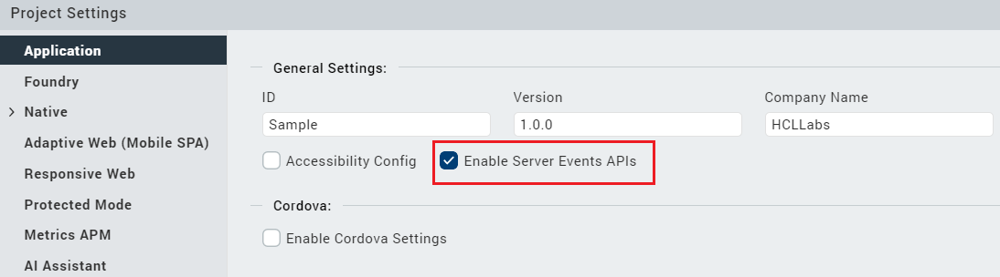

                                

User Guide: [SDKs](../Foundry_SDKs.md) > [VoltMX Iris SDK](Installing_VoltMXJS_SDK.md) > Server Event APIs

Server Event APIs
=================

Server Events is a capability of the Volt MX Foundry run-time server that lets the back-end services generate and subscribe to events. Server Events help you to generate events asynchronously such as processing a submitted order and invoking a time-taking activity where the client app does not need to wait for the response.

> **Note:**  
*   The Server Events APIs are supported in Android, iOS, and SPA/DW platforms.  
*   Only one connection per application and one callback for event notification is allowed.  
*   Server Events are only supported for on-premise instances of Foundry.  

Prerequisites
-------------

Enable the Server Event APIs on Iris. To enable the APIs, follow these steps:

1.  From the left navigation bar of Iris, select **Project Settings**.
2.  On the **Project Settings** window, in the **Application** section, select **Enable Server Events APIs**.



subscribeServerEvents API
-------------------------

The **subscribeServerEvents** API opens a connection and sends a subscription message for the topics you have provided. After subscribing, the application starts receiving the ServerEvents messages for the subscribed topics.

> **_Important:_**  
Make sure that you subscribe to the topics by using this API when an app is launched because there is no support to reconnect to a topic if a connection fails or if the app crashes. For more information, refer to [Limitations](#limitations).

### Syntax

```
VMXFoundry.subscribeServerEvents(topicsToSubscribe, subscribeOptions);
```

### Parameters

  
| Parameter | Type | Description |
| --- | --- | --- |
| topicsToSubscribe | String | Specifies the events to be subscribed. |
| subscribeOptions | JSON | It determines the success and failure of the subscription. This parameter must contain the following functions: **onEventCallback**: If there is a reply from the server, the onEventCallback function is invoked. **onFailureCallback**: If the subscription fails, the onFailureCallback function is invoked. |

### Sample Code

```
var eventsToSubscribe = ["service1/operation1", "service1/operation2", "service2/operation1"];

subscribeOptions = {

    "onEventCallback": function(message) {

        //Handle the server event notification

    },

    "onFailureCallback": function(error) {

        //Handle the subscription failure, majorly due to websocket failure.

    }

};

VMXFoundry.subscribeServerEvents(eventsToSubscribe, subscribeOptions);
```

unsubscribeServerEvents API
---------------------------

The **unsubscribeServerEvents** API is used to unsubscribe the ServerEvents' messages for the topics you have provided.

> **_Note:_**  If you unsubscribe from all the topics, make sure that you close the existing connection by using the [closeConnection](#closeConnection) option.

### Syntax

```
VMXFoundry.unsubscribeServerEvents(topicsToUnsubscribe, unsubscribeOptions);
```

### Parameters

  
| Parameter | Type | Description |
| --- | --- | --- |
| topicsToUnsubscribe | String | Specifies the events to be unsubscribed. |
| UnsubscribeOptions | JSON | This parameter must contain the following functions: **closeConnection**: If you want to close the existing connection, closeConnection must be set to **true**. **onCloseCallback**: This function is invoked when the closeConnection function is set to true and the websocket is closed successfully. |

### Sample Code

```
var eventsToUnsubscribe = ["service1/operation1", "service1/operation2", "service2/operation1"];

unsubscribeOptions = {

    "closeConnection": true, //pass this value as true if you want to close the existing connection.

    "onCloseCallback": function(error) {

        //callback will be invoked if closeConnection is set to true and websocket connection is closed successfully.

    }

};

VMXFoundry.unSubscribeServerEvents(eventsToUnsubscribe, unsubscribeOptions);
```

publishServerEvents API
-----------------------

The publishServerEvents API publishes events to server from the client SDK API.

### Syntax

```
VMXFoundry.publishServerEvents(eventsToPublish);
```

### Parameters

  
| Parameter | Type | Description |
| --- | --- | --- |
| eventsToPublish | String | Specifies the events to be published. |

### Sample Code

```
var eventsToPublish = [{
    "topic": "transaction/deposit",

    "data": {
        "amount": "1500",
        "user": "clientevents",
        "account": "1000",
        "transaction": "deposit"
    }

}];  
  
VMXFoundry.publishServerEvents(eventsToPublish);
```

Frequently Asked Questions
--------------------------

*   Can I subscribe to a topic more than once?
    
    Yes, you can subscribe to events for a topic multiple times. The events will be notified each time an application has subscribed to that topic.
    
*   Can I unsubscribe to a partial list of topics?
    
    Yes, you can unsubscribe to a partial list of topics.
    
*   Can I use different callbacks for every subscription?
    
    Currently, the API maintains only one callback and the events for all topics will be notified through the same callback. When a different callback is passed with another subscription, all the events will start invoking the latest callback provided in the subscription.
    

Limitations
-----------

*   There is no support to reconnect to a topic if a connection fails or if the client app crashes. Therefore, the app will not receive notifications when an event is invoked.  
    
    If the connection fails or if the app crashes, you need to use the [subscribeServerEvents API](#subscribeserverevents-api) to subscribe to the topics. Make sure that you call the API when the app is launched.
