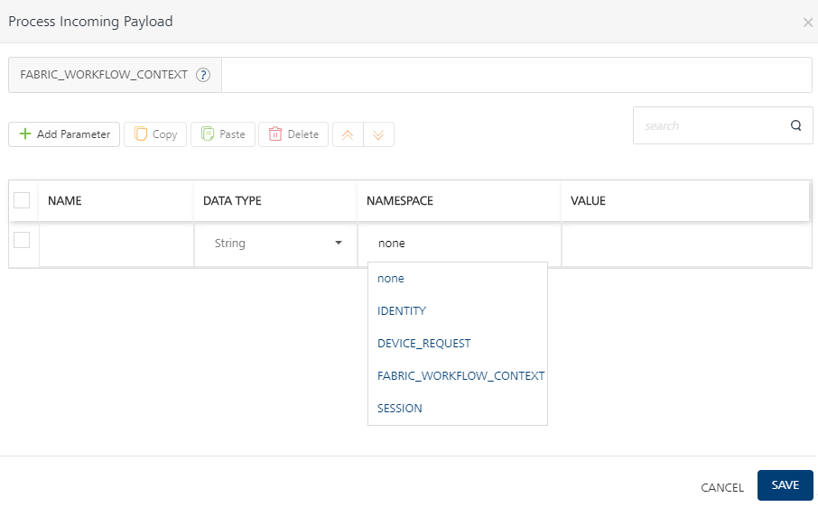
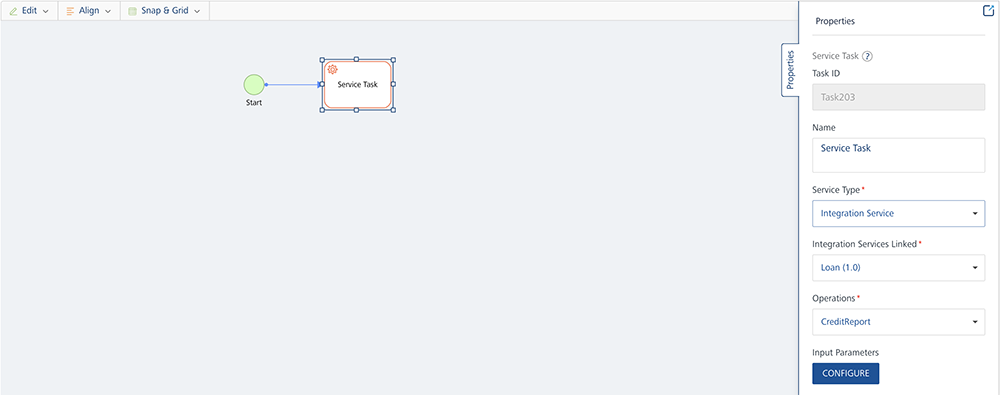

User Guide: Overview

# Workflow

## Overview

A workflow is a visual representation of a business process. It provides you the ability to build processes visually with low code drag and drop functionality. A workflow consists of execution blocks which can be configured as required to accomplish your business use-case. Execution blocks offer a wide range of functionality such as the ability to design complex business logic, service invocation, triggering emails etc.

## Supported Workflow Types

In V9 Volt MX release, when a new Workflow service was introduced in Volt MX Foundry, these workflow services were designed to be triggered/ instantiated from an object service invocation. From V9 SP2, a new type of trigger for Workflow service called Event triggered workflow has been introduced. This is independent of an object invocation and this type of workflow can be started via events on the Foundry bus. In other words, similar to other Foundry services, now workflow service can also be made as an Event listener and therefore be invoked by firing events. Let’s take a detailed look at each workflow type.

- **Object model triggered workflow**. This type of workflow has a tight coupling to an object model and is triggered through state transitions on the linked object’s `workflowstate` field.

  You can link a Workflow service with an object either while creating a workflow or through object service. It is linked to a “state” field in the object, and whenever the state field is changed with a create or update on the object (either by using PUT or POST call, or any [custom verb](ObjectsServices/Objectservices_Stage3.md#mapping-verbs-for-objects-for-service-driven-objects) based on PUT/POST), the workflow is triggered. The workflow will execute all the subsequent tasks that were defined within it and completes the entire backend process that is related to the linked object. To get a quick overview of workflow, refer to [Workflow - An Overview](https://support.hcltechsw.com/csm?id=kb_article&sysparm_article=KB0083344).

- **Event triggered workflow**: This type of workflow as the name suggests can be made to trigger by listening to Events on Foundry. You can configure Workflow service to listen to an existing Server-event Topic of integration/object service verb invocations or via custom code. An event triggered workflow is initialized through the Signal Start node, which is listening to a [Server Event](../../../Foundry/voltmx_foundry_user_guide/Content/ServerEvents.md) that is raised on the Foundry event bus.

  **When to use event triggered workflows:**

  - If workflows need to start or resume based on listening to Events on Foundry.
  - If workflows need not be triggered through object model state transitions. If workflows are not state-managed workflows, that is, if your workflow does not depend on object model state transitions. State-managed workflows can be configured by using object-linked workflows.
  - If workflows need to execute in the background when some other Foundry service is invoked. You can configure Foundry services to raise events for particular topics, which can then be subscribed by event workflows
  - In addition to how Workflow services can be made as listeners, Event-triggered workflows can also raise Events back to Foundry anywhere during the workflow execution by the introduction of Throw Signal node. This way other Foundry services can get notified of any intermittent events raised from a Workflow.

  **How event triggered workflows are different from object triggered workflows:**

  - Event workflows are not associated to any object.
  - Event workflows are not state-managed workflows. Therefore, they do not need to link to any object to maintain their state.
  - Event workflows do not contain Start task. They have Signal start that listens to an event topic and starts the workflow.
  - Event workflows do not contain user tasks like in object-linked workflows that are coupled to state field transition. However Event triggered workflows can be paused by using a Catch signal event and can be resumed based on subscribing to an event topic.
  - Event workflows can be invoked from other Foundry services by using server events from directly on server-side. Whereas Object linked workflows can be invoked through object verb invocations from an external client.

## Working with Workflows

There are different kind of nodes in Workflow and each node represents a specific task or an event. These nodes are connected with each other using **Sequence Flows**. When you add these nodes to a workflow and connect them as per the required logic, the complete workflow is implemented automatically whenever it is invoked.

Different types of Workflow Nodes/Tasks are as follows:

| Nodes/Tasks                                                                                                                                                                                                                                                                                                                                                                                                                              | Supported Workflow Types              |                                       |
| ---------------------------------------------------------------------------------------------------------------------------------------------------------------------------------------------------------------------------------------------------------------------------------------------------------------------------------------------------------------------------------------------------------------------------------------- | ------------------------------------- | ------------------------------------- |
|                                                                                                                                                                                                                                                                                                                                                                                                                                          | Object                                | Event                                 |
| **[Start](#start-event)** – It is an event that represents where the workflow starts. The Start event has one outgoing flow.                                                                                                                                                                                                                                                                                                             |  |  |
| [**User Task**](#user-task) – It is used to represent that a user action is required in a Workflow. For example: Submitting a loan application, manager approving expense.                                                                                                                                                                                                                                                               |  |  |
| **[Signal Start](#signal-start) -** Start Signal node is used to start a workflow based on listening to an Event on Foundry bus.                                                                                                                                                                                                                                                                                                         |  |  |
| **[Catch Signal](#catch-signal-event) -** Catch Signal node is used to pause a workflow's execution and resume it based on an event it is listening to on Foundry bus.                                                                                                                                                                                                                                                                   |  |  |
| **[Throw Signal](#throw-signal-event) -** Throw Signal node is used to raise (publish) Events from workflow during or at the end of workflow execution                                                                                                                                                                                                                                                                                   |  |  |
| **[Service Task](#service-task)** – A Service task is used to invoke a pre-configured service (Integration, Orchestration, Object and Rules Services) available in the Foundry App.                                                                                                                                                                                                                                                      |  |  |
| **[Timer](#timer)** - A Timer is used to create a delay in the workflow to prevent the immediate triggering of a subsequent event/activity. In a workflow whenever a timer node is encountered, then the workflow execution will be paused for the configured amount of minutes/hours and resume from it when the delay time elapses.                                                                                                    |  |  |
| **[Message Task](#message-task)** – It represents an intermediate event through which you can send notifications to the required recipients. The recipient can be an end user or the manager of the concerned department. For example, if the loan approval is pending from the branch manager, then you can use the Message task to send the notification to the manager.                                                               |  |  |
| **[Script Task](#script-task)** - You can use this task to execute a business logic in the workflow. You can select a pre-configured JavaScript service to execute the business logic from this type of task.                                                                                                                                                                                                                            |  |  |
| **[Business Rule Task](#business-rule-task)** - You can use this task to execute a set of rules in the workflow. You can select a pre-configured Rules services available in the Foundry App.                                                                                                                                                                                                                                            |  |  |
| **[Exclusive Gateway](#exclusive-gateways)** – Exclusive Gateways are used to model decision in a process by making exclusive (XOR) disjunction. An exclusive gateway can have multiple outgoing sequence flows and each outgoing sequence flow has its own decision condition. It evaluates the decision condition of each outgoing sequence flow and the **first** matched condition **[sequence flow](#sequence-flows)** is executed. |  |  |
| **[End](#end-event)** – It is an event that represents the end of a workflow.                                                                                                                                                                                                                                                                                                                                                            |  |  |

To go to the **Workflow** tab from the Volt MX Foundry Console dashboard, click **Add New** or select any existing Volt MX Foundry app, and click the **Workflow** tab. The Workflow tab landing page appears.

You can do the following from the Workflow landing page:

- [Create a new workflow](#create-a-new-workflow).
- [Link an existing workflow](#use-existing-workflow-service) in the account to the current Volt MX Foundry app.
- [Manage existing workflows](#manage-workflows).

## Create a New Workflow

<details open markdown="block"><summary id="event-triggered-workflow">Event Triggered workflow :</summary>

1.  Click **Configure New** from the Workflow landing page, the Configure new screen appears.
2.  In the **Name** field, type a unique name for the new Workflow service.
3.  Select the **Event** from the **Trigger** list if you want to design an Event Triggered workflow type as shown.

    {: .hover-scale-img}

    > **_Note:_** A workflow should begin with a Signal Start event and finish with an End event for Event Triggered workflow.

</details>
<details open markdown="block"><summary id= "object-triggered-workflow">Object Triggered workflow :</summary>

Click **Configure New** from the Workflow landing page, the Configure new screen appears.

{: .hover-scale-img}

You can do the following in the **Configure New** screen:

- In the **Name** field, type a unique name for the new Workflow service.
- Select the **Object** from the **Trigger** list if you want to design an Object linked workflow.
- From the **Linked Object** list, select the required object to which you want to link the new Workflow service. The list contains two options:

  - **Use Default** - It creates a new object service with a default name as per the new Workflow service name and this workflow is linked to that Object. The new object service created will be a storage object service.
  - **Use Existing** – You can select this option if you want to link the new workflow with any existing object available in the current Foundry app. The linked object service can be a storage object service, RBMS service or an SDO (Integration or Orchestration service) service. If you want to use SDO as linked object, the **GetByPK** verb is mandatory.

    > **_Note:_** If you want to use SDO as linked object, the **GetByPK** verb is mandatory.

    Click **Use Existing**, and from the **Existing Services** screen select the required Object service, Object, Field, and then click **Add**. The new Workflow is linked to an existing Object service.

    > **_Note:_** Make sure that you designate a Field or create a new Field in the required object to store the workflow state if you want to use an existing workflow. For more information, refer to [Object Services](ObjectsServices/Stage_2.md#objectsdatatype).

- From the **Nodes** pane, double click on required nodes and drag and drop them on the canvas area. To know more about the activities that you need to perform for each node type, refer to [Nodes](#nodes-tasks).

  > **_Note:_** A workflow should begin with a **Start** event and finish with an **End** event for Object linked workflow.

- Link the nodes as per the required flow using **Sequence Flows**. To know more about the activities, you can perform on a Sequence Flow, refer to [Sequence Flows](#sequence-flows).
- The other features available in the canvas area are as follows:

  - **Edit**: Click **Edit** to perform Undo, Redo, Cut, Copy, Paste, Delete, and Select All actions on the nodes that are in the canvas area.
  - **Align**: Click **Align** to arrange the nodes as required. The options in **Align** are Align Left, Align Right, Align Top, Align Bottom, Align Center X, and Align Center Y.
  - **Snap and Grid**: Use the feature to change the canvas layout. Choose **Grid** to get a grid view on the canvas area. If you select **Snapping** and try to place a node on the canvas area, the node would align itself with the closest grid line. This will help you align your nodes properly against each other while creating a workflow.

    > **_Note:_** Grid Lines exist on the canvas area and are visible only when you choose **Grid** from the **Snap and Grid** list.

- Click **Save**. A new Workflow service is created and is added to the Workflow’s landing page.
</details>

## Nodes/Tasks

After the nodes/tasks are placed in the canvas area, you can manage the properties of a node from the Properties pane. These properties vary for each type of node. Defining these properties is crucial in a workflow as the behavior of each node depends on these properties when a workflow is triggered

<details close markdown="block"><summary>Tasks for Object triggered workflow</summary>

#### Start Event

The Start Event’s property pane contains the following fields:

{: .hover-scale-img}

- **Task ID**: A task ID is automatically allotted to the Start and End Event when you drag and drop them in the canvas area. You cannot edit this field.
- **Name**: Displays the name of the node. Modify it as per the activity the node performs.
- **Description**: You can write description for this node.

#### User Task

The User Task’s property pane contains the following fields:

{: .hover-scale-img}

- **Task ID**: A task ID is automatically allotted to the User Task when you drag and drop it in the canvas area. You cannot edit this field.
- **Name**: Displays the name of the node. You can modify it as per the activity the node performs.
- **Allowed States**: It represents the state(s) of the Workflow before the user begins any user task. This represents the state of the process and this information is retrieved from back end. For example: Loan application has to be in Submitted state for the bank manager to review the application.

  - To elaborate further, Allowed States are the states in which a model must be in as a precondition to being accepted into this workflow User task. To keep the workflow consistent, all user tasks take this value from the valid state transitions of the last preceding user task —e.g. If task A precedes task B, and you set the valid state transitions for A to Submitted, then the allowed states for B will automatically be set to Submitted.

    > **_Note:_** The **Allowed State** in the first user task can be blank as the Allowed State is not applicable for the first user task.

- **Valid State Transitions**: Mention the required status that represents the state(s) of the Workflow after the user has executed the user task. In other words, Valid State Transitions represent the states in which a model must be in as a result of this workflow task.

  - This must match with the status in the respective PUT or POST call of the object verb. If the state mentioned in **Valid State Transitions** does not match with state available in the respective POST or PUT call, the workflow will not proceed ahead. For Example: After the bank manager has reviewed the loan application it must be either Approved or Rejected. It cannot move to the Draft state.

  > **_Note:_** The state mentioned in **Valid State Transitions** must exactly same as the workflow state received from the client app.

- **Entry Validation Criteria**: If you want to provide any additional conditions which you want to evaluate before the task is executed, you can provide it here. For example, if you want an additional validation where you want to execute the task if minimum balance in the account is 10,000, then you can configure a logical expression like BACKEND_RESPONSE.balance >=10,000.  
  You can do the following to create an expression:

  - Click **Add**. The **Entry Validation Criteria** screen appears.  
    {: .hover-scale-img}
  - Click **Add Condition** to configure a logical expressions. You can also click **Add Group** and configure a group that can have multiple logical expressions within it.
  - Each condition or group is associated with a logical operator (**AND**, **OR**). Select the required operator to determine the logic to execute the condition or group. If you select the Not checkbox, the selected condition would be inverted.
  - Select the [namespace](#namespace) from the list, and add the related parameter in the **Value** field. For example, if you select BACKEND_RESPONSE from the namespace list, and add balance in the **Value** field, it would be read as BACKEND_RESPONSE.balance.
  - Select a comparison. The available options are ==, == null, >, <, !=, != null, >=, < =. For example, >=
  - Select the [namespace](#namespace) from the list, and add the related parameter in the **Value** field. For example, you can select **none** from the namespace list, and add 10,000 in the **Value** field.

  > **_Note:_** Now as per the example, the complete condition will be read as BACKEND_RESPONSE.balance >=10,000.

  - Click **Save**.

- Click **Configure** under **Process Incoming Payload**. You can use the **Process Incoming Payload** mapping editor to copy data from incoming request payload as well as identity/session scope variables into FOUNDRY_WORKFLOW_CONTEXT for further processing in the workflow.

  > **_Note:_** When a workflow needs any kind of attributes from an `IDENTITY` or `SESSION` scope, always try to populate the necessary data from all these scopes to **FOUNDRY_WORKFLOW_CONTEXT** and use these values from **FOUNDRY_WORKFLOW_CONTEXT**.

  {: .hover-scale-img}

  > **_Note:_** For more information on using the best practices for workflow, refer to [Workflow Best Practices](Workflow_BestPractices.md).

  > **_Note:_** Refer to [Advanced Configurations](#advanced-configurations-workflow).

- **Description**: You can write the description for this node.
</details>

<details close markdown="block"><summary>Tasks for Event triggered workflow</summary>

#### Signal Start

Signal Start node is used to start a workflow based on listening to an Event on Foundry bus. An Event triggered workflow always begins with a Signal Start node. The Signal Event's property pane contains the following fields:

{: .hover-scale-img}

- **Task ID**: A task ID is automatically allotted to the Signal Start Event in the canvas area. You cannot edit this field.
- **Name**: Displays the name of the node. Modify it as per the activity the node performs.
- **Event Topic Name\***: Type the topic name of the event of Foundry. An event topic name is mapped to the Signal Start event.

  > **_Important:_** An event Topic name is mandatory for the Signal Start event.

- **Process Incoming Payload**: You can use this mapping editor to copy data from incoming Event payload into Foundry_workflow_context.

  {: .hover-scale-img}

  - You can copy identity/session scope variables to workflow_context in this mapping editor.
  - Payload of the incoming event is copied and available in DEVICE_REQUEST scope. You can also set params from the Event Payload as Correlation ID.

    > **_Note:_** A Correlation ID can only be set on DEVICE_REQUEST parameters.

    - Correlation ID is required to uniquely identify a workflow instance to start or resume. You can map Correlation ID to any parameter from the Event payload that is available in the DEVICE_REQUEST namespace.

- **Description**: You can write description for this node.

#### Catch Signal Event

Catch Signal node is used to pause a workflow's execution and resume it based on an event it is listening to on Foundry bus.

- **Task ID**: A task ID is automatically allotted to the Catch Signal Event when you drag and drop them in the canvas area. You cannot edit this field.
- **Name**: Displays the name of the node. Modify it as per the activity the node performs.
- **Event Topic Name\***: Type the topic name of Foundry event. The Catch Signal event listens to the event topic and resumes the workflow.

  > **_Important:_** An event Topic name is mandatory for the Catch Signal event.

- **Process Incoming Payload**: You can use this mapping editor to copy data from incoming Event payload into Foundry_workflow_context.

  > **_Note:_** The Correlation ID parameters already configured in Signal Start event will be used in Catch Signal event to identify and resume the workflow instance, please ensure that Event payload contains Correlation ID parameters with same fieldnames as mapped from DEVICE_REQUEST scope in Signal Start. For example: `applicationId` and `SSN`.

- **Description**: You can write description for this node.

#### Throw Signal Event

Throw Signal node is used to raise (publish) Events from workflow during or at the end of workflow execution

- **Task ID**: A task ID is automatically allotted to the Throw Signal Event when you drag and drop them in the canvas area. You cannot edit this field.
- **Name**: Displays the name of the node. Modify it as per the activity the node performs.
- **Event Topic Name\***: Type the topic name of Foundry event. An event is raised with the configured topic name and with an Event payload as configured in the mapping editor.
- **Configure Event Payload**: You can use this mapping editor to populate data from workflow namespaces to send in outgoing Event payload.
- **Description**: You can write description for this node.
</details>

<details close markdown="block"><summary>Common Tasks for Workflow Services</summary>

#### Service Task

The Service Task’s property pane contains the following fields:

{: .hover-scale-img}

- **Task ID**: A task ID is automatically allotted to the Service Task when you drag and drop it in the canvas area. You cannot edit this field.
- **Name**: Displays the name of the node. Modify it as per the activity the node performs.
- **Service Type**: It lists all the service types. Select the required service type from the list
- **Services Linked**: As per the selected service type, all the linked services in the current Volt MX Foundry App are displayed. Select the required service from the list.
- **Operations**: As per the selected service, all the linked operations are displayed. Select the required operation from the list.
- If you have selected Object Services, select the required object and verb from the **Objects** and **Verbs** lists respectively.
- Click **Configure** under **Input Parameters** to manage the Request Input parameters. The Configure Input Parameters screen appears. This screen contains two tabs, namely, **Body** and **Header**. You can configure the following fields in these tabs:  
  {: .hover-scale-img}

  This screen contains two tabs, namely, **Body** and **Header**. You can configure the following fields in these tabs:

  - **Name**: Depending on the type of service and operations selected, the parameters are available in the **Name** list. Select the required input parameter you want to configure. For the parameters that are not configured here, the default values will be taken for them as configured in the service.

    - **Namespace**: Select the required Namespace from the list. The list contains different sources from which the data can be retrieved. When you select a namespace for any parameter, the selected namespace will be accessed to retrieve the data related to that parameter.

    > **_Note:_** For more information on using the best practices for workflow, refer to [Workflow Best Practices](Workflow_BestPractices.md).

    The namespaces available for input parameters are as follows:

    - **IDENTITY**: It denotes that the data is from the user or security attributes from the identity service response.
    - **DEVICE_REQUEST**: It represents the data that is available in the client request through User Task in case of Object linked workflow. This data is persisted for use in the workflow until the next Device Request payload comes from the client.

      Whereas in case of Event triggered workflow, this scope represents the data that is available in the incoming Event payload that started or resumed a workflow. This data is persisted for use in the workflow until the next Event payload is copied into Device_Request on the next Catch signal node.

    - **FOUNDRY_WORKFLOW_CONTEXT**: It represents that the data is available in the persistent store of the current workflow instance. This can be used to store required output response from any service tasks that will be needed in the workflow as well as copy data from incoming requests for further processing in workflow.

      > **_Note:_** Refer to [Advanced Configurations](#advanced-configurations-workflow).

    - **BACKEND_RESPONSE**: It represents that the data is available from the backend response of an object service. It could be from a PUT/POST/Custom Verb call on the linked object while invoking a user task. This namespace is only available in case of object linked workflows.
    - **SESSION**: It represents that the data is available in the session data.
    - **None**: You can use it to pass static values. When you select **None** as the namespace, the value entered in the text-box is passed as a string.

  - **Value**: Type the key note name or variable where the data of the input parameter is stored in the data source. For example: If you need to access Customer_ID from incoming request, select Device_Request namespace and type Customer_ID in the value column.

  > **_Note:_** If you have selected **None** in Namespace list, the data provided in the **Value** column will be considered as the data for the respective parameter.

- Click **Configure** under **Output Parameters** to manage the output response parameters. The Configure Output Parameters screen appears.

  {: .hover-scale-img}  
  The output parameters are copied into a single variable under namespace (**FOUNDRY_WORKFLOW_CONTEXT**) as JSON. Individual elements of the output can be accessed by using a dot(.) notation with a key.

  For example:

  - Assume your output `{"name":"John", "age":30, "car":null }` is stored in Variable Profile under FOUNDRY_WORKFLOW_CONTEXT.Profile, you can access age by using `FOUNDRY_WORKFLOW_CONTEXT.Profile.age`.

    > **_Note:_** Refer to [Advanced Configurations](#advanced-configurations-workflow).

- **Description**: You can write the description for this node.

#### Timer

The Timer’s property pane contains the following fields:

{: .hover-scale-img}

- **Task ID**: A task ID is automatically allotted to the Timer when you drag and drop it in the canvas area. You cannot edit this field.
- **Name**: Displays the name of the node. Modify it as per the activity the node performs.
- **Timer Value Type**: Define the duration of the timer using a fixed duration value or using an expression that performs calculations using workflow runtime data. Select the one of the following from the radio button.

  - **Fixed Duration**: It can be a static value (ex: 30, 40, etc.) in minutes or (ex: 2, 3, etc.) in hours. You can choose minutes or hours from the given drop-down. The timer then imposes a delay for the set number of minutes/hours.
  - **Expression**: It can be an expression formed out of any parameters/attributes from the workflow namespaces (for example: `FOUNDRY_WORKFLOW_CONTEXT.ATTRIBUTE_NAME + 10`). If an expression is configured you must ensure that a numeric value is set to the attributes used and the expression should evaluate to a time delay in minutes. No date related operation is supported as part of the expression. After evaluating the expression, the timer imposes a delay for the derived number of minutes.

    > **_Note:_** An auto-complete feature helps you to complete your input expression in the Timer Value Type field. This feature suggests workflow namespaces from which you can choose your attribute name entries.

    **Examples**:

    1.  Expression:

```
FOUNDRY_WORKFLOW_CONTEXT.timer.timerVal
```

        Result: The **timerVal** is received from the response of an Integration service. If its value is 6 minutes, the workflow is paused for 6 minutes and then resumed.

    2.  Expression:

```
FOUNDRY_WORKFLOW_CONTEXT.timer.timerVal - 1
```

        Result: The **timerVal** is received from the response of an Integration service. If its value is 6 minutes, the workflow is paused for 5 minutes and then resumed.

    3.  Expression:

```
FOUNDRY_WORKFLOW_CONTEXT.timer.timerVal \* 2
```

        Result: The **timerVal** is received from the response of an Integration service. If its value is 6 minutes, the workflow is paused for 12 minutes and then resumed.

    4.  Expression:

```
(FOUNDRY_WORKFLOW_CONTEXT.timer.timerVal / 2) \* 3
```

        Result: **timerVal** is received from the response of an Integration service. If its value is 6 minutes, the workflow is paused for 9 minutes and then resumed.

    5.  Expression:
```
90 - (System.currentTimeMillis() - FOUNDRY_WORKFLOW_CONTEXT.CURRENT_INSTANCE.startTimeInMillis)/(1000\*60)
```

        Result: Any task that is configured after the Timer node is set with the aforementioned expression is delayed by 90 minutes from the start of the workflow instance. The task that is immediately succeeding the timer node will be triggered post completion of the 90 minutes delay.

        The starting time of the workflow instance can be retrieved by using the expression `FOUNDRY_WORKFLOW_CONTEXT.CURRENT_INSTANCE.startTimeInMillis`. This expression stores the instance start time in Date/Timestamp format.

        > **_Note:_** You can use majority of the `java.lang.System` class's useful class fields and methods in defining your expression for setting the Timer value. For more information refer to, [java.lang.System Documentation](<https://docs.oracle.com/javase/7/docs/api/java/lang/System.md#currentTimeMillis()>).

- **Description**: You can write the description for this node.

#### Message Task

A pre-requisite to send email notifications from workflow, is to configure the Email provider/ SMTP server details in Engagement console. Refer to [Email Configuration](../../../Foundry/vms_console_user_guide/Content/Administration/Email_Configuration.md) to know more about setting Email configuration in Volt MX Engagement console.

> **_Important:_** If you are using on-premise Foundry setup, it is mandatory that you setup the Email configuration in Engagement before using workflow message task.  
> If you are using Foundry on cloud, setting Email configuration in Engagement is optional. By default, customers can send upto 100 mails per day through workflow message task or [Email adapter](Email_Adapter.md) in Foundry. If customers are not using their Email server configured through Engagement tenant level settings, the default sender id for notifications would be noreply@<tenanthostname>.messaging.voltmxcloud.com .  
> It is recommended to set up in Email configuration in the Engagement console to have following benefits:

- To have a sender Id that is based on your organization’s email domain.
- No restrictions on # of emails notifications.

The Message Task’s property pane contains the following fields:

{: .hover-scale-img}

- **Task ID**: A task ID is automatically allotted to the Message Task when you drag and drop it in the canvas area. You cannot edit this field.
- **Name**: Displays the name of the node. Modify it as per the activity the node performs.
- **Compose Email**: Click **Compose Email** to create an email notification. The Email Parameters screen appears. It contains **Email-Template** and **Parameters** tab.  
  {: .hover-scale-img}

  - In the **Email Template** tab, type the details in To, Subject, CC, BCC, and Body fields to configure the required email. You can also set dollar ($) parameters in your email and pass values dynamically at run-time.

    > **_Note:_** You can add a maximum five email IDs each in To, CC and BCC. If you add more, only the first five email IDs will get the email notification and the remaining email IDs will be ignored.

  - If you have set dollar ($) parameters in the email, in the **Parameters** tab, you can define the namespace and values for those dollar ($) parameters. For example: If you have used a dollar parameter $amount in the email template, from the Parameters tab you can define the **Name**, **Namespace**, and **Value** as amount, BACKEND_RESPONSE, and NetAmount respectively.

- **Description**: You can write the description for this node.

#### Script Task

The Script Task’s property pane contains the following fields:

{: .hover-scale-img}

- **Task ID**: A task ID is automatically allotted to the Script Task when you drag and drop it in the canvas area. You cannot edit this field.
- **Name**: Displays the name of the node. Modify it as per the activity the node performs.
- **JavaScript Services Linked**: It lists all the JavaScript service available in the Foundry App. Select the required service type from the list.

- **JavaScript Operations**: As per the selected service, all the linked operations are displayed. Select the required operation from the list.
- Click **Configure** under **Input Parameters** to manage the Request Input parameters. The Configure Input Parameters screen appears. This screen contains two tabs, namely, **Body** and **Header**. These tabs display the respective parameters as per the selected service and operations. Follow the steps mentioned [here](#configInputParams) to configure Input Parameters.
- Click **Configure** under **Output Parameters** to manage the output response parameters. Follow the steps mentioned [here](#configOutputParams) to configure Output Parameters.
- **Description**: You can write the description for this node.

#### Business Rule Task

The Business Rule Task's property pane contains the following fields:

{: .hover-scale-img}

- **Task ID**: A task ID is automatically allotted to the Business Rule Task when you drag and drop it in the canvas area. You cannot edit this field.
- **Name**: Displays the name of the node. Modify it as per the activity the node performs.
- **Rule Sets Linked**: It lists all the Rules sets available in the Foundry App. Select the required set from the list.

- **Rules**: As per the selected set, all the linked rules are displayed. Select the required rule from the list.
- Click **Configure** under **Input Parameters** to manage the Request Input parameters. The Configure Input Parameters screen appears. This screen contains two tabs, namely, **Body** and **Header**. These tabs display the respective parameters as per the selected service and operations. Follow the steps mentioned [here](#configInputParams) to configure Input Parameters.
- Click **Configure** under **Output Parameters** to manage the output response parameters. Follow the steps mentioned [here](#configOutputParams) to configure Output Parameters.
- **Description**: You can write the description for this node.

#### Exclusive Gateways

The Exclusive Gateway’s property pane contains the following fields:

{: .hover-scale-img}

- **Task ID**: A task ID is automatically allotted to the Exclusive Gateway when you drag and drop it in the canvas area. You cannot edit this field.
- **Name**: Displays the name of the node. Modify it as per the activity the node performs.
- **Description**: You can write the description for this node.

  > **_Note:_** Refer to [Advanced Configurations](#advanced-configurations-workflow).

The conditions for decision making are configured at the outgoing sequence flows.

#### Sequence Flows

Sequence Flows act as connectors between the nodes. Whenever you place a **Sequence Flow**, a sequence ID is allotted to it. You can view this sequence ID from the **Properties** pane and add description for the flow if required.

{: .hover-scale-img}

The Sequence Flows coming from Exclusive Gateways also contains an additional **[Entry Validation Criteria](#validationCriteria)** field in the Properties pane. You can define the output criteria of the selected **Sequence Flow** here. From the **Exclusive Gateway**, the workflow will be redirected towards the first **Sequence Flow** that meets the output criteria defined in the **Condition** field.

#### End Event

The End Event’s property pane contains the following fields:

{: .hover-scale-img}

- **Task ID**: A task ID is automatically allotted to the End Event when you drag and drop them in the canvas area. You cannot edit this field.
- **Name**: Displays the name of the node. Modify it as per the activity the node performs.
- **Description**: You can write description for this node.

</details>

## Advanced Configurations - Workflow

You can perform the following advanced configurations while creating a Workflow Service.

### Accessing an element in an array via index

Use the following sample expression to access an element in an array via index in FOUNDRY_WORKFLOW_CONTEXT namespace.

FOUNDRY_WORKFLOW_CONTEXT.resp.Employee.get(2).name

This means, if a response has an array of Employee in `FOUNDRY_WORKFLOW_CONTEXT.resp.Employee`, then you can get the name of the third employee by this expression.

## Use Existing Workflow Service

This feature helps you to use an existing Workflow in your foundry app. You can either clone or add existing workflow and make changes to them accordingly.

To use an existing workflow service, perform the following steps:

- In the **Workflow** service tab, click **Use Existing** or in the left pane click the “+” icon and select **Use Existing**. The **Existing services** screen is displayed.
- Select the required services from the **Existing services** screen and click **Clone** or **Add**. The Clone Service or Add Service status screen appears.

  - **Clone**: It creates a duplicate of the selected service. The changes made to the duplicate service will not affect the original service.
  - **Add**: It adds the selected service to the new Volt MX Foundry app. The changes made to the service will affect all the apps using the service.  
    If the service is part of any published app, you must unpublish the service to rename it.

  > **_Note:_** If the list is long, you can search for the required service with **Search** option.

- After the **Clone** or **Add** process is complete, the service is added to the Workflow services list.
- Click the newly added service or open the Contextual menu and click **Edit** to configure the details of the service. For more information on configuring the details, refer to Create a Workflow.


## Manage Workflows

You can manage the details of a service from the Contextual menu available adjacent to each service. The following options are available in the Contextual Menu:

{: .hover-scale-img}

- **Edit** – Click to edit the details of a selected service. After you edit a service, save and republish all the apps that use this service to apply the changes.
- **Clone** - Duplicates an existing service. Clone a service to create a different version of the same service. Changes made to a cloned service will not affect the original service. The name of a cloned service indicates that it is a copy of an existing service. You can edit the name of a cloned service.
- **Unlink From App** - Use this option to unlink the required workflow from the linked Volt MX Foundry app.
- **Unlink from Associated Object** - Use this option to unlink the required workflow from the linked object of the Object service.

  > **_Note:_** This option is disabled for event triggered workflow services.

- **Delete** - Deletes a selected Workflow from Volt MX Foundry Console. You cannot delete a service if the service is in use. You must do the following to delete the service:

  - Unpublish the foundry app.
  - Unlink the linked Object.
  - Unlink the service with the Foundry app.
  - Navigate to API Management > Workflow and delete the service from there.

    > **_Note:_** When you delete a service that has multiple versions, only the active version is deleted.

- **Console Access Control** – You can manage the users who can access this service from here. To know more, refer to [Console Access Control](ConsoleAccessControl.md).
- **Export as XML** - Exports the current version of a service in the form of an XML file.
- **Export** – Exports the service details in the form of a zip file. You can import this zip file to another Volt MX Foundry app and use it. For more information, refer to [Export and Import an Application](Export-Import_Apps.md).

> **_Note:_** To view the Usecase related to Object Triggered Workflow and the implementation of the Usecase, refer to [Object Triggered Workflow Implementation](Workflow_Implementation.md).

> **_Note:_** To view the Usecase related to Event Triggeed Workflow and the implementation of the Usecase, refer to [Event Triggered Workflow Implementation](EventsWorkflowImplementation.md).

> **_Note:_** To view the execution status of a workflow service by using Volt MX App Services Console, refer to [VoltMX App Services Console > Workflow Services](../../../Foundry/vmf_integrationservice_admin_console_userguide/Content/Workflow.md) section.
