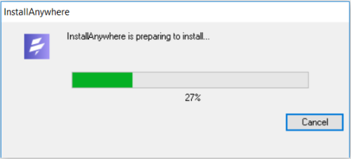
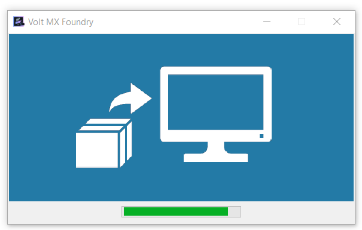
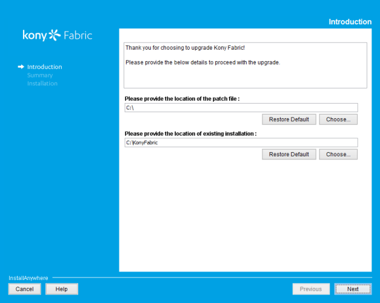
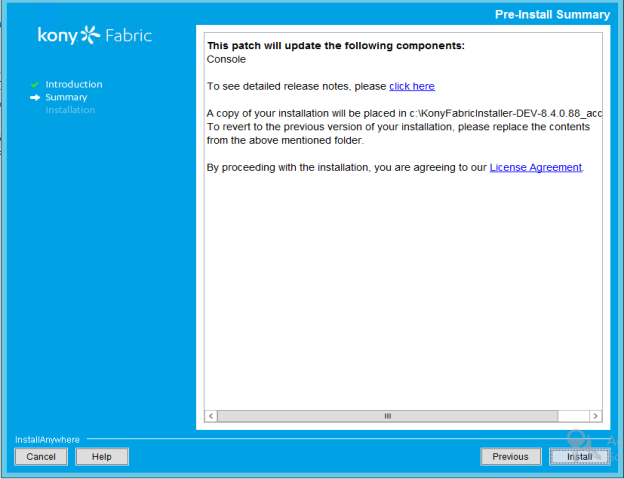
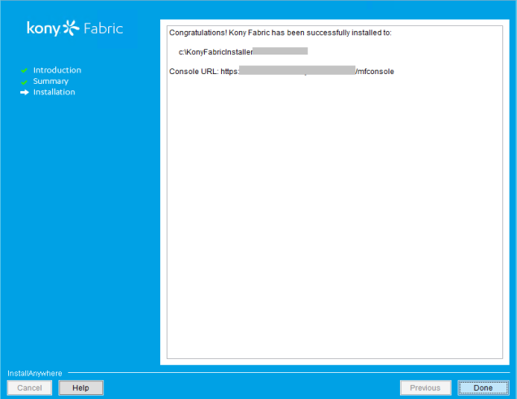
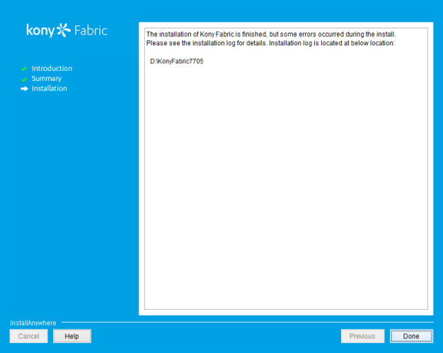

                         

You are here: Installing Hotfix Archives for Volt MX Foundry - Windows

Installing Hotfix Archives for Volt MX Foundry - Windows
=======================================================

The Volt MX Foundry Patch Installer can be used to apply patches (software updates) to Volt MX Foundry components for a specific GA release. The Patch Installer supports applying patches from Foundry 7.0.1 (GA) onwards.

**For example**:

To apply any `7.0.1.x` patches to versions below 7.0.1 GA (Foundry 7.0 GA or 6.5.x), you need to upgrade from `V 6.5.x` or `V 7.0GA`   to  `7.0.1` `GA`  by using the installer, and then apply `7.0.1.x` patches.

The Patch Installer uses hotfix archives and applies the software updates to an existing Volt MX Foundry Installation. A hotfix archive (which is a `.zip` file) file can have artifacts for one or more components. While installing hotfix archives, all components in the .zip are installed to your existing Volt MX Foundry installation.  

Patch Installer GA Versions
---------------------------

The following GA versions are supported for patch installer and hotfix archives.

*   7.0.1 GA.
*   7.1 GA
*   7.2 GA
*   7.3 GA
*   V8
*   V8 SP2
*   V8 SP3 FP1
*   V8 SP4 FP3 HF1

Prerequisites
-------------

*   Ensure that you have a previous version of Volt MX Foundry GA installed on your system at an accessible network location.
    
    > **_Important:_** If you are required to install hotfix archives to a set of components for a specific release, you must have the supported Volt MX Foundry GA version (for example, Foundry 7.0.1) with required components installed on your system.  
      
    For example, if you are required to install hotfix archive for Console version V 7.0.1, you must have the Foundry 7.0.1 GA with Console installed on your system.
    
*   Download the `patchinstaller(binary)` and `hotfix archives` from [https://hclsoftware.flexnetoperations.com](https://hclsoftware.flexnetoperations.com/flexnet/operationsportal/entitledDownloadFile.action?downloadPkgId=HCL_Volt_Foundry_v9.2.x&orgId=HCL&fromRecentFile=false&fromRecentPkg=true&fromDL=false) with your credentials.
*   Ensure that  `VoltMXFoundryPatchInstaller.exe`  file has execute permission.
    
    

Click here for more details on How to download patch installer and hotfix archives:

    
To download Volt MX Foundry Patch Installer and hotfixes, follow these steps:

1.   Log in to [https://hclsoftware.flexnetoperations.com](https://hclsoftware.flexnetoperations.com/flexnet/operationsportal/entitledDownloadFile.action?downloadPkgId=HCL_Volt_Foundry_v9.2.x&orgId=HCL&fromRecentFile=false&fromRecentPkg=true&fromDL=false). You can obtain a user name and password from your sales representative or partner.
2.  Navigate to the **Volt MX Foundry** section.
3.  From the **Volt MX Foundry Patch Installer**, select the specific release from the **Version** drop-down list and then click on the specific release related files you want to download based on your platform (Windows or Linux).  
    For example, if you want to download `Volt MX Foundry Patch Installer 8.0 GA`, select the `8.0 GA` version from the drop-down list, and then click the **Installer\_Windows** link.
4.  For the required hotfix components, select the specific release from the **Version** drop-down list and then click **Download**. The following is a sample screen.

    
*   For GA version 8.3 - Patch installers (8.3.1), using Tomcat and Oracle, you must ensure that the following additional files are added into the component zip folder.
    
    *   Add `ojdbc8.jar` manually into the Auth patch zip file.
    
    > **_Note:_** After including the **ojdbc8.jar** in the Auth patch zip file, the hibernate dialect gets changed from `org.hibernate.dialect.Oracle10gDialect` to `org.hibernate.dialect.Oracle9Dialect`.
    
*   For GA version 8.4 - Patch installers (8.4.3.1), add the `mysql-connector-java-5.1.44.jar` into the VPNS zip file.

To install Volt MX Foundry patch using the installer, follow these steps:

1.  Unzip the `VoltMXFoundrySetup-8.x.x.GA.zip` file, and navigate to the **VoltMXFoundry\_Patch\_Installer\_Windows**folder.
2.  Double-click `VoltMXFoundryPatchInstaller-8.x.x.GA.exe` to launch the installer.  
    The **InstallAnywhere** dialog appears and displays the progress of the launching the installer.
    
    
    
    A dialog with the Volt MX Foundry logo appears.
    
    
    
3.  Next, the **Introduction** window appears asking for following details: Enter the details to proceed with the upgrade:
    
    *   **Please provide the location of the patch file**: Provide the patch file location of the Volt MX Foundry component that you wish to install to current version. For example, `sample.zip`.
        
    *   **Please provide the location of existing installation** . The default install location appears in this field.  
        Provide the location of existing Volt MX Foundry installation that you wish to upgrade with the selected patch version.
    
    
    

1.  Click **Next**. The **Pre-Installation Summary** window appears.
    
    
    
    The installer takes backup of the current install folder. The backup folder will have a suffix of `_{Patch_File_Name}`. For example, if the hotfix name is VPNS.XXX, then the suffix of the backup folder will be `_VPNS.XXX`.
    
    > **_Important:_** The Installer does not support automatic backups of database and other artifacts. The Installer does not support rollback in case of a failure during the upgrade.  
      
     -  You must take backup of your database and other artifacts before upgrading.  
      
     -  After the upgrade, republish your Volt MX Foundry applications.
    
2.  Click **Install**. The **Installing Volt MX Foundry** window appears and the installation starts.
    
    Once the installation completes, the **Installation** window appears with the confirmation message.
    
    
    
    The installation of Volt MX Foundry is finished. In case of any errors during the installation, refer to the installation log for details. Installation log is located at below location: For example, `C:\VoltMXFoundry800\`
    
    
    
3.  Click **Done** to complete the installation. After the installation is completed, the installer creates logs in the install folder.

The **<Install Location>** directory contains the log files logging each invocation of the installer. To make problem identification easier, provide these log files to Volt MX when reporting an issue.

For troubleshooting tips to resolve problems that you may encounter during installation, refer to the following:

*   [FAQs and Troubleshooting](Troubleshooting.md)
