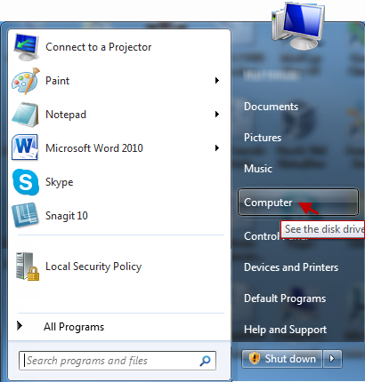
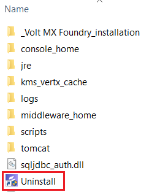
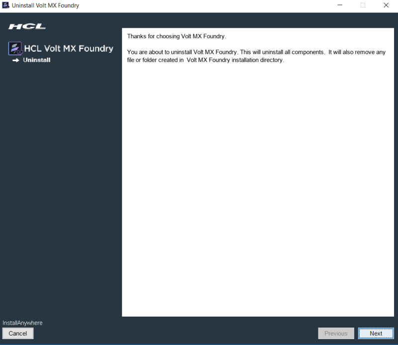

                         

You are here: Uninstalling Volt MX Foundry

Uninstalling Volt MX Foundry
===========================

The instructions given below explains how to uninstall Volt MX Foundry.

To uninstall the Volt MX Foundry using the installer, follow these steps:

1.  Click **Start** menu, and then select **Computer**.
    
    
    
2.  Find and click Hard Disk Drive, where Volt MX Foundry is installed.
3.  Click  `VoltMX Foundry` Install folder.  
    
    The Install folder opens and displays the inner `Uninstall.exe`.
    
    
    
4.  Double-click the `Uninstall.exe`.  
    A dialog with Volt MX Foundry logo appears.
    
      
      
    The **Uninstall Volt MX Foundry** window appears.
    
      
    The **Uninstall Volt MX Foundry** window informs a user that InstallAnywhere will remove features that were installed during product installation. Files and folders created after installation are not removed from the Install directory.
    
5.  Click **Next** to continue.
    
    The **Delete Database** choice window displays the alert message asking if you want to delete the database.
    
6.  Select the option button as **Delete all data** or **Retain all data**. By default, Retain all data is selected.
    
    > **_Note:_** If you select the Delete all data option, the database is deleted from your system. If you select the Retain all data option, then database is not deleted, and you can access it for future use.
    
7.  Click **Uninstall** to continue.
    
    The **Uninstall Volt MX Foundry** window displays list of features and informs a user that the uninstaller removes the following features.
    
    Once the uninstallation is complete, the Uninstall Complete window appears. It informs that all items are successfully uninstalled.
    
8.  Click **Done** to close the window.
