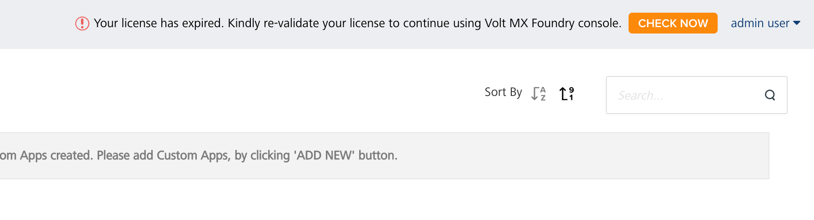
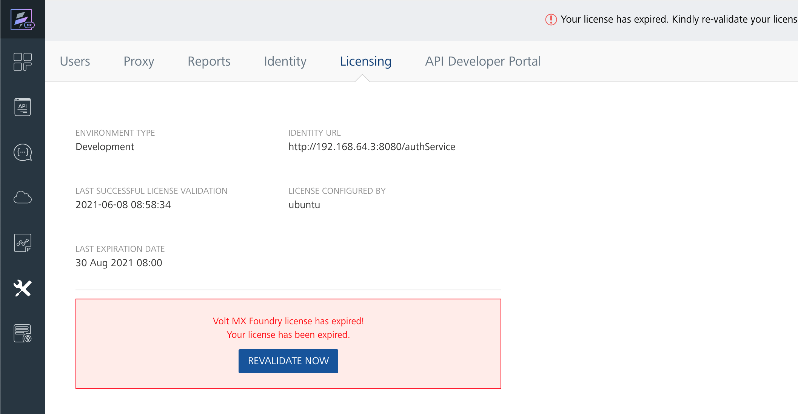
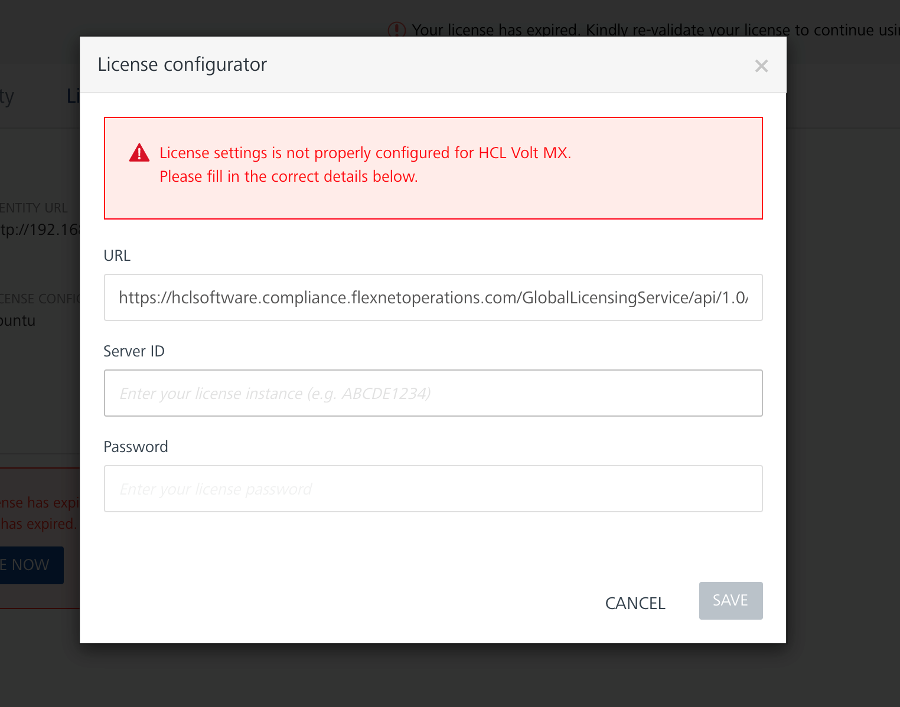
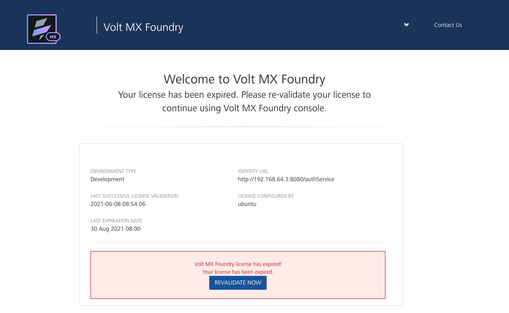

                          

License Validity
================

The license validity is the remaining application usage period from the current day to the last expiration date. When the expiration date is 30 or fewer days away, a notification dialog box appears above the console on each launch. When the expiration date arrives, your access to the application is disabled. 

Viewing the License Validity on Volt MX Iris Enterprise
-------------------------------------------------------
To view the license validity on Volt MX Iris Enterprise, choose **Help** > **About Volt MX License**. The **VoltMX Iris Enterprise License Information** dialog box appears and displays your license information.

Revalidating your license
-------------------------
- In Settings, on the Licensing tab, click **RE-VALIDATE**.

- When revalidation is complete, the updated license information appears on the Licensing tab.
  **Note:** If revalidation fails, the license configurator dialog appears, so you can supply the correct license information.

Revalidating an expired license
-------------------------------
- If your license expires, a license notification appears at the top of the console. Click **CHECK NOW**.

- You are redirected to the Licensing tab, which displays the license information. Click **RE-VALIDATE**.

- The license configurator dialog prompts you to input a valid license **Server ID**. If necessary, contact [HCL Software Customer Support](https://hclpnpsupport.hcltech.com/csm) for license renewal. After saving the configuration, wait for a few seconds for the license to revalidate.

- When revalidation is complete, you are redirected to the console dashboard. Check the license information on the Licensing tab in Settings to validate.

Revalidating a license on a private network
-------------------------------------------
If you are running Volt MX Foundry on a private network, the license revalidation process fails, because your machine cannot connect to the cloud-based Volt MX License Server. 

If you do not have access to the server, you can use your HCL Software ID to download the installer for the HCL Common Local License Server from the HCL License and Download Portal ([https://hclsoftware-fno.flexnetoperations.com/flexnet/operations/](https://hclsoftware-fno.flexnetoperations.com/flexnet/operations/)), along with set-up instructions for [Linux](https://support.hcltechsw.com/csm?sys_kb_id=83893782db5cf410cc426275ca961958&id=kb_article_view&sysparm_rank=4&sysparm_tsqueryId=0ead29fb1b68b810a67e9759bc4bcb41) and [Windows](https://support.hcltechsw.com/csm?sys_kb_id=5a0832b6db98b050cc426275ca961958&id=kb_article_view&sysparm_rank=14&sysparm_tsqueryId=2a7531f71be8b810a67e9759bc4bcb9e). Use the Local License Server **URL** in the license configurator dialog and sync the license information with the HCL Software Flexnet Operations site at a later point.

Revalidating an expired license on a disabled console
-----------------------------------------------------
If your license has been expired 30 days or more, the Foundry console blocks you from accessing the application and displays the Licensing tab. Click **REVALIDATE NOW**.

In the license configurator dialog, enter a valid license **Server ID**. If necessary, contact [HCL Software Customer Support](https://hclpnpsupport.hcltech.com/csm) for license renewal. After saving the license configuration, wait for a few seconds for the license to revalidate.

After successful license revalidation, you are redirected to the re-enabled console dashboard.