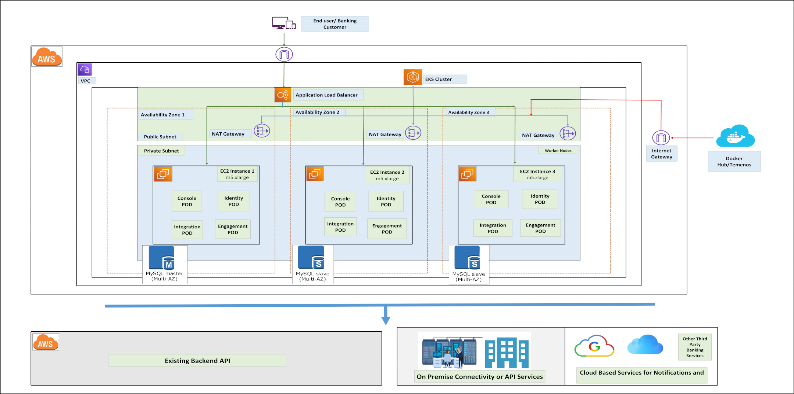
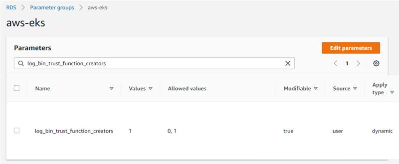
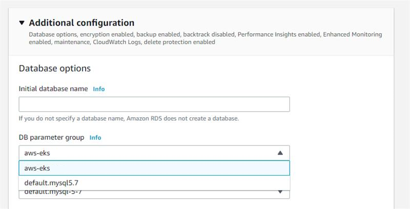

# Volt MX Foundry on Amazon EKS

## Overview

This document specifies the steps that you can follow to get Volt MX Foundry up and running on your Amazon EKS Cluster and assumes a basic understanding of Amazon EKS and Kubernetes concepts.

## Prerequisites

*   An Amazon EKS cluster setup based on the [architecture diagram](#Architecture)
*   A database that is setup external to the Amazon EKS cluster  
    For information about the supported databases and their versions, refer to [Supported Databases](#Databases).  

    >  ***Note:*** If you are using Amazon RDS MySQL as your database, make sure that you follow the [Database Setup](#Database) tasks.

*   A publicly available host name
*   SSL Certificates  
    This is applicable if you want to run your cluster setup with HTTPS.
*   `FoundryKube.zip` file  
    This zip file contains the scripts that you can use to configure and setup an instance of Volt MX Foundry. You can download the file from the [Volt MX Downloads](https://hclsoftware.flexnetoperations.com/flexnet/operationsportal/entitledDownloadFile.action?downloadPkgId=HCL_Volt_Foundry_v9.2.x&orgId=HCL&fromRecentFile=false&fromRecentPkg=true&fromDL=false) page.

### Supported Databases

Volt MX Foundry on Amazon EKS supports the following database servers:

<table cellspacing="0" style="margin-left: 0;margin-right: auto;width: 441px;"><colgroup><col style="width: 183px;"> <col style="width: 165px;"> <col style="width: 165px;"></colgroup>

<thead>

<tr>

<th scope="col">Database Type</th>

<th scope="col">Supported Versions</th>

<th scope="col">Certified Versions</th>

</tr>

</thead>

<tbody>

<tr>

<td style="text-align: left;">Amazon RDS MySQL</td>

<td>5.7</td>

<td>5.7</td>

</tr>

<tr>

<td style="text-align: left;">Microsoft SQL Server</td>

<td>2017, 2019</td>

<td>Not Available</td>

</tr>

<tr>

<td style="text-align: left;">Oracle</td>

<td>Oracle 18c, Oracle 19c (19.3.0)</td>

<td>Not Available</td>

</tr>

</tbody>

</table>

## Architecture

The following architecture diagram proposes the architecture that must be considered to deploy Foundry on Amazon EKS.

## Database Setup Tasks

Before you set up the Amazon RDS - MySQL database and execute the Foundry database scripts, follow these steps:

1.  Create a database parameter group with the `log_bin_trust_function_creators` parameter set to 1.  
    
2.  While creating the database, in the **Additional configuration** section, from the **DB parameter group** list, select the parameter group that you created.  
    

