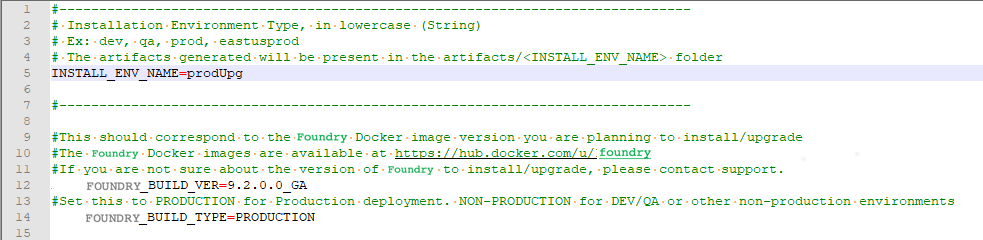

# Upgrade Volt MX Foundry on Amazon EKS

The Configuration and Setup section specified the process by which the Foundry Environment is set up and deployed. In addition to the YAML configuration files that are generated in the artifacts folder, an `upgrade.properties` file is also generated. The `upgrade.properties` file contains keys for the **authService**, **accounts**, and **workspace** components. During the upgrade process, you need to provide the location of the `upgrade.properties` file.

To upgrade the deployed instance of Volt MX Foundry, follow these steps.

1.  In the `config.properties` file, provide values for the following properties:
    *   `INSTALL_ENV_NAME`: Specifies the environment name for the upgraded version of Volt MX Foundry.  
        To avoid overwriting the YAML files that were generated during the installation process, make sure that the environment name is different than the name of the earlier environment.  
        For example: If the name of the earlier environment was **prod**, you can name this environment **prodUpgrade**.
    *   `VOLTMX_FOUNDRY_BUILD_VER`: Specifies the build version of Foundry to which you want to upgrade.  
    
2.  Upgrading Foundry also requires upgrading the existing database schema. Make sure that you point to the same database server that was used during installation. Also make sure that the `DB_PREFIX` and `DB_SUFFIX` properties contain the same values that were used during the installation.
3.  Provide values for the following properties:
    *   `USE_EXISTING_DB`: Specifies whether the upgrade process must use an existing database.  
        The value must be set to `Y`.
    *   `PREVIOUS_INSTALL_LOCATION`: Specifies the location of the `upgrade.properties` file that was generated during the installation.
4.  Generate the database and app YAML files by executing the following command.  

    <pre><code style="display:block;background-color:#eee;">./generate-kube-artifacts.sh config.properties</code><pre>

5.  Similar to the install process, apply the generated YAML files by executing the following commands.

    <pre><code style="display:block;background-color:#eee;">kubectl apply -f ./artifacts/&lt;INSTALL_ENV_NAME&gt;/foundry-db.yml</code><pre>

    <pre><code style="display:block;background-color:#eee;">kubectl apply -f ./artifacts/&lt;INSTALL_ENV_NAME&gt;/foundry-app.yml</code><pre>

After the `foundry-db.yml` and `foundry-app.yml` files are applied, you may need to wait for a few minutes while EKS starts the new deployments and deletes the older deployments. After the process is completed, you can sign-in to the Foundry Console by using the same URL and credentials that were created during the installation.

