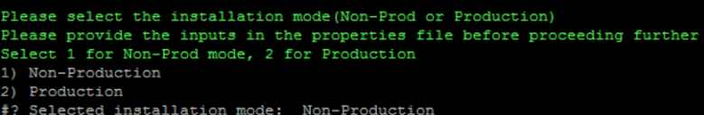
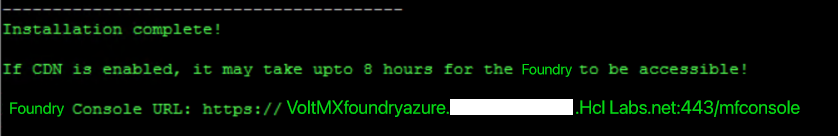
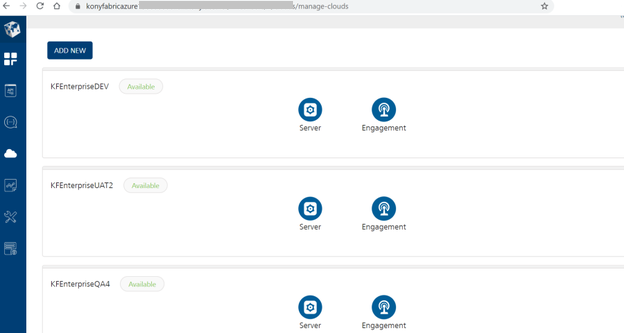

  

Overview for INT and SHARED Clusters
====================================

From Foundry V9 SP1 onwards, the installation will involve a separate dedicated cluster for Integration, which will referred to as the INT cluster. Whereas, the rest of the Foundry components will be present in a single cluster which will be referred to as the SHARED cluster.

VoltMX Foundry Containers on Azure Solution is designed to facilitate VoltMX Foundry on Azure for Non-Production and Production needs. This setup occurs with minimal manual intervention.

*   When you setup a Non-Production account, every time you run it to setup another environment such as qa, uat, etc., only the Integration (INT) cluster gets created and Foundry console is shared for all the Non-Production environments within the subscription.
*   When you setup an Production account each installation is treated as a fresh installation where both Shared cluster and Integration cluster will be created.

In case of a Non-Production setup the information about the shared resources which are required for installing the new environments is stored as installation metadata in Azure Cosmos DB and Azure Key Vault.

Configuration Details for the Production and Non-Production Grade Environments
------------------------------------------------------------------------------

### Non-Production Environment

When you setup a Non-Production account, every time you run it to setup another environment such as qa, uat, etc., only the Integration (INT) cluster gets created and Foundry console is shared for all the Non-Production environments within the subscription.

The Application Gateway, WAF, CDN Profile, VNet, Jumpbox, and File Share are shared by all the Non-Production Integration instances. Each Integration cluster is created under a dedicated subnet within the same VNet.

Rest of the Foundry components like Console, Identity, and Engagement use a set of the Azure resources. There is no CDN configured for these components. Whenever a new Non-Production environment(such as qa, uat) is installed a new Kubernetes deployment gets created for Engagement in the SHARED cluster resource group. There is only one OMS created and used for all the Non-Production environments within a subscription. This OMS is present in the SHARED cluster resource group.

### Production Environment

When you setup an Production account each installation is treated as a fresh installation where both Shared cluster and Integration cluster will be created.

The Enterprise account will have only one environment called PROD. Every Production installation will have Azure resources like the Application Gateway, WAF, CDN Profile, AKS, Azure Cache for Integration, and Azure Database.

The default values of Node Capacity and Resource Allocations for both the environments is as follows:

#### Shared Cluster

*   **Node Size**: D4 V3 (16 GB RAM, 4 vCPU)
*   **Allocatable Memory**: 12.9 GB

#### Integration Cluster

*   **Node size**: B2MS (8 GB RAM, 2 vCPU)
*   **Allocatable Memory**: 7.37 GB
*   **Allocatable CPU**: 2 cores

Configuration using Input Properties
------------------------------------

Following is a list of the properties added to the **enterprise.properties** for the new architecture. For the entire list of properties please refer to [VoltMX Foundry on MS Azure - Configuration](VoltMX Foundry on Azure.html#Configuration).

Edit the input parameters in the following file:

*   **<Installation Directory>/conf/trial.properties** for Non-Production solution.
*   **<Installation Directory>/conf/enterprise.properties** for Enterprise solution.  
    For more information, refer to the [sample.properties (zip)](sample.zip) file.
*   **<Installation Directory>/conf/enterprise.properties** for Enterprise solution.  
    For more information, refer to the [sample.properties](http://opensource.voltmxtechsw.com/volt-mx-docs/voltmxlibrary/voltmxfoundry/voltmxfoundry_on_azure/Content/sample.zip) file.

1.  **Domain Name Inputs** - Following properties are for the Domain names that must mapped with Azure App Gateways. Enter unique and unused domain names for each of the following domain name properties.
    *   **SHARED\_SERVER\_DOMAIN\_NAME** - This is the domain name property for Foundry Console component. This is not required if shared cluster is already created in previous installations. For example, the default value is: kfazure-console.hcl.net.
    *   **INTEGRATION\_SERVER\_DOMAIN\_NAME** - This is the domain name property for Foundry Integration component. For example, the default value is: kfazure-integration.hcl.net.
    *   **VMS\_DOMAIN\_NAME** - This is the domain name property for Foundry Engagement Service Component. For example, the default value is: kfazure-engagement.hcl.net.
2.  **SHARED\_AZURE\_RESOURCE\_GROUP**: You must enter new and unused resource group names for the following properties.
    *   **SHARED\_AZURE\_RESOURCE\_GROUP**: The resource group where the cluster for SHARED components (Console, Identity, and Engagement) would be created. This is not required for Non-Production if the shared cluster is already installed for the same subscription. The default value is: FoundryShared.
    *   **INTEGRATION\_AZURE\_RESOURCE\_GROUP**: The resource group where the cluster for Integration would be created. Specify a resource group name which is not in use already. The default value is: FoundryInt.
    *   **COMMON\_RESOURCE\_GROUP**: The resource group under which PCI related function app gets created. If the SSH key is different for production and non-production environments, ensure to specify this property for Production installation. The default value is: VoltMXInfra.
    
    You cannot use the same SSH key for all Non-Production installations.
    
3.  **Database Inputs**:
    *   **SHARED\_DATABASE\_USER\_NAME**: The username for your shared database. For example, the default value is: dbclient.
    *   **SHARED\_DATABASE\_PASSWORD**: The database password for your shared database.
    
    The following special character $, \*, &, !, (, ), \\ are not supported in DB password.
    
    *   **INTEGRATION\_DATABASE\_USER\_NAME**:The username for your INT database. For example, the default value is: dbclient.
    *   **INTEGRATION\_DATABASE\_PASSWORD**: The database password for your integration database.
    
    If you are using VoltMX Foundry 9.0.0.1 GA docker images, you must specify the same value for SHARED\_DATABASE\_PASSWORD and INTEGRATION\_DATABASE\_PASSWORD. Integration docker image does not support multiple passwords.  
    You can use different passwords for your databases from VoltMX Foundry V9.0.1.0 GA onwards.  
    The following special character $, \*, &, !, (, ), \\ are not supported in DB password.
    

Installation
------------

Steps to Install VoltMX Foundry on MS Azure

These are the minimal set of steps required. Please refer to [VoltMX Foundry on Azure](VoltMX Foundry on Azure.html#On1), if you need to go through the prerequisites and other details.

1.  Create an Ubuntu VM or you can use an existing VM.
2.  Extract the downloaded installation zip on that VM.
3.  Modify/Enter the required properties in the **<Installation Directory>/conf/enterprise.properties** file.
4.  Run the installation using command bash **install-foundry.sh**.

6.  Choose between a Non-Production or a Production type of environment. In the following prompt a Non-Production environment has been chosen.
7.  Specify a label for the Non-Production installation environment. A label is just a simple string such as dev, qa, uat etc., this will also be appended to the Azure resources created for this environment to identify them easily.

9.  The installation begins and towards the end of the installation the following prompt will be displayed.

11.  Once the domains are mapped to the IPs/CNAME as shown in the prompt, validate the mappings and continue the installation. The installer will do an auto registration and proceed to CDN configuration.
    
    You must ensure that the domain mapping must reflect with correct mapping from the script client box using nslookup.
    
12.  After the CDN configuration is complete, you can proceed with the post-installation configuration of CDN as shown in [Setting up Azure Content Delivery Network (CDN)](VoltMX Foundry on Azure.html#Setup).
13.  The following message is displayed containing the Foundry Console URL. Copy and paste the displayed link on to a browser. Press Enter. The Foundry Console is displayed.

Post Installation
-----------------

After the installation and CDN configuration is complete, you can access the Foundry Console using the link displayed on the screen.

1.  Copy and paste the displayed link on to a browser. Press Enter. The Foundry Console is displayed.
2.  Login with the registration credentials provided in the properties file and navigate across various pages. Following is a screenshot of the Environments tab from an Azure test setup after installing 3 environments, namely DEV, UAT2, and QA4.
    
    
    

You can now publish apps and check the runtime services.
