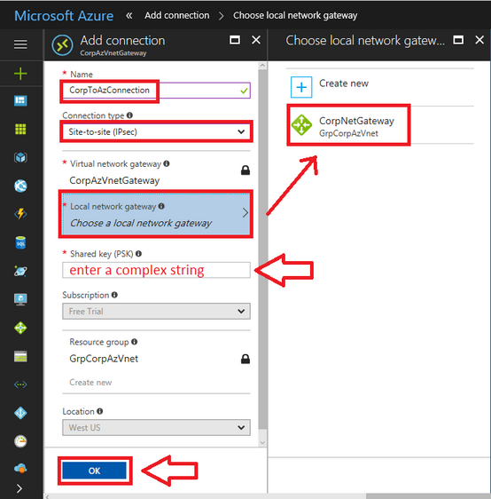

                           

Volt MX  Foundry on MS Azure: [Appendices](Appendices.md#appendices) > [VPN Reference Implementation](Appendices.md#vpn-reference-implementation) > Site-to-Site Tunnel Implementation

Virtual Private Network (VPN) Reference Implementation:
=======================================================

Site-to-Site tunnel between Microsoft Azure and On-Premise Network with FortiGate Firewall
==========================================================================================

This document outlines the process required to set up a site-to-site tunnel between an Azure network and an on-premise network with FortiGate Firewall.

> **_Note:_** VPN Reference Implementation is documented assuming that the FortiGate Firewall is used on the On-Premise setup. If you are using any other firewall, contact your system administrator for setting up the incoming policies from Volt MX Foundry set up on Microsoft Azure Cloud.

The following steps help you to implement a VPN connection between Microsoft Azure and an On-Premise Network:

1.  [Create the Azure Virtual Network](#step-1-create-the-azure-virtual-network)
2.  [Create the Gateway Subnet](#step-2-create-the-gateway-subnet)
3.  _[Create the Virtual Network Gateway Object](#step-3-create-the-virtual-network-gateway-object)_
4.  [Create the Local Network Gateway Object](#step-4-create-the-local-network-gateway-object)
5.  [Create Site-to-Site VPN](#step-5-create-site-to-site-vpn)

Step 1. Create the Azure Virtual Network
----------------------------------------

From the Azure portal, click `New` and start typing Virtual network into the search field, then click on `Virtual network`.

*   **Name**: Provide the name for the Virtual Network object in Azure.
*   **Address space**: Provide a subnet IP Address and ensure that it does not overlap with your on-premises IP address space. Pick an address that is outside the range of your local subnets.For example, 10.100.0.0/16.
*   **Resource group**: Creates an object in Azure called a Resource group (a container with items related to one another).
*   **Location**: Places your network into a specific Microsoft datacenter. You cannot connect a virtual machine from a different datacenter to this virtual network.
*   **Subnet**: Provide a Name and an Address range. You can provide the same details, or a sub-set of the details (saving additional space for later use), that you provided in the Address space. For example,10.100.0.0/24.

Once you configure all the fields, click `Create` to complete the setup.

Step 2. Create the Gateway Subnet
---------------------------------

You need an internal gateway in your network that Azure can use to route traffic back to your on-premises environment.

1.  After your virtual network is built, select it from `All resources`.
2.  On the left menu, select `Subnets`.
3.  Click the option to add a `Gateway subnet`.

> **_Note:_** Azure picks an address range within the space you previously defined. In the given example, it uses 10.100.1.0/24 as the GatewaySubnet. You cannot pick any other name as this is how Azure knows what the subnet is for.

6.  Click `OK`.
    
    
    

Step 3. Create the Virtual Network Gateway object
-------------------------------------------------

You need a software VPN service which is the endpoint for your firewall. The VPN is called a **Virtual network gateway** in Azure.

Follow these steps to create a new Virtual network gateway:

1.  Go to `New`.
2.  Search for **Virtual network gateway**, and select it from the search results.
3.  On the next screen, Click `Create`.

Enter the following details:

*   **Name**: Provide a name that matches with the name of your virtual network.
*   **Gateway type**: Select `VPN`.
*   **VPN type**: Select `Route-based VPN`.
*   **SKU**: Select Basic, as it fits the requirements of most SMBs (Server Message Blocks).
*   **Virtual network**: Choose the Virtual Network that you created.

*   **Public IP address**: To create a new Public IP Address: Click on `Create new`, give it a name, and click `OK`.  
    It is recommended to append **IP** to the name that matches the gateway object you create.

Choose your `Subscription` and your `Location` (make sure that you match it with your other resources), and click `Create`.

The creation of the virtual network gateway may take some time to complete.

Step 4. Create the Local Network Gateway object
-----------------------------------------------

You must create another object to represent your local on-premises network, so that Azure knows your location, and what is behind your firewall. Basically, this defines your on-premises IP address space, as well as an endpoint or gateway (the public IP assigned to your firewall).

Search for Local network gateway and click `Add`.

Enter the following details:

*   **Name**: Provide a name that is distinct from the Azure Gateway.
*   **IP address**: This is your firewall’s primary public IP address.
*   **Address space**: Add all the internal subnets that exist behind your firewall. The Azure virtual network requires routes to these subnets.

> **_Note:_** Include only those subnets that require communication with the Azure virtual network.  

*   **Subscription**: Select your subscription type.
*   **Resource group**: Choose your resource group.
*   **Location**: Select the same location as you did during the creation of the Azure Virtual Network.

After entering all these details, click `Create`.

Step 5. Create Site-to-Site VPN
-------------------------------

Go to `More Services > Virtual network gateways > Connections > Add`

*   **Name**: Provide a name related to the Azure Virtual network that you are creating.
*   **Connection type**: From the drop-down, select `Site-to-Site (IPSec)`.
*   **Local network gateway**: Select the Local network gateway that you created.
*   **Shared key (PSK)**: Provide a complex string and save it securely. You must provide this key on your on-premises firewall.

After entering these details, click `OK`.

On-Prem FortiGate Firewall configuration
----------------------------------------

Log in to Fortinet and go to the VPN tab. Configure both the phases based on the following sections:

### Phase 1 Configuration

*   Click the Auto Key (IKE) Tab and create Phase 1.
*   Fill out the IP address with the Azure Virtual GW IP.
*   Under P1 Proposal, ensure the following:
    *   Encryption must be AES256. This is mandatory for the FortiGate Vendor.
    *   Authentication must be SHA1.
    *   Key life must be 7200.
    *   Enable NAT translation.

### Phase 2 Configuration

*   Click Auto Key (IKE) Tab and create Phase 2.
*   Under Phase 2, set Local Address to the local subnet and Remote Address to the VPN tunnel endpoint subnet (present at the `Virtual Network Address Spaces` in Microsoft Azure).

Policies
--------

Follow these steps to create the FortiGate firewall policies:

*   Go to `Policy & Objects > Policy`
*   Create a new policy for the site-to-site connection that allows outgoing traffic.
*   Set the Source Address and Destination Address using the Firewall objects you just created.
*   Create another policy for the same connection to allow incoming traffic and swap the Source Address and Destination Address.

Go to **VPN > Monitor > IPsec Monitor** to check the status of your VPN tunnel.

