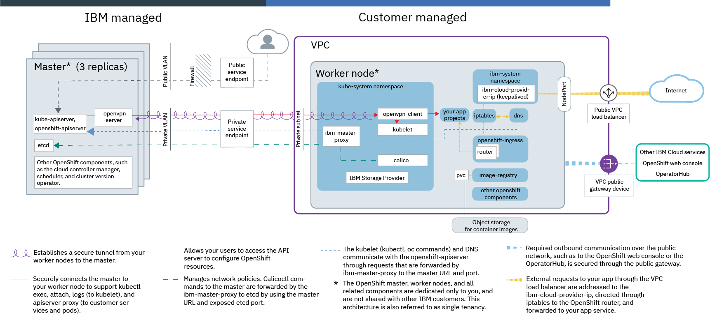
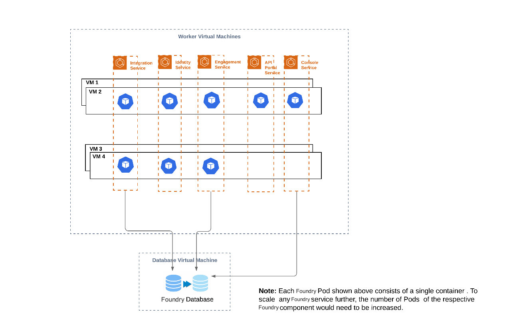

# Volt MX Foundry on Red Hat OpenShift

## Overview

This document specifies the steps that you can follow to get Volt MX Foundry up and running on your OpenShift Cluster and assumes a basic understanding of OpenShift and Kubernetes concepts.The setup occurs with minimal manual intervention and leverages Red Hat OpenShift to package different components as portable container images with all the required binaries and libraries.

## Prerequisites

*   An Red Hat OpenShift cluster consists of master and worker nodes.

*   A database that is setup external to the OpenShift cluster  
    For information about the supported databases and their versions, refer to [Supported Databases](#Databases).  

*   A publicly available host name
    This is applicable if you are not using a host name that is generated by OpenShift.
*   SSL Certificates  
    This is applicable if you want to run your cluster setup with HTTPS.
*   `FoundryKube.zip` file  
    This zip file contains the scripts that you can use to configure and setup an instance of Volt MX Foundry. You can download the file from the [Volt MX Downloads](https://hclsoftware.flexnetoperations.com/flexnet/operationsportal/entitledDownloadFile.action?downloadPkgId=HCL_Volt_Foundry_v9.2.x&orgId=HCL&fromRecentFile=false&fromRecentPkg=true&fromDL=false) page.

### Supported Databases

Volt MX Foundry on OpenShift supports the following database servers:

<table cellspacing="0" style="margin-left: 0;margin-right: auto;width: 441px;"><colgroup><col  style="width: 183px;"> <col style="width: 165px;"> <col style="width: 165px;"></colgroup>

<thead>

<tr>

<th scope="col">Database Type</th>

<th scope="col">Supported Versions</th>

<th scope="col">Certified Versions</th>

</tr>

</thead>

<tbody>

<tr>

<td  style="text-align: left;">MySQL</td>

<td >5.6, 5.7</td>

<td>5.7</td>

</tr>

<tr>

<td style="text-align: left;">Microsoft SQL Server</td>

<td>2017,2019</td>

<td>Not Available</td>

</tr>

<tr>

<td style="text-align: left;">Oracle</td>

<td >Oracle 18c, Oracle 19c (19.3.0)</td>

<td>Not Available</td>

</tr>

</tbody>

</table>

> ***Note:*** MySQL Cluster is not supported for container solutions.

## Architecture

Red Hat OpenShift is available on a variety of platforms, and it is also available as a managed service from public cloud vendors such as IBM, AWS and Azure.

For example, the following architecture diagram showcases Red Hat OpenShift on IBM Cloud, which provides an idea of the setup when considering how to deploy Foundry by using a public cloud managed service.

The following diagram shows how you can set up the Foundry project. Each VM corresponds to one worker node, as depicted in the earlier architecture diagram. The worker and database VMs can be setup in the same zone or in multiple zones based on considerations for high availability.

