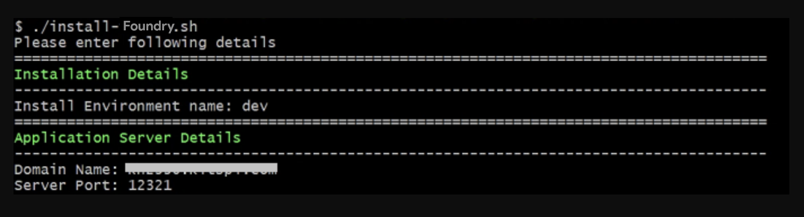
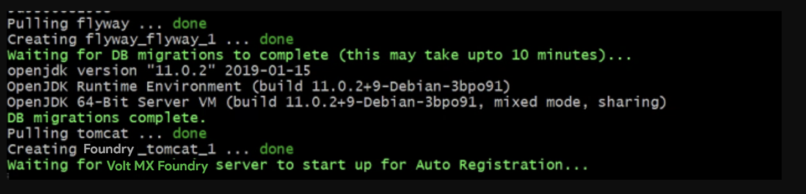

                           

Volt MX  Foundry Containers Solution On-Premises:[FAQs and Troubleshooting](#faqs-and-troubleshooting) > Salient Features

Overview - Volt MX Foundry Single Container Solution
===================================================

The Volt MX Foundry Single Container On-Premises solution offers a quick way to set up Volt MX Foundry on your local environment. It leverages the following technology:

*   **Docker** - To package different components as portable container images (with all the required binaries and libs).

Salient Features
----------------

The Volt MX Foundry Single Container Solution provides developers with tools to build applications.

The Volt MX Foundry Single Container Solution has the following features:

1.  Deploys Volt MX Foundry on a native Docker container.
2.  Supports multi-platform deployment in Windows, Linux, and macOS.

Prerequisites
=============

*   Install `Docker Engine version 19.03.13`, and `Docker Compose version 1.27.4`.
    
    > **Note:**      
    *   For Windows and macOS, you can download and install the package installer for `Docker Desktop version 2.5.0.1 (49550)`.  
    *   For Linux, you must install Docker Engine and Docker Compose separately.  
        
*   On Windows machines, use any bash/shell prompt to execute the install-foundry.sh script. macOS and Linux support Bash prompt by default.
*   Install Java 11.
*   Install an external Database. (The supported types are mentioned [here](#supported-databases).)

> **Note:**  
*   For Windows 10 Pro machines, before installing VirtualBox, make sure that Hyper-V is disabled.  
*   Intel VT and related settings must be enabled in system BIOS.  
*   To execute the installation scripts, you must use **Bash version 4** or later.  
*   To avoid an unknown host exception, make sure that the IP address is configured with the hostname. To do so, follow the steps that are mentioned in the [FAQs section](#faqs-and-troubleshooting).  

Software Requirements
---------------------

### Recommended Operating Systems

HCL recommends using the following operating systems to install Volt MX Foundry Single Container Solution:

  
| Operating System | Recommended Version |
| --- | --- |
| Microsoft Windows | Windows 10 Pro |
| Linux | CentOS 7.2 |
| macOS | macOS Catalina |

### Supported Application Servers

Volt MX  Foundry Single Container Solution supports only the **Tomcat Application server**.

All the Docker images built for Volt MX Foundry are built using the `Tomcat version 9.0.33-jdk11` as the base image.

### Supported Databases

Volt MX  Foundry Single Container Solution supports the following database servers:

  
| Database Type | Version Supported |
| --- | --- |
| MySQL | 5.6, 5.7 |
| Microsoft SQL Server | 2016, 2017 |

> **_Note:_** You must have an existing external database. Databases do not come bundled with the Installer.

Hardware Requirements
---------------------

*   **CPU**: Dual-core processor
*   **Memory**: A minimum RAM of 8 GB is required. HCL recommends using a system with 16 GB RAM.

Architecture
============

For flyway migrations, a container with database image (voltmx-foundry-db) is created. The database image is terminated after all the migrations are completed.

After the migrations are completed, the second container will run the Volt MX Foundry Docker single image(voltmx-foundry-all). This container keeps running in the background for as long as the Volt MX Foundry setup is required.

Following are the two containers present in the VoltMX Foundry Single Container Solution:

*   Volt MX Foundry
*   Database (exists on completion of the Database scripts execution)

The following is the list of Docker images used in the VoltMX Foundry Single Container Solution:

*   Foundry (Contains `mfconsole.war`,   `workspace.war`, `accounts.war`, `apiportal.war`, `authService.war`, `admin.war`, `services.war`, `middleware.war`, `apps.war`, and `vpns.war`)
*   Database (Contains database migration scripts)

The docker images will be pulled when you execute the installation scripts in the "HCL Volt MX Foundry Container Installer" found on HCL's FNO download website: [https://hclsoftware.flexnetoperations.com/flexnet/operationsportal/entitledDownloadFile.action?downloadPkgId=HCL_Volt_Foundry_v9.2.x&orgId=HCL](https://hclsoftware.flexnetoperations.com/flexnet/operationsportal/entitledDownloadFile.action?downloadPkgId=HCL_Volt_Foundry_v9.2.x&orgId=HCL)

To pull the images, use the below command.

For example:  
`docker pull hclcr.io/voltmx/voltmx-foundry-console:9.2.0.0_GA`

Volt MX  Foundry Single Container Solution downloadable bundle contains the following directories and files.

*   **install-foundry.sh** - Installation script
*   **install-actions.sh** - Installation actions script
*   **templates** - Directory containing the config template files
*   **config.properties** - Properties file to pass the inputs to install-foundry.sh instead of giving inputs in shell prompts.
*   **lib** \- Folder containing the foundry-utils.jar file.
*   **foundry**\- Folder containing the docker-compose.yml file.
*   **flyway**\- Folder containing the docker-compose.yml file.

Installation Types
------------------

*   **Command Line or GUI Installation** - Volt MX Foundry Single Container Solution can be installed using the bundled install shell script, which will prompt the user for the required values.
*   **Silent Installation** - The installation script also supports silent installation if the config.properties file is passed as an argument (for example, /path/install-foundry.sh config.properties). Using this, you can have additional ability to pass custom Tomcat JAVA\_OPTS, and time-zone settings as well.

Configuration
=============

The following parameters must be provided by the user during Installation:

1.  **Install Environment Name** - The install environment name can be anything, for example, `dev`, `qa`, `prod`, or `eastusprod`.

> **_Note:_** The Install Environment Name must not contain numbers.

3.  **Application Server Details**:
    *   **Domain Name**: The Domain Name for Volt MX Foundry.  
        
        > **_Note:_** Domain name must not be a dynamic IP address or 'localhost'. Although, the domain name can be a static IP address.
        
    *   **Server Port** - The Port Number for Volt MX Foundry.  
        
        > **_Note:_** Ensure that the specified port is not being used by another service.
        
    *   **COM\_PROTOCOL**: The communication protocol that is used for Volt MX Foundry. This value can be either **http** or **https**.
    *   **KEYSTORE\_FILE** : The path to the existing Keystore file. The path should point to a valid `JKS` file. This value can be empty if the communication protocol is HTTP.
    *   **KEYSTORE\_FILE\_PASS**: Password for the Keystore (`JKS`) file. This value can be empty if the communication protocol is HTTP.
4.  **Database Details**:
    *   **Database Type** - This is the Database Type you want to use for hosting Volt MX Foundry.
    *   **Database Hostname** - This is the Database Server hostname used to connect to the Database Server.
    *   **Database Port Number**– This is the Port Number used to connect to the Database Server.
    *   **Database Username** - This is the preferred Database Username used to connect to the Database Server.
    *   **Database Password** - This is the Database Password used to connect to the Database Server.
    
    > **_Important:_** The Password must be a string containing at least 8 characters, and must include at least one uppercase letter, one lowercase letter, one digit and one special character.
    
    *   **Database Prefix** – This is the Database server prefix for Volt MX Foundry Schemas/Databases.
    *   **Database Suffix** – This is the Database server suffix for Volt MX Foundry Schemas/Databases.
    
    > **_Note:_** In case of upgrade, ensure that the values of the Database Prefix and Suffix that you provide are the same as you had provided during the initial installation.
    
5.  **Automatic Registration Details** (not applicable for upgrade):
    *   **User Id** – E-mail ID used for Volt MX Foundry Registration.
    *   **Password** – Password used for Volt MX Foundry Registration.
    *   **First Name** – First Name used for Volt MX Foundry Registration.
    *   **Last Name** – Last Name used for Volt MX Foundry Registration.
    *   **Environment Name** – The Volt MX Foundry Environment to publish generated applications.
6.  **Time Zone** - The Time Zone of the Database used for Volt MX Foundry installation.
    
    > **_Note:_** The Time Zone is an optional value. If you do not provide any Time Zone, it is set to Etc/UTC.
    

Installation
============

Run the Volt MX Foundry Single Container install script to generate and deploy Volt MX Foundry containers.

**Steps to Install Volt MX Foundry Single Container Solution on On-Premises:**

1.  Download the **`voltmx-foundry-containers-onprem\<version>\GA.zip`** from [downloads](https://hclsoftware.flexnetoperations.com/flexnet/operationsportal/startPage.do) and extract it. The file structure will be as shown below:
    
    config.properties install-foundry.sh\* install-actions.sh\* lib/ templates/ foundry/ flyway/
    
2.  Run the `install-foundry.sh` file.

> **_Note:_** You must provide **execute** permissions to run the `install-foundry.sh` and `install-actions.sh` files on Linux and macOS.

4.  Enter the **Install Environment Name** and **Domain Name**.
    
    
    

> **_Note:_** Domain name cannot be a dynamic IP address or 'localhost'. Although, the domain name can be a static IP address.

6.  For the Database details:
    *   In case of new Install, provide the following details.
    
    
    
    *   In case you are upgrading using an existing database, you must additionally provide the **Previous install artifact directory** which is the location of your existing Volt MX Foundry instance.

> **Note:**  
*   Ensure that the database details you provide point to an existing database instance.  
*   In case of upgrade, ensure that the database points to the existing instance of the database running Volt MX Foundry.  
*   Database Hostname cannot be localhost.  
*   If the Database Prefix or Suffix contain numeric characters, enclose the values in single quotes (' ').  
*   In case of upgrade, ensure that the values of the Database Prefix and Suffix that you provide are the same as you had provided during the initial installation.  

8.  Enter the Administration Account Configuration details as shown:
    
    > **_Note:_** This step is not applicable for upgrades. You can use the credentials that you used to create the initial account.
    
    
    
    > **_Note:_** The Password must contain at least 8 characters, at most 20 characters and must include at least one uppercase letter, one lowercase letter, one digit and one special character.
    
9.  Enter the Time Zone of your Database as shown:  
      
    
    > **_Note:_** The Time Zone is an optional value. If you do not provide any Time Zone, it is set to Etc/UTC.
    

Once all the input parameters are given, the installation procedure starts.  

> **_Note:_** Auto Registration will not occur during upgrade.

After successful completion of execution, the Volt MX Foundry URLs are displayed on the screen.

Limitations
-----------

Volt MX  Foundry Single Container Solution has the following limitations:

*   Support for **SPA / Desktop Web** is only available for zipped SPA apps, but not for WARs.
*   **Log Analytics** is currently not supported.

FAQs and Troubleshooting
========================

*   **Do I need to have an account with the Docker Hub to pull the Volt MX Foundry Images?**
    
    No. The images are public, and you do not need any authorization to download them.
    
*   **How should I restart a container that has been killed?**
    
    To restart a container you must do the following:
    
    *   Go to Downloads (The folder you downloaded and extracted it to) > `VoltMXFoundrySingleContainer-9.x.x.x-GA/foundry/` folder.
    *   Run the command: `docker-compose up -d`.
*   **How to configure the IP address as the hostname to avoid an unknown host exception?**
    
    1.  Update the hostname and IP in the hosts file.
        *   For **Linux**: `“/etc/hosts”`
        *   For **Windows 10 and 8**: `“c:\Windows\System32\Drivers\etc\hosts”`
        *   For **macOS**: `/private/etc/hosts`
        *   Once the file is updated with <IP> SPACE <HOSTNAME>, save and close the file.
        
        > **_Note:_** In case you still face an issue with the hostname resolution, you must flush the DNS cache.
        
    2.  Update `docker-compose.yml` file under `Downloads/VoltMXFoundrySingleContainer-9.x.x.x-GA/foundry/`
        *   Add a section under restart key in the following order:
        
            extra\_hosts:  
        `\- "<HOSTNAME>:<IP>"`
        
    
        Once updated, the file will look like the following image: 
        
     
    
    
    

Extracting Logs from your Application
-------------------------------------

To perform any actions related to the logs of your application, you need the names of the containers in the application.

The **Container names** are:

*   Container name for Foundry: `foundry_tomcat_1`
*   Container name for Flyway: `flyway_flyway_1`

If you want to **extract logs** from a container, execute the following command from your terminal:

*   `docker logs -f <container_name>`

If you want to **teletype (tty)** into the container, execute the following command from your terminal:

*   For **Windows**: `winpty docker exec -it <container_name> bash`
*   For **macOS/Linux**: `docker exec -it <container_name> bash`

> **_Note:_** A database container terminated after the flyway migrations are complete. As a result, you cannot tty into the database container post installation.

If you want to **copy logs** (for example: Component logs) from the Foundry container to your local machine, execute the following command from your terminal:

*   `docker cp <container_name>:<location_in_container> <location_in_machine>`

_For example_: To copy **authService logs**, execute the following command from your terminal:

`docker cp foundry_tomcat_1:/usr/local/logs/authService.log /d/Foundry/logs`

> **_Note:_** Component logs can be found at `/usr/local/logs` inside the container.

Configuring Iris to connect to Volt MX Foundry
---------------------------------------------------

For details on configuring Iris to connect to Volt MX Foundry, refer to [Connect to Volt MX Foundry](../../../Iris/iris_user_guide/Content/Connect_to_VoltMXFoundry.md?Highlight=foundry) in the Iris User Guide.
