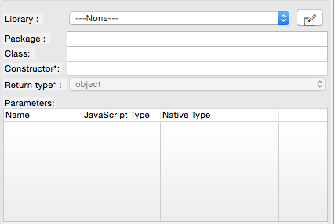

                          

Volt MX  Application Design and Development Guidelines: [Application Design Guidelines](Application_Design_Guidelines_Overview.md) > [Coding Guidelines](Coding_Guidelines.md) > iPhone

### Foreign Function Interface (FFI) Guidelines

#### iPhone

*   Ensure that the library uses the Object versions of primitive types while writing the wrappers for FFI compatibility. For example, if a number is mentioned in the IDE, the wrapper should accept NSNumber.
*   Ensure that namespace for FFI does not clash with the names of the header files in the imported zip file. For example, if the namespace is `zxling` then there should not be any header file with the name `zxling.`.
*   Ensure that any dependent frameworks are added as part of the XCode project configuration before building the XCode project.
*   Try to include the `.m` and `.h` files (Objective C source code for the third-party library) instead of .a files (binary formats) to avoid build time issues in XCode.`.a` files can still be integrated but the developer might run into build issues which might be hard to debug.

#### Android

*   The Java Class on which the static method is invoked should have a _public_ default constructor:
    
    public class Foo
    
    {
    
    ...public Foo()
    
    ...{
    
    .....//default constructor
    
    ...}
    
    }
    

*   Ensure that you pass Activity Context Object as the first parameter to the method. A few Android native APIs require access to the _Activity_ class present in the `voltmxwidgets.jar` file. Make sure that this JAR file is located at `<workspace>\temp\<appName>\build\luaandroid\dist\<appName>\libs\` folder.
*   Use the static method `com.konylabs.android.KonyMain.getActContext()` to access the current _Activity_ class.
    
      
    
    
*   You can reference any of the APIs that are already present on the device (including `voltmxwidgets.jar`) in the Java projects.
*   Ensure that you do not import these JAR files into Volt MX Iris.

#### BlackBerry

*   The Java Class on which the static method is invoked should have a _public_ default constructor:
    
    public class Foo
    
    {
    
    ...public Foo()
    
    ...{
    
    .....//default constructor
    
    ...}
    
    }
    
*   The library should not have a _main_ method. The _main_ method is the entry point into the BlackBerry application. Volt MX Iris defines a _main_ method during code generation. Another _main_ method leads to erroneous behavior.
    
    // Below method should not be part of any class in the library
    
    public static void main(String\[\] args)
    
*   Ensure that the Java class files are compiled using the following JAVAC Flags:
    
    javac -target "1.1" -source "1.2"
    
*   Ensure that resultant JAR file is pre-verified using:
    
    `C:\Program Files\Research In Motion\<JDE FOLDER>>\bin\preverify.exe`
    
    classpath C:\\Program Files\\Research In Motion\\BlackBerry JDE 4.2.1\\lib\\net\_rim\_api.jar <FFI>.jar
    
*   Do not have a class that extends _UiApplication_ interface. If you use a class that extends this interface, the class is not integrated with the IDE and the IDE throws a _NoClassDefFoundError_. The possible reasons for this error are: 

*   JAR file was not pre-verified
*   Native Wrapper library refers to a class that extends _UiApplication._

*   Do not import the `net_rim_api.jar` file into Volt MX Iris. This JAR file has been provided by BlackBerry only for compiling the BlackBerry Desktop Applications.
    
    > **_Note:_** All the methods in all the classes of this JAR file are marked as external (dummy).
    
*   Check the BlackBerry API documentation available at `C:\Program Files\Research In Motion\<JDE Version>\docs\api` to check if the API used in the library is supported.
*   You can reference any of the APIs that are already present on the device (including `voltmxwidgets.jar`) in the Java projects. But ensure that you do not import these JAR files into Volt MX Iris.
*   Check the `*rapc.log` file (end of the file) located under `<workspace>\temp\<appName>\build\luaj2me\blackberry` and `<workspace>\temp\<appName>\build\luaj2me\blackberry47` if you get the `exec returned error 97` error while building an application for BlackBerry in the IDE. This error indicates that the generation of COD file was not successful from the application JAR file.
