                           

Volt MX  Application Design and Development Guidelines: [Flex Layout Guidelines](Flex_Layout_Guidelines_Overview.md) > Flex Pseudocode Examples

Flex Container Pseudocode Examples
----------------------------------

Below are some of the Pseudocode examples and their images:

### Building a grid of widgets

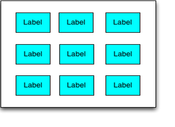

```
//Sample code to build a grid of widgets.
var c = new voltmx.ui.FlexContainer();
c.setDefaultUnit(dp);
c.width =  170;
c.height = 170;

wWidth = 30;
wHeight = 20;
wSpacing = 20;

for (int I = 0; I < 3;  I++ )
{
	for (int J = 0; J < 3 ; J++)
	{
		var label = new Label(“id”, “Label”)

		label.width = wWidth;
		label.height = wHeight;
		label.top =  (I + 1)* spacing  + I* wHeight;
		label.left = (J + 1)* spacing  +  J * wWidth;
		c.add(label);
	}
}

```

### Position the widgets diagonally

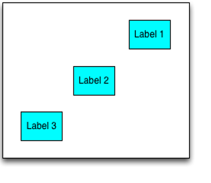

```
//Sample code to position the widgets diagonally. 
var c = new voltmx.ui.FlexContainer();
c.setDefaultUnit(dp);

var label1 = new Label(“id”,“Label1”)
c.add(label1);
var label2 = new Label(“id”,“Label2”)
c.add(label2);
var label3 = new Label(“id”, “Label3”)
c.add(label3);

c.doLayout = function()
{
wWidth = 30;
wHeight = 20;
wSpacing = 20;

label1.width = label2.width = label3.width = wWidth;
label1.height = label2.height = label3.height = wHeight;
label1.right =  20
label1.top = 20;

label2.left = c.frame.width/2 - wWidth/2
label2.top = c.frame.height/2 - wHeight/2

label3.left = 20;
label3.bottom = 20;
}

```

### Position the widgets relative to siblings

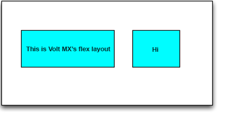

```
//Sample code to position the widgets relative to siblings
var c = new voltmx.ui.FlexContainer();

var label1 = new Label(“Hi”)
c.add(label1);

var label2 = new Label(“Hi”)
c.add(label2);

label1.left = 20;
label1.top = 30
label1.width = voltmx.flex.USE_PREFERRED_SIZE
label1.height = 40

label1.doLayout = function(){

var lab = this.parent.label2;  // accessing the child’s through parent

lab.left = 20 + label1.frame.width /2;
lab.left.top = 30;

label2.width   = label1.frame.width /2
label2. height = 40

}

```

### Overlapping the widgets using zIndex

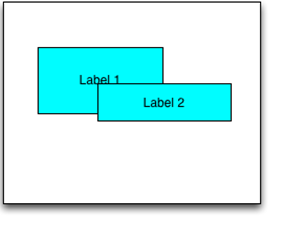

```
//Sample code to overlap the widgets using zIndex 
var label1 = new Label("id", "Label1")
label1.zIndex = 1;
c.add(label1);

var label2 = new Label("id", "Label2")
label1.zIndex = 2;
c.add(label2);

label1.left = 20;
label1.top = 30

label1.width   = 60
label1. height = 50

label1.doLayout = function(){

label2.left = 20 + label1.frame.width /2;
label2.top = 30 + label1.frame.height/2

label2.width   = 80
label2. height = 25

}

```

### Positioning the widgets horizontally

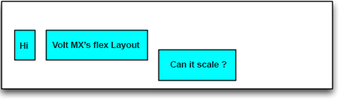

```
//Sample code to position the widgets horizontally
var c = new voltmx.ui.FlexContainer();
//set the container layout type as  VoltMX.Flex.FLOW_HORIZONTAL;

var label1 = new Label("id", "Hi")
c.add(label1);

var label2 = new Label("id", "VoltMX’s Flex Layout")
c.add(label2);

var label3 = new Label("id", "Can it scale ?")
c.add(label3);

label1.top = label2.top = 20;
label3.top = 30

label1.left = label2.left = label3.left = 5;

label1.width = label2.width = label3.width = voltmx.flex.USE_PREFERRED_SIZE

label1.height = label2.height = label3.height = 50
```

### Stacking the widgets vertically

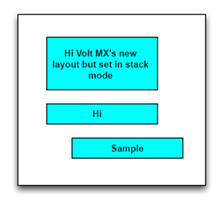

```
//Sample code to stack the widgets vertically
var c = new voltmx.ui.FlexContainer();
//set the container layout type as  VoltMX.Flex.FLOW_VERTICAL;

var label1 = new Label(“id”, “Hi VoltMX’s new layout but set in stack mode”)
c.add(label1);

var label2 = new Label(“id”, “Hi”)
c.add(label2);

var label3 = new Label(“id”, “Sample”)
c.add(label2);

label1.left = label2.left = 30;
label3.left = 40

label1.top = label2.top = label3.top = 5;

label1.width = label2.width = label3.width = 60

label1.height = label2.height = label3.height = voltmx.flex.USE_PREFERRED_SIZE

```

### Wrapping the text when it reaches the specified width

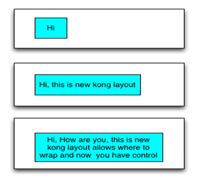

```
//Sample code to wrap the text when it reaches the specified width
var c = new voltmx.ui.FlexContainer();

var label1 = new Label("id", "text")
c.add(label1);

label1.text = // Data is fed from net work

label1.left = 20;
label1.top = 20;
label1.maxWidth = 80
label1.height = voltmx.flex.USE_PREFERRED_SIZE

```

### Wrapping the text when it reaches the parent boundaries

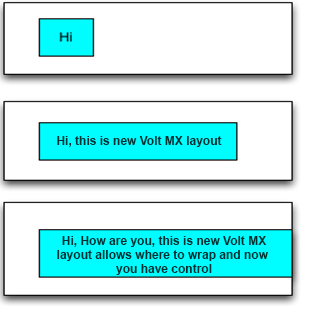

```
//Sample code to wrap the text when it reaches the parent boundaries
var c = new voltmx.ui.FlexContainer();

var label1 = new Label(“id”, “text”)
c.add(label1);

label1.text = // Data is fed from net work

c.doLayout = function()
{
label1.left = 20;
label1.top = 20;
label1.maxWidth =  c.frame.width - 20 
label1.height = voltmx.fLex.USE_PREFERRED_SIZE;
}

```

### Widget occupying the available horizontal space

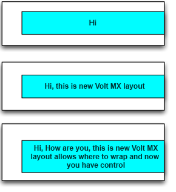

```
//Sample code of widget occupying the available horizontal space
var c = new voltmx.ui.FlexContainer();

var label1 = new Label("id", "text")
c.add(label1);

label1.text = // Data is fed from net work

label1.left = 20;
label1.top = 20;
label1.right = 0;
label1.height = voltmx.flex.USE_PREFERRED_SIZE

```

### Widget occupying the available vertical space

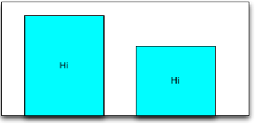

```
//Sample code of widget occupying the available vertical space
var c = new voltmx.ui.FlexContainer();

var label1 = new Label("id", "Hi")
c.add(label1);

var label2 = new Label("id", "Hi")
c.add(label2);

label1.left = 20;
label1.top = 20;

label2.right = 30;
label2.top = 50;

label1.bottom = 0;
label1.width = 50;

```

### widget to occupy its preferred size without any given height or width

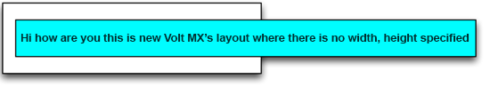

```
//Sample code of a widget to occupy its preferred size without any given height or width
var c = new voltmx.ui.FlexContainer();
c.clipBounds = false;

var label1 = new Label(“id”, “text”)
c.add(label1);

label1.text = // Data is fed from net work

label1.left = 20;
label1.top = 20;

```

### Widget position in center and offset from left and right boundaries

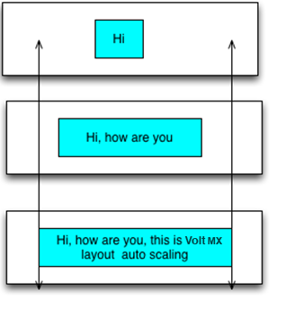

```
//Sample code of widget position in center with width to grow maximum and with a minimum 
offset from left and right boundaries.
var c = new voltmx.ui.FlexContainer();

var label1 = new Label("id", "text")
c.add(label1);

label1.text = // Data is fed from net work
label1.minWidth = 20; 
label1.maxWidth = 80; 
label1.height = voltmx.flex.USE_PREFERRED_SIZE

label1.center = {80,80};

```
