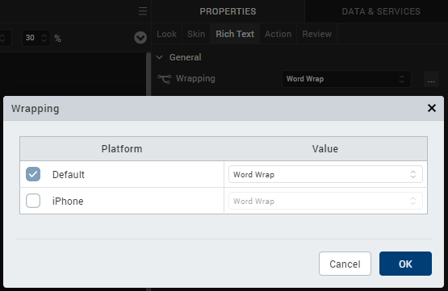
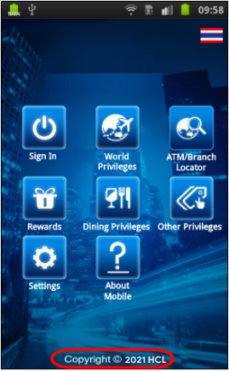
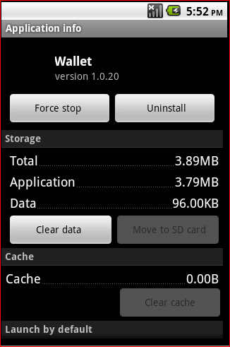
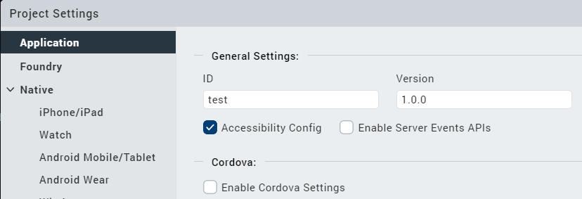
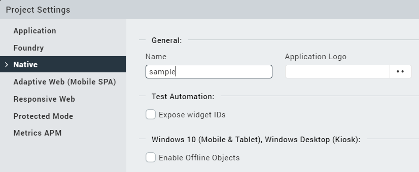
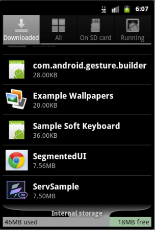
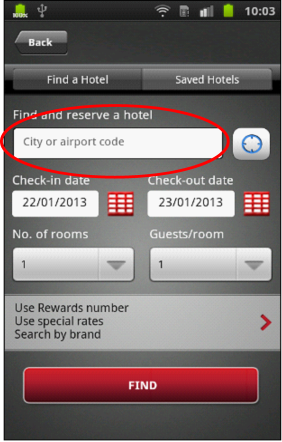

                          

Volt MX  Application Design and Development Guidelines: [Application Design Guidelines](Application_Design_Guidelines_Overview.md) > [UI Guidelines](UI_Guidelines.md) > Text and Grammar across the Application

General User Interface (UI) Guidelines
--------------------------------------

### Guidelines for Text and Grammar across the Application

Following are the guidelines for text and grammar across the application.

*   Verify spelling and grammar on the screen.
*   Capitalization of letters in the middle of a sentence should not be there unless required specifically
*   Verify text does not get wrapped when it should not, for example, when displaying phone numbers in RichText or Label. Wrapping can be either char based or word based.

*   Check for white spaces in between text.
    

### Guidelines for Container Widgets

Use the container widgets only when required. For example, placing a single label in the HBox or the VBox is not an optimal usage of the boxes.

### Guidelines for Skins

Following are guidelines for skins.

*   Do not create too many skins
    *   Remove all unused images and skins from the project, as it unnecessarily increases the binary size.
*   Use skins with gradients
    
    *   Use skins with gradients (vertical and split) instead of images to achieve the same look and feel. If you use images, you should provide images for different form factors.
    
    *   Usage of images increases the size of the binary file.
*   Skin (background/controls/images) should be consistent across the screens.
*   Ensure that you do not set layout properties for widgets in the formController to avoid the properties from being overridden at runtime. HCL recommends that you set the layout properties from the Properties panel of Volt MX Iris.

### Guidelines for Orientation Support

Building the application in both orientations

*   If the application is targeted for both the orientations, then it is recommended to either fork the forms or to use the percentage (%) based margins and paddings, so that the user interface is not distorted between the orientations.

### Guidelines for Headers and Footers

Following are the guidelines for Headers and Footers.

*   Headers and Footers should not exceed 30% of the screen height: 
    
    *   Make sure that the headers and footers do not exceed 30% of the screen height.
    
    *   This is to ensure that there is enough area for scrollable content in the page.
    
    *   If you severely restrict the data area for the form, the user will have to scroll a lot more to see the content.
*   The screen header and footers should be docked unless specified otherwise.
*   Headers and footers should be consistent across screens.

### Guidelines for Copyright

Following are the guidelines for Copyright.

*   Make sure that the copyright year should be Current year.
*   Copyright year image – © should be center aligned with the text.

### Guidelines for Application Info

About the app should have the version of the application and this should be present in all apps.

*   Version can be configured from the application properties window as follows.

*   Application display name can be configured from application properties as follow.

### Guidelines for Application Icon in Phone Settings

Application icon should be displayed in Installed/Uninstall Applications in the Phone Settings.

### Other Guidelines

*   Button size / shapes should be consistent across the screens and as per client requirements.
*   Set the field-type for all the input fields:
    *   Make sure to set the field-type for all user input fields. For example, the field-type (keyboard type) should be numeric if you have a field that expects the ZIP code to be entered.
*   Avoid including text in images as: 
    
    *   Supporting internationalized content would require multiple skins.
    *   It increases application size.
    
    *   It creates maintenance issues if the application supports internationalized content.
*   For Textboxes, use placeholder property appropriately.

*   Trademark Symbol should be super scripted to Normal Text.
    
*   Mark Symbol should be present beside the Application Logo throughout the application unless specified otherwise.
    
*   The Application logo will be center aligned within the screen header unless specified otherwise.
    
*   Size of Vertical scroll bar while scrolling should not distort the application UI.
    
*   Clickable indicator for rows in a segment (iOS):
    
    *   On iOS segment record that has the details should consist an arrow “ > “ image unless specified otherwise. This indicates the row is clickable.
    *   The arrow image for the segment to be shown only if the record has further information or data to display (e.g., list of flights followed by the flight details in the subsequent screen).
    *   On iOS platform the arrow appears by default unless indicator defined as SEGUI\_NONE. However, to achieve this look on other platforms do the following.
        *   Add an extra image widget to the segment.
        *   Configure (arrow) image as source to the extra image field in the segment.
        *   Configure the correct version in the application properties window as follows.
        
        
        
        *   Configure the application display name from application properties windows as follow
            
            
            
        *   Only one tab in accordion view should be displayed with content at a time and shown as selected.
        *   Only one Radio button should be selectable at a time.
        *   Portrait/Landscape orientation should be verified wherever applicable.
        *   Selected Radio button should be retained after navigating back from other screens.
        *   The font size in the drop-down boxes to be same.
        *   The Text alignment within the Text field should be center aligned.
        *   Widgets in the Application should be docked. Should scroll with the screen, should not move if screen is not moving.
        *   If Any search option is present in the application- If application displays “ Showing / displaying 25 results “ , in that page total 25 results should get displayed. In Case if application Displaying 10 results in a screen , then message should be “ Showing 10 Results out of 25 “ with a Next button .
        *   When there are Next (>) and Previous (<) buttons (in the case of search results, photo galleries), in the first screen, Previous (<) should be disabled and in the last screen, Next (>) should be disabled.
        *   Non pagination scenario – if there are a few more results to be shown in the same screen after clicking on some button, then, new results should append to the existing. Here the focus should not go up/down. Should exactly be at the pixel where we clicked to view more results.
        *   Scrolling down to the application – data refresh should be seamless (Dependent on Network coverage)
        *   Phone Numbers in the application
            1.  On focus on the Skin should be Off after user cancels or performs a call, .i.e (when user Performs a call or exits the call, the particular Phone Number should have not have focus).
