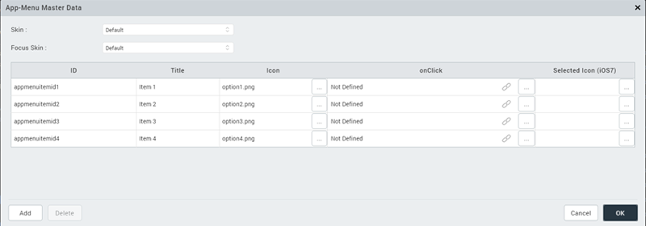
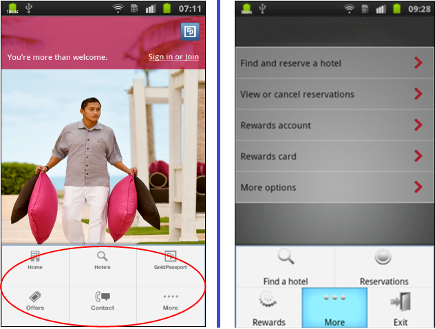

                           

Volt MX  Application Design and Development Guidelines: [Application Design Guidelines](Application_Design_Guidelines_Overview.md) > [UI Guidelines](UI_Guidelines.md) > iOS

Guidelines for App Menu
-----------------------

### iOS

Guidelines for the image resolutions to be used.

  
| Image | Size |
| --- | --- |
| Tab bar image (normal) | 30 x 30 pixels |
| Tab bar image (@2x) | 60 x 60 pixels |

*   A maximum of five app menu items can displayed on the screen.
*   Be sure to avoid using images that replicate Apple products in your designs. These symbols are copyrighted and product designs can change frequently.
*   If we have 4 menu options at the bottom of the screen. Once the user logs out from the application and login's again, the first menu button should be in Focus.

**Reference**: [Guidelines for iOS](http://developer.apple.com/library/ios/)

### Android

Guidelines for the image resolutions to be used:

  
| Image | Size |
| --- | --- |
| Square Icon (ldpi) | 22 x 22 pixels |
| Square Icon (mdpi) | 30 x 30 pixels |
| Square Icon (hdpi) | 44 x 44 pixels |

*   Do not provide an Exit button in the application unless it is absolutely required. Android is a multi-tasking platform and the application can exist in the background. This allows the users to get back to the application quickly.
*   Be sure to avoid using images that replicate Android products in your designs. These symbols are copyrighted and product designs can change frequently.

### Windows
Guidelines for Windows App menu:

* App menu items should have an icon and should have a text hint.
* App menu items should be 48 x 48 pixels and have a white
  foreground on a transparent background using an alpha channel.
* The number of items displayed in an app menu is limited to five.
* Do not provide an Exit button for the application.

### General Guidelines for App Menu

General guidelines for App menu:

*   In iOS, for each menu item you have to provide an image for selected appearance.
*   Active menu page should be in Focus
    *   If user is at Home Screen, Home menu should be in focus.
    *   If user is at Insurance/ travel page, the Insurance / travel menu button should be in focus.

*   Clicking the Application Menu should only show a form and not include time consuming logic like invoking services. This behavior is imposed by the underlying SDK and non-adherence to this guideline will lead to degraded user experience. Ideally as soon as an Application Menu is clicked, the user should be able to view the target form without any perceived delay. In case, the form requires the data to be populated from a network.

### Configure an App Menu

### App Menu Examples

