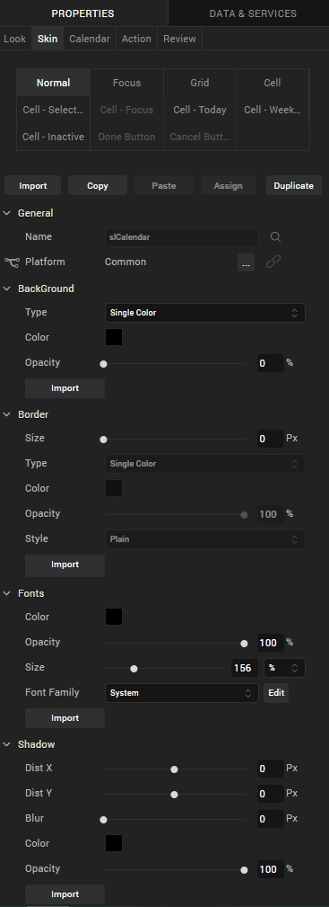
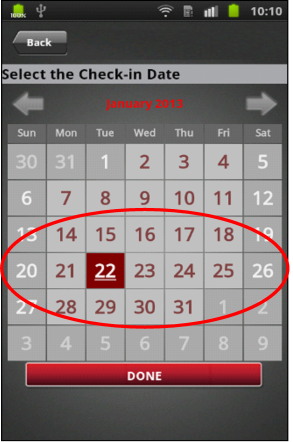
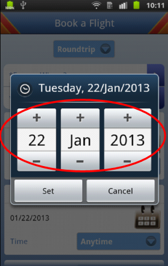

                          

Volt MX  Application Design and Development Guidelines: [Application Design Guidelines](Application_Design_Guidelines_Overview.md) > [UI Guidelines](UI_Guidelines.md) > Guidelines for Calendar Widget

Guidelines for Calendar Widget
------------------------------

Following are the guidelines for Calendar widget.

*   Calendar widget – current date
    *   Current Date in the Calendar widget of the application should be in Focus/Bold font, rest that can be selected should be in another normal color font while those that cannot be selected should be grayed out.
*   Calendar skinning can be done using the viewConfig property (introduced in 5.0) as follows.
    
    
    

 
