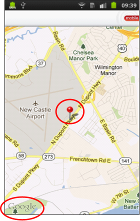
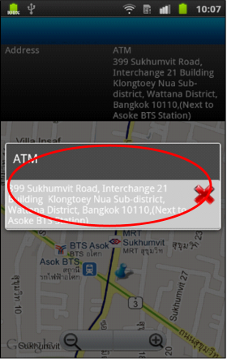

                          

Volt MX  Application Design and Development Guidelines: [Application Design Guidelines](Application_Design_Guidelines_Overview.md) > [UI Guidelines](UI_Guidelines.md) > Map Widget Examples

Guidelines while using Map Widget
---------------------------------

Following are the guidelines while using Map widget.

*   Understand that Map widget is a heavy widget which occupies lot of memory.
*   Avoid using multiple Map widgets
    *   Use a single Map widget and write the code in such a way that data is redirected to the same widget.
*   Make sure to use proper branding while using external interface like Google Maps.
    *   Ensure that the Google Map Widget or any other such external interface has it branding associated with it. If you do not do this, the application may be rejected when you submit the application for approval at respective App stores.
*   Set Map widget as a ScreenLevel widget, making so will optimize the memory used by the Map widget.
*   The Pins on the Map should be easily clickable.
*   If an application displays 10 results for a search result in a Map, then 10 Pins should get displayed in the map representing each Result.

### Map Widget Examples

 
