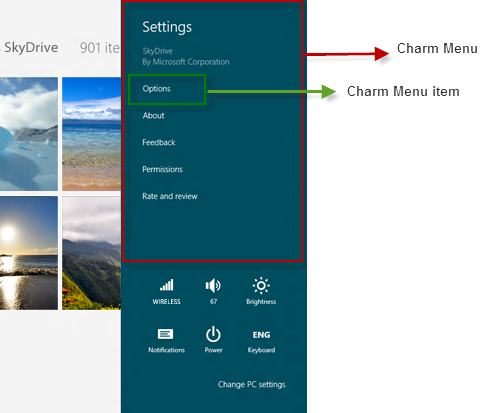

                            

You are here: Charm Setting API

Charm Setting API
=================

The Charms is a feature available on Windows which provides access to various application settings such as About, Feedback, and Permissions. The settings can be configured to control an application's access to system capabilities and some specific settings of the current application. To view the Charm settings pane, swipe from the right side of the screen from right to left. For more information about Charm settings, refer [Charm Settings](http://msdn.microsoft.com/en-us/library/windows/apps/hh770544.aspx).

The Charm Setting API enables you to create a Charm menu, add and remove the Charm menu items.

> **_Important:_** These functions are supported on Windows only.

The Charm Setting API uses `voltmx.application Namespace` and the following API elements.

  
| Function | Description |
| --- | --- |
| [voltmx.application.createSettingsMenu](voltmx.application_functions_charmsapi.md#crtSetMn) | Enables you to create a Charm settings menu for an application. |
| [voltmx.application.setCurrentSettingsMenu](voltmx.application_functions_charmsapi.md#setsetmn) | Uses the unique identifier which represents the Charm settings menu and sets it as current settings menu. |
| [voltmx.application.getCurrentSettingsMenu](voltmx.application_functions_charmsapi.md#getcurmn) | Returns the unique identifier of the current menu that is set through getCurrentSettingsMenu. |
| [voltmx.application.addSettingsMenuItemAt](voltmx.application_functions_charmsapi.md#addsetmn) | Enables you to add a menu item at a given index in the Charm settings menu. |
| [voltmx.application.removeSettingsMenuItemAt](voltmx.application_functions_charmsapi.md#rvsetmnu) | Enables you to removes the specified App Menu item based on the index. |

 

To create a Charm settings menu for an application, use the [voltmx.application.createSettingsMenu](voltmx.application_functions_charmsapi.md#crtSetMn) function. You can get the unique identifier of the current menu by using the [voltmx.application.getCurrentSettingsMenu](voltmx.application_functions_charmsapi.md#getcurmn) function. With the unique identifier of the Charm menu, you can set the menu as the current settings menu using the [voltmx.application.setCurrentSettingsMenu](voltmx.application_functions_charmsapi.md#setsetmn) function.

With this information, you can add a menu item at a given index in the Charm settings menu using the [voltmx.application.addSettingsMenuItemAt](voltmx.application_functions_charmsapi.md#addsetmn) function. If you want to delete a menu item from a given index, use the [voltmx.application.removeSettingsMenuItemAt](voltmx.application_functions_charmsapi.md#rvsetmnu) function.

