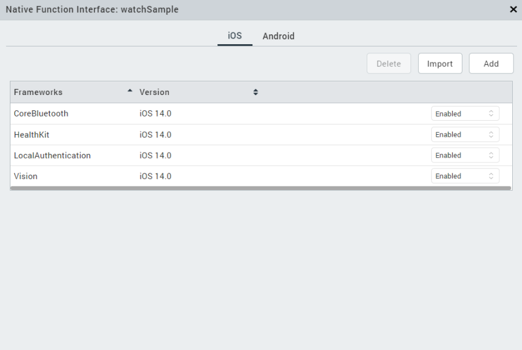
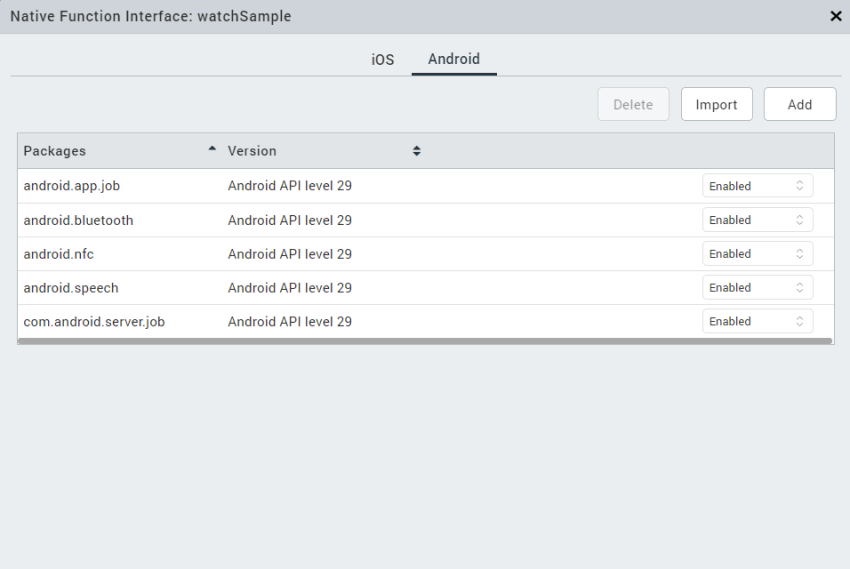

                            

Enabling\_Native\_Function\_APIs (for pre-packaged APIs)
========================================================

Enabling Native Function APIs in Volt MX Iris Classic
--------------------------------------------------------

A few APIs are already pre-packaged with the Volt MX Irisand do not need to be explicitly imported.

To enable Native Function APIs Volt MX Iris for iOS platform, follow these steps:

1.  From your Volt MX Iris, go to the **Application Properties** window.
2.  Navigate to Native > iPhone/iPad tab, and select **Enable Native Function APIs (HealthKit, Apple Pay)**.
    
    
    
3.  Click **Finish**.

To enable Native Function APIs Volt MX Iris for Android platform, follow these steps:

1.  From your Volt MX Iris, go to **Application Properties** window.
2.  Navigate to Native > Android tab, and select **Enable Native Function APIs (NFC, JobScheduler, Speech, Bluetooth)**.
    
    
    
3.  Click **Finish**.

