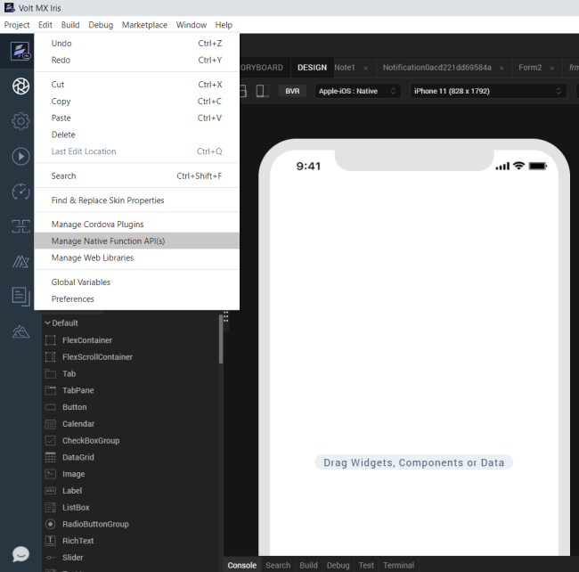
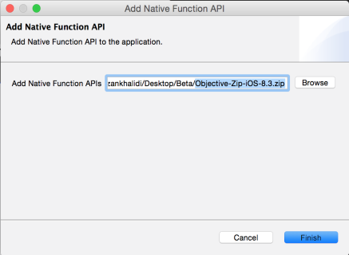
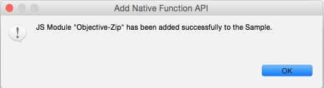
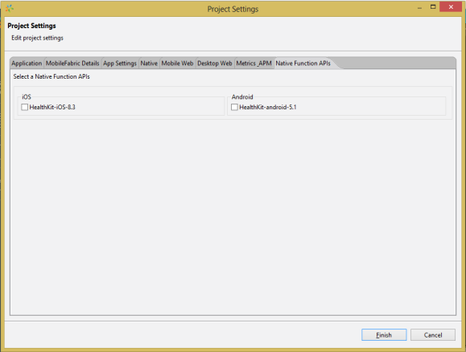

                            

Importing the Native Function API Volt MX Iris
====================================================

To import the Native Function API, follow the below steps:

1.  Download the appropriate Native Function API from [http://community.hclvoltmx.com/downloads](http://community.hclvoltmx.com/downloads).
2.  Under **VoltMX Iris**, click the **VoltMX v7.0 GA** tab.
3.  In the **VoltMX IrisNative Function APIs** section, click the required Native Function to download its zip file.
4.  Open the **VoltMX Iris**.
5.  On the **Edit** menu, click **Add Native Function API**. The **Add Native Function API** dialog box opens.

7.  In the **Add Native Function API** box, select the Native Function API zip file that you want to import using the **Browse** button.

9.  Click **Finish**. The success message box appears.

11.  Click **OK**.
12.  Click the **Project Settings** icon. The **Project Settings** window opens with the **Native Function APIs** tab added.

14.  Click the **Native Function API** tab. The tab opens with the name of the native functionality that is imported. The native functionality is displayed with check box under the platform to which it is applicable.
15.  Select the check box and click **Finish**.

