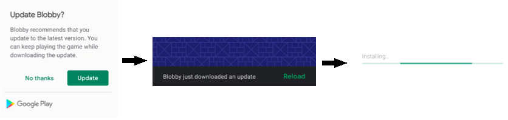
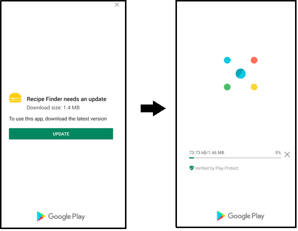

                            

You are here: In-App Updates API

In-App Updates
==============

On devices that use Target SDK API version 21 (and above), the Google Play Core library allows in-app updates. By using the In-App Update APIs, the app developer can notify the user (when the user is in the context of the app) that an app update is available for download.

The Google Play Core library offers the following methods to notify a user about the availability of an app update:

*   [Flexible approach](#Flexible)
*   [Immediate approach](#Immediate)

<h3 id="Flexible">Flexible approach</h3>

The flexible approach provides a user experience that supports the download and installation of the update in the background and has a graceful state monitoring. Developers can use this approach when an app update does not affect the core functionality of the app, or contains a new feature. Use this approach when it is acceptable for the user to continue using the app while the update is downloaded and installed in the background.

Here is an example flow of the flexible app update approach:

<h3 id="Immediate">Immediate approach</h3>

The immediate approach provides a full-screen user experience that requires a user to update and restart the app to continue using the app. Developers can use this approach when an app update is critical and affects the core functionality of the app.

Here is an example flow of the immediate app update approach:

The In-App Update APIs use the `voltmx.gms Namespace` and contains the following functions.

  
| Function | Description |
| --- | --- |
| [voltmx.gms.checkForAppUpdate](voltmx.application_in-app_updates_functions.md#checkForAppUpdate) | Checks if an update is available. |
| [voltmx.gms.completeAppUpdate](voltmx.application_in-app_updates_functions.md#completeAppUpdate) | Completes the app update by installing the downloaded update. |
| [voltmx.gms.registerAppUpdateListener](voltmx.application_in-app_updates_functions.md#registerAppUpdateListener) | Register callbacks to monitor the install status of app update. |
| [voltmx.gms.requestForAppUpdate](voltmx.application_in-app_updates_functions.md#requestForAppUpdate) | Starts the app update, if an update is available. |
| [voltmx.gms.unregisterAppUpdateListener](voltmx.application_in-app_updates_functions.md#unRegisterAppUpdateListener) | Unregister from callbacks that were registered to by using the voltmx.gms.registerAppUpdateListener API. |

