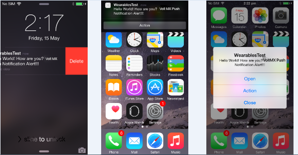

                            


voltmx.notificationsettings Namespace
===================================

The voltmx.notificationsettings namespace provides the following API elements.

Functions
---------

The voltmx.notificationsettings namespace provides the following functions.

voltmx.notificationsettings.createAction
--------------------------------------

This API helps you create an action that can be used with category.

**Syntax**

voltmx.notificationsettings.createAction (actionId, label, pspConfig)

**Input Parameters**

| Parameter | Description |
| --- | --- |
| actionId \[String\] - Mandatory | Specifies a unique ID to identify the action chosen by a user. |
| label \[String\] - Mandatory | Specifies a label that needs to be associated with a action. |
| pspConfig \[JSObject\] - Mandatory | Specifies the configuration function. The parameters follow: image \[Number\] - Mandatory: This parameter is applicable only on the Android platform. Set the image to be displayed for notification settings. activationMode \[Number\] - Mandatory: Specifies the activation mode. The options are:voltmx.notificationsettings.ACTIVATION\_MODE\_FORWARDS: If you set this option, the action will occur in the foreground and launches the application interface. voltmx.notificationsettings.ACTIVATION\_MODE\_BACKWARDS: If you set this option, the action will occur in the background without launching the application interface.> **_Note:_** The activationMode property is applicable only for the iOS platform. authenticationRequired \[Boolean\] - Mandatory: This parameter is applicable only on iOS platform. This parameter is applicable only when you set activationMode as voltmx.notificationsettings.ACTIVATION\_MODE\_BACKWARDS. The user needs to unlock the device, and action occurs in the background. destructive \[Boolean\] - Mandatory: This parameter is applicable only on iOS platform. Set this value to true, if the notification is self destructive. Otherwise, set it to false. visibleOn \[String\] - Mandatory: Set this parameter to display the notification on a watch, or both watch and phone. The options are:voltmx.notificationsettings.WATCH\_ONLYvoltmx.notificationsettings.BOTH |

 

**Example**

```
/*************************************************************************************
 * Function:registerActions()
 * Description: Creates Actions and a Category.
 * Author: Volt MX
 *************************************************************************************/
function registerActions() {
    var accept = voltmx.notificationsettings.createAction({
        "id": "Accept",
        "label": "Accept",
        "pspConfig": {
            "authenticationRequired": true,
            "destructive": true,
            "activationMode": voltmx.notificationsettings.ACTIVATION_MODE_FORWARDS,
            "visibleOn": voltmx.notificationsettings.BOTH
        }
    });

    var reject = voltmx.notificationsettings.createAction({
        "id": "Reject",
        "label": "Reject",
        "pspConfig": {
            "authenticationRequired": false,
            "destructive": false,
            "activationMode": voltmx.notificationsettings.ACTIVATION_MODE_FORWARDS,
            "visibleOn": voltmx.notificationsettings.BOTH
        }
    });

    var decline = voltmx.notificationsettings.createAction({
        "id": "Decline",
        "label": "Decline",
        "pspConfig": {
            "activationMode": voltmx.notificationsettings.ACTIVATION_MODE_BACKWARDS,
            "authenticationRequired": true,
            "destructive": false,
            "visibleOn": voltmx.notificationsettings.BOTH
        }
    });


    var defaultActionContextArr = [accept, reject, decline];
    var minimalActionContextArr = [accept, reject];

    var categoryObj = voltmx.notificationsettings.createCategory({
        "categoryId": "invitation",
        "actions": defaultActionContextArr,
        "pspConfig": {
            "minimalActions": minimalActionContextArr
        }
    });


    //Using voltmx.notificationsettings.registerCategory 

    var categoryArr = [categoryObj];

    var registerCategory = voltmx.notificationsettings.registerCategory({
        "categories": categoryArr,
        "pspConfig": {
            "types": [0, 1, 2]
        }
    });

}
```

**Return values**

This API returns action as a JavaScript object.

Platform Availability

Available on iOS and Android platforms.

voltmx.notificationsettings.createCategory
----------------------------------------

This API helps you create a category with a group of created actions.

**Syntax**

voltmx.localnotifications.createCategory (categoryId, actions, pspConfig:{minimalActions:\[actions\] , presentationOptions});

**Input Parameters**

| Parameter | Description |
| --- | --- |
| categoryId \[String\] - Mandatory | Specifies a unique ID for the group of actions that are defined. |
| actions \[array\] - Mandatory | Specifies the actions that are associated with the category. Pass null, if no actions are associated with the category.> **_Note:_** In Default Context, you cannot add more than four actions on the iOS platform and three actions in the Android platform. |
| pspConfig \[JSObject\] - Mandatory | Specifies the configuration function. The parameter is:minimalActions \[array\] - Mandatory: This parameter is applicable only on the iOS platform. Specify the actions that are to be associated for minimal actions for the category. presentationOptions \[array\] - You can use this parameter to configure the presentation options of notifications. This is a iOS-specific parameter. This parameter is available from V9 SP2 onwards.You can pass an array of the following values:UNNotificationPresentationOptionBadge – 0: adds the notification badge icon.UNNotificationPresentationOptionSound – 1: plays the sound.UNNotificationPresentationOptionAlert – 2: displays the notification banner.> **_Note:_** In default mode, you cannot add more than two actions. |

**Return Values**

This API returns category as a JavaScript object.

**Remarks**

*   If the presentationOptions parameter is not set, it is considered as no options are set and onlineNotification will not be shown.
    
*   Only the mentioned values of presentationOptions must be passed as array.
    
*   The input values for presentationOptions must consist of an array of minimum one value to a maximum of all three values. These options are applicable for all kinds of notifications.
    
*   Onclick of notification banner triggers the onlinenotification callback when the app is in foreground/active state, whereas the offlinenotification callback is triggered when the app is in background/inactive state.
    

**Platform Availability**

Available on iOS and Android platforms.

**Example**

Example 1:

```
var categoryObj = voltmx.notificationsettings.createCategory({
    "categoryId": "invitation",
    "actions": defaultActionContextArr,
    "pspConfig": {
        "minimalActions": minimalActionContextArr,
        "presentationOptions": [0, 1, 2]
    }
});
```

Example 2:

```
/*************************************************************************************
 * Function:registerActions()
 * Description: Creates Actions and a Category.
 * Author: Volt MX
 *************************************************************************************/
function registerActions() {
    var accept = voltmx.notificationsettings.createAction({
        "id": "Accept",
        "label": "Accept",
        "pspConfig": {
            "authenticationRequired": true,
            "destructive": true,
            "activationMode": voltmx.notificationsettings.ACTIVATION_MODE_FORWARDS,
            "visibleOn": voltmx.notificationsettings.BOTH
        }
    });

    var reject = voltmx.notificationsettings.createAction({
        "id": "Reject",
        "label": "Reject",
        "pspConfig": {
            "authenticationRequired": false,
            "destructive": false,
            "activationMode": voltmx.notificationsettings.ACTIVATION_MODE_FORWARDS,
            "visibleOn": voltmx.notificationsettings.BOTH
        }
    });

    var decline = voltmx.notificationsettings.createAction({
        "id": "Decline",
        "label": "Decline",
        "pspConfig": {
            "activationMode": voltmx.notificationsettings.ACTIVATION_MODE_BACKWARDS,
            "authenticationRequired": true,
            "destructive": false,
            "visibleOn": voltmx.notificationsettings.BOTH
        }
    });


    var defaultActionContextArr = [accept, reject, decline];
    var minimalActionContextArr = [accept, reject];

    var categoryObj = voltmx.notificationsettings.createCategory({
        "categoryId": "invitation",
        "actions": defaultActionContextArr,
        "pspConfig": {
            "minimalActions": minimalActionContextArr
        }
    });


    //Using voltmx.notificationsettings.registerCategory 

    var categoryArr = [categoryObj];

    var registerCategory = voltmx.notificationsettings.registerCategory({
        "categories": categoryArr,
        "pspConfig": {
            "types": [0, 1, 2]
        }
    });

}
```

voltmx.notificationsettings.registerCategory
------------------------------------------

This API helps you register the created category with the application.

**Syntax**

voltmx.notificationsettings.registerCategory (categories, pspConfig)

**Input Parameters**

| Parameter | Description |
| --- | --- |
| category \[array\] - Mandatory | Specifies the category objects that are to be registered. |
| pspConfig \[JSObject\] - Optional | This parameter is applicable on iOS platform only. It specifies the platform specific configuration function. The arguments are:
> types \[String\] - Mandatory: Configure this parameter to register the type of notification. The Array for iPhone must contain **any** or **all** of the following:0 - Specifies the notification type as Badge.1 - Specifies the notification type as Sound.2 - Specifies the notification type as Alert.> **_Note:_** If the types are not passed or pspConfig is not defined, then all the notification types are registered by the API.> **_Note:_** If the same API is invoked multiple times, the details of the last invoked call are updated.

 |

**Example**

```
/*************************************************************************************
 * Function:registerActions()
 * Description: Creates Actions and a Category.
 * Author: Volt MX
 *************************************************************************************/
function registerActions() {
    var accept = voltmx.notificationsettings.createAction({
        "id": "Accept",
        "label": "Accept",
        "pspConfig": {
            "authenticationRequired": true,
            "destructive": true,
            "activationMode": voltmx.notificationsettings.ACTIVATION_MODE_FORWARDS,
            "visibleOn": voltmx.notificationsettings.BOTH
        }
    });

    var reject = voltmx.notificationsettings.createAction({
        "id": "Reject",
        "label": "Reject",
        "pspConfig": {
            "authenticationRequired": false,
            "destructive": false,
            "activationMode": voltmx.notificationsettings.ACTIVATION_MODE_FORWARDS,
            "visibleOn": voltmx.notificationsettings.BOTH
        }
    });

    var decline = voltmx.notificationsettings.createAction({
        "id": "Decline",
        "label": "Decline",
        "pspConfig": {
            "activationMode": voltmx.notificationsettings.ACTIVATION_MODE_BACKWARDS,
            "authenticationRequired": true,
            "destructive": false,
            "visibleOn": voltmx.notificationsettings.BOTH
        }
    });


    var defaultActionContextArr = [accept, reject, decline];
    var minimalActionContextArr = [accept, reject];

    var categoryObj = voltmx.notificationsettings.createCategory({
        "categoryId": "invitation",
        "actions": defaultActionContextArr,
        "pspConfig": {
            "minimalActions": minimalActionContextArr
        }
    });


    //Using voltmx.notificationsettings.registerCategory 

    var categoryArr = [categoryObj];

    var registerCategory = voltmx.notificationsettings.registerCategory({
        "categories": categoryArr,
        "pspConfig": {
            "types": [0, 1, 2]
        }
    });

}
```

**Return Values**

None

**Platform Availability**

Available on iOS and Android platforms.

Handling Local and Remote Notifications Callbacks:

*   If the app is in the foreground state (app instance alive), an onlinecallback should be invoked.
*   If the app is in background state (app instance alive or not alive), an offlinecallback should be invoked.



voltmx.notificationsettings.pickTitleAndDescriptionFromPushPayload
----------------------------------------------------------------

Once you set the voltmx.notificationsettings.pickTitleAndDescriptionFromPushPayload API as true, the Title and Description details of the payload are considered. By default, the Title and Description information of the payload are not respected.

**Syntax**

voltmx.notificationsettings.pickTitleAndDescriptionFromPushPayload  
(pickTitleAndDescriptionFromPushPayloadKey)

**Input Parameters**

| Parameter | Description |
| --- | --- |
| pickTitleAndDescriptionFromPushPayloadKey \[Boolean\] - Mandatory | Set this input parameter as true to ensure that the Title and Description data of the payload are taken into consideration. |

 

**Example**

```
var pickTitleAndDescriptionFromPushPayloadKey = true;
voltmx.notificationsettings.pickTitleAndDescriptionFromPushPayload (pickTitleAndDescriptionFromPushPayloadKey);

```

**Remarks**

*   The Boolean value that is passed in the pickTitleAndDescriptionFromPushPayloadKey input parameter is stored in Shared Preferences.
    

**Platform Availability**

*   Android

voltmx.notificationsettings.setProperties
---------------------------------------

You can use the voltmx.notificationsettings.setProperties API to set various properties of notifications that belong to a category.

**Syntax**

setProperties(categoryId, properties)

**Input Parameters**

| Parameter | Description |
| --- | --- |
| categoryId | The category ID of the notification for which the priority is set. The value type of categoryId is String. |
| properties | The configuration object of the category. The value type of properties is JSON object.Currently, the JSON object contains the priority key.**priority:** A property for setting priority to the notification object related to a category. The value type of priority is constant.The priority key contains one of the following constants:constants.NOTIFICATION\_PRIORITY\_DEFAULT: Default notification priority.constants.NOTIFICATION\_PRIORITY\_HIGH: Higher notification priority is set for important notifications.constants.NOTIFICATION\_PRIORITY\_LOW: Lower notification priority is set for notifications that are less important.constants.NOTIFICATION\_PRIORITY\_MAX: Highest notification priority is set for an app's most important items that require the end user's prompt inputs.constants.NOTIFICATION\_PRIORITY\_MIN: Lower notification priority is set for items that are less important. You can choose to display these items in a smaller size, or at a different position in the list compared to the app's PRIORITY\_DEFAULT items. |

**Example**

```
propTable = {};
propTable.priority = constants.NOTIFICATION_PRIORITY_HIGH;
setProperties({
    categoryId: "invitation",
    properties: propTable
});
```

**Platform Availability**

Android

voltmx.notificationsettings.setShowBadge
--------------------------------------

This API helps you to enable or disable notification badges for push/remote or local notifications that are only supported by Volt MX Iris Framework. By default, the visibility of the notification badge is set to true on Android 8.0 devices.

**Syntax**

voltmx.notificationsettings.setShowBadge(notificationChannelName, showBadgeValue)

**Input Paramters**

| Parameter | Description |
| --- | --- |
| notificationChannelName \[String\] - Mandatory | The following values are applicable for this parameter:"localNotification""pushNotification" |
| showBadgeValue \[Boolean\] - Mandatory | Set this value to false to disable the visibilty of the app notification badge. |

**Example**

```
var notificationChannelName = "pushNotification";
var showBadgeValue = false;
voltmx.notificationsettings.setShowBadge(notificationChannelName, showBadgeValue);
```

**Remarks**

*   You must call this API in **preapp init**, as the badge visibility can only be set after the first notification is received. This is because the channel creation is done after the first notification is initiated; once the channel creation is done, the visibility of the notification badge cannot be modified.
*   Some launchers may not support the Notification Badge feature, even on devices with Android 8.0 and later.

**Platform Availability**

*   Android 8.0 and later


