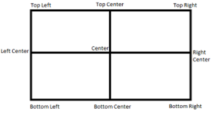

                            

### voltmx.map Namespace Constants

The voltmx.map namespace defines the following constants.

Map Provider Constants

* * *

The Map Provider Constants enable your app to select which map provider to use.

| Constant | Description |
| --- | --- |
| voltmx.map.MAP\_PROVIDER\_BING | Select Bing as the map provider. |
| voltmx.map.MAP\_PROVIDER\_GOOGLE | Select Google as the map provider. |

  

Map View Mode Constants

* * *

Use the Map View Mode Constants to configure which map view your app selects.

| Constant | Description |
| --- | --- |
| voltmx.map.MAP\_VIEW\_MODE\_NORMAL | View the map in whatever mode is the default for the map provider. |
| voltmx.map.MAP\_VIEW\_MODE\_SATELLITE | View the map as a satellite image. |
| voltmx.map.MAP\_VIEW\_MODE\_STREET | View the map as a street map. |
| voltmx.map.MAP\_VIEW\_MODE\_TRAFFIC | View traffic information on the map. |

  

Map Widget Error Codes

* * *

The following table lists the error codes that the Map widget generates.

| Constant | Description |
| --- | --- |
| voltmx.map.ROUTE\_SEARCH\_INVALID\_REQUEST | The format of the route search request was invalid. |
| voltmx.map.ROUTE\_SEARCH\_LIMIT\_EXCEEDED | The service has received too many requests from your application within the allowed time period. For Android, below are the usage limits imposed by Google Map Service. Up to 8 waypoints for Google Map free API and 23 waypoints for Google Map for Work in each request 2500 & 100000 direction requests per 24 hour period for free API and work api respectively. 2 and 10 requests per second for free API and work API respectively. |
| voltmx.map.ROUTE\_SEARCH\_NETWORK\_FAILURE | The request failed due to network failure. |
| voltmx.map.ROUTE\_SEARCH\_PLACE\_NOT\_FOUND | At least one of the locations specified in the request's source, destination, or waypoints could not be found. |
| voltmx.map.ROUTE\_SEARCH\_UNKNOWN\_ERROR | An unknown error occurred. |

  

Pin Image Anchor Constants

* * *

The Pin Image Anchor Constants define the positions that your app can anchor a pin image to on a map. The image positions are illustrated in the image below.

| Constant | Description |
| --- | --- |
| voltmx.map.PIN\_IMG\_ANCHOR\_BOTTOM\_CENTER | Anchors the pin image at the bottom center position. |
| voltmx.map.PIN\_IMG\_ANCHOR\_BOTTOM\_LEFT | Anchors the pin image by its lower left corner. |
| voltmx.map.PIN\_IMG\_ANCHOR\_BOTTOM\_RIGHT | Anchors the pin image by its lower right corner. |
| voltmx.map.PIN\_IMG\_ANCHOR\_CENTER | Anchors the pin image at the center position. |
| voltmx.map.PIN\_IMG\_ANCHOR\_MIDDLE\_LEFT | Anchors the pin image at the middle left position of the image. |
| voltmx.map.PIN\_IMG\_ANCHOR\_MIDDLE\_RIGHT | Anchors the pin image at the middle right position of the image. |
| voltmx.map.PIN\_IMG\_ANCHOR\_TOP\_CENTER | Anchors the pin image at the top center position. |
| voltmx.map.PIN\_IMG\_ANCHOR\_TOP\_LEFT | Anchors the pin image by its upper left corner. |
| voltmx.map.PIN\_IMG\_ANCHOR\_TOP\_RIGHT | Anchors the pin image by its upper right corner. |

  

Pin Image Type Constants

* * *

These constants define the types of images that can be used with maps.

| Constant | Description |
| --- | --- |
| voltmx.map.PIN\_IMG\_SRC\_TYPE\_BASE64 | Indicates that the pin image should be created out of given a base64 string. |
| voltmx.map.PIN\_IMG\_SRC\_TYPE\_FILE\_PATH | Indicates that the pin image is available in internal file system. The specified value can be either an absolute path or a File object. |
| voltmx.map.PIN\_IMG\_SRC\_TYPE\_IMAGE | Indicates that the pin image is of type Image object |
| voltmx.map.PIN\_IMG\_SRC\_TYPE\_RESOURCES | Indicates that the pin image is available in bundled resources. |

Shape Type Constants

* * *

The following constants identify the shapes that can be drawn on maps.

| Constant | Description |
| --- | --- |
| voltmx.map.SHAPE\_TYPE\_POLYGON | The shape is a polygon. |
| voltmx.map.SHAPE\_TYPE\_POLYLINE | The shape is a polyline. |
| voltmx.map.SHAPE\_TYPE\_CIRCLE | The shape is a circle. |

