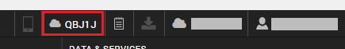

                          

Clear the Publish Code for a Project's Preview
==============================================

When you publish a preview to the cloud, it generates a publish code so that anyone with that code can preview the app on the cloud using the Volt MX App for mobile. Whenever you have that project open in Volt MX Iris, that publish code displays in the status bar.

If you are collaborating on a project, exporting it so that others can import it and work on it, if they attempt to publish a preview of the project to the cloud with that publish code still in place, they won't be able to. By clearing the publish code, a collaborator can then publish a preview to the cloud, generating a new publish code.

Clearing the publish code is also useful if you simply no longer want a preview to be available.

To clear the publish code for a project's preview, from the **Build** menu, click **Reset Live Preview ID**.  
The code clears from the status bar the next time you open the project. The next time you publish a preview to the cloud, the ID is replaced by a new one.
